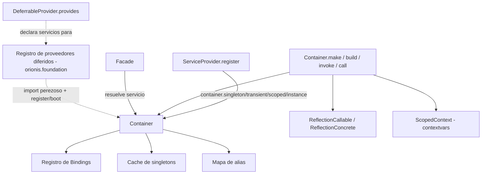

# `orionis.container` — Contenedor de Inyección de Dependencias

El contenedor central de Inversión de Control (IoC) del framework Orionis: registro de servicios (transient, singleton, scoped, instance), inyección automática de dependencias en constructores/callables mediante reflexión, ciclos de vida con alcance (scope) para unidades de trabajo tipo "request", proveedores de servicio diferidos (deferred) y el patrón `Facade` de proxy estático usado en todo el framework (`Log`, `Crypt`, `DB`, etc.).

## Tabla de contenidos

- [Requisitos](#requisitos)
- [Descripción general del módulo](#descripción-general-del-módulo)
- [Arquitectura](#arquitectura)
- [Referencia de API](#referencia-de-api)
  - [`Container`](#container-orioniscontainercontainercontainer)
  - [`IContainer` (contrato)](#icontainer-orioniscontainercontractscontainericontainer)
  - [`Binding`](#binding-orioniscontainerentitiesbindingbinding)
  - [`Lifetime`](#lifetime-orioniscontainerenumslifetimeslifetime)
  - [`CircularDependencyException`](#circulardependencyexception-orioniscontainerexceptionscontainercirculardependencyexception)
  - [`ScopeManager` / `ScopedContext`](#scopemanager--scopedcontext-orioniscontainercontext)
  - [`ServiceProvider` / `IServiceProvider`](#serviceprovider--iserviceprovider)
  - [`DeferrableProvider` / `IDeferrableProvider`](#deferrableprovider--ideferrableprovider)
  - [`Facade` / `FacadeMeta` / `IFacade`](#facade--facademeta--ifacade)
- [Ejemplos de uso](#ejemplos-de-uso)
- [Consideraciones de rendimiento y concurrencia](#consideraciones-de-rendimiento-y-concurrencia)
- [Notas de diseño](#notas-de-diseño)
- [Notas de compatibilidad](#notas-de-compatibilidad)

## Requisitos

No se necesita ninguna instalación adicional más allá del propio framework:

```bash
pip install orionis
```

Dependencias internas usadas por este módulo: `orionis.introspection` (reflexión sobre constructores/callables usada para el autowiring), `orionis.http.request.Request` y `orionis.schemas.validator.Schema` (usados solo al inyectar un parámetro `msgspec.Struct` desde el cuerpo de una petición HTTP), y `orionis.foundation.contracts.application.IApplication` (tipo usado por `ServiceProvider`/`Facade`). `msgspec` es una dependencia central (no opcional) del proyecto.

## Descripción general del módulo

`orionis.container` resuelve el problema de conectar implementaciones concretas con el resto del framework sin fijar dependencias de forma rígida. Ofrece:

1. **Registro de servicios** — enlazar un contrato abstracto (o una clase concreta usada como su propio contrato) con una implementación bajo un ciclo de vida determinado: `transient` (nueva instancia en cada resolución), `singleton` (una instancia compartida), `scoped` (una instancia compartida por alcance lógico, p. ej. una petición) o una `instance` ya construida.
2. **Inyección automática de dependencias** — `make`, `build`, `invoke` y `call` usan reflexión para inspeccionar las firmas de constructores/callables y resolver sus parámetros de forma recursiva (incluyendo dependencias anidadas, tipos enlazados en el contenedor, valores por defecto y esquemas `msgspec.Struct` de petición).
3. **Unidades de trabajo con alcance (scope)** — `beginScope()` abre un bloque `async with` durante el cual los bindings `scoped` resuelven a la misma instancia; el alcance se libera automáticamente al salir.
4. **Proveedores de servicio diferidos (deferred)** — los servicios pueden registrarse de forma perezosa: el contenedor solo importa y arranca el módulo del proveedor la primera vez que uno de sus servicios es realmente solicitado.
5. **El patrón `Facade`** — un proxy de estilo estático (`Log`, `Crypt`, `DB`, etc. se construyen sobre él) que resuelve el servicio subyacente desde el contenedor, con una vía rápida opcional "fijada" (pinned) para llamadas en rutas críticas tras el arranque.

## Arquitectura



- `Container` (en `orionis/container/container.py`) implementa `IContainer` y es el registro + resolutor concreto.
- `orionis.foundation.application.Application` extiende `Container` (e `IApplication`); en la práctica, el único contenedor en ejecución del framework **es** la instancia de `Application`, y `Facade.resolve()` la obtiene mediante `Application()`.
- `ScopedContext`/`ScopeManager` (en `orionis/container/context/`) implementan el mecanismo de ciclo de vida `scoped` usando `contextvars`, de modo que los alcances componen correctamente con las tareas de `asyncio`.
- `ServiceProvider`/`DeferrableProvider` (en `orionis/container/providers/`) son las clases base que extienden los proveedores de la aplicación/framework para registrar bindings.
- `Facade`/`FacadeMeta` (en `orionis/container/facades/`) implementan el patrón de proxy estático usado para exponer servicios enlazados como simples llamadas a nivel de clase.

## Referencia de API

### `Container` (`orionis.container.container.Container`)

```python
class Container(IContainer):
    def __new__(cls, *args, **kwargs) -> Self: ...
    def __init__(self) -> None: ...
```

**Comportamiento de instanciación**: `Container()` (y cualquier subclase, p. ej. `Application()`) es un **singleton por clase** — la primera llamada construye la instancia y la almacena en un diccionario indexado por clase (`Container._instances`); las llamadas posteriores a `Container()` devuelven el mismo objeto. La instanciación es thread-safe mediante double-checked locking (`threading.RLock`). Una subclase de `Container` obtiene su **propio** singleton, independiente de `Container()` en sí.

**Métodos de registro**

| Método | Firma | Descripción |
|---|---|---|
| `instance` | `(abstract: type \| None, instance: object, *, alias: str \| None = None, override: bool = False) -> bool` | Registra un objeto ya construido. Si hay un scope activo, la instancia se guarda en ese scope (no se permiten alias en este caso); en caso contrario se registra como singleton global. |
| `transient` | `(abstract: type \| None, concrete: type, *, alias: str \| None = None, override: bool = False) -> bool` | Registra un binding que produce una nueva instancia cada vez que se resuelve. |
| `singleton` | `(abstract: type \| None, concrete: type, *, alias: str \| None = None, override: bool = False) -> bool` | Registra un binding que produce una única instancia compartida, creada de forma perezosa en la primera resolución. |
| `scoped` | `(abstract: type \| None, concrete: type, *, alias: str \| None = None, override: bool = False) -> bool` | Registra un binding que produce una instancia compartida por cada scope activo (ver `beginScope`). |
| `bound` | `(key: type \| str) -> bool` | Verifica si `key` (un tipo o un alias en forma de string) está registrado en el scope actual, en los bindings globales o en la caché de singletons. |

En todos los métodos de registro, `abstract=None` usa el propio `concrete` como clave del contrato. `alias` permite además resolver el servicio mediante una clave de tipo string. `override=False` (por defecto) lanza `ValueError` si el contrato/alias ya está registrado.

**Métodos de scope**

| Método | Firma | Descripción |
|---|---|---|
| `beginScope` | `() -> ScopeManager` | Crea un nuevo `ScopeManager`, usado como `async with container.beginScope():` para abrir una unidad de trabajo con alcance. |
| `getCurrentScope` | `() -> dict[Any, Any] \| None` | Devuelve el mapeo interno de instancias del scope activo, o `None` si no hay ningún scope activo. |

**Métodos de resolución** (todos `async`)

| Método | Firma | Descripción |
|---|---|---|
| `make` | `(key: type \| str, *args, **kwargs) -> Any` | Resuelve un servicio por tipo abstracto o alias. Usa el ciclo de vida del binding registrado; si no está enlazado, intenta autoconstruir el tipo. Lanza `ValueError` si no puede resolverse. |
| `build` | `(type_: Callable[..., Any], *args, **kwargs) -> Any` | Instancia `type_` directamente con dependencias autoinyectadas, resolviendo antes los proveedores diferidos. Siempre construye una instancia nueva (ignora la caché de ciclo de vida/singleton). Lanza `TypeError` si `type_` no es una clase. |
| `invoke` | `(fn: Callable[..., Any], *args, **kwargs) -> Any` | Llama a un callable que no sea una clase (función, método enlazado, lambda) con parámetros autoinyectados. Espera (`await`) el resultado si `fn` es una función corrutina. Lanza `TypeError` si `fn` es una clase o no es invocable. |
| `call` | `(instance: object, method_name: str, *args, **kwargs) -> Any` | Busca `method_name` en `instance` y lo invoca con parámetros autoinyectados. Lanza `AttributeError` si el método no existe, `TypeError` si no es invocable. |

**Excepciones**

- `TypeError` — argumentos inválidos en los métodos de registro (`concrete`/`abstract` que no es una clase, `alias` que no es string, `instance()` llamado con una clase, `invoke`/`call` apuntando a algo no invocable o a una clase).
- `ValueError` — contrato/alias ya registrado sin `override=True`; alias/clave de servicio no resuelta; también la lanzan internamente `make`/`build` cuando un tipo realmente no puede resolverse.
- `RuntimeError` — se resuelve un binding `scoped` sin un scope activo (usar antes `beginScope()`).
- `CircularDependencyException` — se detecta un ciclo de dependencias al autorresolver argumentos de un constructor.
- `TypeError` — un parámetro de constructor/callable es un tipo built-in/`typing` sin valor por defecto y sin binding (no se puede autorresolver).

**Efectos secundarios**: los métodos de registro mutan los diccionarios internos de bindings/alias/singletons del contenedor; `make`/`build` pueden importar de forma perezosa y ejecutar `register()`/`boot()` de un módulo proveedor diferido la primera vez que se solicita uno de sus servicios declarados.

### `IContainer` (`orionis.container.contracts.container.IContainer`)

Clase base abstracta (`abc.ABC`) que declara el contrato público completo descrito arriba: `instance`, `transient`, `singleton`, `scoped`, `bound`, `beginScope`, `getCurrentScope`, y los métodos asíncronos `make`, `build`, `invoke`, `call`. Implementado por `Container` (y transitivamente por `orionis.foundation.application.Application`).

### `Binding` (`orionis.container.entities.binding.Binding`)

Un registro inmutable que describe una entrada de registro del contenedor.

```python
@dataclass(frozen=True, kw_only=True)
class Binding(BaseEntity):
    contract: type | None = None
    concrete: type | None = None
    instance: object | None = None
    lifetime: Lifetime = Lifetime.TRANSIENT
    alias: str | None = None
```

`__post_init__` valida que `lifetime` sea un miembro del enum `Lifetime` (lanza `TypeError` si no lo es). `Binding` extiende el `BaseEntity` del framework (ver `orionis.support.entities.base`) y normalmente no se construye directamente desde código de aplicación — lo crea internamente `Container.instance`/`transient`/`singleton`/`scoped`.

### `Lifetime` (`orionis.container.enums.lifetimes.Lifetime`)

```python
class Lifetime(Enum):
    TRANSIENT = auto()
    SINGLETON = auto()
    SCOPED = auto()
```

- `TRANSIENT`: se crea una nueva instancia en cada `make()`/resolución.
- `SINGLETON`: se crea una instancia de forma perezosa y se cachea durante la vida del contenedor.
- `SCOPED`: se crea una instancia por cada scope activo (ver `beginScope()`); resolverla fuera de un scope lanza `RuntimeError`.

### `CircularDependencyException` (`orionis.container.exceptions.container.CircularDependencyException`)

Una subclase simple de `Exception` que el contenedor lanza cuando detecta que resolver las dependencias de un tipo requeriría volver a resolver ese mismo tipo (un ciclo de dependencias) dentro de la cadena de resolución actual.

### `ScopeManager` / `ScopedContext` (`orionis.container.context`)

`ScopeManager` (`orionis.container.context.manager.ScopeManager`) es el gestor de contexto asíncrono devuelto por `Container.beginScope()`.

```python
class ScopeManager:
    def __init__(self) -> None: ...
    def __getitem__(self, key: object) -> object | None: ...
    def __setitem__(self, key: object, value: object) -> None: ...
    def __contains__(self, key: object) -> bool: ...
    def clear(self) -> None: ...
    async def __aenter__(self) -> Self: ...
    async def __aexit__(self, exc_type, exc_val, exc_tb) -> None: ...
    async def get(self, key: object) -> Any | None: ...
    def set(self, key: object, value: Any) -> None: ...
    async def resolve(self, key: object) -> Any: ...
```

- Entrar al bloque `async with` registra este `ScopeManager` como el scope activo (mediante `ScopedContext`); salir limpia todas las instancias almacenadas y restaura el scope anterior (soporta scopes anidados).
- `get(key)` admite almacenar una corrutina o un `asyncio.Task` bajo una clave: la primera llamada a `get()` convierte una corrutina almacenada en una `Task`, la espera (`await`) y cachea el resultado resuelto para llamadas posteriores.
- `resolve(key)` se comporta como `get(key)` pero lanza `KeyError` en lugar de devolver `None` cuando la clave no existe.
- El acceso directo `[]` (`scope[key]`, `scope[key] = value`, `key in scope`) es síncrono y no espera corrutinas — prefiere `get`/`set`/`resolve` cuando un valor pueda ser una corrutina.

`ScopedContext` (`orionis.container.context.scope.ScopedContext`) envuelve una única `contextvars.ContextVar` que contiene el scope activo:

```python
class ScopedContext:
    @classmethod
    def getCurrentScope(cls) -> object | None: ...
    @classmethod
    def setCurrentScope(cls, scope: object) -> contextvars.Token: ...
    @classmethod
    def reset(cls, token: contextvars.Token) -> None: ...

# Atajos a nivel de módulo (referencias directas a los métodos vinculados de la ContextVar):
get_current_scope = ScopedContext._active_scope.get
set_current_scope = ScopedContext._active_scope.set
reset_scope       = ScopedContext._active_scope.reset
```

### `ServiceProvider` / `IServiceProvider`

`IServiceProvider` (`orionis.container.contracts.service_provider.IServiceProvider`) declara el contrato del proveedor: un `register(self) -> None` síncrono y un `boot(self) -> None` asíncrono.

`ServiceProvider` (`orionis.container.providers.service_provider.ServiceProvider`) es la clase base que extienden los proveedores de la aplicación/framework:

```python
class ServiceProvider(IServiceProvider):
    def __init__(self, app: IApplication) -> None: ...
    def register(self) -> None: ...       # sobrescribir en subclases
    async def boot(self) -> None: ...      # sobrescribir en subclases
```

`self.app` es la instancia de la aplicación/contenedor pasada en la construcción, usada dentro de `register()`/`boot()` para llamar a `self.app.singleton(...)`, `self.app.make(...)`, etc.

### `DeferrableProvider` / `IDeferrableProvider`

`IDeferrableProvider` (`orionis.container.contracts.deferrable_provider.IDeferrableProvider`) declara un único classmethod abstracto: `provides(cls) -> list[type | str]`.

`DeferrableProvider` (`orionis.container.providers.deferrable_provider.DeferrableProvider`) es una clase base marcadora para proveedores cuyo registro/arranque puede diferirse hasta que uno de sus servicios declarados sea realmente solicitado:

```python
class DeferrableProvider(IDeferrableProvider):
    @classmethod
    def provides(cls) -> list[type | str]: ...  # debe sobrescribirse
```

`provides()` declara qué tipos de servicio/alias son responsabilidad de este proveedor. El registro real que mapea una clave solicitada a `{"module": ..., "class": ...}` (usado internamente por `Container.__resolveDeferredProvider`/`Container._deferred_providers`) lo construye la capa de arranque del framework (`orionis.foundation.application.Application`), no este módulo directamente — `DeferrableProvider` solo aporta la declaración usada para construir ese registro.

### `Facade` / `FacadeMeta` / `IFacade`

`IFacade` (`orionis.container.contracts.facade.IFacade`) declara el contrato: `getFacadeAccessor() -> str`, `resolve(*args, **kwargs) -> object` asíncrono, `pin() -> None` asíncrono, `unpin() -> None`.

`Facade` (`orionis.container.facades.facade.Facade`, metaclase `FacadeMeta`) es la clase base para facades de proxy estático (`Log`, `Crypt`, `DB`, ...):

```python
class Facade(metaclass=FacadeMeta):
    _application: IApplication | None = None
    _pinned_instance: Any = None

    @classmethod
    def getFacadeAccessor(cls) -> str: ...        # debe sobrescribirse; si no, lanza NotImplementedError
    @classmethod
    async def resolve(cls, *args, **kwargs) -> object: ...
    @classmethod
    async def pin(cls) -> None: ...
    @classmethod
    def unpin(cls) -> None: ...
```

- `getFacadeAccessor()` debe devolver la clave del contenedor (tipo o alias en string) usada para resolver el servicio subyacente. Las subclases deben sobrescribirlo; la implementación base lanza `NotImplementedError`.
- `resolve()` obtiene de forma perezosa la instancia compartida `Application()`, lanza `RuntimeError` si la aplicación no ha sido arrancada (`app.isBooted` es `False`), y delega en `app.make(cls.getFacadeAccessor(), *args, **kwargs)`.
- `pin()` resuelve el servicio una vez y lo cachea en `cls._pinned_instance`; `unpin()` limpia esa caché.

`FacadeMeta` (`orionis.container.facades.meta.FacadeMeta`) implementa el despacho dinámico de atributos usado por cada subclase de `Facade`:

- **Cuando está fijado (pinned)** (`cls._pinned_instance is not None`): `FacadeClass.algun_attr` devuelve `getattr(cls._pinned_instance, "algun_attr")` directamente — sin envoltura asíncrona, sin búsqueda en el contenedor.
- **Cuando no está fijado**: `FacadeClass.algun_attr` devuelve una función dispatcher asíncrona cacheada (una por cada par `(clase, atributo)`). Al llamarla — `await FacadeClass.algun_attr(*args, **kwargs)` — se resuelve el servicio mediante `cls.resolve()`, se busca `algun_attr` en él, se invoca si es invocable (esperando el resultado si es awaitable), o se devuelve tal cual si es un atributo simple. **En el estado no fijado, el acceso a atributos/métodos del facade siempre debe esperarse (`await`)**, incluso para atributos que no son invocables.

## Ejemplos de uso

### Registrar y resolver bindings

```python
import asyncio
from abc import ABC, abstractmethod
from orionis.container.container import Container

class IEngine(ABC):
    @abstractmethod
    def start(self) -> str: ...

class V8Engine(IEngine):
    def start(self) -> str:
        return "Motor V8 iniciado"

class Car:
    def __init__(self, engine: IEngine) -> None:
        self.engine = engine

async def main() -> None:
    container = Container()

    # Singleton: una única instancia de IEngine compartida durante la vida del contenedor
    container.singleton(IEngine, V8Engine, alias="engine.v8")

    # Transient: un Car nuevo (con su dependencia IEngine autoinyectada) en cada llamada
    container.transient(Car, Car)

    car = await container.make(Car)
    print(car.engine.start())              # "Motor V8 iniciado"

    # Resolver el mismo singleton del motor mediante su alias
    engine_by_alias = await container.make("engine.v8")
    print(engine_by_alias is car.engine)    # True

asyncio.run(main())
```

### Registrar una instancia ya construida

```python
container = Container()
container.instance(IEngine, V8Engine(), alias="engine.v8")
print(container.bound(IEngine))     # True
print(container.bound("engine.v8"))  # True
```

### Servicios con scope (por unidad de trabajo)

```python
import asyncio
from orionis.container.container import Container

class RequestContext:
    def __init__(self) -> None:
        self.request_id = "req-123"

async def handle_request(container: Container) -> None:
    async with container.beginScope():
        ctx = await container.make(RequestContext)
        print(ctx.request_id)
    # el scope (y su RequestContext cacheado) se descarta al salir

async def main() -> None:
    container = Container()
    container.scoped(RequestContext, RequestContext)
    await handle_request(container)

asyncio.run(main())
```

### `build`, `invoke` y `call`

```python
# build(): siempre construye una instancia nueva autoconectada (ignora la caché de ciclo de vida)
car = await container.build(Car)

# invoke(): llamar a una función/corrutina simple con parámetros autoinyectados
async def describe(engine: IEngine) -> str:
    return f"Auto con: {engine.start()}"

description = await container.invoke(describe)

# call(): invocar un método de un objeto existente con parámetros autoinyectados
class Reporter:
    def report(self, engine: IEngine) -> str:
        return f"Reportando: {engine.start()}"

reporter = Reporter()
report = await container.call(reporter, "report")
```

### Manejar una dependencia circular

```python
from orionis.container.container import Container
from orionis.container.exceptions import CircularDependencyException

class A:
    def __init__(self, b: "B") -> None:
        self.b = b

class B:
    def __init__(self, a: A) -> None:
        self.a = a

async def main() -> None:
    container = Container()
    container.transient(A, A)
    container.transient(B, B)
    try:
        await container.make(A)
    except CircularDependencyException as exc:
        print(f"Ciclo detectado: {exc}")
```

### Escribir un `ServiceProvider`

```python
from orionis.container.providers.service_provider import ServiceProvider

class EngineServiceProvider(ServiceProvider):
    def register(self) -> None:
        self.app.singleton(IEngine, V8Engine, alias="x-engine")

    async def boot(self) -> None:
        # Inicialización asíncrona opcional tras registrarse todos los proveedores
        pass
```

### Escribir un `DeferrableProvider`

```python
from orionis.container.providers.deferrable_provider import DeferrableProvider
from orionis.container.providers.service_provider import ServiceProvider

class HeavyServiceProvider(ServiceProvider, DeferrableProvider):
    @classmethod
    def provides(cls) -> list[type | str]:
        return [IEngine]

    def register(self) -> None:
        self.app.singleton(IEngine, V8Engine, alias="x-engine")
```

### Escribir un `Facade`

```python
from orionis.container.facades.facade import Facade

class Engine(Facade):
    @classmethod
    def getFacadeAccessor(cls) -> str:
        return "x-engine"

# Antes de pin(): cada acceso resuelve el servicio a través del contenedor;
# siempre usar await, incluso para atributos simples.
result = await Engine.start()

# Después de que el proveedor propietario llame a `await Engine.pin()` en boot(),
# el acceso a atributos se convierte en un passthrough directo a la instancia fijada.
await Engine.pin()
Engine.start()  # no hace falta await aquí si el método subyacente es síncrono
```

## Consideraciones de rendimiento y concurrencia

- **Construcción de singleton thread-safe**: `Container.__new__` usa double-checked locking (`threading.RLock`) para que los hilos concurrentes que crean la primera instancia de una subclase de `Container` nunca compitan entre sí; las llamadas posteriores toman una vía rápida sin bloqueo.
- **Resolución asíncrona, no basada en hilos**: `make`/`build`/`invoke`/`call` son funciones corrutina; deben ejecutarse dentro de un bucle de eventos `asyncio` y esperarse (`await`). No existe una API de resolución síncrona.
- **Seguimiento de dependencias circulares por tarea**: la pila de resolución usada para detectar ciclos se almacena en una `contextvars.ContextVar` (un `frozenset` inmutable intercambiado mediante `token`/`reset`), de modo que las tareas concurrentes de `asyncio` que resuelven grafos de dependencias superpuestos no interfieren entre sí.
- **Los scopes se basan en contextvars**: `ScopedContext` también usa una `ContextVar`, por lo que un scope abierto con `beginScope()` es visible para la tarea actual y cualquier código esperado (`await`) desde ella; crear manualmente una nueva `asyncio.Task` dentro de un scope captura una instantánea del contexto en el momento de su creación, siguiendo la semántica estándar de `contextvars`/`asyncio`.
- **El registro no está bloqueado internamente más allá de la creación de instancia**: `instance`/`transient`/`singleton`/`scoped` mutan los diccionarios de bindings/alias del contenedor sin un lock explícito. El patrón de uso esperado es realizar todos los registros durante el arranque de la aplicación (antes de que comience el manejo concurrente de peticiones); resolver singletons ya registrados después es una simple búsqueda en diccionario, segura para lecturas bajo el GIL.
- **Condición de carrera en la primera resolución de singletons**: si dos tareas concurrentes llaman a `make()` para el mismo singleton aún no creado al mismo tiempo, ambas pueden construir una instancia antes de que la caché se llene (la última escritura en la caché de singletons prevalece). Esto solo afecta a la primerísima resolución de un singleton dado.
- **Caché del dispatcher del facade**: `FacadeMeta` cachea un closure dispatcher por cada par `(clase de facade, nombre de atributo)` en un diccionario a nivel de módulo, de modo que los accesos repetidos sin fijar no recrean la función corrutina; fijar (`await Facade.pin()`) elimina por completo esa indirección adicional para rutas críticas.
- **Los proveedores diferidos evitan imports/arranques innecesarios**: el módulo de un proveedor diferido solo se importa y su `register()`/`boot()` se ejecuta la primera vez que uno de sus servicios declarados es realmente solicitado, reduciendo el costo de arranque cuando un servicio nunca se usa en una ejecución dada.

## Notas de diseño

- `Container` implementa `IContainer` (`abc.ABC`) para que el registro/resolutor concreto pueda referenciarse de forma abstracta (p. ej. tipado como `IContainer`) en todo el framework, y para que `orionis.foundation.application.Application` pueda extenderlo añadiendo aspectos propios de la aplicación.
- `Binding` es un dataclass inmutable (`frozen=True, kw_only=True`) que extiende el `BaseEntity` del framework, en consonancia con el resto de la capa de entidades del framework.
- `Lifetime` es un `Enum` simple con tres miembros (`TRANSIENT`, `SINGLETON`, `SCOPED`) que dirige un despacho de estrategia directo dentro de `Container.__resolve`.
- El autowiring de dependencias se basa en reflexión: las firmas de constructores/callables se inspeccionan una vez por llamada mediante `orionis.introspection.callables.reflection.ReflectionCallable` / `orionis.introspection.concretes.reflection.ReflectionConcrete`, produciendo metadatos `Signature`/`Argument` que el contenedor recorre para resolver cada parámetro (tipos enlazados en el contenedor, valores por defecto o autorresolución recursiva).
- Los parámetros de constructor/callable de tipo `msgspec.Struct` reciben un tratamiento especial: el contenedor lee el cuerpo de la petición HTTP actual (`orionis.http.request.Request`) y lo valida/decodifica al tipo de esquema solicitado mediante `orionis.schemas.validator.Schema.validate(...)`.
- Tanto los ciclos de vida `scoped` como la detección de dependencias circulares se implementan con `contextvars.ContextVar` en lugar de variables locales de hilo, de modo que componen correctamente con la concurrencia basada en `asyncio` en vez de asumir un hilo por unidad de trabajo.
- El patrón `Facade` imita el facade estático al estilo Laravel: `FacadeMeta.__getattr__` intercepta el acceso a atributos arbitrarios en la propia clase del facade, resolviendo el servicio enlazado bajo demanda (o devolviendo una referencia directa una vez "fijado"). Es el mismo mecanismo usado por los facades integrados del framework (p. ej. el facade `Log` documentado en `orionis/log`).
- `DeferrableProvider` es solo una clase marcadora/de declaración: no realiza por sí misma la carga perezosa — aporta la lista `provides()` que la capa de arranque del framework (`orionis.foundation`) usa para construir el registro de proveedores diferidos que consulta `Container`.

## Notas de compatibilidad

- **Python**: `>=3.14` (según el `pyproject.toml` del proyecto).
- **Dependencias externas**: `msgspec` (dependencia central del proyecto, usada solo en la ruta de inyección de dependencias tipada con `msgspec.Struct` para peticiones).
- **Dependencias internas**: `orionis.introspection` (reflexión), `orionis.http.request.Request` y `orionis.schemas.validator.Schema` (inyección de dependencias tipada por esquema), `orionis.foundation.contracts.application.IApplication` (tipado para `ServiceProvider`/`Facade`).
- **Requisito de asyncio**: todos los métodos de resolución (`make`, `build`, `invoke`, `call`) y el gestor de contexto de scope (`beginScope`) son asíncronos y requieren un bucle de eventos `asyncio` en ejecución.
