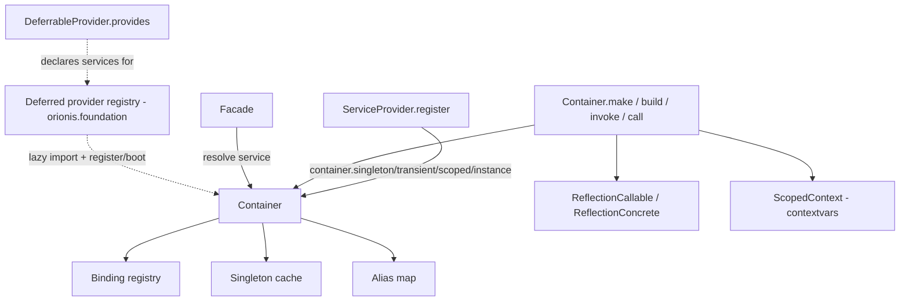

# `orionis.container` — Dependency Injection Container

The core Inversion of Control (IoC) container of the Orionis framework: service registration (transient, singleton, scoped, instance), automatic constructor/callable dependency injection via reflection, scoped lifetimes for request-like units of work, deferred service providers, and the `Facade` static-proxy pattern used across the framework (`Log`, `Crypt`, `DB`, etc.).

## Table of contents

- [Requirements](#requirements)
- [Module overview](#module-overview)
- [Architecture](#architecture)
- [API reference](#api-reference)
  - [`Container`](#container-orioniscontainercontainercontainer)
  - [`IContainer` (contract)](#icontainer-orioniscontainercontractscontainericontainer)
  - [`Binding`](#binding-orioniscontainerentitiesbindingbinding)
  - [`Lifetime`](#lifetime-orioniscontainerenumslifetimeslifetime)
  - [`CircularDependencyException`](#circulardependencyexception-orioniscontainerexceptionscontainercirculardependencyexception)
  - [`ScopeManager` / `ScopedContext`](#scopemanager--scopedcontext-orioniscontainercontext)
  - [`ServiceProvider` / `IServiceProvider`](#serviceprovider--iserviceprovider)
  - [`DeferrableProvider` / `IDeferrableProvider`](#deferrableprovider--ideferrableprovider)
  - [`Facade` / `FacadeMeta` / `IFacade`](#facade--facademeta--ifacade)
- [Usage examples](#usage-examples)
- [Performance and concurrency considerations](#performance-and-concurrency-considerations)
- [Design notes](#design-notes)
- [Compatibility notes](#compatibility-notes)

## Requirements

No installation beyond the framework itself is required:

```bash
pip install orionis
```

Internal dependencies used by this module: `orionis.introspection` (reflection over constructors/callables used for auto-wiring), `orionis.http.request.Request` and `orionis.schemas.validator.Schema` (used only when injecting an `msgspec.Struct` parameter from an HTTP request body), and `orionis.foundation.contracts.application.IApplication` (type used by `ServiceProvider`/`Facade`). `msgspec` is a core (non-optional) project dependency.

## Module overview

`orionis.container` solves the problem of wiring concrete implementations to the rest of the framework without hardcoding dependencies. It provides:

1. **Service registration** — bind an abstract contract (or a concrete class used as its own contract) to an implementation with a given lifetime: `transient` (new instance every resolution), `singleton` (one shared instance), `scoped` (one shared instance per logical scope, e.g. a request), or a pre-built `instance`.
2. **Automatic dependency injection** — `make`, `build`, `invoke` and `call` use reflection to inspect constructor/callable signatures and resolve their parameters recursively (including nested dependencies, container-bound types, default values, and `msgspec.Struct` request schemas).
3. **Scoped units of work** — `beginScope()` opens an `async with` block during which `scoped` bindings resolve to the same instance; the scope is torn down automatically on exit.
4. **Deferred service providers** — services can be registered lazily: the container only imports and boots the provider module the first time one of its services is actually requested.
5. **The `Facade` pattern** — a static-style proxy (`Log`, `Crypt`, `DB`, etc. are built on top of it) that resolves the underlying service from the container, with an optional "pinned" fast path for hot-path calls after boot.

## Architecture



- `Container` (in `orionis/container/container.py`) implements `IContainer` and is the concrete registry + resolver.
- `orionis.foundation.application.Application` extends `Container` (and `IApplication`); in practice, the framework's single running container **is** the `Application` instance, and `Facade.resolve()` obtains it via `Application()`.
- `ScopedContext`/`ScopeManager` (in `orionis/container/context/`) implement the scoped-lifetime mechanism using `contextvars`, so scopes compose correctly with `asyncio` tasks.
- `ServiceProvider`/`DeferrableProvider` (in `orionis/container/providers/`) are the base classes application/framework providers extend to register bindings.
- `Facade`/`FacadeMeta` (in `orionis/container/facades/`) implement the static-proxy pattern used to expose bound services as simple class-level calls.

## API reference

### `Container` (`orionis.container.container.Container`)

```python
class Container(IContainer):
    def __new__(cls, *args, **kwargs) -> Self: ...
    def __init__(self) -> None: ...
```

**Instantiation behavior**: `Container()` (and any subclass, e.g. `Application()`) is a **singleton per class** — the first call constructs the instance and caches it in a class-keyed dictionary (`Container._instances`); subsequent calls to `Container()` return the same object. Instantiation is thread-safe via double-checked locking (`threading.RLock`). A subclass of `Container` gets its **own** singleton, independent from `Container()` itself.

**Registration methods**

| Method | Signature | Description |
|---|---|---|
| `instance` | `(abstract: type \| None, instance: object, *, alias: str \| None = None, override: bool = False) -> bool` | Register an already-constructed object. If a scope is active, the instance is stored in that scope (aliases are not allowed in this case); otherwise it is registered as a global singleton. |
| `transient` | `(abstract: type \| None, concrete: type, *, alias: str \| None = None, override: bool = False) -> bool` | Register a binding that produces a new instance every time it is resolved. |
| `singleton` | `(abstract: type \| None, concrete: type, *, alias: str \| None = None, override: bool = False) -> bool` | Register a binding that produces a single shared instance, created lazily on first resolution. |
| `scoped` | `(abstract: type \| None, concrete: type, *, alias: str \| None = None, override: bool = False) -> bool` | Register a binding that produces one shared instance per active scope (see `beginScope`). |
| `bound` | `(key: type \| str) -> bool` | Check whether `key` (a type or an alias string) is registered in the current scope, the global bindings, or the singleton cache. |

For all registration methods, `abstract=None` uses `concrete` itself as the contract key. `alias` lets the service also be resolved by a string key. `override=False` (default) raises `ValueError` if the contract/alias is already registered.

**Scope methods**

| Method | Signature | Description |
|---|---|---|
| `beginScope` | `() -> ScopeManager` | Create a new `ScopeManager`, used as `async with container.beginScope():` to open a scoped unit of work. |
| `getCurrentScope` | `() -> dict[Any, Any] \| None` | Return the active scope's internal instance mapping, or `None` if no scope is active. |

**Resolution methods** (all `async`)

| Method | Signature | Description |
|---|---|---|
| `make` | `(key: type \| str, *args, **kwargs) -> Any` | Resolve a service by abstract type or alias. Uses the registered binding's lifetime; if unbound, attempts to auto-build the type. Raises `ValueError` if it cannot be resolved. |
| `build` | `(type_: Callable[..., Any], *args, **kwargs) -> Any` | Instantiate `type_` directly with auto-injected dependencies, resolving deferred providers first. Always constructs a fresh instance (bypasses lifetime/singleton caching). Raises `TypeError` if `type_` is not a class. |
| `invoke` | `(fn: Callable[..., Any], *args, **kwargs) -> Any` | Call a non-class callable (function, bound method, lambda) with auto-injected parameters. Awaits the result if `fn` is a coroutine function. Raises `TypeError` if `fn` is a class or not callable. |
| `call` | `(instance: object, method_name: str, *args, **kwargs) -> Any` | Look up `method_name` on `instance` and invoke it with auto-injected parameters. Raises `AttributeError` if the method does not exist, `TypeError` if it is not callable. |

**Exceptions**

- `TypeError` — invalid arguments to registration methods (non-class `concrete`/`abstract`, non-string `alias`, `instance()` called with a class, `invoke`/`call` targeting a non-callable or a class).
- `ValueError` — alias/contract already registered without `override=True`; unresolved alias/service key; also raised by `make`/`build` internals when a type genuinely cannot be resolved.
- `RuntimeError` — a `scoped` binding is resolved without an active scope (use `beginScope()` first).
- `CircularDependencyException` — a dependency cycle is detected while auto-resolving constructor arguments.
- `TypeError` — a constructor/callable parameter is a built-in/`typing` type with no default and no binding (cannot be auto-resolved).

**Side effects**: registration methods mutate the container's internal binding/alias/singleton dictionaries; `make`/`build` may lazily import and `register()`/`boot()` a deferred provider module the first time one of its declared services is requested.

### `IContainer` (`orionis.container.contracts.container.IContainer`)

Abstract base class (`abc.ABC`) declaring the full public contract described above: `instance`, `transient`, `singleton`, `scoped`, `bound`, `beginScope`, `getCurrentScope`, and the async `make`, `build`, `invoke`, `call`. Implemented by `Container` (and transitively by `orionis.foundation.application.Application`).

### `Binding` (`orionis.container.entities.binding.Binding`)

An immutable record describing one container registration.

```python
@dataclass(frozen=True, kw_only=True)
class Binding(BaseEntity):
    contract: type | None = None
    concrete: type | None = None
    instance: object | None = None
    lifetime: Lifetime = Lifetime.TRANSIENT
    alias: str | None = None
```

`__post_init__` validates that `lifetime` is a `Lifetime` enum member (raises `TypeError` otherwise). `Binding` extends the framework's `BaseEntity` (see `orionis.support.entities.base`) and is not normally constructed by application code directly — it is created internally by `Container.instance`/`transient`/`singleton`/`scoped`.

### `Lifetime` (`orionis.container.enums.lifetimes.Lifetime`)

```python
class Lifetime(Enum):
    TRANSIENT = auto()
    SINGLETON = auto()
    SCOPED = auto()
```

- `TRANSIENT`: a new instance is created on every `make()`/resolution.
- `SINGLETON`: one instance is created lazily and cached for the container's lifetime.
- `SCOPED`: one instance is created per active scope (see `beginScope()`); resolving it outside a scope raises `RuntimeError`.

### `CircularDependencyException` (`orionis.container.exceptions.container.CircularDependencyException`)

A plain `Exception` subclass raised by the container when it detects that resolving a type's dependencies would require resolving that same type again (a dependency cycle) within the current resolution chain.

### `ScopeManager` / `ScopedContext` (`orionis.container.context`)

`ScopeManager` (`orionis.container.context.manager.ScopeManager`) is the async context manager returned by `Container.beginScope()`.

```python
class ScopeManager:
    def __init__(self) -> None: ...
    def __getitem__(self, key: object) -> object | None: ...
    def __setitem__(self, key: object, value: object) -> None: ...
    def __contains__(self, key: object) -> bool: ...
    def clear(self) -> None: ...
    async def __aenter__(self) -> Self: ...
    async def __aexit__(self, exc_type, exc_val, exc_tb) -> None: ...
    async def get(self, key: object) -> Any | None: ...
    def set(self, key: object, value: Any) -> None: ...
    async def resolve(self, key: object) -> Any: ...
```

- Entering the `async with` block registers this `ScopeManager` as the active scope (via `ScopedContext`); exiting clears all stored instances and restores the previous scope (supports nested scopes).
- `get(key)` supports storing a coroutine or `asyncio.Task` under a key: the first `get()` call converts a stored coroutine into a `Task`, awaits it, and caches the resolved result for subsequent calls.
- `resolve(key)` behaves like `get(key)` but raises `KeyError` instead of returning `None` when the key is absent.
- Direct `[]` access (`scope[key]`, `scope[key] = value`, `key in scope`) is synchronous and does not await coroutines — prefer `get`/`set`/`resolve` when a value might be a coroutine.

`ScopedContext` (`orionis.container.context.scope.ScopedContext`) wraps a single `contextvars.ContextVar` holding the active scope:

```python
class ScopedContext:
    @classmethod
    def getCurrentScope(cls) -> object | None: ...
    @classmethod
    def setCurrentScope(cls, scope: object) -> contextvars.Token: ...
    @classmethod
    def reset(cls, token: contextvars.Token) -> None: ...

# Module-level shortcuts (direct bound-method references to the ContextVar):
get_current_scope = ScopedContext._active_scope.get
set_current_scope = ScopedContext._active_scope.set
reset_scope       = ScopedContext._active_scope.reset
```

### `ServiceProvider` / `IServiceProvider`

`IServiceProvider` (`orionis.container.contracts.service_provider.IServiceProvider`) declares the provider contract: a synchronous `register(self) -> None` and an asynchronous `boot(self) -> None`.

`ServiceProvider` (`orionis.container.providers.service_provider.ServiceProvider`) is the base class application/framework providers extend:

```python
class ServiceProvider(IServiceProvider):
    def __init__(self, app: IApplication) -> None: ...
    def register(self) -> None: ...       # override in subclasses
    async def boot(self) -> None: ...      # override in subclasses
```

`self.app` is the application/container instance passed at construction time, used inside `register()`/`boot()` to call `self.app.singleton(...)`, `self.app.make(...)`, etc.

### `DeferrableProvider` / `IDeferrableProvider`

`IDeferrableProvider` (`orionis.container.contracts.deferrable_provider.IDeferrableProvider`) declares a single abstract classmethod: `provides(cls) -> list[type | str]`.

`DeferrableProvider` (`orionis.container.providers.deferrable_provider.DeferrableProvider`) is a marker base class for providers whose registration/boot can be deferred until one of their declared services is actually requested:

```python
class DeferrableProvider(IDeferrableProvider):
    @classmethod
    def provides(cls) -> list[type | str]: ...  # must be overridden
```

`provides()` declares which service types/aliases this provider is responsible for. The actual registry mapping a requested key to `{"module": ..., "class": ...}` (used internally by `Container.__resolveDeferredProvider`/`Container._deferred_providers`) is populated by the framework bootstrap layer (`orionis.foundation.application.Application`), not by this module directly — `DeferrableProvider` only supplies the declaration used to build that registry.

### `Facade` / `FacadeMeta` / `IFacade`

`IFacade` (`orionis.container.contracts.facade.IFacade`) declares the contract: `getFacadeAccessor() -> str`, async `resolve(*args, **kwargs) -> object`, async `pin() -> None`, `unpin() -> None`.

`Facade` (`orionis.container.facades.facade.Facade`, metaclass `FacadeMeta`) is the base class for static-proxy facades (`Log`, `Crypt`, `DB`, ...):

```python
class Facade(metaclass=FacadeMeta):
    _application: IApplication | None = None
    _pinned_instance: Any = None

    @classmethod
    def getFacadeAccessor(cls) -> str: ...        # must be overridden; raises NotImplementedError otherwise
    @classmethod
    async def resolve(cls, *args, **kwargs) -> object: ...
    @classmethod
    async def pin(cls) -> None: ...
    @classmethod
    def unpin(cls) -> None: ...
```

- `getFacadeAccessor()` must return the container key (type or alias string) used to resolve the underlying service. Subclasses must override it; the base implementation raises `NotImplementedError`.
- `resolve()` lazily obtains the shared `Application()` instance, raises `RuntimeError` if the application has not been booted (`app.isBooted` is `False`), and delegates to `app.make(cls.getFacadeAccessor(), *args, **kwargs)`.
- `pin()` resolves the service once and caches it on `cls._pinned_instance`; `unpin()` clears that cache.

`FacadeMeta` (`orionis.container.facades.meta.FacadeMeta`) implements the dynamic attribute dispatch used by every `Facade` subclass:

- **When pinned** (`cls._pinned_instance is not None`): `FacadeClass.some_attr` returns `getattr(cls._pinned_instance, "some_attr")` directly — no async wrapping, no container lookup.
- **When not pinned**: `FacadeClass.some_attr` returns a cached async dispatcher function (one per `(class, attr)` pair). Calling it — `await FacadeClass.some_attr(*args, **kwargs)` — resolves the service via `cls.resolve()`, looks up `some_attr` on it, calls it if callable (awaiting the result if it is awaitable), or returns it as-is if it is a plain attribute. **In the unpinned state, facade attribute/method access must always be awaited**, even for attributes that are not callables.

## Usage examples

### Registering and resolving bindings

```python
import asyncio
from abc import ABC, abstractmethod
from orionis.container.container import Container

class IEngine(ABC):
    @abstractmethod
    def start(self) -> str: ...

class V8Engine(IEngine):
    def start(self) -> str:
        return "V8 engine started"

class Car:
    def __init__(self, engine: IEngine) -> None:
        self.engine = engine

async def main() -> None:
    container = Container()

    # Singleton: one shared IEngine instance for the container's lifetime
    container.singleton(IEngine, V8Engine, alias="engine.v8")

    # Transient: a new Car (with its IEngine dependency auto-injected) every call
    container.transient(Car, Car)

    car = await container.make(Car)
    print(car.engine.start())              # "V8 engine started"

    # Resolve the same engine singleton via its alias
    engine_by_alias = await container.make("engine.v8")
    print(engine_by_alias is car.engine)    # True

asyncio.run(main())
```

### Registering a pre-built instance

```python
container = Container()
container.instance(IEngine, V8Engine(), alias="engine.v8")
print(container.bound(IEngine))     # True
print(container.bound("engine.v8"))  # True
```

### Scoped services (per unit of work)

```python
import asyncio
from orionis.container.container import Container

class RequestContext:
    def __init__(self) -> None:
        self.request_id = "req-123"

async def handle_request(container: Container) -> None:
    async with container.beginScope():
        ctx = await container.make(RequestContext)
        print(ctx.request_id)
    # the scope (and its cached RequestContext) is discarded on exit

async def main() -> None:
    container = Container()
    container.scoped(RequestContext, RequestContext)
    await handle_request(container)

asyncio.run(main())
```

### `build`, `invoke` and `call`

```python
# build(): always constructs a fresh, auto-wired instance (ignores lifetime caching)
car = await container.build(Car)

# invoke(): call a plain function/coroutine with auto-injected parameters
async def describe(engine: IEngine) -> str:
    return f"Car with: {engine.start()}"

description = await container.invoke(describe)

# call(): invoke a method on an existing object with auto-injected parameters
class Reporter:
    def report(self, engine: IEngine) -> str:
        return f"Reporting: {engine.start()}"

reporter = Reporter()
report = await container.call(reporter, "report")
```

### Handling a circular dependency

```python
from orionis.container.container import Container
from orionis.container.exceptions import CircularDependencyException

class A:
    def __init__(self, b: "B") -> None:
        self.b = b

class B:
    def __init__(self, a: A) -> None:
        self.a = a

async def main() -> None:
    container = Container()
    container.transient(A, A)
    container.transient(B, B)
    try:
        await container.make(A)
    except CircularDependencyException as exc:
        print(f"Cycle detected: {exc}")
```

### Writing a `ServiceProvider`

```python
from orionis.container.providers.service_provider import ServiceProvider

class EngineServiceProvider(ServiceProvider):
    def register(self) -> None:
        self.app.singleton(IEngine, V8Engine, alias="x-engine")

    async def boot(self) -> None:
        # Optional async initialization after all providers are registered
        pass
```

### Writing a `DeferrableProvider`

```python
from orionis.container.providers.deferrable_provider import DeferrableProvider
from orionis.container.providers.service_provider import ServiceProvider

class HeavyServiceProvider(ServiceProvider, DeferrableProvider):
    @classmethod
    def provides(cls) -> list[type | str]:
        return [IEngine]

    def register(self) -> None:
        self.app.singleton(IEngine, V8Engine, alias="x-engine")
```

### Writing a `Facade`

```python
from orionis.container.facades.facade import Facade

class Engine(Facade):
    @classmethod
    def getFacadeAccessor(cls) -> str:
        return "x-engine"

# Before pin(): every access resolves the service through the container;
# always await, even for plain attributes.
result = await Engine.start()

# After the owning provider calls `await Engine.pin()` during boot(),
# attribute access becomes a direct passthrough to the pinned instance.
await Engine.pin()
Engine.start()  # no await needed here if the underlying method is sync
```

## Performance and concurrency considerations

- **Thread-safe singleton construction**: `Container.__new__` uses double-checked locking (`threading.RLock`) so concurrent threads creating the first instance of a `Container` subclass never race; subsequent calls take a fast, lock-free path.
- **Async, not thread-based, resolution**: `make`/`build`/`invoke`/`call` are coroutine functions; they must run inside an `asyncio` event loop and be awaited. There is no synchronous resolution API.
- **Per-task circular dependency tracking**: the resolution stack used to detect cycles is stored in a `contextvars.ContextVar` (immutable `frozenset` swapped via `token`/`reset`), so concurrent `asyncio` tasks resolving overlapping dependency graphs do not interfere with each other.
- **Scopes are contextvars-based**: `ScopedContext` also uses a `ContextVar`, so a scope opened with `beginScope()` is visible to the current task and any code awaited from it; manually spawning a new `asyncio.Task` inside a scope captures a snapshot of the context at creation time, following standard `contextvars`/`asyncio` semantics.
- **Registration is not internally locked beyond instance creation**: `instance`/`transient`/`singleton`/`scoped` mutate the container's binding/alias dictionaries without an explicit lock. The expected usage pattern is to perform all registrations during application bootstrap (before concurrent request handling begins); resolving already-registered singletons afterward is a simple dictionary lookup, which is safe under the GIL for reads.
- **First-resolution race on singletons**: if two concurrent tasks call `make()` for the same not-yet-created singleton at the same time, both may build an instance before the cache is populated (the last write to the singleton cache wins). This only affects the very first resolution of a given singleton.
- **Facade dispatcher caching**: `FacadeMeta` caches one dispatcher closure per `(facade class, attribute name)` pair in a module-level dictionary, so repeated unpinned accesses do not recreate the coroutine function; pinning (`await Facade.pin()`) removes the extra indirection entirely for hot paths.
- **Deferred providers avoid unnecessary imports/boot work**: a deferred provider's module is only imported and its `register()`/`boot()` executed the first time one of its declared services is actually requested, reducing startup cost when a service is never used in a given run.

## Design notes

- `Container` implements `IContainer` (`abc.ABC`) so the concrete registry/resolver can be referenced abstractly (e.g. type-hinted as `IContainer`) throughout the framework, and so `orionis.foundation.application.Application` can extend it while adding application-level concerns.
- `Binding` is an immutable (`frozen=True, kw_only=True`) dataclass extending the framework's `BaseEntity`, consistent with the rest of the framework's entities layer.
- `Lifetime` is a plain `Enum` with three members (`TRANSIENT`, `SINGLETON`, `SCOPED`) driving a straightforward strategy dispatch inside `Container.__resolve`.
- Dependency auto-wiring is reflection-based: constructor/callable signatures are inspected once per call via `orionis.introspection.callables.reflection.ReflectionCallable` / `orionis.introspection.concretes.reflection.ReflectionConcrete`, producing `Signature`/`Argument` metadata that the container walks to resolve each parameter (container-bound types, default values, or recursive auto-resolution).
- `msgspec.Struct` constructor/callable parameters receive special-cased handling: the container reads the current HTTP request body (`orionis.http.request.Request`) and validates/decodes it into the requested schema type via `orionis.schemas.validator.Schema.validate(...)`.
- Scoped lifetimes and circular-dependency detection are both implemented with `contextvars.ContextVar` rather than thread-locals, so they compose correctly with `asyncio`-based concurrency instead of assuming one thread per unit of work.
- The `Facade` pattern mirrors the Laravel-style static facade: `FacadeMeta.__getattr__` intercepts arbitrary attribute access on the facade class itself, resolving the bound service on demand (or returning a direct reference once "pinned"). This is the same mechanism used by the framework's built-in facades (e.g. the `Log` facade documented in `orionis/log`).
- `DeferrableProvider` is a marker/declaration class only: it does not itself perform lazy loading — it supplies the `provides()` list that the framework's bootstrap layer (`orionis.foundation`) uses to build the deferred-provider registry consulted by `Container`.

## Compatibility notes

- **Python**: `>=3.14` (per the project's `pyproject.toml`).
- **External dependencies**: `msgspec` (core project dependency, used only for the `msgspec.Struct` request-schema injection path).
- **Internal dependencies**: `orionis.introspection` (reflection), `orionis.http.request.Request` and `orionis.schemas.validator.Schema` (schema-typed dependency injection), `orionis.foundation.contracts.application.IApplication` (typing for `ServiceProvider`/`Facade`).
- **Asyncio requirement**: all resolution methods (`make`, `build`, `invoke`, `call`) and the scope context manager (`beginScope`) are asynchronous and require a running `asyncio` event loop.
