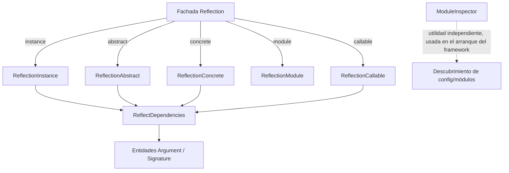

# Orionis Introspection Toolkit (`orionis.introspection`)

> API de reflexión unificada y cacheada sobre clases abstractas, clases concretas, instancias de objetos, módulos y callables.
>
> 🇬🇧 English version: [README.md](README.md)

`orionis.introspection` es el motor de reflexión que impulsa el contenedor
de inyección de dependencias de Orionis, el auto-wiring del router y el
descubrimiento de configuración/módulos del framework durante el arranque.
Envuelve los módulos estándar `inspect`, `typing` y `ast` de Python detrás de
un conjunto reducido de clases especializadas que clasifican los miembros de
una clase por **visibilidad** (pública / protegida / privada / dunder),
**tipo** (método de instancia / de clase / estático, atributo, propiedad) y
**síncrono vs. asíncrono**, y que resuelven las **dependencias de parámetros**
de constructores y métodos para la inyección automática de dependencias.

---

## Tabla de contenidos

1. [Requisitos](#requisitos)
2. [Descripción funcional del módulo](#descripción-funcional-del-módulo)
3. [Arquitectura](#arquitectura)
4. [Referencia de API](#referencia-de-api)
   - [`Reflection` (fachada)](#reflection-orionisintrospectionreflectionreflection)
   - [`ReflectionAbstract`](#reflectionabstract-orionisintrospectionabstractreflectionreflectionabstract)
   - [`ReflectionConcrete`](#reflectionconcrete-orionisintrospectionconcretesreflectionreflectionconcrete)
   - [`ReflectionInstance`](#reflectioninstance-orionisintrospectioninstancesreflectionreflectioninstance)
   - [`ReflectionCallable`](#reflectioncallable-orionisintrospectioncallablesreflectionreflectioncallable)
   - [`ReflectionModule`](#reflectionmodule-orionisintrospectionmodulesreflectionreflectionmodule)
   - [`ReflectDependencies`](#reflectdependencies-orionisintrospectiondependenciesreflectionreflectdependencies)
   - [`ModuleInspector`](#moduleinspector-orionisintrospectionmodulesinspectormoduleinspector)
   - [Entidades: `Argument`, `Signature`](#entidades-argument-signature)
   - [La API de clasificación visibilidad × tipo × síncrono/asíncrono](#la-api-de-clasificación-visibilidad--tipo--síncronoasíncrono)
5. [Ejemplos de uso](#ejemplos-de-uso)
6. [Consideraciones de rendimiento y concurrencia](#consideraciones-de-rendimiento-y-concurrencia)
7. [Notas de diseño](#notas-de-diseño)
8. [Notas de compatibilidad](#notas-de-compatibilidad)

---

## Requisitos

No se requiere ninguna instalación adicional a la del propio framework:

```bash
pip install orionis
```

- **Python:** 3.14 o superior.
- **Dependencia en tiempo de ejecución:** [`msgspec`](https://pypi.org/project/msgspec/)
  (`msgspec>=0.21.1`, dependencia central y no opcional del framework) se
  utiliza para detectar si un parámetro resuelto es un esquema
  `msgspec.Struct` (`Argument.is_schema`), información que el contenedor/router
  usan para decidir si un parámetro debe poblarse desde el cuerpo de una
  petición HTTP.
- No se requiere ningún extra opcional para usar este módulo.

## Descripción funcional del módulo

Construir un contenedor IoC, un router HTTP con handlers auto-conectados o
un cargador de configuración que descubre dataclasses en todo el código
requieren la misma capacidad subyacente: **examinar una pieza de código y
describirla con precisión** — qué atributos y métodos tiene, cuál es su
visibilidad, si son síncronos o asíncronos, y qué parámetros necesita un
constructor o método para invocarse correctamente. `orionis.introspection`
centraliza esta capacidad para que el resto del framework no repita código
repetitivo de `inspect`/`typing`:

- **`Reflection`** — una fachada estática de fábricas/predicados. Se usa
  para obtener el objeto de reflexión correcto (`Reflection.instance(obj)`,
  `Reflection.abstract(cls)`, `Reflection.concrete(cls)`,
  `Reflection.module("pkg.mod")`, `Reflection.callable(fn)`) o para ejecutar
  un predicado de tipo rápido (`Reflection.isAbstract`,
  `Reflection.isCoroutineFunction`, `Reflection.isProtocol`, etc.) sin
  instanciar nada.
- **`ReflectionAbstract` / `ReflectionConcrete` / `ReflectionInstance`** —
  tres reflectores paralelos, uno para clases base abstractas, uno para
  clases concretas (instanciables) y uno para instancias de objetos en
  ejecución. Los tres exponen la misma API de clasificación
  **visibilidad × tipo × síncrono/asíncrono** (ver más abajo) además de
  metadatos de clase (docstring, código fuente, archivo, anotaciones,
  clases base) y firmas de dependencias de constructor/método.
  `ReflectionConcrete` y `ReflectionInstance` además permiten **mutar** el
  objetivo reflejado (`setAttribute`, `setMethod`, `removeAttribute`,
  `removeMethod`).
- **`ReflectionCallable`** — refleja una única función, método o lambda:
  nombre, módulo, docstring, código fuente, archivo, `inspect.Signature` y
  la `Signature` de dependencias resuelta.
- **`ReflectionModule`** — refleja un módulo importable: sus clases,
  funciones y constantes, cada uno separado por visibilidad, además de los
  imports, el archivo y el código fuente del módulo. También permite
  inyectar/eliminar clases en tiempo de ejecución (`setClass`/`removeClass`),
  lo cual el framework usa en pruebas y en escenarios de wiring dinámico.
- **`ReflectDependencies`** — el motor compartido detrás de
  `constructorSignature()` / `methodSignature()` / `callableSignature()` en
  cada uno de los reflectores anteriores. Inspecciona un `inspect.Signature`
  y clasifica cada parámetro como *resuelto* (tiene una anotación de tipo no
  built-in o un valor por defecto) o *no resuelto* (sin anotación y sin
  valor por defecto, o con una anotación built-in "pelada"), que es
  exactamente la información que el contenedor de DI necesita para decidir
  si puede auto-construir un parámetro o debe pedírselo al llamador.
- **`ModuleInspector`** — una utilidad estática de nivel más bajo, usada por
  el propio proceso de arranque del framework para descubrir módulos Python
  bajo un árbol de directorios, cargar dinámicamente una clase por su ruta
  punteada, comprobar si un archivo importa un módulo dado (vía `ast`, sin
  importarlo) y descubrir dataclasses congeladas (frozen) en un conjunto de
  módulos (usado para localizar entidades de configuración).

## Arquitectura



- `Reflection` (`orionis/introspection/reflection.py`) es una fachada sin
  estado: cada método de fábrica **importa perezosamente** la clase
  reflectora concreta dentro del propio cuerpo del método y devuelve una
  instancia nueva — ningún módulo reflector se importa hasta que realmente
  se necesita.
- `ReflectionAbstract`, `ReflectionConcrete`, `ReflectionInstance` y
  `ReflectionCallable` poseen cada uno un diccionario de caché privado
  (basado en `__slots__`) y delegan el cálculo de la firma de dependencias
  en `ReflectDependencies`
  (`orionis/introspection/dependencies/reflection.py`), que a su vez
  construye entidades `Argument`/`Signature`
  (`orionis/introspection/dependencies/entities/`).
- `ModuleInspector` (`orionis/introspection/modules/inspector.py`) no
  depende de las clases reflectoras; es una utilidad autónoma de métodos
  estáticos consumida directamente por el código de arranque del framework
  (p. ej. descubrimiento de configuración), no a través de la fachada
  `Reflection`.
- Cada clase reflectora tiene un contrato equivalente en su subpaquete
  `contracts/` (`IReflectionAbstract`, `IReflectionConcrete`,
  `IReflectionInstance`, `IReflectionCallable`, `IReflectionModule`,
  `IReflectDependencies`), y la clase concreta siempre referencia el tipo
  del contrato en las firmas públicas (p. ej. `Reflection.instance(...) ->
  IReflectionInstance`).

## Referencia de API

### `Reflection` (`orionis.introspection.reflection.Reflection`)

Una clase compuesta únicamente por `@staticmethod` — nunca se instancia.
Dos familias de métodos:

**Métodos de fábrica** (cada uno importa perezosamente y devuelve un
reflector nuevo):

| Método | Retorna | Notas |
| --- | --- | --- |
| `Reflection.instance(instance: Any)` | `IReflectionInstance` | Envuelve una instancia de objeto. Lanza error si `instance` es una clase, una instancia built-in/abc, o proviene de `__main__`. |
| `Reflection.abstract(abstract: type)` | `IReflectionAbstract` | Envuelve una clase base abstracta. Lanza `TypeError` si `abstract` no es abstracta (`inspect.isabstract`). |
| `Reflection.concrete(concrete: type)` | `IReflectionConcrete` | Envuelve una clase concreta e instanciable. Lanza `TypeError` si no es una clase concreta de usuario (ver `isConcreteClass`). |
| `Reflection.module(module: str)` | `IReflectionModule` | Importa `module` por nombre punteado y lo envuelve. Lanza `TypeError` si el nombre no es válido o la importación falla. |
| `Reflection.callable(fn: Callable)` | `IReflectionCallable` | Envuelve una función, método vinculado o lambda. Lanza `TypeError` para cualquier otra cosa. |

**Predicados de tipo** — envoltorios ligeros, sin asignaciones extra, sobre
`inspect`/`typing` (todos reciben `obj: Any` y devuelven `bool`, salvo que
se indique lo contrario):

`isAbstract`, `isConcreteClass`, `isAsyncGen`, `isAsyncGenFunction`,
`isAwaitable`, `isBuiltIn`, `isClass`, `isCode`, `isCoroutine`,
`isCoroutineFunction`, `isDataDescriptor`, `isFrame`, `isFunction`,
`isGenerator`, `isGeneratorFunction`, `isGetSetDescriptor`,
`isMemberDescriptor`, `isMethod`, `isMethodDescriptor`, `isModule`,
`isRoutine`, `isTraceback`, `isGeneric`, `isProtocol`, `isInstance`,
`isTypingConstruct`.

Predicados destacados:

- `isConcreteClass(obj)` — `True` solo si `obj` es un `type`, **no** es
  built-in, abstracto, genérico, un `Protocol`, ni un constructo de
  `typing`, no hereda directamente de `abc.ABC`, y define `__init__`.
- `isInstance(obj)` — `True` si `obj` es un objeto (no un `type`) cuya
  clase está definida fuera de `builtins`/`abc`.
- `isProtocol(obj)` — `True` si `obj` es una clase que hereda de
  `typing.Protocol` (y no es el propio `Protocol`).

### `ReflectionAbstract` (`orionis.introspection.abstract.reflection.ReflectionAbstract`)

```python
def __init__(self, abstract: type) -> None
```

Envuelve una **clase base abstracta** (`inspect.isabstract(abstract)` debe
ser `True`, si no lanza `TypeError`). Expone `setAttribute` /
`removeAttribute` / `removeMethod` (mutación a nivel de clase), pero no
`setMethod` — solo `ReflectionConcrete`/`ReflectionInstance` pueden añadir
nuevos métodos al objetivo reflejado.

Metadatos de clase: `getClass()`, `getClassName()`, `getModuleName()`,
`getModuleWithClassName()`, `getDocstring()`, `getBaseClasses()`,
`getSourceCode()`, `getFile()`, `getAnnotations()`.

Clasificación de atributos/métodos/propiedades: ver la
[API de clasificación compartida](#la-api-de-clasificación-visibilidad--tipo--síncronoasíncrono)
más abajo. También ofrece `hasAttribute`, `getAttribute`, `setAttribute`,
`removeAttribute`, `hasMethod`, `removeMethod`, `getMethodSignature`,
`getPropertySignature`, `getPropertyDocstring`.

Dependencias y caché: `constructorSignature() -> Signature`,
`methodSignature(method_name: str) -> Signature`, `clearCache() -> None`.

### `ReflectionConcrete` (`orionis.introspection.concretes.reflection.ReflectionConcrete`)

```python
def __init__(self, concrete: type) -> None
```

Envuelve una **clase concreta e instanciable** (validada con
`Reflection.isConcreteClass`; lanza `TypeError` en caso contrario). Añade
capacidades de mutación y orientadas a instancias sobre la API de
clasificación compartida:

| Método | Firma | Descripción |
| --- | --- | --- |
| `setMethod` | `(name: str, method: Callable) -> bool` | Añade un método nuevo a la clase. Gestiona el mangling de nombres privados. Lanza `ValueError` si el nombre ya existe, no es válido, o `method` no es invocable. |
| `getProperty` | `(name: str) -> Any` | Invoca el getter de una propiedad sobre la clase y devuelve su valor. Lanza `ValueError`/`TypeError` si no existe o no es una propiedad. |
| `getSourceCode` | `(method: str | None = None) -> str | None` | Devuelve el código fuente de la clase, o el de un método concreto si se indica `method`. |
| `getAttribute` | `(name: str, default: Any = None) -> Any` | A diferencia de `ReflectionAbstract.getAttribute`, acepta un valor `default` en lugar de lanzar una excepción. |
| `getConstructorSignature` | `() -> inspect.Signature` | `inspect.Signature` en bruto de `__init__` (no la entidad `Signature` de dependencias resuelta). |
| `constructorSignature` / `methodSignature` | `() -> Signature` / `(name: str) -> Signature` | Delegan en `ReflectDependencies(self._concrete)`. |

Además de todos los miembros compartidos con `ReflectionAbstract`:
metadatos de clase, `hasAttribute`/`setAttribute`/`removeAttribute`,
`hasMethod`/`removeMethod`/`getMethodSignature`, la API de clasificación
completa, `getPropertySignature`, `getPropertyDocstring`, `clearCache`.

### `ReflectionInstance` (`orionis.introspection.instances.reflection.ReflectionInstance`)

```python
def __init__(self, instance: Any) -> None
```

Envuelve una **instancia de objeto en ejecución**. Lanza `TypeError` si
`instance` es una clase, o una instancia de una clase built-in/`abc`; lanza
`ValueError` si la clase de la instancia se definió en `__main__` (reflejar
objetos de `__main__` no está soportado porque el módulo no puede
reimportarse de forma segura).

| Método | Firma | Descripción |
| --- | --- | --- |
| `getInstance` | `() -> Any` | Devuelve el propio objeto envuelto. |
| `setMethod` | `(name: str, method: Callable) -> bool` | Añade un método a la clase de la instancia. |
| `removeMethod` | `(name: str) -> None` | Elimina un método de la clase de la instancia vía `delattr`. Lanza `AttributeError` si no existe. **Nota:** devuelve `None`, a diferencia del `bool` que devuelven `ReflectionAbstract.removeMethod`/`ReflectionConcrete.removeMethod`. |
| `getMethodDocstring` | `(name: str) -> str | None` | Docstring de un método concreto. |
| `getProperty` | `(name: str) -> Any` | Mismo comportamiento que `ReflectionConcrete.getProperty`. |
| `getPropertyDocstring` | `(name: str) -> str` | Tipo de retorno no opcional en el contrato (en la práctica devuelve el docstring del getter). |
| `getBaseClasses` | `() -> tuple[type, ...]` | Devuelve una **tupla** (los reflectores abstracto/concreto devuelven una `list`). |

Además de metadatos de clase, la API de clasificación completa,
`hasAttribute`/`getAttribute(name, default=None)`/`setAttribute`/
`removeAttribute`, `hasMethod`/`getMethodSignature`,
`getPropertySignature`, `constructorSignature`/`methodSignature`,
`clearCache`.

### `ReflectionCallable` (`orionis.introspection.callables.reflection.ReflectionCallable`)

```python
def __init__(self, fn: callable) -> None
```

Envuelve una única función, método vinculado o lambda. Lanza `TypeError` si
`fn` no es un `FunctionType`/`MethodType` (ni un invocable con `__code__`).

| Método | Retorna | Descripción |
| --- | --- | --- |
| `getCallable()` | `callable` | El invocable envuelto. |
| `getName()` | `str` | `fn.__name__`, precalculado en la construcción. |
| `getModuleName()` | `str` | `fn.__module__`, precalculado en la construcción. |
| `getModuleWithCallableName()` | `str` | `"{module}.{name}"`. |
| `getDocstring()` | `str` | `fn.__doc__ or ""`. |
| `getSourceCode()` | `str` | `inspect.getsource(fn)`, cacheado. Lanza `AttributeError` ante un `OSError` (p. ej. built-ins). |
| `getFile()` | `str` | Ruta absoluta del archivo fuente. Lanza `TypeError` si no está disponible. |
| `getSignature()` | `inspect.Signature` | Firma de parámetros en bruto. |
| `getDependencies()` | `Signature` | Firma de dependencias resuelta/no resuelta (cacheada), vía `ReflectDependencies`. |
| `clearCache()` | `None` | Limpia el diccionario de caché interno. |

### `ReflectionModule` (`orionis.introspection.modules.reflection.ReflectionModule`)

```python
def __init__(self, module: str) -> None
```

Importa `module` (`importlib.import_module`) y lo envuelve. Lanza
`TypeError` si `module` no es una cadena no vacía o si la importación
falla.

| Método | Retorna | Descripción |
| --- | --- | --- |
| `getModule()` | `object` | El objeto módulo importado. |
| `hasClass(class_name)` / `getClass(class_name)` | `bool` / `type \| None` | Busca una clase definida en el módulo. |
| `setClass(class_name, cls)` / `removeClass(class_name)` | `bool` | Inyecta o elimina un atributo de clase en el objeto módulo. Lanza `ValueError` ante nombres/tipos inválidos. |
| `getClasses()` / `getPublicClasses()` / `getProtectedClasses()` / `getPrivateClasses()` | `dict` | Clases definidas en el módulo, separadas por visibilidad. |
| `getConstant(name)` / `getConstants()` / `getPublicConstants()` / `getProtectedConstants()` / `getPrivateConstants()` | `object \| None` / `dict` | Valores no invocables y no clase definidos a nivel de módulo. |
| `getFunctions()` / `getPublicFunctions()` / `getPublicSyncFunctions()` / `getPublicAsyncFunctions()` / `getProtectedFunctions()` / `getProtectedSyncFunctions()` / `getProtectedAsyncFunctions()` / `getPrivateFunctions()` / `getPrivateSyncFunctions()` / `getPrivateAsyncFunctions()` | `dict` | Funciones a nivel de módulo, separadas por visibilidad y síncrono/asíncrono. |
| `getImports()` | `dict` | Nombres importados en el espacio de nombres del módulo. |
| `getFile()` | `str` | Ruta del archivo del módulo. |
| `getSourceCode()` | `str` | Código fuente del módulo. Lanza `ValueError` si no puede leerse. |
| `clearCache()` | `None` | Limpia el diccionario de caché interno. |

### `ReflectDependencies` (`orionis.introspection.dependencies.reflection.ReflectDependencies`)

```python
def __init__(self, target: Any | None = None) -> None
```

El motor de resolución de dependencias compartido, utilizado internamente
por cada uno de los reflectores anteriores (cada uno construye
`ReflectDependencies(self._target_object)` bajo demanda, en lugar de
heredar de él).

| Método | Retorna | Descripción |
| --- | --- | --- |
| `constructorSignature()` | `Signature` | Inspecciona `target.__init__` (lanza `ValueError` si la firma no puede inspeccionarse). |
| `methodSignature(method_name: str)` | `Signature` | Inspecciona `getattr(target, method_name)`. |
| `callableSignature()` | `Signature` | Inspecciona `target` directamente. Lanza `TypeError` si `target` no es invocable. |

Regla de clasificación aplicada a cada parámetro (omitiendo `self`, `cls`,
`*args`, `**kwargs`):

- **No resuelto**: sin anotación *y* sin valor por defecto, **o** una
  anotación que resuelve a un tipo built-in (`module == "builtins"`, p. ej.
  `str`, `int`) sin valor por defecto.
- **Resuelto**: tiene un valor por defecto (el `Argument.type` se infiere de
  `type(default)`), **o** tiene una anotación de tipo no built-in. Cuando la
  anotación es en sí misma una subclase de `msgspec.Struct`,
  `Argument.is_schema` se marca como `True`.
- Las anotaciones en forma de cadena (forward reference) se tratan como
  resueltas a `typing.<nombre>`, salvo que el nombre referenciado sea
  exactamente el de un tipo `builtins` — el resolutor no evalúa las forward
  references.

### `ModuleInspector` (`orionis.introspection.modules.inspector.ModuleInspector`)

Una clase utilitaria compuesta únicamente por `@staticmethod`/
`@classmethod` (nunca se instancia), independiente de la fachada
`Reflection` y utilizada por el código de arranque del framework para el
descubrimiento de módulos/configuración:

| Método | Firma | Descripción |
| --- | --- | --- |
| `discoverModules` | `(base_path: Path, tarjet_path: Path) -> set[str]` | Busca recursivamente archivos `*.py` bajo `tarjet_path` y convierte sus rutas en nombres de módulo punteados relativos a `base_path`, eliminando los segmentos `venv`/`site-packages`. |
| `loadClass` | `(module_path: str \| None = None, class_name: str \| None = None, *, metadata: dict[str, str] \| None = None) -> type` | Importa un módulo y devuelve una clase por nombre, con una caché de clases resueltas por proceso (`__cache_resolved_classes`). Acepta argumentos explícitos o un diccionario `metadata` con claves `"module"`/`"class"`. Lanza `ImportError`, `AttributeError` o `TypeError`. |
| `fileImportsAny` | `(file_path: Path, target_modules: set[str]) -> bool` | Usa `ast.parse`/`ast.walk` (sin importar) para comprobar si un archivo importa alguno de `target_modules`. Devuelve `False` ante `SyntaxError`/`UnicodeDecodeError` o si el archivo no existe. |
| `discoverFrozenDataclasses` | `(modules: set[str]) -> set[tuple[str, str, str, type]]` | Importa cada módulo en `modules` y recopila tuplas `(nombre_archivo, ruta_módulo, nombre_clase, clase)` para cada dataclass **congelada** (frozen) definida directamente en ese módulo. Lanza `RuntimeError` si un módulo no puede importarse. |

### Entidades: `Argument`, `Signature`

Ambas viven en `orionis.introspection.dependencies.entities` y se usan
como tipo de retorno de todos los métodos `constructorSignature`/
`methodSignature`/`callableSignature`/`getDependencies` anteriores.

**`Argument`** — `@dataclass(slots=True, kw_only=True, frozen=True)`:

| Campo | Tipo | Descripción |
| --- | --- | --- |
| `name` | `str` | Nombre del parámetro. |
| `resolved` | `bool` | Si este parámetro se clasificó como resuelto. |
| `module_name` | `str` | Módulo del tipo del parámetro. |
| `class_name` | `str` | Nombre del tipo del parámetro. |
| `type` | `type[Any]` | El objeto de tipo Python resuelto. |
| `full_class_path` | `str` | `"{module_name}.{class_name}"`. |
| `is_keyword_only` | `bool` (por defecto `False`) | Si el parámetro es solo-por-nombre (keyword-only). |
| `is_schema` | `bool` (por defecto `False`) | Si `type` es una subclase de `msgspec.Struct`. |
| `default` | `Any \| None` (por defecto `None`) | El valor por defecto del parámetro, si lo tiene. |

Lanza `TypeError` en `__post_init__` si `module_name`, `class_name` o
`full_class_path` no son cadenas, y `ValueError` si `type` es `None` sin
que se haya proporcionado `default`.

**`Signature`** — `@dataclass(frozen=True, kw_only=True)`, extiende
`orionis.support.entities.base.BaseEntity`:

| Campo | Tipo | Descripción |
| --- | --- | --- |
| `resolved` | `dict[str, Argument]` | Parámetros clasificados como resueltos. |
| `unresolved` | `dict[str, Argument]` | Parámetros clasificados como no resueltos. |
| `ordered` | `dict[str, Argument]` | Todos los parámetros, en el orden original de declaración. |

Métodos auxiliares: `hasParameters()`, `noArgumentsRequired()`,
`hasUnresolvedArguments()`, `getResolved()`, `getUnresolved()`,
`getAllOrdered()`, `getPositionalOnly()`, `getKeywordOnly()`, `toDict()`,
`resolvedToDict()`, `unresolvedToDict()`, `keywordOnlyToDict()`,
`positionalOnlyToDict()`, `arguments()` / `items()` (ambos devuelven
`dict_items[str, Argument]` sobre `ordered`). `Signature` también hereda los
métodos de serialización estilo `toDict()` de `BaseEntity`.

### La API de clasificación visibilidad × tipo × síncrono/asíncrono

`ReflectionAbstract`, `ReflectionConcrete` y `ReflectionInstance` exponen
todos el **mismo patrón de nombres** para clasificar los miembros de una
clase. Los nombres siguen la plantilla:

```
get[Public|Protected|Private][Class|Static|""][Sync|Async|""]Methods() -> list[str]
```

- **Visibilidad**: `Public` (sin guion bajo inicial), `Protected` (un único
  guion bajo inicial, sin mangling), `Private` (con mangling de nombre
  `_NombreClase__nombre`, devuelto con el prefijo de mangling eliminado), o
  ninguna (métodos dunder, tratados aparte).
- **Tipo**: métodos de instancia normales, métodos de `Class`
  (`@classmethod`), o métodos `Static` (`@staticmethod`).
- **Síncrono/Asíncrono**: cada combinación de tipo × visibilidad tiene una
  variante `All` (implícita — sin sufijo), `Sync` y `Async`, determinada
  mediante `inspect.iscoroutinefunction`.

Esto produce las siguientes familias de métodos (todas devuelven
`list[str]`, disponibles en los tres reflectores):

| Visibilidad | Métodos de instancia | Métodos de clase | Métodos estáticos |
| --- | --- | --- | --- |
| Pública | `getPublicMethods`, `getPublicSyncMethods`, `getPublicAsyncMethods` | `getPublicClassMethods`, `getPublicClassSyncMethods`, `getPublicClassAsyncMethods` | `getPublicStaticMethods`, `getPublicStaticSyncMethods`, `getPublicStaticAsyncMethods` |
| Protegida | `getProtectedMethods`, `getProtectedSyncMethods`, `getProtectedAsyncMethods` | `getProtectedClassMethods`, `getProtectedClassSyncMethods`, `getProtectedClassAsyncMethods` | `getProtectedStaticMethods`, `getProtectedStaticSyncMethods`, `getProtectedStaticAsyncMethods` |
| Privada | `getPrivateMethods`, `getPrivateSyncMethods`, `getPrivateAsyncMethods` | `getPrivateClassMethods`, `getPrivateClassSyncMethods`, `getPrivateClassAsyncMethods` | `getPrivateStaticMethods`, `getPrivateStaticSyncMethods`, `getPrivateStaticAsyncMethods` |

Además, en cada reflector: `getMethods()` (agregado de todo lo anterior),
`getDunderMethods()` / `getMagicMethods()` (alias), y la familia análoga de
**atributos** — `getAttributes()`, `getPublicAttributes()`,
`getProtectedAttributes()`, `getPrivateAttributes()`,
`getDunderAttributes()`, `getMagicAttributes()` (diccionarios de
nombre → valor, excluyendo invocables, métodos estáticos/de clase y
propiedades) — y la familia de **propiedades** — `getProperties()`,
`getPublicProperties()`, `getProtectedProperties()`,
`getPrivateProperties()`, además de `getPropertySignature(name)` y
`getPropertyDocstring(name)`.

Todos los resultados de clasificación se calculan mediante un **escaneo de
clase de una sola pasada** (`_scanClass`) la primera vez que se llama a
cualquier método de clasificación, y luego se sirven desde un diccionario
de caché interno hasta que se invoca `clearCache()` o se muta el objetivo
(`setAttribute`/`removeAttribute`/`setMethod`/`removeMethod`), lo que
invalida la caché automáticamente.

## Ejemplos de uso

### Reflejar una clase concreta para introspección al estilo DI

```python
from orionis.introspection import Reflection

class WelcomeService:
    """Servicio de ejemplo con miembros de visibilidad mixta."""

    greeting: str = "Hello"

    def __init__(self, name: str, retries: int = 3) -> None:
        self._name = name
        self.retries = retries

    def greet(self) -> str:
        return f"{self.greeting}, {self._name}!"

    async def greetAsync(self) -> str:
        return self.greet()

    def _protectedHelper(self) -> None:
        ...

    def __privateHelper(self) -> None:  # noqa: PLW3201 (solo ilustrativo)
        ...

reflection = Reflection.concrete(WelcomeService)

reflection.getClassName()               # "WelcomeService"
reflection.getModuleWithClassName()     # "<módulo>.WelcomeService"
reflection.getPublicMethods()           # ["greet", "greetAsync"]
reflection.getPublicSyncMethods()       # ["greet"]
reflection.getPublicAsyncMethods()      # ["greetAsync"]
reflection.getProtectedMethods()        # ["_protectedHelper"]
reflection.getPrivateMethods()          # ["__privateHelper"] (mangling eliminado)
reflection.getPublicAttributes()        # {"greeting": "Hello"}

signature = reflection.constructorSignature()
signature.hasUnresolvedArguments()      # True: "name" no tiene anotación/valor por defecto
list(signature.getUnresolved())         # ["name"]
list(signature.getResolved())           # ["retries"] (tiene un valor por defecto)
```

### Reflejar una instancia en ejecución y mutarla

```python
from orionis.introspection import Reflection

instance = WelcomeService(name="Ada")
ri = Reflection.instance(instance)

ri.getAttribute("retries", default=0)   # 3
ri.setAttribute("retries", 5)
ri.setMethod("shout", lambda self: ri.getAttribute("greeting").upper())
ri.hasMethod("shout")                   # True
ri.clearCache()                         # fuerza un nuevo escaneo de miembros en el próximo acceso
```

### Reflejar las dependencias de un callable

```python
from orionis.introspection import Reflection

def send_email(to: str, subject: str = "Hello") -> None:
    ...

rc = Reflection.callable(send_email)
deps = rc.getDependencies()
deps.getUnresolved()   # {"to": Argument(...)}  -- sin anotación, sin valor por defecto
deps.getResolved()     # {"subject": Argument(...)}  -- tiene un valor por defecto
```

### Reflejar un módulo

```python
from orionis.introspection import Reflection

rm = Reflection.module("orionis.support.entities.base")
rm.getPublicClasses()      # {"BaseEntity": <class ...>}
rm.getPublicFunctions()    # {} (ninguna definida a nivel de módulo en este ejemplo)
rm.getFile()               # ruta absoluta a base.py
```

### Descubrir módulos y dataclasses de configuración congeladas

```python
from pathlib import Path
from orionis.introspection.modules.inspector import ModuleInspector

base = Path("/ruta/al/proyecto")
modules = ModuleInspector.discoverModules(base, base / "config")
entities = ModuleInspector.discoverFrozenDataclasses(modules)
for file_name, module_path, class_name, cls in entities:
    print(file_name, module_path, class_name, cls)
```

### Usar los predicados de tipo de `Reflection`

```python
from orionis.introspection import Reflection

async def handler() -> None:
    ...

Reflection.isCoroutineFunction(handler)  # True
Reflection.isConcreteClass(WelcomeService)  # True
Reflection.isAbstract(WelcomeService)        # False
```

## Consideraciones de rendimiento y concurrencia

- **Escaneo de una sola pasada + caché**: `ReflectionAbstract`,
  `ReflectionConcrete` y `ReflectionInstance` escanean el diccionario de la
  clase **una sola vez** (`_scanClass`) en el primer acceso a un miembro,
  clasificando cada atributo/método/propiedad en un único bucle, y cachean
  los resultados en un diccionario por instancia. Las llamadas repetidas a
  cualquier getter de clasificación (`getPublicMethods()`, etc.) son
  lecturas de caché O(1) hasta que se llama a `clearCache()` o se muta el
  objetivo.
- **`__slots__` en todas partes**: `ReflectionAbstract`, `ReflectionCallable`
  y los helpers internos `_ScanBuffers`/`_Flags` declaran `__slots__`, lo
  que elimina la asignación de `__dict__` por instancia y acelera el acceso
  a atributos. Esta es una decisión de diseño existente, no algo a cambiar.
- **Cachés LRU a nivel de módulo en `ReflectDependencies`**:
  `_get_signature` y `_get_resolved_signature` están envueltas en
  `functools.lru_cache(maxsize=1024)` **a nivel de módulo**, por lo que la
  `Signature` de dependencias resuelta para un callable/constructor/método
  dado se calcula una sola vez **por proceso**, compartida entre todas las
  instancias de `ReflectDependencies`/reflectores que inspeccionen el mismo
  objetivo — no solo dentro de una instancia de reflector. Como la clave de
  caché es el propio objeto objetivo, tenlo en cuenta si reconstruyes
  dinámicamente funciones/clases con la misma identidad durante la vida del
  proceso (la firma cacheada no se recalculará).
- **`ModuleInspector.__cache_resolved_classes`**: un `dict` simple a nivel
  de clase (sin bloqueo) que cachea los resultados de `loadClass` por clave
  `"módulo.Clase"`. Las lecturas y escrituras dependen del GIL para su
  atomicidad; esto es adecuado para el patrón de uso, principalmente en el
  arranque y de escritura única, que el framework le aplica.
- **Los objetos de reflexión no están pensados para compartirse/mutarse de
  forma concurrente** entre hilos sobre el mismo objetivo — si dos hilos
  llaman a `setAttribute`/`setMethod`/`removeMethod` sobre el mismo
  reflector (o sobre dos reflectores que envuelven la misma clase) al mismo
  tiempo, las mutaciones del diccionario de la clase subyacente y la
  invalidación de la caché no están sincronizadas con un bloqueo. En la
  práctica, la reflexión se usa principalmente en el arranque de la
  aplicación (wiring de DI, descubrimiento de configuración) y no en la
  ruta caliente de las peticiones, por lo que esto no supone un problema
  real.
- **Sin E/S más allá de la búsqueda de código fuente/archivo**:
  `getSourceCode()`/`getFile()` realizan lecturas síncronas del sistema de
  archivos vía `inspect` la primera vez que se llaman (y luego cachean el
  resultado); evita llamarlos en un bucle ajustado dentro de una ruta
  caliente.

## Notas de diseño

- **Fachada + imports perezosos**: `Reflection` nunca importa un módulo
  reflector en el momento de importar el propio módulo — cada método de
  fábrica importa su clase objetivo dentro del cuerpo del método. Esto
  mantiene `import orionis.introspection` barato incluso si solo se usa un
  tipo de reflector.
- **Contratos (`contracts/reflection.py`) por reflector**: cada reflector
  concreto implementa un contrato `ABC` equivalente (`IReflectionAbstract`,
  `IReflectionConcrete`, `IReflectionInstance`, `IReflectionCallable`,
  `IReflectionModule`, `IReflectDependencies`), y las APIs públicas del
  resto del framework tipan contra el contrato, no contra la clase
  concreta.
- **Entidades dataclass para los metadatos de dependencias**: `Argument`
  es `frozen=True, slots=True, kw_only=True`; `Signature` es
  `frozen=True, kw_only=True` y extiende `BaseEntity` (helpers de
  serialización compartidos por las entidades de configuración/datos de
  `orionis`). Ambas validan sus propios tipos de campo en `__post_init__`.
- **Caché como protocolo de diccionario**: `ReflectionAbstract`,
  `ReflectionConcrete`, `ReflectionInstance`, `ReflectionCallable` y
  `ReflectionModule` implementan todos `__getitem__`/`__setitem__`/
  `__contains__`/`__delitem__` sobre su diccionario de caché interno,
  dando a quien los use (y a los tests) una forma uniforme, al estilo de
  un diccionario, de inspeccionar o precargar valores cacheados sin acceder
  a atributos privados.
- **Tipos de error consistentes, sin jerarquía de excepciones propia**:
  este módulo lanza intencionalmente excepciones integradas de Python
  (`TypeError`, `ValueError`, `AttributeError`, `ImportError`,
  `RuntimeError`) en lugar de definir sus propias clases de excepción — los
  fallos de validación usan `TypeError`/`ValueError`, los miembros
  faltantes usan `AttributeError`, y los fallos de importación usan
  `ImportError`/`RuntimeError`.
- **Asimetrías deliberadas entre reflectores** (no son errores a
  "corregir"):
  - `ReflectionInstance.removeMethod()` devuelve `None`, mientras que
    `ReflectionAbstract.removeMethod()`/`ReflectionConcrete.removeMethod()`
    devuelven `bool`.
  - `ReflectionInstance.getBaseClasses()` devuelve una `tuple[type, ...]`,
    mientras que los reflectores abstracto/concreto devuelven una
    `list[type]`.
  - `ReflectionAbstract.getAttribute(name)` no tiene parámetro `default` y
    lanza una excepción cuando el atributo falta, mientras que
    `ReflectionConcrete`/`ReflectionInstance` con
    `getAttribute(name, default=None)` aceptan un valor de respaldo en su
    lugar.
  - Solo `ReflectionConcrete` expone `getConstructorSignature()`, que
    devuelve un `inspect.Signature` en bruto, además de
    `constructorSignature()` (tipada como `Signature`) compartida por
    todos los reflectores.

## Notas de compatibilidad

- **Versión mínima de Python:** 3.14 (según `pyproject.toml`,
  `requires-python = ">=3.14"`), igual que el resto del framework.
- **Dependencia obligatoria:** `msgspec>=0.21.1` (dependencia central,
  usada únicamente para la detección de esquemas `msgspec.Struct` en
  `ReflectDependencies`).
- Todo lo demás en este módulo se apoya únicamente en la biblioteca
  estándar de Python (`inspect`, `typing`, `ast`, `importlib`,
  `functools`, `keyword`, `dataclasses`, `pathlib`).
- Sin comportamiento específico de plataforma; el módulo funciona de forma
  idéntica en Windows, Linux y macOS.
