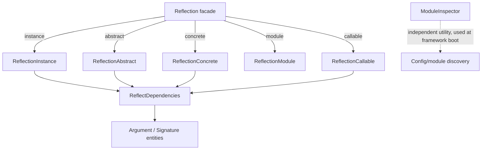

# Orionis Introspection Toolkit (`orionis.introspection`)

> Unified, cached reflection API over abstract classes, concrete classes, object instances, modules, and callables.
>
> 🇪🇸 Versión en español: [README.es.md](README.es.md)

`orionis.introspection` is the reflection engine that powers the Orionis
dependency-injection container, the router's auto-wiring, and the
framework's configuration/module discovery at boot time. It wraps Python's
`inspect`, `typing` and `ast` modules behind a small set of purpose-built
classes that classify class members by **visibility** (public / protected /
private / dunder), **kind** (instance / class / static method, attribute,
property) and **sync vs. async**, and that resolve constructor/method
**parameter dependencies** for automatic dependency injection.

---

## Table of contents

1. [Requirements](#requirements)
2. [Module overview](#module-overview)
3. [Architecture](#architecture)
4. [API reference](#api-reference)
   - [`Reflection` (facade)](#reflection-orionisintrospectionreflectionreflection)
   - [`ReflectionAbstract`](#reflectionabstract-orionisintrospectionabstractreflectionreflectionabstract)
   - [`ReflectionConcrete`](#reflectionconcrete-orionisintrospectionconcretesreflectionreflectionconcrete)
   - [`ReflectionInstance`](#reflectioninstance-orionisintrospectioninstancesreflectionreflectioninstance)
   - [`ReflectionCallable`](#reflectioncallable-orionisintrospectioncallablesreflectionreflectioncallable)
   - [`ReflectionModule`](#reflectionmodule-orionisintrospectionmodulesreflectionreflectionmodule)
   - [`ReflectDependencies`](#reflectdependencies-orionisintrospectiondependenciesreflectionreflectdependencies)
   - [`ModuleInspector`](#moduleinspector-orionisintrospectionmodulesinspectormoduleinspector)
   - [Entities: `Argument`, `Signature`](#entities-argument-signature)
   - [The visibility × kind × sync/async classification API](#the-visibility--kind--syncasync-classification-api)
5. [Usage examples](#usage-examples)
6. [Performance and concurrency considerations](#performance-and-concurrency-considerations)
7. [Design notes](#design-notes)
8. [Compatibility notes](#compatibility-notes)

---

## Requirements

No installation beyond the framework itself is required:

```bash
pip install orionis
```

- **Python:** 3.14 or newer.
- **Runtime dependency:** [`msgspec`](https://pypi.org/project/msgspec/)
  (`msgspec>=0.21.1`, a core, non-optional dependency of the framework) is
  used to detect whether a resolved parameter type is a `msgspec.Struct`
  schema (`Argument.is_schema`), which the container/router use to decide
  whether a parameter should be populated from an HTTP request body.
- No optional extras are required to use this module.

## Module overview

Building an IoC container, an HTTP router with auto-wired handlers, or a
configuration loader that discovers dataclasses across the codebase all
require the same underlying capability: **looking at a piece of code and
describing it precisely** — what attributes and methods it has, what their
visibility is, whether they are synchronous or asynchronous, and what
parameters a constructor or method needs to be called correctly.
`orionis.introspection` centralises this capability so the rest of the
framework does not repeat `inspect`/`typing` boilerplate:

- **`Reflection`** — a static factory/predicate facade. Use it to obtain the
  right reflection object (`Reflection.instance(obj)`,
  `Reflection.abstract(cls)`, `Reflection.concrete(cls)`,
  `Reflection.module("pkg.mod")`, `Reflection.callable(fn)`) or to run a
  quick type predicate (`Reflection.isAbstract`, `Reflection.isCoroutineFunction`,
  `Reflection.isProtocol`, etc.) without instantiating anything.
- **`ReflectionAbstract` / `ReflectionConcrete` / `ReflectionInstance`** —
  three parallel reflectors, one for abstract base classes, one for
  concrete (instantiable) classes, and one for live object instances. All
  three expose the same **visibility × kind × sync/async** classification
  API (see below) plus class metadata (docstring, source code, file,
  annotations, base classes) and constructor/method dependency signatures.
  `ReflectionConcrete` and `ReflectionInstance` additionally allow **mutating**
  the reflected target (`setAttribute`, `setMethod`, `removeAttribute`,
  `removeMethod`).
- **`ReflectionCallable`** — reflects a single function, method, or lambda:
  name, module, docstring, source, file, `inspect.Signature`, and resolved
  dependency `Signature`.
- **`ReflectionModule`** — reflects an importable module: its classes,
  functions and constants, each split by visibility, plus the module's
  imports, file, and source code. Also allows injecting/removing classes at
  runtime (`setClass`/`removeClass`), which the framework uses in tests and
  dynamic wiring scenarios.
- **`ReflectDependencies`** — the shared engine behind
  `constructorSignature()` / `methodSignature()` / `callableSignature()` on
  every reflector above. Inspects an `inspect.Signature` and classifies each
  parameter as *resolved* (has a non-builtin type annotation or a default
  value) or *unresolved* (no annotation and no default, or a bare builtin
  annotation), which is exactly the information the DI container needs to
  decide whether it can auto-construct a parameter or must ask the caller
  for it.
- **`ModuleInspector`** — a lower-level, purely static utility used by the
  framework's own bootstrap process to discover Python modules under a
  directory tree, dynamically load a class by dotted path, check whether a
  file imports a given module (via `ast`, without importing it), and
  discover frozen dataclasses across a set of modules (used to find
  configuration entities).

## Architecture



- `Reflection` (`orionis/introspection/reflection.py`) is a stateless
  facade: every factory method **lazily imports** the concrete reflector
  class inside the method body and returns a fresh instance — no reflector
  module is imported until it is actually needed.
- `ReflectionAbstract`, `ReflectionConcrete`, `ReflectionInstance`, and
  `ReflectionCallable` each own a private cache dict (`__slots__`-based) and
  delegate dependency-signature computation to `ReflectDependencies`
  (`orionis/introspection/dependencies/reflection.py`), which in turn
  builds `Argument`/`Signature` entities
  (`orionis/introspection/dependencies/entities/`).
- `ModuleInspector` (`orionis/introspection/modules/inspector.py`) does not
  depend on the reflector classes; it is a standalone static-method utility
  consumed directly by framework bootstrap code (e.g. configuration
  discovery), not through the `Reflection` facade.
- Every reflector class has a matching contract in its `contracts/`
  subpackage (`IReflectionAbstract`, `IReflectionConcrete`,
  `IReflectionInstance`, `IReflectionCallable`, `IReflectionModule`,
  `IReflectDependencies`), and the concrete class always references the
  contract type in public signatures (e.g. `Reflection.instance(...) ->
  IReflectionInstance`).

## API reference

### `Reflection` (`orionis.introspection.reflection.Reflection`)

A class of `@staticmethod`s only — never instantiated. Two families of
methods:

**Factory methods** (each lazily imports and returns a new reflector):

| Method | Returns | Notes |
| --- | --- | --- |
| `Reflection.instance(instance: Any)` | `IReflectionInstance` | Wraps an object instance. Raises if `instance` is a class, a built-in/abc instance, or from `__main__`. |
| `Reflection.abstract(abstract: type)` | `IReflectionAbstract` | Wraps an abstract base class. Raises `TypeError` if `abstract` is not abstract (`inspect.isabstract`). |
| `Reflection.concrete(concrete: type)` | `IReflectionConcrete` | Wraps a concrete, instantiable class. Raises `TypeError` if not a concrete user-defined class (see `isConcreteClass`). |
| `Reflection.module(module: str)` | `IReflectionModule` | Imports `module` by dotted name and wraps it. Raises `TypeError` if the name is invalid or the import fails. |
| `Reflection.callable(fn: Callable)` | `IReflectionCallable` | Wraps a function, bound method, or lambda. Raises `TypeError` for anything else. |

**Type predicates** — thin, allocation-free wrappers over `inspect`/`typing`
(all take `obj: Any` and return `bool`, unless noted):

`isAbstract`, `isConcreteClass`, `isAsyncGen`, `isAsyncGenFunction`,
`isAwaitable`, `isBuiltIn`, `isClass`, `isCode`, `isCoroutine`,
`isCoroutineFunction`, `isDataDescriptor`, `isFrame`, `isFunction`,
`isGenerator`, `isGeneratorFunction`, `isGetSetDescriptor`,
`isMemberDescriptor`, `isMethod`, `isMethodDescriptor`, `isModule`,
`isRoutine`, `isTraceback`, `isGeneric`, `isProtocol`, `isInstance`,
`isTypingConstruct`.

Notable predicates:

- `isConcreteClass(obj)` — `True` only if `obj` is a `type`, is **not**
  built-in, abstract, generic, a `Protocol`, or a typing construct, does not
  directly inherit `abc.ABC`, and defines `__init__`.
- `isInstance(obj)` — `True` if `obj` is an object (not a `type`) whose
  class is defined outside `builtins`/`abc`.
- `isProtocol(obj)` — `True` if `obj` is a class that subclasses
  `typing.Protocol` (and is not `Protocol` itself).

### `ReflectionAbstract` (`orionis.introspection.abstract.reflection.ReflectionAbstract`)

```python
def __init__(self, abstract: type) -> None
```

Wraps an **abstract base class** (`inspect.isabstract(abstract)` must be
`True`, otherwise raises `TypeError`). Exposes `setAttribute` /
`removeAttribute` / `removeMethod` (class-level mutation), but not
`setMethod` — only `ReflectionConcrete`/`ReflectionInstance` can add new
methods to the reflected target.

Class metadata: `getClass()`, `getClassName()`, `getModuleName()`,
`getModuleWithClassName()`, `getDocstring()`, `getBaseClasses()`,
`getSourceCode()`, `getFile()`, `getAnnotations()`.

Attribute/method/property classification: see the
[shared classification API](#the-visibility--kind--syncasync-classification-api)
below. Also provides `hasAttribute`, `getAttribute`, `setAttribute`,
`removeAttribute`, `hasMethod`, `removeMethod`, `getMethodSignature`,
`getPropertySignature`, `getPropertyDocstring`.

Dependencies and cache: `constructorSignature() -> Signature`,
`methodSignature(method_name: str) -> Signature`, `clearCache() -> None`.

### `ReflectionConcrete` (`orionis.introspection.concretes.reflection.ReflectionConcrete`)

```python
def __init__(self, concrete: type) -> None
```

Wraps a **concrete, instantiable class** (validated with
`Reflection.isConcreteClass`; raises `TypeError` otherwise). Adds mutation
and instance-oriented capabilities on top of the shared classification API:

| Method | Signature | Description |
| --- | --- | --- |
| `setMethod` | `(name: str, method: Callable) -> bool` | Adds a new method to the class. Handles private-name mangling. Raises `ValueError` if the name already exists, is invalid, or `method` is not callable. |
| `getProperty` | `(name: str) -> Any` | Invokes a property's getter against the class and returns its value. Raises `ValueError`/`TypeError` if missing or not a property. |
| `getSourceCode` | `(method: str | None = None) -> str | None` | Returns the class source, or a single method's source if `method` is given. |
| `getAttribute` | `(name: str, default: Any = None) -> Any` | Unlike `ReflectionAbstract.getAttribute`, accepts a `default` fallback instead of raising. |
| `getConstructorSignature` | `() -> inspect.Signature` | Raw `inspect.Signature` of `__init__` (not the resolved `Signature` dependency entity). |
| `constructorSignature` / `methodSignature` | `() -> Signature` / `(name: str) -> Signature` | Delegate to `ReflectDependencies(self._concrete)`. |

Plus all members shared with `ReflectionAbstract`: class metadata,
`hasAttribute`/`setAttribute`/`removeAttribute`, `hasMethod`/`removeMethod`/
`getMethodSignature`, the full classification API, `getPropertySignature`,
`getPropertyDocstring`, `clearCache`.

### `ReflectionInstance` (`orionis.introspection.instances.reflection.ReflectionInstance`)

```python
def __init__(self, instance: Any) -> None
```

Wraps a **live object instance**. Raises `TypeError` if `instance` is a
class, or an instance of a built-in/`abc` class; raises `ValueError` if the
instance's class was defined in `__main__` (reflecting `__main__` objects is
unsupported because the module cannot be safely re-imported).

| Method | Signature | Description |
| --- | --- | --- |
| `getInstance` | `() -> Any` | Returns the wrapped object itself. |
| `setMethod` | `(name: str, method: Callable) -> bool` | Adds a method to the instance's class. |
| `removeMethod` | `(name: str) -> None` | Removes a method from the instance's class via `delattr`. Raises `AttributeError` if it does not exist. **Note:** returns `None`, unlike the `bool` returned by `ReflectionAbstract.removeMethod`/`ReflectionConcrete.removeMethod`. |
| `getMethodDocstring` | `(name: str) -> str | None` | Docstring of a specific method. |
| `getProperty` | `(name: str) -> Any` | Same behavior as `ReflectionConcrete.getProperty`. |
| `getPropertyDocstring` | `(name: str) -> str` | Non-optional return type in the contract (in practice returns the getter's docstring). |
| `getBaseClasses` | `() -> tuple[type, ...]` | Returns a **tuple** (the abstract/concrete reflectors return a `list`). |

Plus class metadata, the full classification API, `hasAttribute`/
`getAttribute(name, default=None)`/`setAttribute`/`removeAttribute`,
`hasMethod`/`getMethodSignature`, `getPropertySignature`,
`constructorSignature`/`methodSignature`, `clearCache`.

### `ReflectionCallable` (`orionis.introspection.callables.reflection.ReflectionCallable`)

```python
def __init__(self, fn: callable) -> None
```

Wraps a single function, bound method, or lambda. Raises `TypeError` if
`fn` is not a `FunctionType`/`MethodType` (or a callable with `__code__`).

| Method | Returns | Description |
| --- | --- | --- |
| `getCallable()` | `callable` | The wrapped callable. |
| `getName()` | `str` | `fn.__name__`, pre-computed at construction. |
| `getModuleName()` | `str` | `fn.__module__`, pre-computed at construction. |
| `getModuleWithCallableName()` | `str` | `"{module}.{name}"`. |
| `getDocstring()` | `str` | `fn.__doc__ or ""`. |
| `getSourceCode()` | `str` | `inspect.getsource(fn)`, cached. Raises `AttributeError` on `OSError` (e.g. built-ins). |
| `getFile()` | `str` | Absolute source file path. Raises `TypeError` if unavailable. |
| `getSignature()` | `inspect.Signature` | Raw parameter signature. |
| `getDependencies()` | `Signature` | Resolved/unresolved dependency signature (cached), via `ReflectDependencies`. |
| `clearCache()` | `None` | Clears the internal cache dict. |

### `ReflectionModule` (`orionis.introspection.modules.reflection.ReflectionModule`)

```python
def __init__(self, module: str) -> None
```

Imports `module` (`importlib.import_module`) and wraps it. Raises
`TypeError` if `module` is not a non-empty string or the import fails.

| Method | Returns | Description |
| --- | --- | --- |
| `getModule()` | `object` | The imported module object. |
| `hasClass(class_name)` / `getClass(class_name)` | `bool` / `type \| None` | Look up a class defined in the module. |
| `setClass(class_name, cls)` / `removeClass(class_name)` | `bool` | Inject or remove a class attribute on the module object. Raises `ValueError` on invalid names/types. |
| `getClasses()` / `getPublicClasses()` / `getProtectedClasses()` / `getPrivateClasses()` | `dict` | Classes defined in the module, split by visibility. |
| `getConstant(name)` / `getConstants()` / `getPublicConstants()` / `getProtectedConstants()` / `getPrivateConstants()` | `object \| None` / `dict` | Module-level non-callable, non-class values. |
| `getFunctions()` / `getPublicFunctions()` / `getPublicSyncFunctions()` / `getPublicAsyncFunctions()` / `getProtectedFunctions()` / `getProtectedSyncFunctions()` / `getProtectedAsyncFunctions()` / `getPrivateFunctions()` / `getPrivateSyncFunctions()` / `getPrivateAsyncFunctions()` | `dict` | Module-level functions, split by visibility and sync/async. |
| `getImports()` | `dict` | Names imported into the module's namespace. |
| `getFile()` | `str` | Module's file path. |
| `getSourceCode()` | `str` | Module source. Raises `ValueError` if it cannot be read. |
| `clearCache()` | `None` | Clears the internal cache dict. |

### `ReflectDependencies` (`orionis.introspection.dependencies.reflection.ReflectDependencies`)

```python
def __init__(self, target: Any | None = None) -> None
```

The shared dependency-resolution engine used internally by every reflector
above (they each construct `ReflectDependencies(self._target_object)` on
demand rather than subclassing it).

| Method | Returns | Description |
| --- | --- | --- |
| `constructorSignature()` | `Signature` | Inspects `target.__init__` (raises `ValueError` if the signature cannot be inspected). |
| `methodSignature(method_name: str)` | `Signature` | Inspects `getattr(target, method_name)`. |
| `callableSignature()` | `Signature` | Inspects `target` directly. Raises `TypeError` if `target` is not callable. |

Classification rule applied to every parameter (skipping `self`, `cls`,
`*args`, `**kwargs`):

- **Unresolved**: no annotation *and* no default value, **or** an
  annotation that resolves to a builtin type (`module == "builtins"`,
  e.g. `str`, `int`) with no default.
- **Resolved**: has a default value (the `Argument.type` is inferred from
  `type(default)`), **or** has a non-builtin type annotation. When the
  annotation is itself a `msgspec.Struct` subclass, `Argument.is_schema` is
  set to `True`.
- String (forward-reference) annotations are treated as resolved to
  `typing.<name>` unless the referenced name happens to be a plain
  `builtins` type name — the resolver does not evaluate forward references.

### `ModuleInspector` (`orionis.introspection.modules.inspector.ModuleInspector`)

A `@staticmethod`/`@classmethod`-only utility class (never instantiated),
independent from the `Reflection` facade and used by framework bootstrap
code for module/config discovery:

| Method | Signature | Description |
| --- | --- | --- |
| `discoverModules` | `(base_path: Path, tarjet_path: Path) -> set[str]` | Recursively finds `*.py` files under `tarjet_path` and converts their paths into dotted module names relative to `base_path`, stripping `venv`/`site-packages` segments. |
| `loadClass` | `(module_path: str \| None = None, class_name: str \| None = None, *, metadata: dict[str, str] \| None = None) -> type` | Imports a module and returns a class by name, with a per-process resolved-class cache (`__cache_resolved_classes`). Accepts either explicit arguments or a `metadata` dict with `"module"`/`"class"` keys. Raises `ImportError`, `AttributeError`, or `TypeError`. |
| `fileImportsAny` | `(file_path: Path, target_modules: set[str]) -> bool` | Uses `ast.parse`/`ast.walk` (no import) to check whether a file imports any of `target_modules`. Returns `False` on `SyntaxError`/`UnicodeDecodeError` or a missing file. |
| `discoverFrozenDataclasses` | `(modules: set[str]) -> set[tuple[str, str, str, type]]` | Imports each module in `modules` and collects `(file_stem, module_path, class_name, class)` tuples for every **frozen** dataclass defined directly in that module. Raises `RuntimeError` if a module fails to import. |

### Entities: `Argument`, `Signature`

Both live in `orionis.introspection.dependencies.entities` and are consumed
as the return type of every `constructorSignature`/`methodSignature`/
`callableSignature`/`getDependencies` method above.

**`Argument`** — `@dataclass(slots=True, kw_only=True, frozen=True)`:

| Field | Type | Description |
| --- | --- | --- |
| `name` | `str` | Parameter name. |
| `resolved` | `bool` | Whether this parameter was classified as resolved. |
| `module_name` | `str` | Module of the parameter's type. |
| `class_name` | `str` | Name of the parameter's type. |
| `type` | `type[Any]` | The resolved Python type object. |
| `full_class_path` | `str` | `"{module_name}.{class_name}"`. |
| `is_keyword_only` | `bool` (default `False`) | Whether the parameter is keyword-only. |
| `is_schema` | `bool` (default `False`) | Whether `type` is a `msgspec.Struct` subclass. |
| `default` | `Any \| None` (default `None`) | The parameter's default value, if any. |

Raises `TypeError` in `__post_init__` if `module_name`, `class_name`, or
`full_class_path` are not strings, and `ValueError` if `type` is `None`
with no `default` provided.

**`Signature`** — `@dataclass(frozen=True, kw_only=True)`, extends
`orionis.support.entities.base.BaseEntity`:

| Field | Type | Description |
| --- | --- | --- |
| `resolved` | `dict[str, Argument]` | Parameters classified as resolved. |
| `unresolved` | `dict[str, Argument]` | Parameters classified as unresolved. |
| `ordered` | `dict[str, Argument]` | All parameters, in original declaration order. |

Helper methods: `hasParameters()`, `noArgumentsRequired()`,
`hasUnresolvedArguments()`, `getResolved()`, `getUnresolved()`,
`getAllOrdered()`, `getPositionalOnly()`, `getKeywordOnly()`, `toDict()`,
`resolvedToDict()`, `unresolvedToDict()`, `keywordOnlyToDict()`,
`positionalOnlyToDict()`, `arguments()` / `items()` (both return
`dict_items[str, Argument]` over `ordered`). `Signature` also inherits
`toDict()`-style dataclass serialization helpers from `BaseEntity`.

### The visibility × kind × sync/async classification API

`ReflectionAbstract`, `ReflectionConcrete`, and `ReflectionInstance` all
expose the **same naming pattern** for classifying class members. Names
follow the template:

```
get[Public|Protected|Private][Class|Static|""][Sync|Async|""]Methods() -> list[str]
```

- **Visibility**: `Public` (no leading underscore), `Protected` (single
  leading underscore, not name-mangled), `Private` (name-mangled
  `_ClassName__name`, returned with the mangling prefix stripped), or none
  (dunder methods, handled separately).
- **Kind**: plain instance methods, `Class` methods (`@classmethod`), or
  `Static` methods (`@staticmethod`).
- **Sync/Async**: every kind × visibility combination has an `All`
  (implied — no suffix), `Sync`, and `Async` variant, determined via
  `inspect.iscoroutinefunction`.

This produces the following method families (all return `list[str]`,
available on all three reflectors):

| Visibility | Instance methods | Class methods | Static methods |
| --- | --- | --- | --- |
| Public | `getPublicMethods`, `getPublicSyncMethods`, `getPublicAsyncMethods` | `getPublicClassMethods`, `getPublicClassSyncMethods`, `getPublicClassAsyncMethods` | `getPublicStaticMethods`, `getPublicStaticSyncMethods`, `getPublicStaticAsyncMethods` |
| Protected | `getProtectedMethods`, `getProtectedSyncMethods`, `getProtectedAsyncMethods` | `getProtectedClassMethods`, `getProtectedClassSyncMethods`, `getProtectedClassAsyncMethods` | `getProtectedStaticMethods`, `getProtectedStaticSyncMethods`, `getProtectedStaticAsyncMethods` |
| Private | `getPrivateMethods`, `getPrivateSyncMethods`, `getPrivateAsyncMethods` | `getPrivateClassMethods`, `getPrivateClassSyncMethods`, `getPrivateClassAsyncMethods` | `getPrivateStaticMethods`, `getPrivateStaticSyncMethods`, `getPrivateStaticAsyncMethods` |

Plus, on every reflector: `getMethods()` (aggregate of all of the above),
`getDunderMethods()` / `getMagicMethods()` (alias), and the analogous
**attribute** family — `getAttributes()`, `getPublicAttributes()`,
`getProtectedAttributes()`, `getPrivateAttributes()`,
`getDunderAttributes()`, `getMagicAttributes()` (dicts of name → value,
excluding callables, static/class methods and properties) — and
**property** family — `getProperties()`, `getPublicProperties()`,
`getProtectedProperties()`, `getPrivateProperties()`, plus
`getPropertySignature(name)` and `getPropertyDocstring(name)`.

All classification results are computed by a **single-pass class scan**
(`_scanClass`) the first time any classification method is called, then
served from an internal cache dict until `clearCache()` is invoked or the
target is mutated (`setAttribute`/`removeAttribute`/`setMethod`/
`removeMethod`), which invalidates the cache automatically.

## Usage examples

### Reflecting a concrete class for DI-style introspection

```python
from orionis.introspection import Reflection

class WelcomeService:
    """Example service with mixed visibility members."""

    greeting: str = "Hello"

    def __init__(self, name: str, retries: int = 3) -> None:
        self._name = name
        self.retries = retries

    def greet(self) -> str:
        return f"{self.greeting}, {self._name}!"

    async def greetAsync(self) -> str:
        return self.greet()

    def _protectedHelper(self) -> None:
        ...

    def __privateHelper(self) -> None:  # noqa: PLW3201 (illustrative only)
        ...

reflection = Reflection.concrete(WelcomeService)

reflection.getClassName()               # "WelcomeService"
reflection.getModuleWithClassName()     # "<module>.WelcomeService"
reflection.getPublicMethods()           # ["greet", "greetAsync"]
reflection.getPublicSyncMethods()       # ["greet"]
reflection.getPublicAsyncMethods()      # ["greetAsync"]
reflection.getProtectedMethods()        # ["_protectedHelper"]
reflection.getPrivateMethods()          # ["__privateHelper"] (mangling stripped)
reflection.getPublicAttributes()        # {"greeting": "Hello"}

signature = reflection.constructorSignature()
signature.hasUnresolvedArguments()      # True: "name" has no annotation/default
list(signature.getUnresolved())         # ["name"]
list(signature.getResolved())           # ["retries"] (has a default value)
```

### Reflecting a live instance and mutating it

```python
from orionis.introspection import Reflection

instance = WelcomeService(name="Ada")
ri = Reflection.instance(instance)

ri.getAttribute("retries", default=0)   # 3
ri.setAttribute("retries", 5)
ri.setMethod("shout", lambda self: ri.getAttribute("greeting").upper())
ri.hasMethod("shout")                   # True
ri.clearCache()                         # forces a fresh member scan on next access
```

### Reflecting a callable's dependencies

```python
from orionis.introspection import Reflection

def send_email(to: str, subject: str = "Hello") -> None:
    ...

rc = Reflection.callable(send_email)
deps = rc.getDependencies()
deps.getUnresolved()   # {"to": Argument(...)}  -- no annotation, no default
deps.getResolved()     # {"subject": Argument(...)}  -- has a default value
```

### Reflecting a module

```python
from orionis.introspection import Reflection

rm = Reflection.module("orionis.support.entities.base")
rm.getPublicClasses()      # {"BaseEntity": <class ...>}
rm.getPublicFunctions()    # {} (none defined at module scope in this example)
rm.getFile()               # absolute path to base.py
```

### Discovering modules and frozen configuration dataclasses

```python
from pathlib import Path
from orionis.introspection.modules.inspector import ModuleInspector

base = Path("/path/to/project")
modules = ModuleInspector.discoverModules(base, base / "config")
entities = ModuleInspector.discoverFrozenDataclasses(modules)
for file_name, module_path, class_name, cls in entities:
    print(file_name, module_path, class_name, cls)
```

### Using the `Reflection` type predicates

```python
from orionis.introspection import Reflection

async def handler() -> None:
    ...

Reflection.isCoroutineFunction(handler)  # True
Reflection.isConcreteClass(WelcomeService)  # True
Reflection.isAbstract(WelcomeService)        # False
```

## Performance and concurrency considerations

- **Single-pass scanning + caching**: `ReflectionAbstract`, `ReflectionConcrete`,
  and `ReflectionInstance` scan the class dictionary **once** (`_scanClass`)
  on first member access, bucketing every attribute/method/property in a
  single loop, and cache the results in a per-instance dict. Repeated calls
  to any classification getter (`getPublicMethods()`, etc.) are O(1) cache
  reads until `clearCache()` is called or the target is mutated.
- **`__slots__` everywhere**: `ReflectionAbstract`, `ReflectionCallable`, and
  the internal `_ScanBuffers`/`_Flags` helpers declare `__slots__`, removing
  per-instance `__dict__` allocation and speeding up attribute access. This
  is an existing design choice, not something to change.
- **Module-level LRU caches in `ReflectDependencies`**: `_get_signature` and
  `_get_resolved_signature` are wrapped in `functools.lru_cache(maxsize=1024)`
  **at module scope**, so the resolved dependency `Signature` for a given
  callable/constructor/method is computed once **per process**, shared
  across every `ReflectDependencies`/reflector instance that inspects the
  same target — not just within one reflector instance. Because the cache
  key is the target object itself, keep this in mind if you dynamically
  rebuild functions/classes with the same identity across the process
  lifetime (the cached signature will not be recomputed).
- **`ModuleInspector.__cache_resolved_classes`**: a plain class-level `dict`
  (no lock) caching `loadClass` results by `"module.Class"` key. Reads and
  writes rely on the GIL for atomicity; this is adequate for the
  bootstrap-time, mostly-write-once usage pattern the framework applies it
  to.
- **Reflection objects are not designed to be shared/mutated concurrently**
  across threads for the same target — if two threads call `setAttribute`/
  `setMethod`/`removeMethod` on the same reflector (or on two reflectors
  wrapping the same class) at the same time, the underlying class dict
  mutations and cache invalidation are not synchronized with a lock. In
  practice, reflection is primarily used at application boot (DI wiring,
  config discovery) rather than on the hot request path, where this is not
  a concern.
- **No I/O beyond source/file lookups**: `getSourceCode()`/`getFile()`
  perform synchronous file-system reads via `inspect` the first time they
  are called (then cache the result); avoid calling them in a tight loop on
  a hot path.

## Design notes

- **Facade + lazy imports**: `Reflection` never imports a reflector module
  at import time — each factory method imports its target class inside the
  method body. This keeps `import orionis.introspection` cheap even if only
  one reflector kind is ever used.
- **Contracts (`contracts/reflection.py`) per reflector**: every concrete
  reflector implements a matching `ABC` contract
  (`IReflectionAbstract`, `IReflectionConcrete`, `IReflectionInstance`,
  `IReflectionCallable`, `IReflectionModule`, `IReflectDependencies`), and
  public APIs elsewhere in the framework type-hint against the contract,
  not the concrete class.
- **Dataclass entities for dependency metadata**: `Argument` is
  `frozen=True, slots=True, kw_only=True`; `Signature` is `frozen=True,
  kw_only=True` and extends `BaseEntity` (shared serialization helpers used
  across `orionis` config/data entities). Both validate their own field
  types in `__post_init__`.
- **Cache-as-dict-protocol**: `ReflectionAbstract`, `ReflectionConcrete`,
  `ReflectionInstance`, `ReflectionCallable`, and `ReflectionModule` all
  implement `__getitem__`/`__setitem__`/`__contains__`/`__delitem__` against
  their internal cache dict, giving callers (and tests) a uniform,
  dict-like way to inspect or seed cached values without reaching into
  private attributes.
- **Consistent error types, no custom exception hierarchy**: this module
  intentionally raises plain built-in exceptions (`TypeError`, `ValueError`,
  `AttributeError`, `ImportError`, `RuntimeError`) rather than defining
  its own exception classes — validation failures use `TypeError`/
  `ValueError`, missing members use `AttributeError`, and import failures
  use `ImportError`/`RuntimeError`.
- **Deliberate asymmetries between reflectors** (not bugs to "fix"):
  - `ReflectionInstance.removeMethod()` returns `None`, while
    `ReflectionAbstract.removeMethod()`/`ReflectionConcrete.removeMethod()`
    return `bool`.
  - `ReflectionInstance.getBaseClasses()` returns a `tuple[type, ...]`, while
    the abstract/concrete reflectors return a `list[type]`.
  - `ReflectionAbstract.getAttribute(name)` has no `default` parameter and
    raises when the attribute is missing, while
    `ReflectionConcrete`/`ReflectionInstance`'s `getAttribute(name, default=None)`
    accept a fallback value instead.
  - Only `ReflectionConcrete` exposes `getConstructorSignature()` returning
    a raw `inspect.Signature`, in addition to the `Signature`-typed
    `constructorSignature()` shared by all reflectors.

## Compatibility notes

- **Minimum Python version:** 3.14 (per `pyproject.toml`,
  `requires-python = ">=3.14"`), matching the rest of the framework.
- **Required dependency:** `msgspec>=0.21.1` (core dependency, used only for
  `msgspec.Struct` schema detection in `ReflectDependencies`).
- Everything else in this module relies solely on the Python standard
  library (`inspect`, `typing`, `ast`, `importlib`, `functools`, `keyword`,
  `dataclasses`, `pathlib`).
- No platform-specific behavior; the module works identically on Windows,
  Linux, and macOS.
