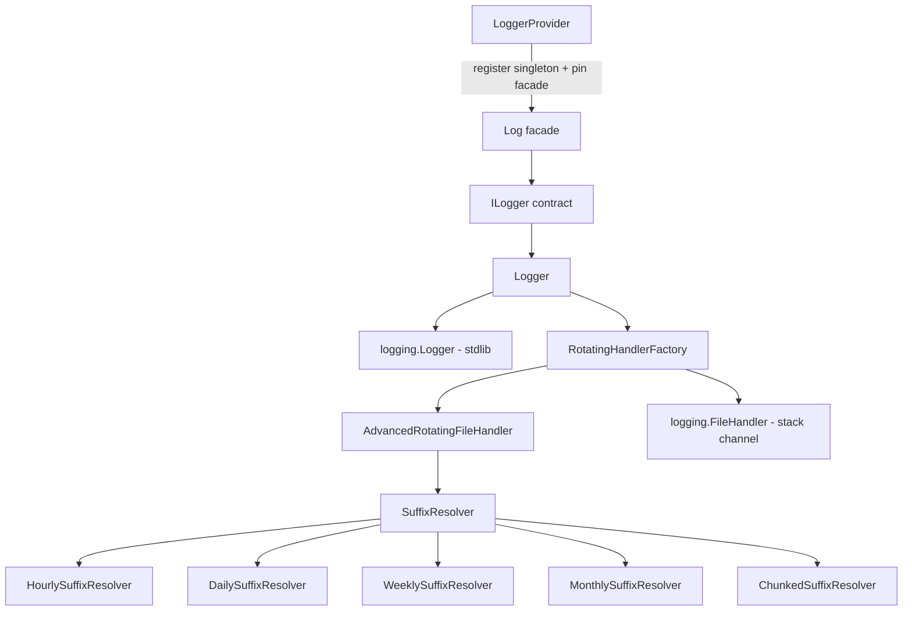

# `orionis.log` — Logging Module

A thread-safe, channel-based logging service for the Orionis framework, built on top of the Python standard `logging` module. It provides a Laravel-inspired "channels" abstraction (`stack`, `hourly`, `daily`, `weekly`, `monthly`, `chunked`) with lazy initialization, runtime channel switching, and a custom rotating file handler.

## Table of contents

- [Requirements](#requirements)
- [Module overview](#module-overview)
- [Architecture](#architecture)
- [API reference](#api-reference)
  - [`Logger`](#logger-orionislogloggerlogger)
  - [`ILogger` (contract)](#ilogger-orionislogcontractsloggerilogger)
  - [`SuffixResolver` (contract)](#suffixresolver-orionislogcontractssuffix_resolversuffixresolver)
  - [Suffix resolvers](#suffix-resolvers-orionisloghandlers)
  - [`AdvancedRotatingFileHandler`](#advancedrotatingfilehandler-orionisloghandlersadvanced_rotating_file_handler)
  - [`RotatingHandlerFactory`](#rotatinghandlerfactory-orionisloghandlersrotating_handler_factory)
  - [`LoggerProvider`](#loggerprovider-orionislogprovider)
  - [`Log` facade](#log-facade-orionissupportfacadesloggerlog)
- [Usage examples](#usage-examples)
- [Performance and concurrency considerations](#performance-and-concurrency-considerations)
- [Design notes](#design-notes)
- [Compatibility notes](#compatibility-notes)

## Requirements

No installation beyond the framework itself is required:

```bash
pip install orionis
```

The module relies exclusively on the Python standard library (`logging`, `pathlib`, `threading`, `gzip`, `shutil`, `re`, `time`, `datetime`) plus internal Orionis modules (`orionis.foundation`, `orionis.container`, `orionis.support.facades.datetime`). No third-party logging backends are used.

## Module overview

`orionis.log` implements the framework's logging service. It solves three problems:

1. **Unified logging API** — a single `ILogger` contract (`info`, `error`, `warning`, `debug`, `critical`, plus channel/lifecycle management) usable through dependency injection or the `Log` facade.
2. **Configurable channels** — log destinations are declared in `config/logging.py` (an app-level `BootstrapLogging` entity extending `orionis.foundation.config.logging.entities.logging.Logging`). Each channel selects a strategy: a plain file (`stack`) or a rotating file family (`hourly`, `daily`, `weekly`, `monthly`, `chunked`).
3. **Custom rotation** — instead of relying on `logging.handlers.TimedRotatingFileHandler`/`RotatingFileHandler`, the module ships `AdvancedRotatingFileHandler`, a single handler implementation driven by a pluggable `SuffixResolver` strategy, supporting optional gzip compression of rotated files and backup-count cleanup.

The package is re-exported from `orionis/log/__init__.py`:

```python
from orionis.log import Logger
```

## Architecture



- `Logger` (in `orionis/log/logger.py`) implements `ILogger` and wraps a single stdlib `logging.Logger` instance named `"__orionis__"`.
- `LoggerProvider` (in `orionis/log/provider.py`) is a framework `ServiceProvider`: it binds `ILogger → Logger` as a singleton in the container and pins the `Log` facade during `boot()`.
- Only **one channel is active at a time** in `Logger`. Switching channels (`switchChannel`) closes the previous handler(s) and attaches a new one.

## API reference

### `Logger` (`orionis.log.logger.Logger`)

Implements `ILogger`. Constructed with an application instance; never instantiate it manually inside application code — resolve it through the container or the `Log` facade instead (direct instantiation is shown below only for testing/standalone scenarios).

```python
class Logger(ILogger):
    name: ClassVar[str] = "__orionis__"

    def __init__(self, app: IApplication) -> None: ...
```

**Parameters**

- `app` (`IApplication`): application instance. Used to read `app.config("logging")` (the channel configuration dictionary) and `app.path("root")` (the application root directory used to resolve relative log paths).

**Properties / methods**

| Member | Signature | Description |
|---|---|---|
| `name` | `str` (class attribute) | Always `"__orionis__"`. Identifies the internal logger name. |
| `info` | `(message: str) -> None` | Logs a message at `INFO` level. Lazily initializes the logger on first call. |
| `error` | `(message: str) -> None` | Logs a message at `ERROR` level. |
| `warning` | `(message: str) -> None` | Logs a message at `WARNING` level. |
| `debug` | `(message: str) -> None` | Logs a message at `DEBUG` level. |
| `critical` | `(message: str) -> None` | Logs a message at `CRITICAL` level. |
| `getLogger` | `() -> logging.Logger` | Returns the underlying stdlib `logging.Logger` for advanced usage (adding filters, custom handlers, etc.). Raises `RuntimeError` if it cannot be initialized. |
| `reloadConfiguration` | `() -> None` | Re-reads `app.config("logging")`, closes existing handlers and re-initializes the logger with the new configuration. Raises `RuntimeError` on failure. |
| `switchChannel` | `(channel_name: str) -> bool` | Closes the current handler(s) and activates `channel_name`. Returns `False` if the channel does not exist in configuration or handler creation fails (never raises). |
| `close` | `() -> None` | Closes and detaches all handlers, releasing file descriptors. Safe to call multiple times. Never raises (errors are suppressed). |
| `getActiveChannels` | `() -> list[str]` | Names of channels with a currently attached handler (in practice, at most one). |
| `getActiveChannel` | `() -> str \| None` | First active channel name, or `None` if none is active. |
| `getAvailableChannels` | `() -> list[str]` | All channel names declared in configuration (`config["channels"].keys()`), regardless of whether they are active. |

**Exceptions**

- `RuntimeError`: raised by `__initializeLogger`/`reloadConfiguration` when the underlying `logging.FileHandler`/rotating handler cannot be set up (e.g. filesystem errors), and by `getLogger`/internal readiness checks if the logger could not be created.

**Side effects**

- Creates directories for log files on demand (`Path(...).mkdir(parents=True, exist_ok=True)`).
- Opens/holds file handles for the active channel until `close()` is called or the instance is garbage collected (`__del__` calls `close()`).

### `ILogger` (`orionis.log.contracts.logger.ILogger`)

Abstract base class (`abc.ABC`) declaring the public logging contract implemented by `Logger`. Used for dependency injection (`self.app.singleton(ILogger, Logger, ...)`) and as the facade's type. Declares the abstract `name` property and all methods listed above (`info`, `error`, `warning`, `debug`, `critical`, `getLogger`, `reloadConfiguration`, `switchChannel`, `close`, `getActiveChannels`, `getActiveChannel`, `getAvailableChannels`).

### `SuffixResolver` (`orionis.log.contracts.suffix_resolver.SuffixResolver`)

Abstract base class (`__slots__ = ()`) defining the rotation strategy interface consumed by `AdvancedRotatingFileHandler`.

```python
class SuffixResolver(ABC):
    def getSuffix(self, dt: datetime | None = None) -> str: ...
    def getNextRotationTime(self, current_time: datetime) -> datetime: ...
```

- `getSuffix(dt=None)`: returns the string used to substitute the `{suffix}` placeholder in a channel's `path` template. Uses `dt` if provided, otherwise the current time.
- `getNextRotationTime(current_time)`: computes the datetime of the next rotation (informational/utility method; the handler itself decides rotation by comparing the resolved suffix on each write, not by scheduling).

### Suffix resolvers (`orionis.log.handlers`)

All resolvers live under `orionis/log/handlers/` and use `__slots__`. They rely on `orionis.support.facades.datetime.DateTime.getZoneInfo()` to obtain the application's configured timezone.

| Class | Constructor | `getSuffix()` format | Notes |
|---|---|---|---|
| `HourlySuffixResolver` | `HourlySuffixResolver()` | `YYYY-MM-DD_HH` | Rotates every hour. |
| `DailySuffixResolver` | `DailySuffixResolver(at_time: time \| None = None)` | `YYYY-MM-DD` | `at_time` defaults to midnight; used by `getNextRotationTime`. |
| `WeeklySuffixResolver` | `WeeklySuffixResolver(at_time: time \| None = None)` | `YYYY-weekWW` (ISO week) | Rotation anchored to Monday. |
| `MonthlySuffixResolver` | `MonthlySuffixResolver(at_time: time \| None = None)` | `YYYY-MM` | Rotation on the 1st of the next month. |
| `ChunkedSuffixResolver` | `ChunkedSuffixResolver()` | `YYYYMMDD_HHMMSS_NNNN` (zero-padded counter) | Thread-safe monotonically increasing counter (`threading.Lock`); every call to `getSuffix()` returns a **new, unique** suffix, so rotation is driven by `max_bytes`, not by time. |

### `AdvancedRotatingFileHandler` (`orionis.log.handlers.advanced_rotating_file_handler`)

A `logging.Handler` subclass that rotates files based on a `SuffixResolver` (time-based families) and/or file size (`max_bytes`, used for chunked rotation).

```python
class AdvancedRotatingFileHandler(Handler):
    def __init__(
        self,
        path_template: str,
        suffix_resolver: SuffixResolver,
        max_bytes: int | None = None,
        backup_count: int = 5,
        encoding: str = "utf-8",
        *,
        delay: bool = True,
        compress_rotated: bool = False,
        app_root: str = ".",
    ) -> None: ...
```

**Parameters**

- `path_template` (`str`): path containing a literal `{suffix}` placeholder, e.g. `"storage/logs/daily_{suffix}.log"`.
- `suffix_resolver` (`SuffixResolver`): strategy used to compute the current suffix and detect when rotation is required.
- `max_bytes` (`int | None`): if set, rotates once the active file reaches this size (used for chunked rotation).
- `backup_count` (`int`): number of rotated files to keep; older files matching the template are deleted.
- `encoding` (`str`): file encoding, default `"utf-8"`.
- `delay` (`bool`, keyword-only): if `True` (default), the file is not opened until the first record is emitted.
- `compress_rotated` (`bool`, keyword-only): if `True`, rotated files are gzip-compressed (`.gz`) and the original is removed.
- `app_root` (`str`, keyword-only): base directory used to resolve `path_template` (relative paths are joined with this root).

**Methods**

- `emit(record: logging.LogRecord) -> None`: formats the record, ensures the stream (rotating if needed), and writes the line. On `OSError`, delegates to `self.handleError(record)` (standard `logging` behavior — never raises to the caller).
- `close() -> None`: closes the open stream and calls `Handler.close()`.

**Side effects**: creates parent directories for the resolved path; may delete/rotate/gzip files under `backup_count` cleanup logic.

### `RotatingHandlerFactory` (`orionis.log.handlers.rotating_handler_factory`)

Static factory used by `Logger` to build a `logging.Handler` for a given channel type.

```python
class RotatingHandlerFactory:
    @staticmethod
    def createHandler(
        channel_name: str,
        channel_config: dict,
        app_root: str,
    ) -> logging.Handler | None: ...
```

- `channel_name`: one of `"stack"`, `"hourly"`, `"daily"`, `"weekly"`, `"monthly"`, `"chunked"`. Unknown names return `None`.
- `channel_config`: the channel's configuration dictionary (as produced by `config/logging.py` entities converted to `dict`), read for keys such as `path`, `level`, `retention_hours`, `retention_days`, `at`, `retention_weeks`, `retention_months`, `mb_size`, `files`.
- `app_root`: application root path used to resolve relative log paths.
- Returns a ready-to-use `logging.Handler` (`FileHandler` for `"stack"`, `AdvancedRotatingFileHandler` for the rotating families) or `None` for an unsupported channel type.

### `LoggerProvider` (`orionis.log.provider`)

```python
class LoggerProvider(ServiceProvider):
    def register(self) -> None: ...
    async def boot(self) -> None: ...
```

- `register()`: binds `ILogger` to `Logger` as a singleton in the application container, under the internal alias `"x-orionis-ILogger"`.
- `boot()` (async): pins the `Log` facade (`await LoggerFacade.pin()`) so `Log.info(...)`, `Log.error(...)`, etc. resolve directly to the singleton instance without container lookups on every call. Registered by default in `orionis/foundation/core_providers.py`.

### `Log` facade (`orionis.support.facades.logger.Log`)

```python
class Log(Facade):
    @classmethod
    def getFacadeAccessor(cls) -> str: ...  # "x-orionis-ILogger"
```

A static-style proxy (framework `Facade` pattern) exposing every `ILogger` method (`Log.info(...)`, `Log.error(...)`, `Log.switchChannel(...)`, etc.) without manually resolving the service from the container. Its type stub (`logger.pyi`) declares `class Log(ILogger, IFacade)` purely for editor/type-checker autocompletion; at runtime it forwards calls to the pinned `Logger` singleton.

## Usage examples

### Basic logging via the facade (typical application code)

```python
from orionis.support.facades.logger import Log

Log.info("User created successfully")
Log.warning("Cache miss for key 'user:42'")
Log.error("Failed to connect to the payment gateway")
Log.critical("Out of memory - shutting down worker")
```

### Inspecting and switching channels at runtime

```python
from orionis.support.facades.logger import Log

print(Log.getAvailableChannels())  # e.g. ["stack", "hourly", "daily", "weekly", "monthly", "chunked"]
print(Log.getActiveChannel())      # e.g. "stack"

if Log.switchChannel("daily"):
    Log.info("Now logging to the daily rotating channel")
else:
    Log.warning("Channel 'daily' is not configured")
```

### Reloading configuration after a runtime config change

```python
from orionis.support.facades.logger import Log

# ... application updates config("logging") at runtime ...
Log.reloadConfiguration()
Log.info("Logger reloaded with the new configuration")
```

### Accessing the underlying stdlib logger for interoperability

```python
import logging
from orionis.support.facades.logger import Log

stdlib_logger: logging.Logger = Log.getLogger()
stdlib_logger.addFilter(logging.Filter(name="orders"))
```

### Direct `Logger` instantiation (standalone scripts / tests, outside the container)

```python
from orionis.log.logger import Logger

class MinimalApp:
    """Duck-typed stand-in for IApplication (only config/path are used)."""

    def __init__(self, root: str) -> None:
        self._root = root

    def config(self, key: str) -> dict:
        return {
            "default": "stack",
            "channels": {
                "stack": {"path": "storage/logs/stack.log", "level": 20},
            },
        }

    def path(self, key: str) -> str:
        return self._root

logger = Logger(MinimalApp("."))
logger.info("Application booted")
logger.close()  # release file handles when done
```

### Wiring `AdvancedRotatingFileHandler` manually (advanced use, without the DI container)

```python
import logging
from orionis.log.handlers.advanced_rotating_file_handler import AdvancedRotatingFileHandler
from orionis.log.handlers.daily_suffix_resolver import DailySuffixResolver

handler = AdvancedRotatingFileHandler(
    path_template="storage/logs/daily_{suffix}.log",
    suffix_resolver=DailySuffixResolver(),
    backup_count=7,
    app_root=".",
    compress_rotated=False,
)
handler.setFormatter(logging.Formatter("%(asctime)s [%(levelname)s]: %(message)s"))

worker_logger = logging.getLogger("background-worker")
worker_logger.setLevel(logging.INFO)
worker_logger.addHandler(handler)
worker_logger.info("Manually wired daily rotation")
```

### Declaring channels in `config/logging.py`

```python
from datetime import time
from orionis.foundation.config.logging import Channels, Daily, Level, Logging, Stack

class BootstrapLogging(Logging):
    default: str = "daily"
    channels: Channels = Channels(
        stack=Stack(path="storage/logs/stack.log", level=Level.INFO),
        daily=Daily(
            path="storage/logs/daily_{suffix}.log",
            level=Level.INFO,
            retention_days=7,
            at=time(hour=0, minute=0, second=0),
        ),
    )
```

## Performance and concurrency considerations

- **Lazy, thread-safe initialization**: `Logger` uses double-checked locking (`threading.Lock`) so the stdlib logger/handlers are only built on the first log call, and concurrent threads calling `info`/`error`/etc. before initialization will not race.
- **Shared formatter cache**: `Logger._formatter_cache` is a `ClassVar` dict shared by *all* `Logger` instances in the process, keyed by `f"{log_format}|{date_format}"`, avoiding redundant `logging.Formatter` construction.
- **Lock scope in `AdvancedRotatingFileHandler.emit`**: message formatting happens *outside* the internal lock; only the rotation check and the actual file write happen inside `self._lock`, reducing contention when many threads log concurrently.
- **Single active channel**: `Logger` keeps only one channel attached at a time. `switchChannel`/`reloadConfiguration` close previous handlers before opening new ones — no file handle leaks across switches under normal operation.
- **Process-safety, not multi-process safety**: the locking in `AdvancedRotatingFileHandler` is a `threading.Lock`, which only coordinates threads within the same process. Do not point two separate OS processes at the same rotating log file path without external coordination (e.g. separate files per worker, or an external log aggregator).
- **Path resolution cache**: `AdvancedRotatingFileHandler` caches resolved paths for 5 minutes (monotonic clock) and clears the cache once it exceeds 50 entries — relevant mainly for `chunked` rotation, which generates a new suffix on every call.
- **Cleanup cost**: `_cleanupOldFiles` lists and stats every file in the log directory matching the channel's pattern on each rotation; keep `backup_count`/`retention_*` values reasonable if the log directory holds many unrelated files.
- **Optional gzip compression** (`compress_rotated=True`, used by the `chunked` channel) is synchronous and runs once per rotation (not per log line), so its cost is amortized.
- **Fully synchronous API**: all methods perform blocking file I/O. There is no `async`/`await` variant; if called from latency-sensitive `async` code paths, consider offloading with `asyncio.to_thread` (the module does not do this internally).
- **Graceful shutdown**: `close()` and `__del__` suppress `OSError`/`RuntimeError`/`ValueError` to guarantee handles are released even during interpreter shutdown or unpredictable GC ordering.

## Design notes

- `Logger` implements the `ILogger` contract (`abc.ABC`) so it can be swapped via the container (`self.app.singleton(ILogger, Logger, ...)`) and consumed through the `Log` facade without depending on the concrete class.
- The channel abstraction mirrors a Laravel-style logging "channels" design: a `stack` channel uses a plain `logging.FileHandler`; the time/size-based families (`hourly`, `daily`, `weekly`, `monthly`, `chunked`) share a single `AdvancedRotatingFileHandler` implementation parameterized by the Strategy pattern (`SuffixResolver`).
- `RotatingHandlerFactory` dispatches by channel type through a module-level dict (`_CHANNEL_CREATORS`) instead of an `if/elif` chain, for O(1) resolution.
- Suffix resolver classes use `__slots__` (no `__dict__`), consistent with the framework-wide convention for small, frequently-instantiated value/strategy objects.
- `LoggerProvider` follows the framework's standard `ServiceProvider` + `Facade` pinning pattern: bind the singleton in `register()`, pin the facade in async `boot()` — the same pattern used by other core services (e.g. the encrypter module).

## Compatibility notes

- **Python**: `>=3.14` (per the project's `pyproject.toml`).
- **External dependencies**: none — only the Python standard library.
- **Internal dependencies**: `orionis.foundation` (`IApplication`, `Level` enum), `orionis.container` (`ServiceProvider`, `Facade`), `orionis.support.facades.datetime` (`DateTime.getZoneInfo()`, used by suffix resolvers for timezone-aware timestamps).
