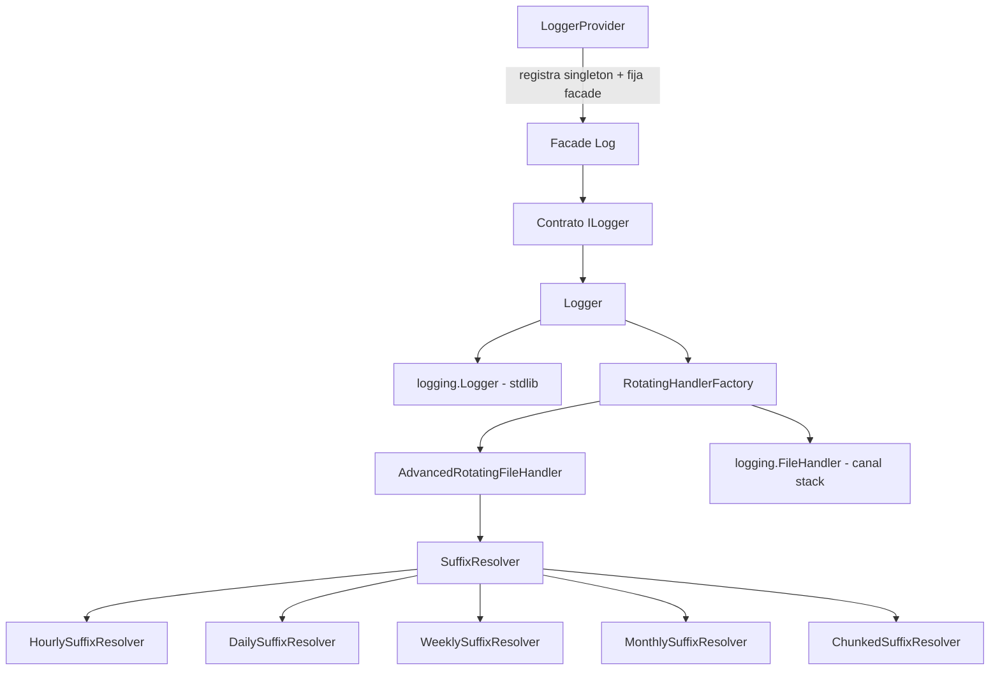

# `orionis.log` — Módulo de Logging

Servicio de logging thread-safe basado en canales para el framework Orionis, construido sobre el módulo estándar `logging` de Python. Ofrece una abstracción de "canales" inspirada en Laravel (`stack`, `hourly`, `daily`, `weekly`, `monthly`, `chunked`) con inicialización perezosa, cambio de canal en tiempo de ejecución y un manejador de rotación de archivos propio.

## Tabla de contenidos

- [Requisitos](#requisitos)
- [Descripción general del módulo](#descripción-general-del-módulo)
- [Arquitectura](#arquitectura)
- [Referencia de API](#referencia-de-api)
  - [`Logger`](#logger-orionislogloggerlogger)
  - [`ILogger` (contrato)](#ilogger-orionislogcontractsloggerilogger)
  - [`SuffixResolver` (contrato)](#suffixresolver-orionislogcontractssuffix_resolversuffixresolver)
  - [Resolvers de sufijo](#resolvers-de-sufijo-orionisloghandlers)
  - [`AdvancedRotatingFileHandler`](#advancedrotatingfilehandler-orionisloghandlersadvanced_rotating_file_handler)
  - [`RotatingHandlerFactory`](#rotatinghandlerfactory-orionisloghandlersrotating_handler_factory)
  - [`LoggerProvider`](#loggerprovider-orionislogprovider)
  - [Facade `Log`](#facade-log-orionissupportfacadesloggerlog)
- [Ejemplos de uso](#ejemplos-de-uso)
- [Consideraciones de rendimiento y concurrencia](#consideraciones-de-rendimiento-y-concurrencia)
- [Notas de diseño](#notas-de-diseño)
- [Notas de compatibilidad](#notas-de-compatibilidad)

## Requisitos

No se necesita ninguna instalación adicional más allá del propio framework:

```bash
pip install orionis
```

El módulo depende únicamente de la biblioteca estándar de Python (`logging`, `pathlib`, `threading`, `gzip`, `shutil`, `re`, `time`, `datetime`) además de módulos internos de Orionis (`orionis.foundation`, `orionis.container`, `orionis.support.facades.datetime`). No se utiliza ningún backend de logging de terceros.

## Descripción general del módulo

`orionis.log` implementa el servicio de logging del framework. Resuelve tres problemas:

1. **API de logging unificada** — un único contrato `ILogger` (`info`, `error`, `warning`, `debug`, `critical`, más gestión del ciclo de vida/canales) utilizable mediante inyección de dependencias o el facade `Log`.
2. **Canales configurables** — los destinos de log se declaran en `config/logging.py` (una entidad `BootstrapLogging` a nivel de aplicación que extiende `orionis.foundation.config.logging.entities.logging.Logging`). Cada canal selecciona una estrategia: un archivo simple (`stack`) o una familia de rotación (`hourly`, `daily`, `weekly`, `monthly`, `chunked`).
3. **Rotación personalizada** — en lugar de depender de `logging.handlers.TimedRotatingFileHandler`/`RotatingFileHandler`, el módulo incluye `AdvancedRotatingFileHandler`, una única implementación de handler controlada por una estrategia `SuffixResolver` intercambiable, con compresión gzip opcional de los archivos rotados y limpieza según el número de respaldos.

El paquete se reexporta desde `orionis/log/__init__.py`:

```python
from orionis.log import Logger
```

## Arquitectura



- `Logger` (en `orionis/log/logger.py`) implementa `ILogger` y envuelve una única instancia de `logging.Logger` de la biblioteca estándar, llamada `"__orionis__"`.
- `LoggerProvider` (en `orionis/log/provider.py`) es un `ServiceProvider` del framework: enlaza `ILogger → Logger` como singleton en el contenedor y fija ("pinea") el facade `Log` durante `boot()`.
- Solo **un canal está activo a la vez** en `Logger`. Cambiar de canal (`switchChannel`) cierra el/los handler(s) anterior(es) y adjunta uno nuevo.

## Referencia de API

### `Logger` (`orionis.logging.logger.Logger`)

Implementa `ILogger`. Se construye con una instancia de la aplicación; no lo instancies manualmente en código de aplicación — resuélvelo a través del contenedor o del facade `Log` (la instanciación directa que se muestra más abajo es solo para pruebas/scripts independientes).

```python
class Logger(ILogger):
    name: ClassVar[str] = "__orionis__"

    def __init__(self, app: IApplication) -> None: ...
```

**Parámetros**

- `app` (`IApplication`): instancia de la aplicación. Se usa para leer `app.config("logging")` (el diccionario de configuración de canales) y `app.path("root")` (el directorio raíz de la aplicación usado para resolver rutas de log relativas).

**Propiedades / métodos**

| Miembro | Firma | Descripción |
|---|---|---|
| `name` | `str` (atributo de clase) | Siempre `"__orionis__"`. Identifica el nombre interno del logger. |
| `info` | `(message: str) -> None` | Registra un mensaje en nivel `INFO`. Inicializa el logger perezosamente en la primera llamada. |
| `error` | `(message: str) -> None` | Registra un mensaje en nivel `ERROR`. |
| `warning` | `(message: str) -> None` | Registra un mensaje en nivel `WARNING`. |
| `debug` | `(message: str) -> None` | Registra un mensaje en nivel `DEBUG`. |
| `critical` | `(message: str) -> None` | Registra un mensaje en nivel `CRITICAL`. |
| `getLogger` | `() -> logging.Logger` | Devuelve el `logging.Logger` interno de la biblioteca estándar para uso avanzado (agregar filtros, handlers personalizados, etc.). Lanza `RuntimeError` si no puede inicializarse. |
| `reloadConfiguration` | `() -> None` | Vuelve a leer `app.config("logging")`, cierra los handlers existentes y reinicializa el logger con la nueva configuración. Lanza `RuntimeError` si falla. |
| `switchChannel` | `(channel_name: str) -> bool` | Cierra el/los handler(s) actual(es) y activa `channel_name`. Devuelve `False` si el canal no existe en la configuración o si falla la creación del handler (nunca lanza excepción). |
| `close` | `() -> None` | Cierra y desconecta todos los handlers, liberando descriptores de archivo. Seguro de llamar varias veces. Nunca lanza excepción (los errores se suprimen). |
| `getActiveChannels` | `() -> list[str]` | Nombres de los canales con un handler actualmente adjunto (en la práctica, como máximo uno). |
| `getActiveChannel` | `() -> str \| None` | Nombre del primer canal activo, o `None` si ninguno está activo. |
| `getAvailableChannels` | `() -> list[str]` | Todos los nombres de canal declarados en la configuración (`config["channels"].keys()`), estén activos o no. |

**Excepciones**

- `RuntimeError`: lanzada por `__initializeLogger`/`reloadConfiguration` cuando no se puede configurar el `logging.FileHandler`/handler de rotación subyacente (p. ej. errores del sistema de archivos), y por `getLogger`/las verificaciones internas de disponibilidad si el logger no pudo crearse.

**Efectos secundarios**

- Crea directorios para los archivos de log bajo demanda (`Path(...).mkdir(parents=True, exist_ok=True)`).
- Abre y mantiene descriptores de archivo para el canal activo hasta que se llama a `close()` o la instancia es recolectada por el recolector de basura (`__del__` llama a `close()`).

### `ILogger` (`orionis.logging.contracts.logger.ILogger`)

Clase base abstracta (`abc.ABC`) que declara el contrato público de logging implementado por `Logger`. Se usa para inyección de dependencias (`self.app.singleton(ILogger, Logger, ...)`) y como tipo del facade. Declara la propiedad abstracta `name` y todos los métodos listados arriba (`info`, `error`, `warning`, `debug`, `critical`, `getLogger`, `reloadConfiguration`, `switchChannel`, `close`, `getActiveChannels`, `getActiveChannel`, `getAvailableChannels`).

### `SuffixResolver` (`orionis.logging.contracts.suffix_resolver.SuffixResolver`)

Clase base abstracta (`__slots__ = ()`) que define la interfaz de estrategia de rotación consumida por `AdvancedRotatingFileHandler`.

```python
class SuffixResolver(ABC):
    def getSuffix(self, dt: datetime | None = None) -> str: ...
    def getNextRotationTime(self, current_time: datetime) -> datetime: ...
```

- `getSuffix(dt=None)`: devuelve la cadena usada para sustituir el marcador `{suffix}` en la plantilla `path` de un canal. Usa `dt` si se proporciona, o la hora actual en caso contrario.
- `getNextRotationTime(current_time)`: calcula la fecha/hora de la próxima rotación (método informativo/utilitario; el handler decide la rotación comparando el sufijo resuelto en cada escritura, no mediante planificación).

### Resolvers de sufijo (`orionis.logging.handlers`)

Todos los resolvers viven en `orionis/log/handlers/` y usan `__slots__`. Dependen de `orionis.support.facades.datetime.DateTime.getZoneInfo()` para obtener la zona horaria configurada de la aplicación.

| Clase | Constructor | Formato de `getSuffix()` | Notas |
|---|---|---|---|
| `HourlySuffixResolver` | `HourlySuffixResolver()` | `YYYY-MM-DD_HH` | Rota cada hora. |
| `DailySuffixResolver` | `DailySuffixResolver(at_time: time \| None = None)` | `YYYY-MM-DD` | `at_time` por defecto es medianoche; usado por `getNextRotationTime`. |
| `WeeklySuffixResolver` | `WeeklySuffixResolver(at_time: time \| None = None)` | `YYYY-weekWW` (semana ISO) | Rotación anclada al lunes. |
| `MonthlySuffixResolver` | `MonthlySuffixResolver(at_time: time \| None = None)` | `YYYY-MM` | Rotación el día 1 del mes siguiente. |
| `ChunkedSuffixResolver` | `ChunkedSuffixResolver()` | `YYYYMMDD_HHMMSS_NNNN` (contador con ceros a la izquierda) | Contador incremental thread-safe (`threading.Lock`); cada llamada a `getSuffix()` devuelve un sufijo **nuevo y único**, por lo que la rotación se controla mediante `max_bytes`, no por tiempo. |

### `AdvancedRotatingFileHandler` (`orionis.logging.handlers.advanced_rotating_file_handler`)

Subclase de `logging.Handler` que rota archivos basándose en un `SuffixResolver` (familias basadas en tiempo) y/o en tamaño de archivo (`max_bytes`, usado para la rotación por chunks).

```python
class AdvancedRotatingFileHandler(Handler):
    def __init__(
        self,
        path_template: str,
        suffix_resolver: SuffixResolver,
        max_bytes: int | None = None,
        backup_count: int = 5,
        encoding: str = "utf-8",
        *,
        delay: bool = True,
        compress_rotated: bool = False,
        app_root: str = ".",
    ) -> None: ...
```

**Parámetros**

- `path_template` (`str`): ruta que contiene el marcador literal `{suffix}`, p. ej. `"storage/logs/daily_{suffix}.log"`.
- `suffix_resolver` (`SuffixResolver`): estrategia usada para calcular el sufijo actual y detectar cuándo se requiere rotación.
- `max_bytes` (`int | None`): si se establece, rota una vez que el archivo activo alcanza este tamaño (usado para la rotación por chunks).
- `backup_count` (`int`): número de archivos rotados a conservar; los archivos más antiguos que coincidan con la plantilla se eliminan.
- `encoding` (`str`): codificación del archivo, por defecto `"utf-8"`.
- `delay` (`bool`, solo por palabra clave): si es `True` (por defecto), el archivo no se abre hasta que se emite el primer registro.
- `compress_rotated` (`bool`, solo por palabra clave): si es `True`, los archivos rotados se comprimen con gzip (`.gz`) y se elimina el original.
- `app_root` (`str`, solo por palabra clave): directorio base usado para resolver `path_template` (las rutas relativas se combinan con esta raíz).

**Métodos**

- `emit(record: logging.LogRecord) -> None`: formatea el registro, asegura el stream (rotando si es necesario) y escribe la línea. Ante un `OSError`, delega en `self.handleError(record)` (comportamiento estándar de `logging` — nunca propaga la excepción al llamador).
- `close() -> None`: cierra el stream abierto y llama a `Handler.close()`.

**Efectos secundarios**: crea los directorios padre para la ruta resuelta; puede eliminar/rotar/comprimir archivos según la lógica de limpieza de `backup_count`.

### `RotatingHandlerFactory` (`orionis.logging.handlers.rotating_handler_factory`)

Fábrica estática usada por `Logger` para construir un `logging.Handler` según el tipo de canal.

```python
class RotatingHandlerFactory:
    @staticmethod
    def createHandler(
        channel_name: str,
        channel_config: dict,
        app_root: str,
    ) -> logging.Handler | None: ...
```

- `channel_name`: uno de `"stack"`, `"hourly"`, `"daily"`, `"weekly"`, `"monthly"`, `"chunked"`. Nombres desconocidos devuelven `None`.
- `channel_config`: diccionario de configuración del canal (tal como lo generan las entidades de `config/logging.py` convertidas a `dict`), del que se leen claves como `path`, `level`, `retention_hours`, `retention_days`, `at`, `retention_weeks`, `retention_months`, `mb_size`, `files`.
- `app_root`: ruta raíz de la aplicación usada para resolver rutas de log relativas.
- Devuelve un `logging.Handler` listo para usar (`FileHandler` para `"stack"`, `AdvancedRotatingFileHandler` para las familias rotativas) o `None` para un tipo de canal no soportado.

### `LoggerProvider` (`orionis.logging.provider`)

```python
class LoggerProvider(ServiceProvider):
    def register(self) -> None: ...
    async def boot(self) -> None: ...
```

- `register()`: enlaza `ILogger` con `Logger` como singleton en el contenedor de la aplicación, bajo el alias interno `"x-orionis-ILogger"`.
- `boot()` (asíncrono): fija ("pinea") el facade `Log` (`await LoggerFacade.pin()`) para que `Log.info(...)`, `Log.error(...)`, etc. resuelvan directamente a la instancia singleton sin búsquedas en el contenedor en cada llamada. Registrado por defecto en `orionis/foundation/core_providers.py`.

### Facade `Log` (`orionis.support.facades.logger.Log`)

```python
class Log(Facade):
    @classmethod
    def getFacadeAccessor(cls) -> str: ...  # "x-orionis-ILogger"
```

Un proxy de estilo estático (patrón `Facade` del framework) que expone cada método de `ILogger` (`Log.info(...)`, `Log.error(...)`, `Log.switchChannel(...)`, etc.) sin necesidad de resolver manualmente el servicio desde el contenedor. Su stub de tipos (`logger.pyi`) declara `class Log(ILogger, IFacade)` únicamente para autocompletado del editor/verificador de tipos; en tiempo de ejecución reenvía las llamadas al singleton `Logger` fijado.

## Ejemplos de uso

### Logging básico mediante el facade (código de aplicación típico)

```python
from orionis.support.facades.logger import Log

Log.info("Usuario creado correctamente")
Log.warning("Cache miss para la clave 'user:42'")
Log.error("Fallo al conectar con la pasarela de pagos")
Log.critical("Memoria agotada - apagando el worker")
```

### Inspeccionar y cambiar de canal en tiempo de ejecución

```python
from orionis.support.facades.logger import Log

print(Log.getAvailableChannels())  # p. ej. ["stack", "hourly", "daily", "weekly", "monthly", "chunked"]
print(Log.getActiveChannel())      # p. ej. "stack"

if Log.switchChannel("daily"):
    Log.info("Ahora registrando en el canal rotativo diario")
else:
    Log.warning("El canal 'daily' no está configurado")
```

### Recargar la configuración tras un cambio en tiempo de ejecución

```python
from orionis.support.facades.logger import Log

# ... la aplicación actualiza config("logging") en tiempo de ejecución ...
Log.reloadConfiguration()
Log.info("Logger recargado con la nueva configuración")
```

### Acceder al logger nativo de la biblioteca estándar para interoperabilidad

```python
import logging
from orionis.support.facades.logger import Log

stdlib_logger: logging.Logger = Log.getLogger()
stdlib_logger.addFilter(logging.Filter(name="orders"))
```

### Instanciación directa de `Logger` (scripts independientes / pruebas, fuera del contenedor)

```python
from orionis.logging.logger import Logger

class MinimalApp:
    """Sustituto duck-typed de IApplication (solo se usan config/path)."""

    def __init__(self, root: str) -> None:
        self._root = root

    def config(self, key: str) -> dict:
        return {
            "default": "stack",
            "channels": {
                "stack": {"path": "storage/logs/stack.log", "level": 20},
            },
        }

    def path(self, key: str) -> str:
        return self._root

logger = Logger(MinimalApp("."))
logger.info("Aplicación iniciada")
logger.close()  # liberar los descriptores de archivo al terminar
```

### Configurar `AdvancedRotatingFileHandler` manualmente (uso avanzado, sin el contenedor DI)

```python
import logging
from orionis.logging.handlers.advanced_rotating_file_handler import AdvancedRotatingFileHandler
from orionis.logging.handlers.daily_suffix_resolver import DailySuffixResolver

handler = AdvancedRotatingFileHandler(
    path_template="storage/logs/daily_{suffix}.log",
    suffix_resolver=DailySuffixResolver(),
    backup_count=7,
    app_root=".",
    compress_rotated=False,
)
handler.setFormatter(logging.Formatter("%(asctime)s [%(levelname)s]: %(message)s"))

worker_logger = logging.getLogger("background-worker")
worker_logger.setLevel(logging.INFO)
worker_logger.addHandler(handler)
worker_logger.info("Rotación diaria configurada manualmente")
```

### Declarar canales en `config/logging.py`

```python
from datetime import time
from orionis.foundation.config.logging import Channels, Daily, Level, Logging, Stack

class BootstrapLogging(Logging):
    default: str = "daily"
    channels: Channels = Channels(
        stack=Stack(path="storage/logs/stack.log", level=Level.INFO),
        daily=Daily(
            path="storage/logs/daily_{suffix}.log",
            level=Level.INFO,
            retention_days=7,
            at=time(hour=0, minute=0, second=0),
        ),
    )
```

## Consideraciones de rendimiento y concurrencia

- **Inicialización perezosa y thread-safe**: `Logger` usa double-checked locking (`threading.Lock`) para que el logger/handlers de la biblioteca estándar solo se construyan en la primera llamada de log, y los hilos concurrentes que llamen a `info`/`error`/etc. antes de la inicialización no compitan entre sí.
- **Caché compartida de formatters**: `Logger._formatter_cache` es un diccionario `ClassVar` compartido por *todas* las instancias de `Logger` en el proceso, indexado por `f"{log_format}|{date_format}"`, evitando construir `logging.Formatter` redundantes.
- **Alcance del lock en `AdvancedRotatingFileHandler.emit`**: el formateo del mensaje ocurre *fuera* del lock interno; solo la verificación de rotación y la escritura real en el archivo ocurren dentro de `self._lock`, reduciendo la contención cuando muchos hilos escriben logs simultáneamente.
- **Un único canal activo**: `Logger` mantiene solo un canal adjunto a la vez. `switchChannel`/`reloadConfiguration` cierran los handlers anteriores antes de abrir los nuevos — no hay fugas de descriptores de archivo entre cambios en operación normal.
- **Seguridad entre hilos, no entre procesos**: el bloqueo en `AdvancedRotatingFileHandler` es un `threading.Lock`, que solo coordina hilos dentro del mismo proceso. No apuntes dos procesos del sistema operativo distintos a la misma ruta de log rotativo sin coordinación externa (p. ej. archivos separados por worker, o un agregador de logs externo).
- **Caché de resolución de rutas**: `AdvancedRotatingFileHandler` cachea las rutas resueltas durante 5 minutos (reloj monotónico) y limpia la caché al superar 50 entradas — relevante principalmente para la rotación `chunked`, que genera un sufijo nuevo en cada llamada.
- **Costo de la limpieza**: `_cleanupOldFiles` lista y hace `stat` de cada archivo del directorio de logs que coincida con el patrón del canal en cada rotación; mantén valores razonables de `backup_count`/`retention_*` si el directorio de logs contiene muchos archivos no relacionados.
- **Compresión gzip opcional** (`compress_rotated=True`, usada por el canal `chunked`) es síncrona y se ejecuta una vez por rotación (no por línea de log), por lo que su costo se amortiza.
- **API totalmente síncrona**: todos los métodos realizan E/S de archivos bloqueante. No existe una variante `async`/`await`; si se llama desde rutas de código `async` sensibles a la latencia, considera delegar con `asyncio.to_thread` (el módulo no lo hace internamente).
- **Cierre ordenado**: `close()` y `__del__` suprimen `OSError`/`RuntimeError`/`ValueError` para garantizar que los descriptores se liberen incluso durante el cierre del intérprete o un orden de recolección de basura impredecible.

## Notas de diseño

- `Logger` implementa el contrato `ILogger` (`abc.ABC`) para poder intercambiarse mediante el contenedor (`self.app.singleton(ILogger, Logger, ...)`) y consumirse a través del facade `Log` sin depender de la clase concreta.
- La abstracción de canales imita un diseño de "canales" de logging al estilo Laravel: el canal `stack` usa un `logging.FileHandler` simple; las familias basadas en tiempo/tamaño (`hourly`, `daily`, `weekly`, `monthly`, `chunked`) comparten una única implementación `AdvancedRotatingFileHandler` parametrizada mediante el patrón Strategy (`SuffixResolver`).
- `RotatingHandlerFactory` despacha por tipo de canal mediante un diccionario a nivel de módulo (`_CHANNEL_CREATORS`) en lugar de una cadena `if/elif`, para una resolución O(1).
- Las clases de resolvers de sufijo usan `__slots__` (sin `__dict__`), en consonancia con la convención del framework para objetos de valor/estrategia pequeños e instanciados con frecuencia.
- `LoggerProvider` sigue el patrón estándar del framework de `ServiceProvider` + fijación de `Facade`: enlaza el singleton en `register()`, fija el facade en el `boot()` asíncrono — el mismo patrón usado por otros servicios centrales (p. ej. el módulo de encriptación).

## Notas de compatibilidad

- **Python**: `>=3.14` (según el `pyproject.toml` del proyecto).
- **Dependencias externas**: ninguna — solo la biblioteca estándar de Python.
- **Dependencias internas**: `orionis.foundation` (`IApplication`, enum `Level`), `orionis.container` (`ServiceProvider`, `Facade`), `orionis.support.facades.datetime` (`DateTime.getZoneInfo()`, usado por los resolvers de sufijo para marcas de tiempo con zona horaria).
