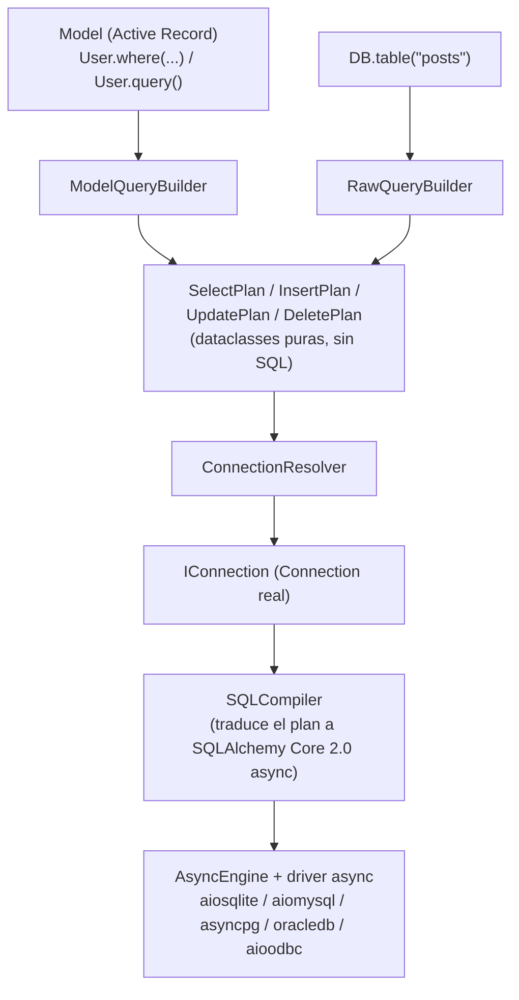
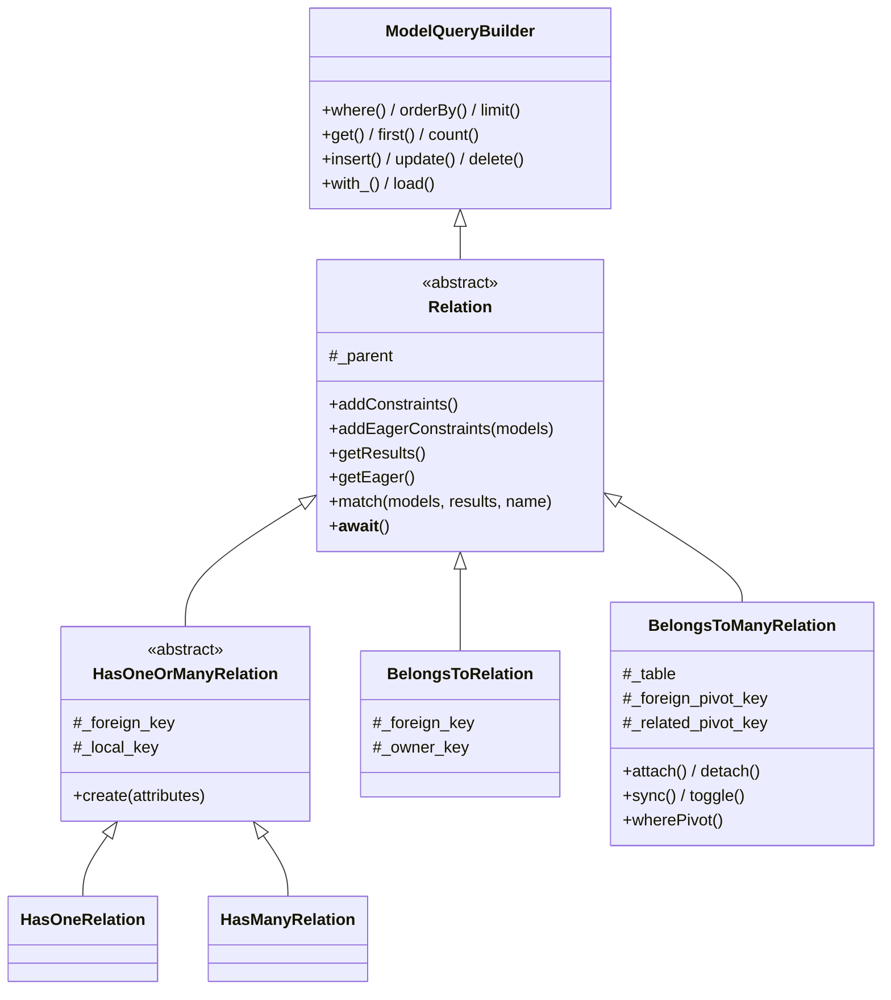

# Modelos y Query Builder en Orionis

> Manual en español del ORM de Orionis (`orionis.orm`) y de su generador de
> esquemas (`orionis.database.schema`), explicado siempre en paralelo con el
> funcionamiento equivalente de **Laravel / Eloquent**, ya que gran parte de
> su diseño (fachadas, fluent query builder, migraciones, convenciones de
> nombres) está directamente inspirado en él.

## Índice

1. [Arquitectura general](#1-arquitectura-general)
2. [Diferencias fundamentales con Laravel](#2-diferencias-fundamentales-con-laravel)
3. [Definir un modelo](#3-definir-un-modelo)
4. [Catálogo de tipos de columna](#4-catálogo-de-tipos-de-columna)
5. [Configuración declarativa del modelo](#5-configuración-declarativa-del-modelo)
6. [CRUD y ciclo de vida](#6-crud-y-ciclo-de-vida)
7. [Serialización y seguimiento de cambios (dirty tracking)](#7-serialización-y-seguimiento-de-cambios-dirty-tracking)
8. [Query Builder fluido del modelo](#8-query-builder-fluido-del-modelo)
9. [Recuperación, agregados y paginación](#9-recuperación-agregados-y-paginación)
10. [Colecciones](#10-colecciones)
11. [Relaciones entre modelos](#11-relaciones-entre-modelos)
12. [Consultas sin modelo: `DB.table()` y JOINs](#12-consultas-sin-modelo-dbtable-y-joins)
13. [Esquema y migraciones](#13-esquema-y-migraciones)
14. [Transacciones](#14-transacciones)
15. [Conexiones múltiples](#15-conexiones-múltiples)
16. [Excepciones](#16-excepciones)
17. [Tabla resumen: Eloquent ↔ Orionis](#17-tabla-resumen-eloquent--orionis)
18. [Limitaciones actuales](#18-limitaciones-actuales)

---

## 1. Arquitectura general



Puntos que conviene interiorizar antes de seguir, si vienes de Laravel:

- **Todo es `async`/`await`.** `save()`, `find()`, `get()`, `create()`,
  `delete()`... son corrutinas. Eloquent es 100% síncrono; en Orionis
  siempre hay que `await` cualquier operación que toque la base de datos.
- Orionis **no usa el ORM/Session propio de SQLAlchemy** (nada de
  `declarative_base`, `relationship()`, `Session`). Solo aprovecha
  **SQLAlchemy Core 2.0** como "motor de traducción" de SQL — de forma
  parecida a como Eloquent usa el Query Builder de Laravel por debajo. El
  Active Record (`Model`), el builder fluido y el plan intermedio
  (`SelectPlan`/`InsertPlan`/...) son 100% propios del framework.
- Los modelos **no resuelven su conexión a través del contenedor de DI**;
  hablan con `ConnectionResolver` (`orionis/orm/resolver.py`), un puente
  estático equivalente a `Model::setConnectionResolver()` de Eloquent. El
  `DatabaseProvider` instala el manager ahí durante el `boot()`.
- Las **relaciones** (`hasOne`/`hasMany`/`belongsTo`/`belongsToMany`, ver
  [§11](#11-relaciones-entre-modelos)) no son un mecanismo aparte: cada
  una es una subclase de `ModelQueryBuilder` con una restricción
  precargada — reutilizan exactamente el mismo camino `B → C → D → E → F → G`
  de este diagrama, sin ninguna ruta de datos paralela.

---

## 2. Diferencias fundamentales con Laravel

| Aspecto | Laravel / Eloquent | Orionis |
|---|---|---|
| Ejecución | Síncrona | 100% asíncrona (`async`/`await`) |
| Esquema del modelo | Se infiere en runtime desde la BD | **Se declara explícitamente** en la clase con tipos (`String()`, `Integer()`, ...) |
| Motor SQL subyacente | PDO + Query Builder propio | SQLAlchemy Core 2.0 (async), nunca su ORM |
| Relaciones (`hasMany`, `belongsTo`...) | Sí | Sí (ver [§11](#11-relaciones-entre-modelos)) — declaradas como **métodos de instancia**, no como propiedades mágicas |
| Soft deletes | Sí (`SoftDeletes` trait) | No existen todavía |
| Accessors/mutators, events, scopes | Sí | No existen todavía |
| JOIN fluido sobre un modelo | Sí (`User::join(...)`) | Solo vía `DB.table()` (`RawQueryBuilder`), no en `ModelQueryBuilder` |
| Migraciones | `php artisan migrate` | `reactor migrate` / `reactor migrate:rollback` |

---

## 3. Definir un modelo

A diferencia de Eloquent (donde el modelo es casi vacío y el esquema se
descubre dinámicamente), en Orionis **cada columna debe declararse como
atributo de clase**, usando los tipos fluidos de `orionis.orm`. Esto se
parece más a Django ORM o a SQLAlchemy declarativo que a Eloquent.

```python
from typing import ClassVar
from orionis.orm import Boolean, Integer, Model, String, StrictJson, StrictTimestamp


class User(Model):
    id = Integer().primary().autoIncrement()
    name = String(255)
    email = String(255).unique()
    active = Boolean().nullable()
    meta = StrictJson().nullable()
    created_at = StrictTimestamp().nullable()
    updated_at = StrictTimestamp().nullable()

    casts: ClassVar[dict[str, str]] = {"active": "bool", "meta": "json"}
    hidden: ClassVar[list[str]] = ["password"]
    fillable: ClassVar[list[str]] = ["name", "email", "password"]
```

Qué hace la metaclase `ModelMeta` (`orionis/orm/metaclass.py`) al crear la
clase:

1. Recorre el cuerpo de la clase (y las clases padre, incluyendo modelos
   `__abstract__ = True`) buscando instancias de `ColumnDefinition`.
2. **Las "detacha" de la clase** (`delattr`) — por eso, en una instancia ya
   creada, `user.name` no lee un atributo de clase Python: pasa por
   `Model.__getattr__`, que sirve el valor desde el diccionario interno
   `_attributes`.
3. Calcula el nombre de tabla, la clave primaria, los casts heredados y
   compila los "cast handlers" una sola vez (nunca hay reflexión en el
   camino caliente de hidratación/persistencia).

> **Importante:** si una columna no se declara en el modelo, no formará
> parte de `meta.columns`, y por lo tanto **`fill()`/`create()`/mass
> assignment la rechazarán con `MassAssignmentException`** aunque la
> columna exista físicamente en la tabla. Toda columna que vaya a
> asignarse por mass assignment debe declararse en la clase.

### Modelos abstractos

```python
class Auditable(Model):
    __abstract__ = True  # no genera tabla propia; solo aporta columnas/lógica
    created_at = StrictTimestamp().nullable()
    updated_at = StrictTimestamp().nullable()


class Invoice(Auditable):
    id = Integer().primary().autoIncrement()
    total = String()  # las columnas de Auditable se heredan automáticamente
```

---

## 4. Catálogo de tipos de columna

Todos se importan directo desde `orionis.orm` (por ejemplo
`from orionis.orm import String, Integer, StrictJson`). Se dividen en dos
familias:

### Tipos genéricos (portables entre motores)

| Tipo | Equivalente SQL aproximado |
|---|---|
| `BigInteger` | entero grande |
| `Boolean` | booleano |
| `Date` | fecha |
| `DateTime` | fecha y hora (`timezone=True/False`) |
| `Double`, `Float`, `Numeric` | punto flotante / decimal |
| `Enum` | enumeración validada en BD o emulada |
| `Integer`, `SmallInteger` | enteros |
| `Interval` | intervalo de tiempo |
| `LargeBinary` | binario grande |
| `String`, `Unicode` | `VARCHAR` |
| `Text`, `UnicodeText` | texto largo |
| `Time` | hora |
| `Uuid` | UUID nativo o emulado |
| `PickleType`, `MatchType`, `NumericCommon`, `SchemaType` | tipos auxiliares/mixins (ver nota) |

### Tipos específicos (`Strict*`, ligados a un tipo SQL concreto)

`StrictArray`, `StrictBigInt`, `StrictBinary`, `StrictBlob`, `StrictChar`,
`StrictClob`, `StrictDecimal`, `StrictDoublePrecision`, `StrictInt`,
`StrictJson`, `StrictNChar`, `StrictNVarChar`, `StrictReal`,
`StrictSmallInt`, `StrictTimestamp`, `StrictVarBinary`, `StrictVarChar`.

> `Uuid`/`JSON` son casos especiales: `UUID` solo existe como miembro
> **genérico** (`Uuid`, sin variante "Strict"), mientras que `JSON` solo
> existe como miembro **específico** (`StrictJson`, sin variante genérica).
>
> `NumericCommon` y `SchemaType` son mixins sin tipo DDL propio: si se
> usan como columna real, el compilador lanza `QueryException` ("No SQL
> type registered"). `MatchType` tampoco es una columna real: es solo el
> tipo de retorno lógico del operador `MATCH`.

Cada tipo expone una API fluida heredada de `ColumnDefinition`
(`orionis/orm/schema/column/definition.py`):

| Método | Efecto |
|---|---|
| `.primary()` | marca la columna como clave primaria |
| `.nullable()` | permite `NULL` |
| `.default(valor)` | valor por defecto (o callable sin argumentos) |
| `.unique()` | agrega restricción `UNIQUE` |
| `.index()` | crea índice no único |
| `.foreign("tabla.columna")` | declara clave foránea (formato calificado) |
| `.autoIncrement()` | autoincremento |
| `.comment("texto")` | comentario DDL |
| `.hasDefault()` | introspección: ¿se llamó a `.default()`? |

```python
user_id = Integer().foreign("users.id").index()
status = String(20).default("pending").nullable()
```

---

## 5. Configuración declarativa del modelo

Equivalente 1 a 1 de las propiedades estáticas de Eloquent, como
`ClassVar` en vez de propiedades de instancia con prefijo `$`:

| Orionis (`ClassVar`) | Laravel (`Eloquent`) | Comportamiento |
|---|---|---|
| `table: str \| None` | `protected $table` | Si se omite, se infiere `pluralize(snake_case(NombreClase))` (p. ej. `Company` → `companies`) |
| `connection: str \| None` | `protected $connection` | Nombre de conexión declarada en `config/database.py`; `None` = conexión por defecto |
| `fillable: list[str]` | `protected $fillable` | Whitelist de mass assignment |
| `guarded: list[str]` | `protected $guarded` | Blacklist; admite comodín `"*"` (bloquea todo) |
| `hidden: list[str]` | `protected $hidden` | Omitidos en `toDict()`/`toJson()` |
| `casts: dict[str, str]` | `protected $casts` | Casts soportados: `int`, `float`, `bool`, `datetime`, `date`, `json`, `uuid` |
| `primary_key: str \| None` | `protected $primaryKey` | Si se omite: primera columna con `.primary()`, o `"id"` como último recurso |
| `incrementing: bool` | `public $incrementing` | Si es `True` y hay PK autogenerada, se adopta tras el `INSERT` |
| `timestamps: bool` | `public $timestamps` | Requiere además que la columna exista realmente declarada en el modelo |
| `CREATED_AT` / `UPDATED_AT` | `const CREATED_AT` / `UPDATED_AT` | Nombres de columna de timestamps, idéntico a Laravel |

Reglas de precedencia de `fillable`/`guarded` (idénticas a Eloquent):

- Si `fillable` no está vacío → **solo** esas columnas son asignables (se
  ignora `guarded`).
- Si `fillable` está vacío y `guarded` no → todo es asignable **excepto**
  lo listado en `guarded` (o nada, si `guarded = ["*"]`).
- Si ambos están vacíos → todo es asignable.

Cualquier violación lanza `MassAssignmentException`, igual que
`MassAssignmentException` en Laravel.

---

## 6. CRUD y ciclo de vida

### Crear

```python
# Estilo "create": instancia + guarda en un solo paso (equivalente a User::create([...]))
user = await User.create({"name": "Ana", "email": "ana@example.com", "password": "secret"})
print(user.id)  # clave primaria adoptada tras el INSERT

# Estilo "new + save" (equivalente a (new User($attrs))->save())
user = User({"name": "Ana", "email": "ana@example.com", "password": "secret"})
await user.save()
```

En el primer `save()` de una instancia nueva (`_performInsert`):

- Si el modelo mantiene `timestamps` y las columnas existen, se rellenan
  `created_at`/`updated_at` automáticamente (solo si no vienen ya en los
  atributos).
- Si `incrementing=True` y el driver reporta un `last_insert_id`, se
  adopta como valor de la clave primaria.

### Leer

```python
user = await User.find(1)                 # None si no existe
user = await User.findOrFail(1)           # ModelNotFoundException si no existe
first_user = await User.first()           # primer registro de la tabla
all_users = await User.all()              # Collection con todos los registros
```

### Actualizar

```python
user = await User.findOrFail(1)
user.name = "Ana María"          # pasa por __setattr__ -> setAttribute() (aplica casts)
await user.save()                # detecta _exists=True -> UPDATE solo de lo "dirty"

# o en un solo paso:
await user.update({"name": "Ana María"})   # fill() + save()
```

`save()` sobre una instancia existente solo escribe los atributos que
cambiaron (`getDirty()`); si nada cambió, no ejecuta ningún `UPDATE` y
retorna `True` igualmente. El timestamp de actualización se refresca
automáticamente si hay columna declarada para ello.

> **Detalle sutil:** si se muta la propia clave primaria de una instancia
> ya persistida (`user.id = 999`) y se guarda, el `WHERE` del `UPDATE`
> localiza la fila por el valor **original** de la PK, pero el `SET`
> incluye el nuevo valor — el resultado neto es un "rename" de la fila,
> no un bloqueo del cambio.

### Eliminar

```python
user = await User.findOrFail(1)
await user.delete()                 # elimina solo esa fila por su PK

deleted_count = await User.destroy(1, 2, 3)   # elimina por PK sin instanciar
```

### Timestamps

`Model.freshTimestamp()` produce un `datetime` con zona horaria UTC
*aware*, salvo que la columna destino (`updated_at`/`created_at`) sea del
tipo específico `StrictTimestamp` — en ese caso produce un valor *naive*
(sin `tzinfo`), coherente con el tipo `TIMESTAMP` sin zona horaria.

---

## 7. Serialización y seguimiento de cambios (dirty tracking)

Serialización (`AttributesMixin`, `orionis/orm/attributes.py`):

```python
user.toDict()          # dict con los atributos visibles (respeta `hidden`)
user.toJson()           # igual, en JSON
user.only("name", "email")     # subconjunto de atributos
user.exclude("password")       # todos menos los indicados (alias de except_)
user.getAttribute("name", default=None)
```

Estado / dirty tracking (`StateMixin`, `orionis/orm/state.py`), idéntico
en espíritu a los métodos homónimos de Eloquent:

| Método | Efecto |
|---|---|
| `isDirty(*attrs)` | ¿cambió algo (o los atributos indicados) desde el último sync? |
| `isClean(*attrs)` | negación de `isDirty` |
| `getDirty()` | `dict` con los valores actuales que difieren del snapshot original |
| `wasChanged(*attrs)` | ¿el **último `save()`** escribió cambios? |
| `getChanges()` | `dict` de lo escrito por el último `save()` |
| `getOriginal(key=None, default=None)` | snapshot original completo, o un valor puntual |
| `syncOriginal()` | recalibra el snapshot "original" al estado actual |

---

## 8. Query Builder fluido del modelo

Igual que Eloquent, cualquier método del builder puede invocarse
directamente sobre la clase del modelo — la metaclase reenvía la llamada
a `Model.query()` de forma transparente:

```python
# Estas dos líneas son equivalentes:
users = await User.where("active", True).get()
users = await User.query().where("active", True).get()
```

> El reenvío (`ModelMeta.__getattr__`) solo funciona sobre un modelo
> **concreto** (con `__meta__` ya construido) — no sobre la clase
> abstracta `Model` en sí.

> Toda esta API fluida (`where`, `orderBy`, `limit`, `get`, `update`,
> `delete`...) también funciona **sin cambios** sobre una relación
> (`user.posts().where(...)`) — ver [§11](#11-relaciones-entre-modelos).

### Condiciones `where`

Tres formas de invocación, igual que en Laravel:

```python
User.where("active", True)                       # (columna, valor) -> "="
User.where("age", ">=", 18)                       # (columna, operador, valor)
User.where({"active": True, "country": "PE"})     # mapping -> igualdad AND
```

Operadores soportados en la forma básica: `=`, `==`, `!=`, `<>`, `<`,
`<=`, `>`, `>=`, `like`, `not like`, `ilike`, `not ilike`.

```python
User.orWhere("email", "ana@example.com")   # combinado con OR
```

### Condiciones especializadas

| Método | Equivalente Laravel |
|---|---|
| `whereIn(col, valores)` / `whereNotIn(col, valores)` | `whereIn` / `whereNotIn` |
| `whereNull(col)` / `whereNotNull(col)` | `whereNull` / `whereNotNull` |
| `whereBetween(col, [a, b])` | `whereBetween` |
| `whereLike(col, patrón)` / `whereNotLike(col, patrón)` | `where(col, 'like', ...)` |
| `whereILike(col, patrón)` / `whereNotILike(col, patrón)` | `whereLike(..., caseSensitive: false)` |
| `whereStartsWith(col, valor)` | `whereStartsWith` (Laravel 11+) |
| `whereEndsWith(col, valor)` | `whereEndsWith` (Laravel 11+) |
| `whereContains(col, valor)` | `whereLike(col, "%valor%")` |
| `whereRegexpMatch(col, patrón)` | `whereRegex` (el dialecto exacto depende del motor) |
| `distinct()` | `distinct()` |

```python
User.whereIn("id", [1, 2, 3])
User.whereBetween("age", [18, 30])
User.whereLike("email", "%@gmail.com")
User.whereStartsWith("name", "An")
```

### Orden, agrupación, límites

```python
User.orderBy("name", "desc")
User.latest()              # ORDER BY created_at DESC (o la PK si no hay timestamps)
User.oldest("id")
User.groupBy("country").having("country", "PE")
User.limit(10).offset(20)  # alias: .take(10).skip(20)
```

---

## 9. Recuperación, agregados y paginación

### Terminales de lectura

```python
await User.where("active", True).get()          # Collection de instancias User
await User.where("active", True).first()        # instancia o None
await User.where("active", True).firstOrFail()   # ModelNotFoundException si no hay match
await User.query().find(1)                       # por clave primaria
await User.query().findOrFail(1)
```

### Agregados

```python
await User.count()
await User.where("active", True).exists()
await User.where("active", True).doesntExist()
await User.max("age")
await User.min("age")
await User.avg("age")
await User.sum("balance")
```

### Mutación masiva vía builder

```python
result = await User.query().insert({"name": "Ana", "email": "ana@example.com"})
print(result.last_insert_id, result.row_count)

updated = await User.where("country", "PE").update({"verified": True})
deleted = await User.where("active", False).delete()
```

> **Diferencia importante con `Model.create()`:** el `insert()` del
> builder serializa los valores directamente (`serialize_for_storage`),
> **sin** pasar por `fillable`/`guarded` ni agregar timestamps
> automáticamente. En cambio, `update()` del builder **sí** refresca el
> timestamp de actualización si el modelo lo declara.

### Paginación

```python
page = await User.where("active", True).paginate(page=1, per_page=15)

page.items         # Collection de la página actual
page.total         # total de filas en todas las páginas
page.page          # página actual
page.per_page      # tamaño de página
page.last_page     # última página disponible
page.has_next       # bool
page.has_previous   # bool
```

Fuera de una transacción, `paginate()` ejecuta el `COUNT` y el `SELECT`
de la página **en paralelo** (`asyncio.gather`), ya que cada uno abre su
propia conexión pooled; dentro de una transacción compartida se ejecutan
en secuencia (una única conexión no soporta dos sentencias concurrentes).

---

## 10. Colecciones

`get()`/`all()` devuelven `orionis.support.types.collection.Collection`
(no una lista plana), con una API fluida similar a `Illuminate\Support\Collection`:

```python
users = await User.all()

users.first()                    # primer elemento (opcionalmente con callback de filtro)
users.last()
users.all()                       # lista Python subyacente
users.take(5)
users.filter(lambda u: u.active)
users.each(lambda u: print(u.name))
users.groupBy("country")
users.sort(key=lambda u: u.name)
users.random(count=1)
```

> Métodos como `each`, `sort`, `transform`, `reject`, `push`, `pop`,
> `merge`, `prepend`, `put`, `pull`, `shift` **mutan y devuelven `self`**,
> mientras que otros (`filter`, `take`, `groupBy`, entre otros) devuelven
> una **nueva** `Collection` — revisar `orionis/support/types/collection.py`
> ante la duda sobre un método puntual.

---

## 11. Relaciones entre modelos

Orionis implementa relaciones entre modelos (`hasOne`, `hasMany`,
`belongsTo`, `belongsToMany`) inspiradas directamente en la API de
Eloquent, pero adaptadas a la arquitectura 100% asíncrona y a las
restricciones reales del lenguaje Python — en particular, a que Python
**no** permite distinguir de forma transparente entre "acceder a un
método" y "acceder a una propiedad mágica" como sí hace PHP.

### 11.1 Arquitectura y filosofía de diseño



Puntos clave del diseño (`orionis/orm/relations/`):

- **Cada relación ES un `ModelQueryBuilder` completo.** `Relation` hereda
  directamente de `ModelQueryBuilder`, en vez de envolverlo o componerlo.
  Esto significa que `.where()`, `.orderBy()`, `.limit()`, `.get()`,
  `.first()`, `.update()`, `.delete()`... funcionan sobre una relación
  exactamente igual que sobre `User.query()` — no hay una API paralela
  que aprender ni que mantener sincronizada con el builder normal.
- **Una clase por tipo de relación**, todas heredando de la base común
  `Relation` (`orionis/orm/relations/relation.py`): `HasOneRelation`,
  `HasManyRelation` (ambas comparten lógica en la intermedia
  `HasOneOrManyRelation`, igual que en Eloquent), `BelongsToRelation` y
  `BelongsToManyRelation`. Añadir `MorphOne`/`MorphMany`/`MorphTo`/
  `MorphToMany`/`HasOneThrough`/`HasManyThrough` en el futuro solo
  requiere una clase nueva que implemente el mismo *template method*
  (`addConstraints`/`addEagerConstraints`/`getResults`/`getEager`/
  `match`) — no toca ninguna línea de código existente.
- **Sin funciones globales.** `hasOne`, `hasMany`, `belongsTo` y
  `belongsToMany` son **métodos de instancia** provistos por
  `RelationsMixin` (mezclado en `Model`), no funciones sueltas — el
  cuerpo de un modelo solo los invoca (`self.hasMany(Post)`), nunca los
  importa como símbolos de módulo.

### ¿Por qué métodos de instancia y no `posts = hasMany(Post)`?

Eloquent permite declarar relaciones como método porque en PHP es la
única forma natural: `public function posts() { return
$this->hasMany(Post::class); }`. Se evaluó también la alternativa "campo
de clase" (`posts = hasMany(Post)`, análoga a cómo se declaran las
columnas con `ColumnDefinition`), pero se descartó deliberadamente por
dos motivos concretos, no por preferencia estética:

1. **Referencias adelantadas (forward references) reales.** Un campo de
   clase se evalúa **en el momento en que se define la clase**. Si
   `User` declara `posts = hasMany(Post)` y `Post` declara `user =
   belongsTo(User)`, una de las dos clases necesariamente se referencia
   a sí misma antes de existir — sea en el mismo archivo (orden de
   declaración) o, peor, entre dos módulos que se importan mutuamente
   (`ImportError` circular real de Python, no un problema del ORM). Un
   **método** no tiene este problema: su cuerpo no se ejecuta al definir
   la clase, sino en el momento en que se *llama*, cuando ambas clases ya
   existen por completo — es el mismo truco que usa Eloquent, solo que
   Python lo obtiene gratis de los métodos en lugar de necesitar cadenas
   de texto perezosas (`relationship("Post")`, al estilo SQLAlchemy/Django).
2. **Orionis es 100% asíncrono.** `$user->posts` en Eloquent dispara la
   consulta de forma transparente gracias a `__get()` mágico de PHP —
   algo que en un framework `async`/`await` no se puede reproducir sin
   convertir cualquier acceso a atributo en una operación bloqueante o en
   un valor "quizás sea una corrutina". Mantener las relaciones como
   métodos dejó clarísimo, desde la propia sintaxis, que `user.posts()`
   siempre requiere `await` en algún punto de la cadena.

```python
from orionis.orm import Model


class User(Model):
    id = Integer().primary().autoIncrement()
    name = String()

    def posts(self):
        return self.hasMany(Post)

    def profile(self):
        return self.hasOne(Profile)


class Post(Model):
    id = Integer().primary().autoIncrement()
    title = String()
    user_id = Integer().nullable()

    def user(self):
        return self.belongsTo(User)
```

> **Ergonomía extra:** toda `Relation` implementa `__await__`, así que
> `await user.posts()` es equivalente a `await user.posts().get()` (o a
> `.first()` para `hasOne`/`belongsTo`) — permite escribir el atajo
> típico de Eloquent sin perder la posibilidad de encadenar el builder
> completo cuando hace falta más control:
>
> ```python
> posts = await user.posts()                 # atajo: equivale a .get()
> posts = await user.posts().get()           # forma explícita, idéntica
> profile = await user.profile()             # atajo: equivale a .first()
> ```

### 11.2 `hasOne` — uno a uno

```python
class User(Model):
    def profile(self):
        return self.hasOne(Profile)


class Profile(Model):
    id = Integer().primary().autoIncrement()
    bio = String().nullable()
    user_id = Integer().nullable()
```

```python
user = await User.find(1)

profile = await user.profile()                 # Profile | None
profile = await user.profile().first()         # equivalente, explícito
profile = await user.profile().where("bio", "x").first()   # builder completo

# Crear el relacionado inyectando automáticamente la FK:
profile = await user.profile().create({"bio": "Nueva bio"})
```

Inferencia automática (idéntica a `hasMany`, ver tabla de la §11.3):
`foreign_key = snake_case(NombreClasePadre) + "_id"` (columna que vive en
la tabla **relacionada**), `local_key = primary_key` del padre.

### 11.3 `hasMany` — uno a muchos

```python
class User(Model):
    def posts(self):
        return self.hasMany(Post)


class Post(Model):
    id = Integer().primary().autoIncrement()
    title = String()
    user_id = Integer().nullable()
    published = Boolean().nullable()
```

```python
user = await User.find(1)

posts = await user.posts()                      # atajo -> .get()
posts = await user.posts().get()                # Collection[Post]

# El Query Builder completo sigue disponible:
await user.posts().where("published", True).orderBy("created_at", "desc").get()

# Crear un post ya vinculado al usuario (equivalente a
# Post::create + asignar user_id manualmente en Eloquent):
post = await user.posts().create({"title": "Nuevo post"})

# update()/delete() masivos respetan la restricción de la relación:
await user.posts().where("published", False).update({"published": True})
await user.posts().where("published", False).delete()
```

| Convención | Valor por defecto | Parámetro para sobrescribir |
|---|---|---|
| `foreign_key` | `snake_case(NombreClasePadre) + "_id"` (p. ej. `User` → `user_id`) | `self.hasMany(Post, foreign_key="autor_id")` |
| `local_key` | `primary_key` del padre (normalmente `"id"`) | `self.hasMany(Post, local_key="uuid")` |

```python
class User(Model):
    def posts(self):
        return self.hasMany(Post, foreign_key="autor_id", local_key="id")
```

> Si el padre no tiene valor de `local_key` (instancia nueva sin guardar,
> o el atributo es `None`), la relación devuelve una `Collection` vacía
> **sin ejecutar ninguna consulta** — nunca hace `WHERE columna IS NULL`,
> que podría matchear accidentalmente filas huérfanas con la FK en
> `NULL`.

### 11.4 `belongsTo` — inversa de `hasOne`/`hasMany`

```python
class Post(Model):
    id = Integer().primary().autoIncrement()
    title = String()
    user_id = Integer().nullable()

    def user(self):
        return self.belongsTo(User)
```

```python
post = await Post.find(1)

owner = await post.user()                       # atajo -> .first()
owner = await post.user().first()               # equivalente, explícito
```

| Convención | Valor por defecto | Parámetro para sobrescribir |
|---|---|---|
| `foreign_key` | `snake_case(NombreClaseRelacionada) + "_id"` (p. ej. `User` → `user_id`) | `self.belongsTo(User, foreign_key="autor_id")` |
| `owner_key` | `primary_key` del relacionado (normalmente `"id"`) | `self.belongsTo(User, owner_key="uuid")` |

> **Diferencia con Laravel:** Eloquent infiere el `foreign_key` de
> `belongsTo` a partir del **nombre del método** de la relación
> (`user()` → `user_id`), inspeccionando la pila de llamadas en tiempo de
> ejecución. Orionis lo infiere en cambio a partir del **nombre de la
> clase relacionada** (`User` → `user_id`) para evitar cualquier
> introspección de stack frames en la ruta caliente de construcción de
> relaciones — en la inmensa mayoría de los casos el resultado es
> idéntico (el método se suele llamar igual que la clase, en
> minúsculas), y cuando no coincide basta con pasar `foreign_key`
> explícito.

Si `post.user_id` es `None`, `await post.user()` devuelve `None`
**sin ejecutar ninguna consulta** (mismo principio que en `hasMany`).

### 11.5 `belongsToMany` — muchos a muchos con tabla pivote

```python
class Role(Model):
    id = Integer().primary().autoIncrement()
    name = String()

    def users(self):
        return self.belongsToMany(User)


class User(Model):
    id = Integer().primary().autoIncrement()
    name = String()

    def roles(self):
        return self.belongsToMany(Role)
```

Convenciones de nombre (idénticas en espíritu a Laravel):

| Convención | Valor por defecto | Parámetro para sobrescribir |
|---|---|---|
| `table` (pivote) | ambos nombres de clase en snake_case, unidos por `"_"` en orden alfabético (p. ej. `Role`+`User` → `role_user`) | `self.belongsToMany(User, table="role_user")` |
| `foreign_pivot_key` | `snake_case(NombreClasePropia) + "_id"` | `self.belongsToMany(User, foreign_pivot_key="role_id")` |
| `related_pivot_key` | `snake_case(NombreClaseRelacionada) + "_id"` | `self.belongsToMany(User, related_pivot_key="user_id")` |
| `parent_key` | `primary_key` del modelo propio | `self.belongsToMany(User, parent_key="uuid")` |
| `related_key` | `primary_key` del modelo relacionado | `self.belongsToMany(User, related_key="uuid")` |

```python
role = await Role.find(1)

users = await role.users()                       # atajo -> .get()
users = await role.users().get()                 # Collection[User]

# Query Builder completo sobre la tabla RELACIONADA (users):
await role.users().where("active", True).orderBy("name").get()

# Filtrar por columnas de la propia tabla PIVOTE:
await role.users().wherePivot("assigned_by", 42).get()
```

#### Insertar y eliminar relaciones (`attach` / `detach` / `sync` / `toggle`)

```python
# Vincular (acepta un id, una lista de ids, o instancias de modelo):
await role.users().attach(user.id)
await role.users().attach([1, 2, 3])
await role.users().attach(user)

# Columnas extra en la fila pivote (compartidas por todos los ids):
await role.users().attach([1, 2], attributes={"assigned_by": 42})

# Columnas extra DISTINTAS por id (mapping id -> atributos):
await role.users().attach({1: {"assigned_by": 42}, 2: {"assigned_by": 7}})

# Desvincular ids concretos, o todos si no se pasa nada:
await role.users().detach(user.id)
await role.users().detach([1, 2])
await role.users().detach()                       # desvincula TODO

# Sincronizar: deja vinculados EXACTAMENTE estos ids (adjunta/quita lo necesario)
result = await role.users().sync([1, 2, 3])
result["attached"]   # ids nuevos vinculados
result["detached"]   # ids que se quitaron

# Alternar: vincula lo que no estaba, desvincula lo que ya estaba
result = await role.users().toggle([2, 3, 4])
```

Custom pivot (tabla y claves totalmente personalizadas):

```python
class Student(Model):
    def courses(self):
        return self.belongsToMany(
            Course,
            table="enrollments",
            foreign_pivot_key="student_ref",
            related_pivot_key="course_ref",
            parent_key="student_id",
            related_key="course_id",
        )
```

> **Diferencia con Laravel — cómo se resuelve internamente
> `belongsToMany`:** Eloquent compila un único `JOIN` contra la tabla
> pivote, aplicando alias a cada columna proyectada
> (`pivot_created_at`, etc.) para evitar colisiones de nombre entre las
> dos tablas. El compilador SQL de Orionis (`SQLCompiler`) **ya soporta**
> JOINs multi-tabla a nivel interno (los usa `DB.table().join(...)`),
> pero no soporta todavía aliasing de columnas proyectadas — usarlo tal
> cual para `belongsToMany` produciría colisiones de clave en el `dict`
> de resultado si ambas tablas comparten un nombre de columna (algo
> habitual: `id`, `created_at`, `name`...). Por eso `BelongsToManyRelation`
> resuelve la relación en **dos consultas** en lugar de un único `JOIN`:
>
> 1. `SELECT` sobre la tabla pivote (vía `RawQueryBuilder`, el mismo que
>    usa `DB.table()`) para obtener los ids relacionados.
> 2. `SELECT ... WHERE id IN (...)` sobre la tabla del modelo
>    relacionado, reutilizando el `ModelQueryBuilder` normal — con
>    hidratación y casts completos, a diferencia de un `JOIN` crudo.
>
> Para una sola relación esto es una consulta más que en Laravel; en
> cambio, en *eager loading* (§11.6) el costo es el mismo en ambos casos:
> exactamente 2 consultas totales sin importar cuántos padres se carguen
> a la vez, nunca N+1.

> **Claves compuestas:** no soportadas todavía en `belongsToMany` (ni en
> ninguna otra relación) — el resto del ORM tampoco soporta una clave
> primaria de modelo compuesta por varias columnas (`Model.primary_key`
> es siempre un único `str`), así que esta limitación es consistente con
> el estado actual del framework, no una carencia exclusiva de las
> relaciones.

### 11.6 Eager loading (`with_()` / `load()`)

```python
users = await User.with_("posts").get()
users = await User.query().with_("posts", "profile").get()   # varias a la vez
users = await User.query().load("posts").get()                # alias idéntico

for user in users:
    print(user.relationLoaded("posts"))    # True
    print(user.getRelation("posts"))       # Collection[Post] ya resuelta
```

> **Diferencia con Laravel — por qué `with_()` y no `with()`:** `with`
> es palabra reservada de Python (la de `with ... as ...`); no puede
> usarse como nombre de método. Se optó por el mismo patrón que ya usa
> el resto del framework para evitar colisiones con keywords (`except_`
> junto a su alias `exclude()` en `AttributesMixin`): el método
> "canónico" lleva un guion bajo final, `with_()`, y `load()` es un
> alias sin ese problema, ambos con idéntico comportamiento.

El mecanismo evita el problema N+1 sin tocar el compilador SQL ni
introducir `JOIN`s: para cada nombre pedido, `ModelQueryBuilder` toma
**un** modelo de muestra del resultado (todos comparten la misma
relación), construye la relación en modo "sin restricción de instancia"
(`Relation.noConstraints`), le aplica un único `whereIn(...)` con las
claves de **todos** los padres cargados (`addEagerConstraints`), ejecuta
**una sola consulta adicional** (`getEager()`), agrupa los resultados por
clave y se los asigna a cada padre (`match()`). Esto funciona igual para
las cuatro relaciones, incluida `belongsToMany` (2 consultas totales, no
2 por padre).

```python
# Funciona también con first() (no solo con get()):
user = await User.query().with_("profile").first()

# Y encadenado con cualquier otra cláusula del builder:
await User.where("active", True).with_("posts").orderBy("name").get()
```

> **Limitación intencional (no un bug):** tras un eager load, **leer**
> el resultado cacheado requiere `model.getRelation("posts")` de forma
> explícita. `model.posts` (sin paréntesis) siempre devuelve el método
> en sí — nunca el resultado cacheado — porque, a diferencia de PHP,
> Python no tiene forma de interceptar "acceso a atributo" en un nombre
> que también existe como método real de la clase. Volver a llamar
> `await model.posts()` **siempre** ejecuta una consulta nueva (modo
> lazy), incluso si esa relación ya fue eager-cargada; usar
> `getRelation()` es la única forma de aprovechar el resultado
> precargado sin volver a golpear la base de datos.
>
> Un nombre desconocido o que no resuelve a una relación real
> (`with_("no_existe")`) lanza `RelationNotFoundException` de inmediato,
> antes de tocar la base de datos.

### 11.7 Relaciones, Query Builder y transacciones

Toda `Relation` resuelve su conexión exactamente igual que
`ModelQueryBuilder` (`ConnectionResolver`, sin pasar por el contenedor de
DI), así que participa de forma transparente en cualquier transacción ya
abierta sobre esa conexión — task-local, anidable con `SAVEPOINT`, igual
que el resto del ORM (§14):

```python
async with DB.connection().transaction():
    user = await User.create({"name": "Ana"})
    await user.posts().create({"title": "Primer post"})
    await role.users().attach(user.id)
# COMMIT automático si nada lanzó; ROLLBACK completo (posts + pivote
# incluidos) si algo dentro del bloque lanzó una excepción.
```

### 11.8 Buenas prácticas

- Prefiere `await padre.relacion()` (atajo `__await__`) para el caso
  simple de "traer todo sin condiciones"; usa `.where(...)`/`.orderBy(...)`
  explícitos en cuanto necesites filtrar o encadenar más del builder.
- Usa `with_()`/`load()` en cuanto vayas a iterar la misma relación sobre
  **varios** modelos (listados, reportes...) — evita N+1 sin cambiar
  nada del resto del código de la relación.
- Para crear un relacionado ya vinculado, prefiere
  `padre.relacion().create({...})` en vez de instanciar el modelo
  relacionado a mano y asignar la FK manualmente — `create()` inyecta la
  clave automáticamente y sigue respetando `fillable`/`guarded` del
  modelo relacionado.
- En `belongsToMany`, prefiere `sync()` sobre combinar `attach()`/
  `detach()` manualmente cuando quieras que el estado final sea "solo
  estos ids" — evita condiciones de carrera entre leer el estado actual y
  decidir qué adjuntar/quitar.
- Declara siempre las claves explícitas (`foreign_key=`, `owner_key=`,
  `table=`, ...) en cuanto el nombre de tu método de relación no
  coincida con el nombre de la clase relacionada — la inferencia
  automática es una comodidad, no una garantía semántica.

---

## 12. Consultas sin modelo: `DB.table()` y JOINs

Equivalente al Query Builder "plano" de Laravel (`DB::table('x')`), para
casos donde no hace falta (o no conviene) un modelo:

```python
from orionis.support.facades import DB

rows = await DB.table("posts").where("published", True).get()   # Collection[dict]
row = await DB.table("posts").where("id", 1).first()             # dict | None
```

Diferencias clave frente a `ModelQueryBuilder`:

- Los resultados son **`dict` planos**, tal cual los entrega el driver
  (sin hidratación ni casts — por ejemplo, un booleano de SQLite vuelve
  como `1`/`0`, no como `True`/`False`).
- La tabla no tiene un esquema Python declarado (`TableDefinition` vacía);
  el compilador declara perezosamente cada columna referenciada.
- **Es el único lugar donde hoy existen JOINs fluidos.**

### JOINs

```python
posts = await (
    DB.table("posts")
    .join("users", "posts.user_id", "=", "users.id")   # INNER JOIN
    .select("posts.title", "users.name")
    .where("users.active", True)
    .orderBy("posts.created_at", "desc")
    .get()
)

# LEFT OUTER JOIN
await DB.table("posts").leftJoin("comments", "posts.id", "=", "comments.post_id").get()

# CROSS JOIN (sin condición ON)
await DB.table("sizes").crossJoin("colors").get()
```

Para unir contra la tabla real de un modelo (con su esquema completo, en
vez de una tabla "sin columnas conocidas"), se puede pasar
`Model.__meta__.table`:

```python
await DB.table("posts").join(User.__meta__.table, "posts.user_id", "=", "users.id").get()
```

**Limitaciones actuales del JOIN** (deliberadas, no bugs):

- Solo `INNER`, `LEFT` y `CROSS` están implementados. `RIGHT` y `FULL`
  lanzan `QueryException` ("not supported yet") — SQLAlchemy Core no
  soporta `RIGHT JOIN` nativo.
- Un `JOIN` que no sea `CROSS` y no declare condiciones también lanza
  `QueryException` (evita productos cartesianos accidentales).
- `ModelQueryBuilder` (`User.where(...)`) **todavía no expone** `.join()`
  — hoy los JOINs solo están disponibles a través de `DB.table()`.
- `RawQueryBuilder` tampoco tiene aún `whereBetween`, `whereLike` ni
  `paginate()` (sí tiene `where`/`orWhere`/`whereIn`/`whereNotIn`/
  `whereNull`/`whereNotNull`, `orderBy`, `groupBy`, `having`, `limit`,
  `offset`, y los terminales `get`/`first`/`count`/`insert`/`update`/`delete`).

---

## 13. Esquema y migraciones

### `Schema` y `Blueprint` (equivalente a `Schema::create` de Laravel)

```python
from orionis.support.facades import Schema

# Estilo fluido con "async with" (recomendado, similar a la clausura de Laravel)
async with Schema.create("posts") as table:
    table.id()
    table.bigInteger("user_id").foreign("users.id").index()
    table.string("title", 255)
    table.text("body").nullable()
    table.boolean("published").default(False)
    table.timestamps()

    table.comment("Tabla de publicaciones del blog.")

# Estilo "definiciones explícitas" (equivalente a pasar todo de una vez)
from orionis.database.schema import Column, Comment

await Schema.create(
    "posts",
    Column.id(),
    Column.string("title", 255),
    Comment("Tabla de publicaciones del blog."),
)

await Schema.drop("posts")
```

Si el bloque `async with` lanza una excepción, **la tabla no se crea**.

Factories de columnas disponibles en `Blueprint`/`Column` (proxy dinámico
sobre el mismo catálogo del §4): `id()`, `bigInteger()`, `boolean()`,
`date()`, `dateTime()`, `double()`, `enum()`, `string()`, `text()`,
`uuid()`, entre ~40 más — cualquier tipo del catálogo tiene su factory
equivalente en `snake`/`camelCase` correspondiente.

### Restricciones a nivel de tabla

| Constructor / método de `Blueprint` | Equivalente Laravel |
|---|---|
| `Comment(texto)` / `table.comment(texto)` | `$table->comment('...')` |
| `ForeignKey(col, ref_tabla, ref_col, name=None)` / `table.foreignKey(...)` | `$table->foreign('col')->references('id')->on('tabla')` |
| `Index(*cols, name=None, unique=False)` / `table.index(...)` | `$table->index([...])` |
| `PrimaryKey(*cols)` / `table.primaryKey(...)` | `$table->primary([...])` (PK compuesta) |
| `Unique(*cols, name=None)` / `table.unique(...)` | `$table->unique([...])` |

Ejemplo con clave primaria compuesta e índice (tomado de una migración
real del framework, tabla pivote polimórfica):

```python
async with Schema.create("model_has_permissions") as table:
    table.bigInteger("permission_id").foreign("permissions.id")
    table.string("model_type", 255)
    table.bigInteger("model_id")

    table.primaryKey("permission_id", "model_id", "model_type")
    table.index("model_id", "model_type")
```

> La fachada `Schema` se registra como **transient** (nueva instancia en
> cada uso) porque acumula estado propio de una sola operación —no debe
> "pinearse" como el resto de fachadas del framework.

### Migraciones

```python
from orionis.database import Migration
from orionis.support.facades import Schema


class CreatePostsTable(Migration):
    async def up(self) -> None:
        async with Schema.create("posts") as table:
            table.id()
            table.string("title", 255)
            table.timestamps()

    async def down(self) -> None:
        await Schema.drop("posts")
```

Comandos de consola (equivalentes a `php artisan migrate`/`migrate:rollback`):

```powershell
reactor migrate
reactor migrate:rollback --step=1
```

`reactor migrate` descubre los archivos en `database/migrations/`,
ejecuta `up()` en orden cronológico (prefijo numérico del nombre de
archivo) y registra cada migración aplicada en una tabla de tracking
propia (`migrations`). `migrate:rollback` revierte por **lote** (el
último grupo de migraciones aplicado en una misma corrida), igual que
Laravel, no una cantidad fija de archivos.

---

## 14. Transacciones

```python
from orionis.support.facades import DB

async with DB.connection().transaction():
    user = await User.create({"name": "Ana", "email": "ana@example.com"})
    await Profile.create({"user_id": user.id})
# COMMIT automático al salir sin excepción; ROLLBACK si algo lanzó dentro del bloque
```

Equivalente a `DB::transaction(function () { ... })` de Laravel, salvo
que aquí es un **async context manager** en vez de una clausura.

También existe el control manual:

```python
connection = DB.connection()
await connection.begin()
try:
    ...
    await connection.commit()
except Exception:
    await connection.rollback()
    raise
```

Las transacciones son **task-local** y anidables: un `transaction()`
dentro de otro ya abierto genera un `SAVEPOINT` en vez de una transacción
nueva. `connection.inTransaction()` indica si hay al menos un nivel
abierto (usado, por ejemplo, por `paginate()` para decidir si puede
paralelizar `COUNT` + `SELECT`).

---

## 15. Conexiones múltiples

Declaradas en `config/database.py` (equivalente a `config/database.php`),
con soporte para `sqlite`, `mysql`, `pgsql`, `oracle` y `sqlserver`:

```python
class Order(Model):
    connection = "pgsql"   # nombre declarado en config/database.py
    ...
```

```python
from orionis.support.facades import DB

await DB.connection().select("SELECT 1")          # conexión por defecto
await DB.connection("pgsql").select("SELECT 1")    # conexión nombrada

DB.getDefaultName()
DB.setDefaultName("pgsql")
```

---

## 16. Excepciones

### ORM (`orionis.orm.exceptions`)

| Excepción | Cuándo se lanza |
|---|---|
| `OrmException` | Base de todas las anteriores |
| `OrmConfigurationException` | Se usa el ORM antes de instalar el `ConnectionResolver` (app no booteada) |
| `ModelNotFoundException` | `findOrFail`/`firstOrFail` sin resultados |
| `MassAssignmentException` | Columna no declarada, o no permitida por `fillable`/`guarded` |
| `InvalidQueryException` | Argumentos inválidos en el builder (operador no soportado, límites negativos, `whereBetween` con ≠2 valores, ...) |

### Base de datos (`orionis.database.exceptions`)

| Excepción | Cuándo se lanza |
|---|---|
| `DatabaseException` | Base de todas las anteriores |
| `ConnectionNotFoundException` | Nombre de conexión no declarado en la configuración |
| `QueryException` | Falla la compilación o ejecución de una sentencia SQL |
| `TransactionException` | Uso incorrecto de `begin`/`commit`/`rollback` |
| `MigrationNotFoundException` | `migrate:rollback` sobre un registro sin archivo `.py` correspondiente |
| `MissingDatabaseDependencyException` | Falta el driver opcional del motor configurado |
| `UnsupportedDriverException` | El driver configurado no tiene implementación |

---

## 17. Tabla resumen: Eloquent ↔ Orionis

| Laravel Eloquent | Orionis |
|---|---|
| `class User extends Model` | `class User(Model):` (metaclass `ModelMeta`) |
| Esquema inferido dinámicamente | Esquema **declarado** con tipos en la clase |
| `User::create([...])` | `await User.create({...})` |
| `User::find($id)` | `await User.find(id)` |
| `User::findOrFail($id)` | `await User.findOrFail(id)` |
| `$user->save()` | `await user.save()` |
| `$user->update([...])` | `await user.update({...})` |
| `$user->delete()` | `await user.delete()` |
| `User::destroy($ids)` | `await User.destroy(*ids)` |
| `User::where(...)->get()` | `await User.where(...).get()` |
| `$user->isDirty()` / `getChanges()` | `user.isDirty()` / `user.getChanges()` |
| `DB::table('x')` | `DB.table('x')` (sin casts, resultados `dict`) |
| `Schema::create('x', fn ($t) => ...)` | `async with Schema.create('x') as t:` |
| `$table->string('name')` | `table.string('name', 255)` |
| `php artisan migrate` | `reactor migrate` |
| `php artisan migrate:rollback` | `reactor migrate:rollback --step=N` |
| `DB::transaction(fn () => ...)` | `async with DB.connection().transaction():` |
| `$user->hasMany(Post::class)` (método) | `self.hasMany(Post)` (método de instancia, idéntico) |
| `$user->posts` (propiedad mágica) | `await user.posts()` (atajo `__await__`, con paréntesis) |
| `$user->posts()->where(...)->get()` | `await user.posts().where(...).get()` |
| `$role->users()->attach($id)` | `await role.users().attach(id)` |
| `$role->users()->sync([...])` / `->toggle([...])` | `await role.users().sync([...])` / `.toggle([...])` |
| `User::with('posts')->get()` | `await User.with_("posts").get()` (o `.load("posts")`) |
| Soft deletes | **No existen todavía** |
| Accessors/mutators, events, scopes | **No existen todavía** |
| JOIN fluido sobre el modelo | Solo vía `DB.table()` |

---

## 18. Limitaciones actuales

Para no generar expectativas equivocadas viniendo de Eloquent, a la fecha
de este manual **no existen todavía** en Orionis:

- **Soft deletes** (`deleted_at`, `withTrashed()`, etc.).
- **Accessors/mutators** de atributo (`getXAttribute`/`setXAttribute`),
  **eventos del ciclo de vida** (`creating`, `saved`, ...) ni
  **observers**.
- **Query scopes** locales o globales.
- **JOIN fluido en `ModelQueryBuilder`** (`User.join(...)`) — el `IR`
  (`SelectPlan`) y el compilador ya soportan joins multi-tabla
  internamente (es lo que usa `RawQueryBuilder`), pero la API pública
  del builder atado a un modelo todavía no los expone.
- Varias comodidades de `RawQueryBuilder` presentes en `ModelQueryBuilder`
  (`whereBetween`, `whereLike`, `paginate()`).

Limitaciones específicas de las **relaciones** (§11), todas deliberadas
y documentadas en detalle en su sección correspondiente:

- **Relaciones polimórficas** (`morphOne`, `morphMany`, `morphTo`,
  `morphToMany`) y **relaciones "through"** (`hasOneThrough`,
  `hasManyThrough`) no están implementadas todavía — la arquitectura de
  clases (`Relation` como base común) está preparada para incorporarlas
  sin tocar el código existente, pero esta primera versión solo cubre
  `hasOne`/`hasMany`/`belongsTo`/`belongsToMany`.
- **Claves compuestas** no soportadas en ninguna relación (consistente
  con que `Model.primary_key` es siempre una única columna en todo el
  ORM, no una limitación exclusiva de las relaciones).
- **`belongsToMany` no usa un único `JOIN`** contra la tabla pivote —
  resuelve en dos consultas (pivote → ids → tabla relacionada) para
  evitar colisiones de columnas que el compilador SQL no soporta alias
  todavía. El costo adicional desaparece por completo en *eager loading*
  (siempre 2 consultas totales, nunca N+1).
- **Sin acceso al "objeto pivote"** por fila relacionada (Eloquent expone
  `$model->pivot->created_at`); esta primera versión no adjunta las
  columnas extra de la tabla pivote a cada instancia relacionada —
  usa `wherePivot()` para filtrar por ellas, o consulta la tabla pivote
  directamente con `DB.table(...)` si necesitas leer sus valores.
- **`max()`/`min()`/`avg()`/`sum()`/`paginate()` no están cubiertos por
  los tests de `BelongsToManyRelation`** (sí funcionan en `hasOne`/
  `hasMany`/`belongsTo`, que no sobrescriben ningún terminal) — se
  recomienda usar `count()`/`exists()`/`get()` sobre relaciones
  `belongsToMany`, o `DB.table()` directo para agregados más complejos
  sobre la tabla pivote.
- El método se llama `with_()` (con guion bajo) y no `with()`, porque
  `with` es palabra reservada de Python — `load()` es un alias idéntico
  sin esa restricción.
- Tras un *eager load*, releer el resultado requiere `model.getRelation(nombre)`
  explícito — `model.posts` (sin paréntesis) siempre devuelve el método,
  nunca el valor cacheado (ver nota de la §11.6).

Estas ausencias son deliberadas (diseño en evolución activa), no errores;
si tu flujo de trabajo depende de alguna, la alternativa actual es
combinar consultas explícitas (`DB.table()` para los JOINs, seguido de
hidratación manual si hace falta) hasta que la API correspondiente se
incorpore al framework.
