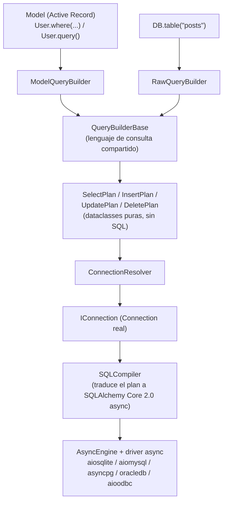
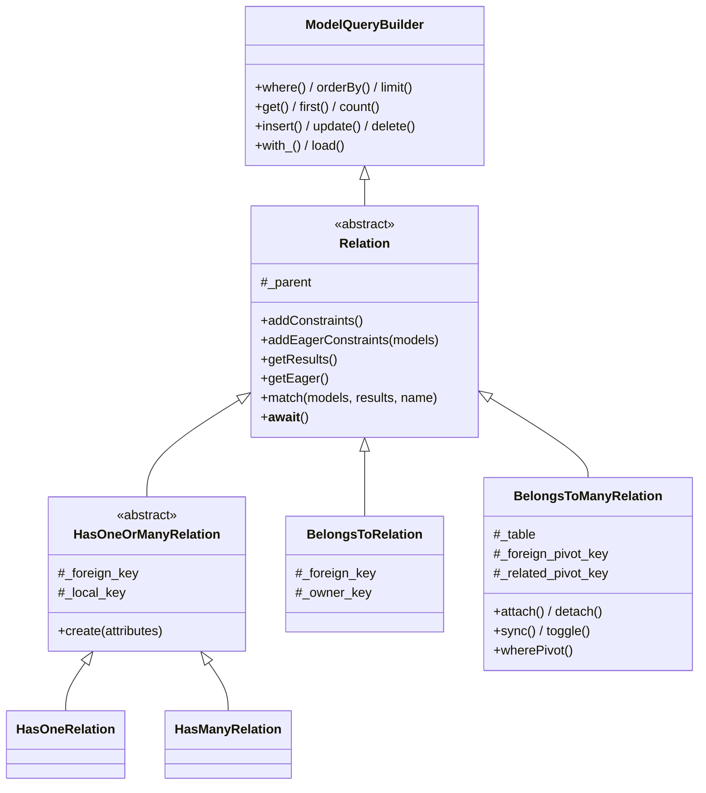

# Modelos y Query Builder en Orionis

> Manual en español del ORM de Orionis (`orionis.orm`) y de su generador de
> esquemas (`orionis.database.schema`), explicado siempre en paralelo con el
> funcionamiento equivalente de **Laravel / Eloquent**, ya que gran parte de
> su diseño (fachadas, fluent query builder, migraciones, convenciones de
> nombres) está directamente inspirado en él.

## Índice

1. [Arquitectura general](#1-arquitectura-general)
2. [Diferencias fundamentales con Laravel](#2-diferencias-fundamentales-con-laravel)
3. [Definir un modelo](#3-definir-un-modelo)
4. [Catálogo de tipos de columna](#4-catálogo-de-tipos-de-columna)
5. [Configuración declarativa del modelo](#5-configuración-declarativa-del-modelo)
6. [CRUD y ciclo de vida](#6-crud-y-ciclo-de-vida)
7. [Serialización y seguimiento de cambios (dirty tracking)](#7-serialización-y-seguimiento-de-cambios-dirty-tracking)
8. [Query Builder fluido del modelo](#8-query-builder-fluido-del-modelo)
9. [Recuperación, agregados y paginación](#9-recuperación-agregados-y-paginación)
10. [Colecciones](#10-colecciones)
11. [Relaciones entre modelos](#11-relaciones-entre-modelos)
12. [Soft deletes](#12-soft-deletes)
13. [Scopes locales y globales](#13-scopes-locales-y-globales)
14. [Accessors, mutators y eventos del modelo](#14-accessors-mutators-y-eventos-del-modelo)
15. [Motor compartido: `DB.table()` y JOINs](#15-motor-compartido-dbtable-y-joins)
16. [Esquema y migraciones](#16-esquema-y-migraciones)
17. [Transacciones](#17-transacciones)
18. [Conexiones múltiples](#18-conexiones-múltiples)
19. [Excepciones](#19-excepciones)
20. [Tabla resumen: Eloquent ↔ Orionis](#20-tabla-resumen-eloquent--orionis)
21. [Limitaciones actuales](#21-limitaciones-actuales)

---

## 1. Arquitectura general



Puntos que conviene interiorizar antes de seguir, si vienes de Laravel:

- **Todo es `async`/`await`.** `save()`, `find()`, `get()`, `create()`,
  `delete()`... son corrutinas. Eloquent es 100% síncrono; en Orionis
  siempre hay que `await` cualquier operación que toque la base de datos.
- **Un único motor de consulta.** `ModelQueryBuilder` y `RawQueryBuilder`
  heredan de `QueryBuilderBase`: el modelo no reimplementa el lenguaje de
  consulta, solo añade hidratación, casts, scopes, eventos y soft
  deletes encima del mismo plan y el mismo compilador.
- Orionis **no usa el ORM/Session propio de SQLAlchemy** (nada de
  `declarative_base`, `relationship()`, `Session`). Solo aprovecha
  **SQLAlchemy Core 2.0** como "motor de traducción" de SQL — de forma
  parecida a como Eloquent usa el Query Builder de Laravel por debajo. El
  Active Record (`Model`), el builder fluido y el plan intermedio
  (`SelectPlan`/`InsertPlan`/...) son 100% propios del framework.
- Los modelos **no resuelven su conexión a través del contenedor de DI**;
  hablan con `ConnectionResolver` (`orionis/orm/resolver.py`), un puente
  estático equivalente a `Model::setConnectionResolver()` de Eloquent. El
  `ConnectionManagerProvider` instala el manager ahí durante el `boot()`.
- Las **relaciones** (`hasOne`/`hasMany`/`belongsTo`/`belongsToMany`, ver
  [§11](#11-relaciones-entre-modelos)) no son un mecanismo aparte: cada
  una es una subclase de `ModelQueryBuilder` con una restricción
  precargada — reutilizan exactamente el mismo camino del diagrama, sin
  ninguna ruta de datos paralela.

---

## 2. Diferencias fundamentales con Laravel

| Aspecto | Laravel / Eloquent | Orionis |
|---|---|---|
| Ejecución | Síncrona | 100% asíncrona (`async`/`await`) |
| Esquema del modelo | Se infiere en runtime desde la BD | **Se declara explícitamente** en la clase con tipos (`String()`, `Integer()`, ...) |
| Motor SQL subyacente | PDO + Query Builder propio | SQLAlchemy Core 2.0 (async), nunca su ORM |
| Relaciones (`hasMany`, `belongsTo`...) | Sí | Sí (ver [§11](#11-relaciones-entre-modelos)) — declaradas como **métodos de instancia**, no como propiedades mágicas |
| Soft deletes | Sí (`SoftDeletes` trait) | Sí (`soft_deletes = True`, ver [§12](#12-soft-deletes)) |
| Scopes locales y globales | Sí | Sí (ver [§13](#13-scopes-locales-y-globales)) |
| Accessors/mutators, eventos, observers | Sí | Sí (ver [§14](#14-accessors-mutators-y-eventos-del-modelo)) |
| JOIN fluido sobre un modelo | Sí (`User::join(...)`) | Sí, misma sintaxis que `DB.table()` (motor compartido) |
| Migraciones | `php artisan migrate` | `reactor migrate` (+ `:rollback`, `:reset`, `:refresh`, `:fresh`, `:status`) |

---

## 3. Definir un modelo

A diferencia de Eloquent (donde el modelo es casi vacío y el esquema se
descubre dinámicamente), en Orionis **cada columna debe declararse como
atributo de clase**, usando los tipos fluidos de `orionis.orm`. Esto se
parece más a Django ORM o a SQLAlchemy declarativo que a Eloquent.

```python
from typing import ClassVar
from orionis.orm import Boolean, Integer, Model, String, StrictJson, StrictTimestamp


class User(Model):
    id = Integer().primary().autoIncrement()
    name = String(255)
    email = String(255).unique()
    active = Boolean().nullable()
    meta = StrictJson().nullable()
    created_at = StrictTimestamp().nullable()
    updated_at = StrictTimestamp().nullable()

    casts: ClassVar[dict[str, str]] = {"active": "bool", "meta": "json"}
    hidden: ClassVar[list[str]] = ["password"]
    fillable: ClassVar[list[str]] = ["name", "email", "password"]
```

Qué hace la metaclase `ModelMeta` (`orionis/orm/metaclass.py`) al crear la
clase:

1. Recorre el cuerpo de la clase (y las clases padre, incluyendo modelos
   `__abstract__ = True`) buscando instancias de `ColumnDefinition`.
2. **Las "detacha" de la clase** (`delattr`) — por eso, en una instancia ya
   creada, `user.name` no lee un atributo de clase Python: pasa por
   `Model.__getattr__`, que sirve el valor desde el diccionario interno
   `_attributes`.
3. Calcula el nombre de tabla, la clave primaria, los casts heredados y
   compila los "cast handlers" una sola vez (nunca hay reflexión en el
   camino caliente de hidratación/persistencia).

> **Importante:** si una columna no se declara en el modelo, no formará
> parte de `meta.columns`, y por lo tanto **`fill()`/`create()`/mass
> assignment la rechazarán con `MassAssignmentException`** aunque la
> columna exista físicamente en la tabla. Toda columna que vaya a
> asignarse por mass assignment debe declararse en la clase.

### Modelos abstractos

```python
class Auditable(Model):
    __abstract__ = True  # no genera tabla propia; solo aporta columnas/lógica
    created_at = StrictTimestamp().nullable()
    updated_at = StrictTimestamp().nullable()


class Invoice(Auditable):
    id = Integer().primary().autoIncrement()
    total = String()  # las columnas de Auditable se heredan automáticamente
```

---

## 4. Catálogo de tipos de columna

Todos se importan directo desde `orionis.orm` (por ejemplo
`from orionis.orm import String, Integer, StrictJson`). Se dividen en dos
familias:

### Tipos genéricos (portables entre motores)

| Tipo | Equivalente SQL aproximado |
|---|---|
| `BigInteger` | entero grande |
| `Boolean` | booleano |
| `Date` | fecha |
| `DateTime` | fecha y hora (`timezone=True/False`) |
| `Double`, `Float`, `Numeric` | punto flotante / decimal |
| `Enum` | enumeración validada en BD o emulada |
| `Integer`, `SmallInteger` | enteros |
| `Interval` | intervalo de tiempo |
| `LargeBinary` | binario grande |
| `String`, `Unicode` | `VARCHAR` |
| `Text`, `UnicodeText` | texto largo |
| `Time` | hora |
| `Uuid` | UUID nativo o emulado |
| `PickleType`, `MatchType`, `NumericCommon`, `SchemaType` | tipos auxiliares/mixins (ver nota) |

### Tipos específicos (`Strict*`, ligados a un tipo SQL concreto)

`StrictArray`, `StrictBigInt`, `StrictBinary`, `StrictBlob`, `StrictChar`,
`StrictClob`, `StrictDecimal`, `StrictDoublePrecision`, `StrictInt`,
`StrictJson`, `StrictNChar`, `StrictNVarChar`, `StrictReal`,
`StrictSmallInt`, `StrictTimestamp`, `StrictVarBinary`, `StrictVarChar`.

> `Uuid`/`JSON` son casos especiales: `UUID` solo existe como miembro
> **genérico** (`Uuid`, sin variante "Strict"), mientras que `JSON` solo
> existe como miembro **específico** (`StrictJson`, sin variante genérica).
>
> `NumericCommon` y `SchemaType` son mixins sin tipo DDL propio: si se
> usan como columna real, el compilador lanza `QueryException` ("No SQL
> type registered"). `MatchType` tampoco es una columna real: es solo el
> tipo de retorno lógico del operador `MATCH`.

Cada tipo expone una API fluida heredada de `ColumnDefinition`
(`orionis/orm/schema/column/definition.py`):

| Método | Efecto |
|---|---|
| `.primary()` | marca la columna como clave primaria |
| `.nullable()` | permite `NULL` |
| `.default(valor)` | valor por defecto (o callable sin argumentos) |
| `.unique()` | agrega restricción `UNIQUE` |
| `.index()` | crea índice no único |
| `.foreign("tabla.columna")` | declara clave foránea (formato calificado) |
| `.autoIncrement()` | autoincremento |
| `.comment("texto")` | comentario DDL |
| `.hasDefault()` | introspección: ¿se llamó a `.default()`? |

```python
user_id = Integer().foreign("users.id").index()
status = String(20).default("pending").nullable()
```

---

## 5. Configuración declarativa del modelo

Equivalente 1 a 1 de las propiedades estáticas de Eloquent, como
`ClassVar` en vez de propiedades de instancia con prefijo `$`:

| Orionis (`ClassVar`) | Laravel (`Eloquent`) | Comportamiento |
|---|---|---|
| `table: str \| None` | `protected $table` | Si se omite, se infiere `pluralize(snake_case(NombreClase))` (p. ej. `Company` → `companies`) |
| `connection: str \| None` | `protected $connection` | Nombre de conexión declarada en `config/database.py`; `None` = conexión por defecto |
| `fillable: list[str]` | `protected $fillable` | Whitelist de mass assignment |
| `guarded: list[str]` | `protected $guarded` | Blacklist; admite comodín `"*"` (bloquea todo) |
| `hidden: list[str]` | `protected $hidden` | Omitidos en `toDict()`/`toJson()` |
| `casts: dict[str, str]` | `protected $casts` | Casts soportados: `int`, `float`, `bool`, `datetime`, `date`, `json`, `uuid` |
| `primary_key: str \| None` | `protected $primaryKey` | Si se omite: primera columna con `.primary()`, o `"id"` como último recurso |
| `incrementing: bool` | `public $incrementing` | Si es `True` y hay PK autogenerada, se adopta tras el `INSERT` |
| `uuids: bool` | trait `HasUuids` | Genera la clave primaria en el cliente antes del `INSERT` (`newUniqueId()`) |
| `timestamps: bool` | `public $timestamps` | Requiere además que la columna exista realmente declarada en el modelo |
| `soft_deletes: bool` | trait `SoftDeletes` | Activa el borrado lógico ([§12](#12-soft-deletes)); requiere la columna `deleted_at` declarada |
| `appends: list[str]` | `protected $appends` | Atributos calculados por accessor añadidos a `toDict()`/`toJson()` |
| `CREATED_AT` / `UPDATED_AT` / `DELETED_AT` | `const CREATED_AT` / `UPDATED_AT` / `DELETED_AT` | Nombres de columna de timestamps, idéntico a Laravel |

Reglas de precedencia de `fillable`/`guarded` (idénticas a Eloquent):

- Si `fillable` no está vacío → **solo** esas columnas son asignables (se
  ignora `guarded`).
- Si `fillable` está vacío y `guarded` no → todo es asignable **excepto**
  lo listado en `guarded` (o nada, si `guarded = ["*"]`).
- Si ambos están vacíos → todo es asignable.

Cualquier violación lanza `MassAssignmentException`, igual que
`MassAssignmentException` en Laravel.

---

## 6. CRUD y ciclo de vida

### Crear

```python
# Estilo "create": instancia + guarda en un solo paso (equivalente a User::create([...]))
user = await User.create({"name": "Ana", "email": "ana@example.com", "password": "secret"})
print(user.id)  # clave primaria adoptada tras el INSERT

# Estilo "new + save" (equivalente a (new User($attrs))->save())
user = User({"name": "Ana", "email": "ana@example.com", "password": "secret"})
await user.save()
```

En el primer `save()` de una instancia nueva (`_performInsert`):

- Si el modelo mantiene `timestamps` y las columnas existen, se rellenan
  `created_at`/`updated_at` automáticamente (solo si no vienen ya en los
  atributos).
- Si `incrementing=True` y el driver reporta un `last_insert_id`, se
  adopta como valor de la clave primaria.

### Leer

```python
user = await User.find(1)                 # None si no existe
user = await User.findOrFail(1)           # ModelNotFoundException si no existe
first_user = await User.first()           # primer registro de la tabla
all_users = await User.all()              # Collection con todos los registros
```

### Actualizar

```python
user = await User.findOrFail(1)
user.name = "Ana María"          # pasa por __setattr__ -> setAttribute() (aplica casts)
await user.save()                # detecta _exists=True -> UPDATE solo de lo "dirty"

# o en un solo paso:
await user.update({"name": "Ana María"})   # fill() + save()
```

`save()` sobre una instancia existente solo escribe los atributos que
cambiaron (`getDirty()`); si nada cambió, no ejecuta ningún `UPDATE` y
retorna `True` igualmente. El timestamp de actualización se refresca
automáticamente si hay columna declarada para ello.

> **Detalle sutil:** si se muta la propia clave primaria de una instancia
> ya persistida (`user.id = 999`) y se guarda, el `WHERE` del `UPDATE`
> localiza la fila por el valor **original** de la PK, pero el `SET`
> incluye el nuevo valor — el resultado neto es un "rename" de la fila,
> no un bloqueo del cambio.

### Eliminar

```python
user = await User.findOrFail(1)
await user.delete()                 # elimina solo esa fila por su PK

deleted_count = await User.destroy(1, 2, 3)   # elimina por PK sin instanciar
```

> Si el modelo declara `soft_deletes = True`, `delete()` **marca** la
> fila en vez de borrarla; ver [§12](#12-soft-deletes).

### Eventos

Cada escritura dispara la cadena `saving` → `creating`/`updating` →
`created`/`updated` → `saved`, y cada borrado `deleting` → `deleted`.
Un listener de un evento "previo" puede abortar la operación devolviendo
`False` — ver [§14](#14-accessors-mutators-y-eventos-del-modelo).

### Timestamps

`Model.freshTimestamp()` produce un `datetime` con zona horaria UTC
*aware*, salvo que la columna destino (`updated_at`/`created_at`) sea del
tipo específico `StrictTimestamp` — en ese caso produce un valor *naive*
(sin `tzinfo`), coherente con el tipo `TIMESTAMP` sin zona horaria.

---

## 7. Serialización y seguimiento de cambios (dirty tracking)

Serialización (`AttributesMixin`, `orionis/orm/attributes.py`):

```python
user.toDict()          # dict con los atributos visibles (respeta `hidden` y `appends`)
user.toJson()           # igual, en JSON
user.only("name", "email")     # subconjunto de atributos
user.exclude("password")       # todos menos los indicados (alias de except_)
user.getAttribute("name", default=None)
```

> `toDict()` aplica los **accessors** declarados y añade los atributos
> de `appends`; `hidden` tiene prioridad sobre ambos. Ver
> [§14](#14-accessors-mutators-y-eventos-del-modelo).

Estado / dirty tracking (`StateMixin`, `orionis/orm/state.py`), idéntico
en espíritu a los métodos homónimos de Eloquent:

| Método | Efecto |
|---|---|
| `isDirty(*attrs)` | ¿cambió algo (o los atributos indicados) desde el último sync? |
| `isClean(*attrs)` | negación de `isDirty` |
| `getDirty()` | `dict` con los valores actuales que difieren del snapshot original |
| `wasChanged(*attrs)` | ¿el **último `save()`** escribió cambios? |
| `getChanges()` | `dict` de lo escrito por el último `save()` |
| `getOriginal(key=None, default=None)` | snapshot original completo, o un valor puntual |
| `syncOriginal()` | recalibra el snapshot "original" al estado actual |

---

## 8. Query Builder fluido del modelo

Igual que Eloquent, cualquier método del builder puede invocarse
directamente sobre la clase del modelo — la metaclase reenvía la llamada
a `Model.query()` de forma transparente:

```python
# Estas dos líneas son equivalentes:
users = await User.where("active", True).get()
users = await User.query().where("active", True).get()
```

> El reenvío (`ModelMeta.__getattr__`) solo funciona sobre un modelo
> **concreto** (con `__meta__` ya construido) — no sobre la clase
> abstracta `Model` en sí.

> Toda esta API fluida (`where`, `orderBy`, `limit`, `get`, `update`,
> `delete`...) también funciona **sin cambios** sobre una relación
> (`user.posts().where(...)`) — ver [§11](#11-relaciones-entre-modelos).

> **Un solo motor.** Todo lo descrito en esta sección vive en
> `QueryBuilderBase` (`orionis/orm/query/base_builder.py`), la clase de
> la que heredan **tanto** `ModelQueryBuilder` (`User.query()`) **como**
> `RawQueryBuilder` (`DB.table(...)`). No hay dos implementaciones del
> lenguaje de consulta: el modelo es únicamente una capa de hidratación
> y casts sobre el mismo `SelectPlan` y el mismo compilador
> (ver [§15](#15-motor-compartido-dbtable-y-joins)).

### Condiciones `where`

Tres formas de invocación, igual que en Laravel:

```python
User.where("active", True)                       # (columna, valor) -> "="
User.where("age", ">=", 18)                       # (columna, operador, valor)
User.where({"active": True, "country": "PE"})     # mapping -> igualdad AND
```

Operadores soportados en la forma básica: `=`, `==`, `!=`, `<>`, `<`,
`<=`, `>`, `>=`, `like`, `not like`, `ilike`, `not ilike`. Cualquier otro
operador es rechazado con `InvalidQueryException` **antes** de llegar al
SQL, de modo que la cadena del operador nunca se interpola.

```python
User.orWhere("email", "ana@example.com")   # combinado con OR
```

### Agrupación de condiciones (paréntesis)

Pasar un *callable* a `where()`/`orWhere()` abre un grupo: las
condiciones declaradas dentro se compilan entre paréntesis, exactamente
igual que la clausura de Laravel.

```python
# WHERE status = 'active' AND (role = 'admin' OR role = 'manager')
await (
    User.where("status", "active")
    .where(lambda query: query.where("role", "admin").orWhere("role", "manager"))
    .get()
)

# WHERE (country = 'CO' OR country = 'MX') AND (age >= 18 AND age <= 60)
await (
    User.where(lambda q: q.where("country", "CO").orWhere("country", "MX"))
    .where(lambda q: q.where("age", ">=", 18).where("age", "<=", 60))
    .get()
)

# WHERE active = 1 OR (role = 'admin' AND verified = 1)
await (
    User.where("active", True)
    .orWhere(lambda q: q.where("role", "admin").where("verified", True))
    .get()
)
```

El anidamiento es **recursivo y sin límite de profundidad**: un grupo
puede contener otros grupos, y el orden lógico de evaluación se conserva
tal cual se declaró. Un grupo vacío no filtra nada (es el elemento
neutro).

### Condiciones especializadas

| Método | Equivalente Laravel |
|---|---|
| `whereIn(col, valores)` / `whereNotIn(col, valores)` | `whereIn` / `whereNotIn` |
| `orWhereIn(...)` / `orWhereNotIn(...)` | `orWhereIn` / `orWhereNotIn` |
| `whereNull(col)` / `whereNotNull(col)` | `whereNull` / `whereNotNull` |
| `orWhereNull(...)` / `orWhereNotNull(...)` | `orWhereNull` / `orWhereNotNull` |
| `whereBetween(col, [a, b])` / `whereNotBetween(...)` | `whereBetween` / `whereNotBetween` |
| `whereColumn(a, op, b)` / `orWhereColumn(...)` | `whereColumn` / `orWhereColumn` |
| `whereRaw(sql, bindings)` / `orWhereRaw(...)` | `whereRaw` / `orWhereRaw` |
| `whereExists(sub)` / `whereNotExists(sub)` | `whereExists` / `whereNotExists` |
| `orWhereExists(...)` / `orWhereNotExists(...)` | `orWhereExists` / `orWhereNotExists` |
| `whereLike(col, patrón)` / `whereNotLike(col, patrón)` | `where(col, 'like', ...)` |
| `whereILike(col, patrón)` / `whereNotILike(col, patrón)` | `whereLike(..., caseSensitive: false)` |
| `whereStartsWith(col, valor)` | `whereStartsWith` (Laravel 11+) |
| `whereEndsWith(col, valor)` | `whereEndsWith` (Laravel 11+) |
| `whereContains(col, valor)` | `whereLike(col, "%valor%")` |
| `whereRegexpMatch(col, patrón)` | `whereRegex` (el dialecto exacto depende del motor) |
| `distinct()` | `distinct()` |

```python
User.whereIn("id", [1, 2, 3])
User.whereNotBetween("age", [18, 30])
User.whereColumn("updated_at", ">", "created_at")
User.whereLike("email", "%@gmail.com")
User.whereStartsWith("name", "An")
```

`whereRaw()` y `havingRaw()` aceptan un fragmento SQL con marcadores
`:nombre`; **los valores viajan siempre como parámetros vinculados**, de
modo que el driver los escapa y el fragmento no puede usarse para
inyectar literales:

```python
User.whereRaw("age > :floor", {"floor": 40})
```

### Proyección

```python
User.select("id", "name")
User.addSelect("email")                       # añade sin reemplazar
User.selectRaw("count(*)", alias="total")     # fragmento SQL etiquetado
User.selectSub(
    lambda q: q.table("posts")
               .selectRaw("count(*)")
               .whereColumn("posts.user_id", "=", "users.id"),
    "posts_count",
)                                              # subconsulta escalar correlacionada
```

### Subconsultas

Cualquier método que acepte una subconsulta admite tres formas: un
*callable* que recibe un builder nuevo, otro builder ya construido, o un
`SelectPlan` listo.

```python
# IN con subconsulta
User.whereIn("id", lambda q: q.table("posts").select("user_id"))

# EXISTS correlacionado (la subconsulta ve las columnas de la consulta externa)
User.whereExists(
    lambda q: q.table("posts")
               .select("id")
               .whereColumn("posts.user_id", "=", "users.id"),
)
```

### Orden, agrupación, límites

```python
User.orderBy("name", "desc")
User.latest()              # ORDER BY created_at DESC (o la PK si no hay timestamps)
User.oldest("id")
User.groupBy("country").having("country", "PE")
User.groupBy("country").havingRaw("count(*) > :n", {"n": 5})
User.limit(10).offset(20)  # alias: .take(10).skip(20)
User.forPage(2, 15)        # limit + offset de una página
```

### Bloqueos y consultas compuestas

```python
await User.where("id", 1).lockForUpdate().first()   # SELECT ... FOR UPDATE
await User.where("id", 1).sharedLock().first()       # SELECT ... FOR SHARE

await (
    User.select("name").where("country", "CO")
    .unionAll(lambda q: q.table("users").select("name").where("country", "MX"))
    .get()
)
```

### JOINs desde el modelo

Los JOIN están disponibles con la **misma sintaxis** desde el modelo y
desde `DB.table()`; la referencia completa (tipos, alias, callbacks,
subconsultas) está en [§15](#15-motor-compartido-dbtable-y-joins).

```python
await (
    User.select("users.name", "posts.title")
    .join("posts", "posts.user_id", "=", "users.id")
    .where("posts.published", True)
    .get()
)
```

### Reutilización y composición

`clone()` devuelve una copia con un plan **independiente**, para derivar
varias consultas de una base común sin contaminarla:

```python
base = User.where("active", True)
admins = await base.clone().where("role", "admin").get()
total = await base.clone().count()
```

`toPlan()` expone el `SelectPlan` acumulado, que es lo que permite
incrustar un builder como subconsulta de otro.

---

## 9. Recuperación, agregados y paginación

### Terminales de lectura

```python
await User.where("active", True).get()          # Collection de instancias User
await User.where("active", True).first()        # instancia o None
await User.where("active", True).firstOrFail()   # ModelNotFoundException si no hay match
await User.query().find(1)                       # por clave primaria
await User.query().findOrFail(1)
await User.query().value("email")                # un único valor de la primera fila
await User.query().pluck("email")                # Collection con una sola columna
```

### Agregados

```python
await User.count()
await User.where("active", True).exists()
await User.where("active", True).doesntExist()
await User.max("age")
await User.min("age")
await User.avg("age")
await User.sum("balance")
```

### Mutación masiva vía builder

```python
result = await User.query().insert({"name": "Ana", "email": "ana@example.com"})
print(result.last_insert_id, result.row_count)

updated = await User.where("country", "PE").update({"verified": True})
deleted = await User.where("active", False).delete()
```

> **Diferencia importante con `Model.create()`:** el `insert()` del
> builder serializa los valores directamente (`serialize_for_storage`),
> **sin** pasar por `fillable`/`guarded` ni agregar timestamps
> automáticamente. En cambio, `update()` del builder **sí** refresca el
> timestamp de actualización si el modelo lo declara.

### Paginación

```python
page = await User.where("active", True).paginate(page=1, per_page=15)

page.items         # Collection de la página actual
page.total         # total de filas en todas las páginas
page.page          # página actual
page.per_page      # tamaño de página
page.last_page     # última página disponible
page.has_next       # bool
page.has_previous   # bool
```

Fuera de una transacción, `paginate()` ejecuta el `COUNT` y el `SELECT`
de la página **en paralelo** (`asyncio.gather`), ya que cada uno abre su
propia conexión pooled; dentro de una transacción compartida se ejecutan
en secuencia (una única conexión no soporta dos sentencias concurrentes).

---

## 10. Colecciones

`get()`/`all()` devuelven `orionis.support.types.collection.Collection`
(no una lista plana), con una API fluida similar a `Illuminate\Support\Collection`:

```python
users = await User.all()

users.first()                    # primer elemento (opcionalmente con callback de filtro)
users.last()
users.all()                       # lista Python subyacente
users.take(5)
users.filter(lambda u: u.active)
users.each(lambda u: print(u.name))
users.groupBy("country")
users.sort(key=lambda u: u.name)
users.random(count=1)
```

> Métodos como `each`, `sort`, `transform`, `reject`, `push`, `pop`,
> `merge`, `prepend`, `put`, `pull`, `shift` **mutan y devuelven `self`**,
> mientras que otros (`filter`, `take`, `groupBy`, entre otros) devuelven
> una **nueva** `Collection` — revisar `orionis/support/types/collection.py`
> ante la duda sobre un método puntual.

---

## 11. Relaciones entre modelos

Orionis implementa relaciones entre modelos (`hasOne`, `hasMany`,
`belongsTo`, `belongsToMany`) inspiradas directamente en la API de
Eloquent, pero adaptadas a la arquitectura 100% asíncrona y a las
restricciones reales del lenguaje Python — en particular, a que Python
**no** permite distinguir de forma transparente entre "acceder a un
método" y "acceder a una propiedad mágica" como sí hace PHP.

### 11.1 Arquitectura y filosofía de diseño



Puntos clave del diseño (`orionis/orm/relations/`):

- **Cada relación ES un `ModelQueryBuilder` completo.** `Relation` hereda
  directamente de `ModelQueryBuilder`, en vez de envolverlo o componerlo.
  Esto significa que `.where()`, `.orderBy()`, `.limit()`, `.get()`,
  `.first()`, `.update()`, `.delete()`... funcionan sobre una relación
  exactamente igual que sobre `User.query()` — no hay una API paralela
  que aprender ni que mantener sincronizada con el builder normal.
- **Una clase por tipo de relación**, todas heredando de la base común
  `Relation` (`orionis/orm/relations/relation.py`): `HasOneRelation`,
  `HasManyRelation` (ambas comparten lógica en la intermedia
  `HasOneOrManyRelation`, igual que en Eloquent), `BelongsToRelation` y
  `BelongsToManyRelation`. Añadir `MorphOne`/`MorphMany`/`MorphTo`/
  `MorphToMany`/`HasOneThrough`/`HasManyThrough` en el futuro solo
  requiere una clase nueva que implemente el mismo *template method*
  (`addConstraints`/`addEagerConstraints`/`getResults`/`getEager`/
  `match`) — no toca ninguna línea de código existente.
- **Sin funciones globales.** `hasOne`, `hasMany`, `belongsTo` y
  `belongsToMany` son **métodos de instancia** provistos por
  `RelationsMixin` (mezclado en `Model`), no funciones sueltas — el
  cuerpo de un modelo solo los invoca (`self.hasMany(Post)`), nunca los
  importa como símbolos de módulo.

### ¿Por qué métodos de instancia y no `posts = hasMany(Post)`?

Eloquent permite declarar relaciones como método porque en PHP es la
única forma natural: `public function posts() { return
$this->hasMany(Post::class); }`. Se evaluó también la alternativa "campo
de clase" (`posts = hasMany(Post)`, análoga a cómo se declaran las
columnas con `ColumnDefinition`), pero se descartó deliberadamente por
dos motivos concretos, no por preferencia estética:

1. **Referencias adelantadas (forward references) reales.** Un campo de
   clase se evalúa **en el momento en que se define la clase**. Si
   `User` declara `posts = hasMany(Post)` y `Post` declara `user =
   belongsTo(User)`, una de las dos clases necesariamente se referencia
   a sí misma antes de existir — sea en el mismo archivo (orden de
   declaración) o, peor, entre dos módulos que se importan mutuamente
   (`ImportError` circular real de Python, no un problema del ORM). Un
   **método** no tiene este problema: su cuerpo no se ejecuta al definir
   la clase, sino en el momento en que se *llama*, cuando ambas clases ya
   existen por completo — es el mismo truco que usa Eloquent, solo que
   Python lo obtiene gratis de los métodos en lugar de necesitar cadenas
   de texto perezosas (`relationship("Post")`, al estilo SQLAlchemy/Django).
2. **Orionis es 100% asíncrono.** `$user->posts` en Eloquent dispara la
   consulta de forma transparente gracias a `__get()` mágico de PHP —
   algo que en un framework `async`/`await` no se puede reproducir sin
   convertir cualquier acceso a atributo en una operación bloqueante o en
   un valor "quizás sea una corrutina". Mantener las relaciones como
   métodos dejó clarísimo, desde la propia sintaxis, que `user.posts()`
   siempre requiere `await` en algún punto de la cadena.

```python
from orionis.orm import Model


class User(Model):
    id = Integer().primary().autoIncrement()
    name = String()

    def posts(self):
        return self.hasMany(Post)

    def profile(self):
        return self.hasOne(Profile)


class Post(Model):
    id = Integer().primary().autoIncrement()
    title = String()
    user_id = Integer().nullable()

    def user(self):
        return self.belongsTo(User)
```

> **Ergonomía extra:** toda `Relation` implementa `__await__`, así que
> `await user.posts()` es equivalente a `await user.posts().get()` (o a
> `.first()` para `hasOne`/`belongsTo`) — permite escribir el atajo
> típico de Eloquent sin perder la posibilidad de encadenar el builder
> completo cuando hace falta más control:
>
> ```python
> posts = await user.posts()                 # atajo: equivale a .get()
> posts = await user.posts().get()           # forma explícita, idéntica
> profile = await user.profile()             # atajo: equivale a .first()
> ```

### 11.2 `hasOne` — uno a uno

```python
class User(Model):
    def profile(self):
        return self.hasOne(Profile)


class Profile(Model):
    id = Integer().primary().autoIncrement()
    bio = String().nullable()
    user_id = Integer().nullable()
```

```python
user = await User.find(1)

profile = await user.profile()                 # Profile | None
profile = await user.profile().first()         # equivalente, explícito
profile = await user.profile().where("bio", "x").first()   # builder completo

# Crear el relacionado inyectando automáticamente la FK:
profile = await user.profile().create({"bio": "Nueva bio"})
```

Inferencia automática (idéntica a `hasMany`, ver tabla de la §11.3):
`foreign_key = snake_case(NombreClasePadre) + "_id"` (columna que vive en
la tabla **relacionada**), `local_key = primary_key` del padre.

### 11.3 `hasMany` — uno a muchos

```python
class User(Model):
    def posts(self):
        return self.hasMany(Post)


class Post(Model):
    id = Integer().primary().autoIncrement()
    title = String()
    user_id = Integer().nullable()
    published = Boolean().nullable()
```

```python
user = await User.find(1)

posts = await user.posts()                      # atajo -> .get()
posts = await user.posts().get()                # Collection[Post]

# El Query Builder completo sigue disponible:
await user.posts().where("published", True).orderBy("created_at", "desc").get()

# Crear un post ya vinculado al usuario (equivalente a
# Post::create + asignar user_id manualmente en Eloquent):
post = await user.posts().create({"title": "Nuevo post"})

# update()/delete() masivos respetan la restricción de la relación:
await user.posts().where("published", False).update({"published": True})
await user.posts().where("published", False).delete()
```

| Convención | Valor por defecto | Parámetro para sobrescribir |
|---|---|---|
| `foreign_key` | `snake_case(NombreClasePadre) + "_id"` (p. ej. `User` → `user_id`) | `self.hasMany(Post, foreign_key="autor_id")` |
| `local_key` | `primary_key` del padre (normalmente `"id"`) | `self.hasMany(Post, local_key="uuid")` |

```python
class User(Model):
    def posts(self):
        return self.hasMany(Post, foreign_key="autor_id", local_key="id")
```

> Si el padre no tiene valor de `local_key` (instancia nueva sin guardar,
> o el atributo es `None`), la relación devuelve una `Collection` vacía
> **sin ejecutar ninguna consulta** — nunca hace `WHERE columna IS NULL`,
> que podría matchear accidentalmente filas huérfanas con la FK en
> `NULL`.

### 11.4 `belongsTo` — inversa de `hasOne`/`hasMany`

```python
class Post(Model):
    id = Integer().primary().autoIncrement()
    title = String()
    user_id = Integer().nullable()

    def user(self):
        return self.belongsTo(User)
```

```python
post = await Post.find(1)

owner = await post.user()                       # atajo -> .first()
owner = await post.user().first()               # equivalente, explícito
```

| Convención | Valor por defecto | Parámetro para sobrescribir |
|---|---|---|
| `foreign_key` | `snake_case(NombreClaseRelacionada) + "_id"` (p. ej. `User` → `user_id`) | `self.belongsTo(User, foreign_key="autor_id")` |
| `owner_key` | `primary_key` del relacionado (normalmente `"id"`) | `self.belongsTo(User, owner_key="uuid")` |

> **Diferencia con Laravel:** Eloquent infiere el `foreign_key` de
> `belongsTo` a partir del **nombre del método** de la relación
> (`user()` → `user_id`), inspeccionando la pila de llamadas en tiempo de
> ejecución. Orionis lo infiere en cambio a partir del **nombre de la
> clase relacionada** (`User` → `user_id`) para evitar cualquier
> introspección de stack frames en la ruta caliente de construcción de
> relaciones — en la inmensa mayoría de los casos el resultado es
> idéntico (el método se suele llamar igual que la clase, en
> minúsculas), y cuando no coincide basta con pasar `foreign_key`
> explícito.

Si `post.user_id` es `None`, `await post.user()` devuelve `None`
**sin ejecutar ninguna consulta** (mismo principio que en `hasMany`).

### 11.5 `belongsToMany` — muchos a muchos con tabla pivote

```python
class Role(Model):
    id = Integer().primary().autoIncrement()
    name = String()

    def users(self):
        return self.belongsToMany(User)


class User(Model):
    id = Integer().primary().autoIncrement()
    name = String()

    def roles(self):
        return self.belongsToMany(Role)
```

Convenciones de nombre (idénticas en espíritu a Laravel):

| Convención | Valor por defecto | Parámetro para sobrescribir |
|---|---|---|
| `table` (pivote) | ambos nombres de clase en snake_case, unidos por `"_"` en orden alfabético (p. ej. `Role`+`User` → `role_user`) | `self.belongsToMany(User, table="role_user")` |
| `foreign_pivot_key` | `snake_case(NombreClasePropia) + "_id"` | `self.belongsToMany(User, foreign_pivot_key="role_id")` |
| `related_pivot_key` | `snake_case(NombreClaseRelacionada) + "_id"` | `self.belongsToMany(User, related_pivot_key="user_id")` |
| `parent_key` | `primary_key` del modelo propio | `self.belongsToMany(User, parent_key="uuid")` |
| `related_key` | `primary_key` del modelo relacionado | `self.belongsToMany(User, related_key="uuid")` |

```python
role = await Role.find(1)

users = await role.users()                       # atajo -> .get()
users = await role.users().get()                 # Collection[User]

# Query Builder completo sobre la tabla RELACIONADA (users):
await role.users().where("active", True).orderBy("name").get()

# Filtrar por columnas de la propia tabla PIVOTE:
await role.users().wherePivot("assigned_by", 42).get()
```

#### Insertar y eliminar relaciones (`attach` / `detach` / `sync` / `toggle`)

```python
# Vincular (acepta un id, una lista de ids, o instancias de modelo):
await role.users().attach(user.id)
await role.users().attach([1, 2, 3])
await role.users().attach(user)

# Columnas extra en la fila pivote (compartidas por todos los ids):
await role.users().attach([1, 2], attributes={"assigned_by": 42})

# Columnas extra DISTINTAS por id (mapping id -> atributos):
await role.users().attach({1: {"assigned_by": 42}, 2: {"assigned_by": 7}})

# Desvincular ids concretos, o todos si no se pasa nada:
await role.users().detach(user.id)
await role.users().detach([1, 2])
await role.users().detach()                       # desvincula TODO

# Sincronizar: deja vinculados EXACTAMENTE estos ids (adjunta/quita lo necesario)
result = await role.users().sync([1, 2, 3])
result["attached"]   # ids nuevos vinculados
result["detached"]   # ids que se quitaron

# Alternar: vincula lo que no estaba, desvincula lo que ya estaba
result = await role.users().toggle([2, 3, 4])
```

Custom pivot (tabla y claves totalmente personalizadas):

```python
class Student(Model):
    def courses(self):
        return self.belongsToMany(
            Course,
            table="enrollments",
            foreign_pivot_key="student_ref",
            related_pivot_key="course_ref",
            parent_key="student_id",
            related_key="course_id",
        )
```

> **Diferencia con Laravel — cómo se resuelve internamente
> `belongsToMany`:** Eloquent compila un único `JOIN` contra la tabla
> pivote, aplicando alias a cada columna proyectada
> (`pivot_created_at`, etc.) para evitar colisiones de nombre entre las
> dos tablas. El compilador SQL de Orionis (`SQLCompiler`) **ya soporta**
> JOINs multi-tabla a nivel interno (los usa `DB.table().join(...)`),
> pero no soporta todavía aliasing de columnas proyectadas — usarlo tal
> cual para `belongsToMany` produciría colisiones de clave en el `dict`
> de resultado si ambas tablas comparten un nombre de columna (algo
> habitual: `id`, `created_at`, `name`...). Por eso `BelongsToManyRelation`
> resuelve la relación en **dos consultas** en lugar de un único `JOIN`:
>
> 1. `SELECT` sobre la tabla pivote (vía `RawQueryBuilder`, el mismo que
>    usa `DB.table()`) para obtener los ids relacionados.
> 2. `SELECT ... WHERE id IN (...)` sobre la tabla del modelo
>    relacionado, reutilizando el `ModelQueryBuilder` normal — con
>    hidratación y casts completos, a diferencia de un `JOIN` crudo.
>
> Para una sola relación esto es una consulta más que en Laravel; en
> cambio, en *eager loading* (§11.6) el costo es el mismo en ambos casos:
> exactamente 2 consultas totales sin importar cuántos padres se carguen
> a la vez, nunca N+1.

> **Claves compuestas:** no soportadas todavía en `belongsToMany` (ni en
> ninguna otra relación) — el resto del ORM tampoco soporta una clave
> primaria de modelo compuesta por varias columnas (`Model.primary_key`
> es siempre un único `str`), así que esta limitación es consistente con
> el estado actual del framework, no una carencia exclusiva de las
> relaciones.

### 11.6 Eager loading (`with_()` / `load()`)

```python
users = await User.with_("posts").get()
users = await User.query().with_("posts", "profile").get()   # varias a la vez
users = await User.query().load("posts").get()                # alias idéntico

for user in users:
    print(user.relationLoaded("posts"))    # True
    print(user.getRelation("posts"))       # Collection[Post] ya resuelta
```

> **Diferencia con Laravel — por qué `with_()` y no `with()`:** `with`
> es palabra reservada de Python (la de `with ... as ...`); no puede
> usarse como nombre de método. Se optó por el mismo patrón que ya usa
> el resto del framework para evitar colisiones con keywords (`except_`
> junto a su alias `exclude()` en `AttributesMixin`): el método
> "canónico" lleva un guion bajo final, `with_()`, y `load()` es un
> alias sin ese problema, ambos con idéntico comportamiento.

El mecanismo evita el problema N+1 sin tocar el compilador SQL ni
introducir `JOIN`s: para cada nombre pedido, `ModelQueryBuilder` toma
**un** modelo de muestra del resultado (todos comparten la misma
relación), construye la relación en modo "sin restricción de instancia"
(`Relation.noConstraints`), le aplica un único `whereIn(...)` con las
claves de **todos** los padres cargados (`addEagerConstraints`), ejecuta
**una sola consulta adicional** (`getEager()`), agrupa los resultados por
clave y se los asigna a cada padre (`match()`). Esto funciona igual para
las cuatro relaciones, incluida `belongsToMany` (2 consultas totales, no
2 por padre).

```python
# Funciona también con first() (no solo con get()):
user = await User.query().with_("profile").first()

# Y encadenado con cualquier otra cláusula del builder:
await User.where("active", True).with_("posts").orderBy("name").get()
```

> **Limitación intencional (no un bug):** tras un eager load, **leer**
> el resultado cacheado requiere `model.getRelation("posts")` de forma
> explícita. `model.posts` (sin paréntesis) siempre devuelve el método
> en sí — nunca el resultado cacheado — porque, a diferencia de PHP,
> Python no tiene forma de interceptar "acceso a atributo" en un nombre
> que también existe como método real de la clase. Volver a llamar
> `await model.posts()` **siempre** ejecuta una consulta nueva (modo
> lazy), incluso si esa relación ya fue eager-cargada; usar
> `getRelation()` es la única forma de aprovechar el resultado
> precargado sin volver a golpear la base de datos.
>
> Un nombre desconocido o que no resuelve a una relación real
> (`with_("no_existe")`) lanza `RelationNotFoundException` de inmediato,
> antes de tocar la base de datos.

### 11.7 Relaciones, Query Builder y transacciones

Toda `Relation` resuelve su conexión exactamente igual que
`ModelQueryBuilder` (`ConnectionResolver`, sin pasar por el contenedor de
DI), así que participa de forma transparente en cualquier transacción ya
abierta sobre esa conexión — task-local, anidable con `SAVEPOINT`, igual
que el resto del ORM (§14):

```python
async with DB.connection().transaction():
    user = await User.create({"name": "Ana"})
    await user.posts().create({"title": "Primer post"})
    await role.users().attach(user.id)
# COMMIT automático si nada lanzó; ROLLBACK completo (posts + pivote
# incluidos) si algo dentro del bloque lanzó una excepción.
```

### 11.8 Buenas prácticas

- Prefiere `await padre.relacion()` (atajo `__await__`) para el caso
  simple de "traer todo sin condiciones"; usa `.where(...)`/`.orderBy(...)`
  explícitos en cuanto necesites filtrar o encadenar más del builder.
- Usa `with_()`/`load()` en cuanto vayas a iterar la misma relación sobre
  **varios** modelos (listados, reportes...) — evita N+1 sin cambiar
  nada del resto del código de la relación.
- Para crear un relacionado ya vinculado, prefiere
  `padre.relacion().create({...})` en vez de instanciar el modelo
  relacionado a mano y asignar la FK manualmente — `create()` inyecta la
  clave automáticamente y sigue respetando `fillable`/`guarded` del
  modelo relacionado.
- En `belongsToMany`, prefiere `sync()` sobre combinar `attach()`/
  `detach()` manualmente cuando quieras que el estado final sea "solo
  estos ids" — evita condiciones de carrera entre leer el estado actual y
  decidir qué adjuntar/quitar.
- Declara siempre las claves explícitas (`foreign_key=`, `owner_key=`,
  `table=`, ...) en cuanto el nombre de tu método de relación no
  coincida con el nombre de la clase relacionada — la inferencia
  automática es una comodidad, no una garantía semántica.

---

## 12. Soft deletes

Un modelo activa el borrado lógico declarando `soft_deletes = True` y una
columna de marca temporal (`deleted_at` por defecto, renombrable con
`DELETED_AT`):

```python
class Account(Model):
    soft_deletes = True

    id = Integer().primary().autoIncrement()
    name = String()
    deleted_at = DateTime()      # la metaclase la fuerza a NULLABLE
```

> La metaclase marca automáticamente la columna de borrado lógico como
> `nullable()`: una columna `NOT NULL` haría imposible representar una
> fila viva, así que el framework corrige la declaración en vez de
> fallar en el primer `INSERT`.

A partir de ahí el comportamiento es el de Eloquent:

```python
await account.delete()          # UPDATE ... SET deleted_at = <now>
account.trashed()               # True
await account.restore()         # UPDATE ... SET deleted_at = NULL
await account.forceDelete()     # DELETE real

await Account.count()                    # excluye las filas marcadas
await Account.withTrashed().count()      # incluye las marcadas
await Account.onlyTrashed().get()        # solo las marcadas
await Account.withoutTrashed().get()     # comportamiento por defecto, explícito
```

El builder también respeta el borrado lógico en las operaciones masivas:

```python
await Account.where("active", False).delete()        # marca, no borra
await Account.onlyTrashed().restore()                # restaura en bloque
await Account.where("active", False).forceDelete()   # borra de verdad
```

La exclusión de filas marcadas se aplica **en el momento de ejecutar**
la consulta, no al construirla, por lo que `withTrashed()` puede
llamarse en cualquier punto de la cadena. Las relaciones
([§11](#11-relaciones-entre-modelos)) heredan esta lógica sin ningún
código adicional, porque `Relation` extiende `ModelQueryBuilder`.

---

## 13. Scopes locales y globales

### Scopes locales

Un scope local es un método de clase con el prefijo `scope`; se invoca
sin el prefijo y con la inicial en minúscula, igual que en Laravel:

```python
class Account(Model):

    @classmethod
    def scopeActive(cls, query):
        return query.where("active", True)

    @classmethod
    def scopeOfRole(cls, query, role: str):
        return query.where("role", role)
```

```python
await Account.active().get()                    # desde la clase
await Account.query().active().get()            # desde el builder
await Account.query().ofRole("admin").get()     # con argumentos
await Account.query().scope("ofRole", "admin")  # forma explícita por nombre
```

> Los scopes deben declararse como `@classmethod` (o `@staticmethod`):
> se invocan sin instancia, recibiendo el builder como primer argumento.
> Un nombre inexistente lanza `ScopeNotFoundException` con `scope(...)`,
> y `AttributeError` con la forma de atributo (para no enmascarar
> errores de tipeo).

### Scopes globales

Un scope global se aplica a **todas** las consultas del modelo:

```python
Account.addGlobalScope("active", lambda query: query.where("active", True))

await Account.count()                                  # ya filtrado
await Account.withoutGlobalScope("active").count()      # excepción puntual
await Account.withoutGlobalScopes().count()             # desactiva todos
Account.removeGlobalScope("active")                     # lo quita del modelo
```

Los scopes globales se heredan por las subclases del modelo (se copian
al construir la metadata) y, igual que el filtro de soft deletes, se
inyectan en el plan justo antes de ejecutar la consulta.

---

## 14. Accessors, mutators y eventos del modelo

### Accessors y mutators

La convención es la de Eloquent adaptada a los nombres camelCase del
framework: `get<Nombre>Attribute` y `set<Nombre>Attribute`, donde
`<Nombre>` se convierte a `snake_case` para obtener el atributo.

```python
class Account(Model):
    appends = ["display_name"]

    first_name = String()
    last_name = String()
    role = String()
    secret = String()

    def getRoleAttribute(self, value):
        """Se aplica al LEER account.role."""
        return str(value).upper()

    def setSecretAttribute(self, value):
        """Se aplica al ESCRIBIR account.secret; el retorno es lo que se guarda."""
        return hash_it(value)

    def getDisplayNameAttribute(self, value):
        """Atributo calculado: no necesita columna."""
        return f"{self._attributes['first_name']} {self._attributes['last_name']}"
```

- El **accessor** recibe el valor almacenado y su retorno es lo que ve
  quien lee el atributo; el valor crudo sigue accesible con
  `getOriginal("role")` o `model._attributes["role"]`.
- El **mutator** se ejecuta antes que el *cast* declarado, de modo que
  ambos se componen.
- `appends` añade a `toDict()`/`toJson()` atributos que solo existen
  como accessor; `hidden` sigue teniendo prioridad sobre `appends`.

### Eventos del ciclo de vida

Eventos disponibles: `retrieved`, `saving`, `creating`, `created`,
`updating`, `updated`, `saved`, `deleting`, `deleted`, `restoring`,
`restored`.

```python
Account.registerEvent("creating", lambda model: print("creando", model.name))

async def audit(model):
    await AuditLog.create({"account_id": model.id})

Account.registerEvent("created", audit)     # los listeners pueden ser async
```

Un *observer* registra de golpe todos los métodos que coincidan con un
nombre de evento:

```python
class AccountObserver:
    def creating(self, account): ...
    def deleted(self, account): ...

Account.observe(AccountObserver)
Account.flushEvents()            # limpia todos; flushEvents("created") limpia uno
```

Los eventos "previos" (`saving`, `creating`, `updating`, `deleting`,
`restoring`) **abortan la operación** si un listener devuelve `False`,
igual que en Eloquent:

```python
Account.registerEvent("creating", lambda model: bool(model.email))
await Account.create({"name": "Ada"})   # False -> no se inserta nada
```

Orden de disparo en una escritura: `saving` → `creating`/`updating` →
`created`/`updated` → `saved`. En un borrado: `deleting` → `deleted`.
En una restauración: `restoring` → `restored`. `retrieved` se dispara
por cada instancia hidratada (y se omite por completo si no hay
listeners registrados, para no penalizar la hidratación masiva).

### Claves primarias generadas por el cliente

```python
class Token(Model):
    incrementing = False
    uuids = True

    id = Uuid().primary()
    label = String()

token = await Token.create({"label": "api"})
token.id      # UUID generado antes del INSERT
```

`Model.newUniqueId()` es sobrescribible si necesitas ULIDs o claves con
prefijo.

---

## 15. Motor compartido: `DB.table()` y JOINs

Equivalente al Query Builder "plano" de Laravel (`DB::table('x')`), para
casos donde no hace falta (o no conviene) un modelo:

```python
from orionis.support.facades import DB

rows = await DB.table("posts").where("published", True).get()   # Collection[dict]
row = await DB.table("posts").where("id", 1).first()             # dict | None
```

`DB.table(...)` y `Model.query()` **comparten exactamente el mismo
motor**: ambos son subclases de `QueryBuilderBase`, acumulan el mismo
`SelectPlan` y se compilan con el mismo `SQLCompiler`. Todo lo de
[§8](#8-query-builder-fluido-del-modelo) (grupos anidados, subconsultas,
raw, uniones, bloqueos, `clone()`...) está disponible en ambos sin
diferencias.

Lo único que cambia es la capa de arriba:

- Los resultados son **`dict` planos**, tal cual los entrega el driver
  (sin hidratación ni casts — por ejemplo, un booleano de SQLite vuelve
  como `1`/`0`, no como `True`/`False`).
- La tabla no tiene un esquema Python declarado (`TableDefinition` vacía);
  el compilador declara perezosamente cada columna referenciada.
- No hay scopes, eventos ni soft deletes (son comportamiento de modelo).

```python
DB.table("posts", alias="p")            # alias de la tabla principal
DB.connection("reporting").table("x")   # gateway acotado a otra conexión
DB.table("x", connection="reporting")   # equivalente, por llamada
```

> `DB.connection(name)` devuelve un gateway **nuevo** acotado a esa
> conexión; nunca muta el servicio compartido del contenedor, de modo
> que peticiones concurrentes no pueden reapuntarse entre sí.

También expone SQL crudo y control de transacciones por conexión:

```python
await DB.select("SELECT * FROM users WHERE id = :id", {"id": 1})
await DB.execute("UPDATE users SET active = :a", {"a": 1})
await DB.statement("VACUUM")
DB.getDefaultName() / DB.setDefaultName("pgsql")
```

### JOINs

```python
posts = await (
    DB.table("posts")
    .join("users", "posts.user_id", "=", "users.id")   # INNER JOIN
    .select("posts.title", "users.name")
    .where("users.active", True)
    .orderBy("posts.created_at", "desc")
    .get()
)

await DB.table("posts").leftJoin("comments", "posts.id", "=", "comments.post_id").get()
await DB.table("posts").rightJoin("users", "posts.user_id", "=", "users.id").get()
await DB.table("posts").fullJoin("users", "posts.user_id", "=", "users.id").get()
await DB.table("sizes").crossJoin("colors").get()        # sin condición ON
```

**Alias** en ambos lados:

```python
await (
    DB.table("users", alias="u")
    .select("u.name", "p.title")
    .join("posts", "p.user_id", "=", "u.id", alias="p")
    .get()
)
```

**Múltiples condiciones ON** mediante callback:

```python
await (
    DB.table("users")
    .join(
        "posts",
        lambda join: join
            .on("posts.user_id", "=", "users.id")
            .orOn("posts.author_id", "=", "users.id"),
    )
    .get()
)
```

**JOIN con subconsulta** (tabla derivada, el alias es obligatorio):

```python
await (
    DB.table("users")
    .select("users.name", "stats.total")
    .joinSub(
        lambda q: q.table("posts")
                   .select("user_id")
                   .selectRaw("sum(views)", alias="total")
                   .groupBy("user_id"),
        "stats",
        "stats.user_id", "=", "users.id",
    )
    .get()
)
```

También existen `leftJoinSub()` y `rightJoinSub()`.

Para unir contra la tabla real de un modelo (con su esquema completo, en
vez de una tabla "sin columnas conocidas"), se puede pasar
`Model.__meta__.table`:

```python
await DB.table("posts").join(User.__meta__.table, "posts.user_id", "=", "users.id").get()
```

**Notas de implementación:**

- `RIGHT JOIN` se compila invirtiendo los lados de un `LEFT OUTER JOIN`
  (SQLAlchemy Core no tiene un constructor `RIGHT` nativo); el conjunto
  de resultados es idéntico.
- Un `JOIN` que no sea `CROSS` y no declare condiciones lanza
  `QueryException` (evita productos cartesianos accidentales).
- Un `joinSub()` sin alias lanza `QueryException`: una tabla derivada sin
  nombre no podría referenciarse desde el `ON` ni desde el `SELECT`.

---

## 16. Esquema y migraciones

### `Schema` y `Blueprint` (equivalente a `Schema::create` de Laravel)

```python
from orionis.support.facades import Schema

# Estilo fluido con "async with" (recomendado, similar a la clausura de Laravel)
async with Schema.create("posts") as table:
    table.id()
    table.bigInteger("user_id").foreign("users.id").index()
    table.string("title", 255)
    table.text("body").nullable()
    table.boolean("published").default(False)
    table.timestamps()

    table.comment("Tabla de publicaciones del blog.")

# Estilo "definiciones explícitas" (equivalente a pasar todo de una vez)
from orionis.database.schema import Column, Comment

await Schema.create(
    "posts",
    Column.id(),
    Column.string("title", 255),
    Comment("Tabla de publicaciones del blog."),
)

await Schema.drop("posts")
```

Si el bloque `async with` lanza una excepción, **la tabla no se crea**.

Factories de columnas disponibles en `Blueprint`/`Column` (proxy dinámico
sobre el mismo catálogo del §4): `id()`, `bigInteger()`, `boolean()`,
`date()`, `dateTime()`, `double()`, `enum()`, `string()`, `text()`,
`uuid()`, entre ~40 más — cualquier tipo del catálogo tiene su factory
equivalente en `snake`/`camelCase` correspondiente.

### Restricciones a nivel de tabla

| Constructor / método de `Blueprint` | Equivalente Laravel |
|---|---|
| `Comment(texto)` / `table.comment(texto)` | `$table->comment('...')` |
| `ForeignKey(col, ref_tabla, ref_col, name=None)` / `table.foreignKey(...)` | `$table->foreign('col')->references('id')->on('tabla')` |
| `Index(*cols, name=None, unique=False)` / `table.index(...)` | `$table->index([...])` |
| `PrimaryKey(*cols)` / `table.primaryKey(...)` | `$table->primary([...])` (PK compuesta) |
| `Unique(*cols, name=None)` / `table.unique(...)` | `$table->unique([...])` |

Ejemplo con clave primaria compuesta e índice (tomado de una migración
real del framework, tabla pivote polimórfica):

```python
async with Schema.create("model_has_permissions") as table:
    table.bigInteger("permission_id").foreign("permissions.id")
    table.string("model_type", 255)
    table.bigInteger("model_id")

    table.primaryKey("permission_id", "model_id", "model_type")
    table.index("model_id", "model_type")
```

> La fachada `Schema` se registra como **transient** (nueva instancia en
> cada uso) porque acumula estado propio de una sola operación —no debe
> "pinearse" como el resto de fachadas del framework.

### Migraciones

```python
from orionis.database import Migration
from orionis.support.facades import Schema


class CreatePostsTable(Migration):
    async def up(self) -> None:
        async with Schema.create("posts") as table:
            table.id()
            table.string("title", 255)
            table.timestamps()

    async def down(self) -> None:
        await Schema.drop("posts")
```

Comandos de consola (equivalentes a la familia `php artisan migrate*`):

```powershell
reactor migrate                      # aplica las pendientes
reactor migrate:rollback --step=1    # revierte los N últimos lotes
reactor migrate:reset                # revierte todas las aplicadas
reactor migrate:refresh --step=2     # revierte y vuelve a aplicar
reactor migrate:fresh                # borra la tabla de tracking y migra desde cero
reactor migrate:status               # tabla de aplicadas / pendientes
```

Todos aceptan `--database=<conexión>` (`-d`) para operar sobre una
conexión distinta de la predeterminada.

`reactor migrate` descubre los archivos en `database/migrations/`,
ejecuta `up()` en orden cronológico (prefijo numérico del nombre de
archivo) y registra cada migración aplicada en una tabla de tracking
propia (`migrations`). `migrate:rollback` revierte por **lote** (el
último grupo de migraciones aplicado en una misma corrida), igual que
Laravel, no una cantidad fija de archivos.

**Atomicidad.** Cada migración se ejecuta dentro de su propia
transacción junto con su registro de tracking: si `up()` falla a mitad,
se revierte todo lo de esa migración y la tabla `migrations` nunca queda
afirmando que una migración se aplicó cuando no fue así. (En motores sin
DDL transaccional —MySQL— el `ROLLBACK` no puede deshacer el DDL ya
confirmado, pero el registro de tracking sigue siendo coherente.)

El runner es agnóstico de la consola: `Migrator` acepta un objeto
`MigrationEvents` con los callbacks `on_start`/`on_success`/`on_error`,
y son los comandos quienes deciden cómo pintarlos.

---

## 17. Transacciones

```python
from orionis.support.facades import DB

async with DB.connection().transaction():
    user = await User.create({"name": "Ana", "email": "ana@example.com"})
    await Profile.create({"user_id": user.id})
# COMMIT automático al salir sin excepción; ROLLBACK si algo lanzó dentro del bloque
```

Equivalente a `DB::transaction(function () { ... })` de Laravel, salvo
que aquí es un **async context manager** en vez de una clausura.

También existe el control manual:

```python
connection = DB.connection()
await connection.begin()
try:
    ...
    await connection.commit()
except Exception:
    await connection.rollback()
    raise
```

Las transacciones son **task-local** y anidables: un `transaction()`
dentro de otro ya abierto genera un `SAVEPOINT` en vez de una transacción
nueva. `connection.inTransaction()` indica si hay al menos un nivel
abierto (usado, por ejemplo, por `paginate()` para decidir si puede
paralelizar `COUNT` + `SELECT`).

---

## 18. Conexiones múltiples

Declaradas en `config/database.py` (equivalente a `config/database.php`),
con soporte para `sqlite`, `mysql`, `pgsql`, `oracle` y `sqlserver`:

```python
class Order(Model):
    connection = "pgsql"   # nombre declarado en config/database.py
    ...
```

```python
from orionis.support.facades import DB

await DB.connection().select("SELECT 1")          # conexión por defecto
await DB.connection("pgsql").select("SELECT 1")    # conexión nombrada

DB.getDefaultName()
DB.setDefaultName("pgsql")
```

---

## 19. Excepciones

### ORM (`orionis.orm.exceptions`)

| Excepción | Cuándo se lanza |
|---|---|
| `OrmException` | Base de todas las anteriores |
| `OrmConfigurationException` | Se usa el ORM antes de instalar el `ConnectionResolver` (app no booteada) |
| `ModelNotFoundException` | `findOrFail`/`firstOrFail` sin resultados |
| `MassAssignmentException` | Columna no declarada, o no permitida por `fillable`/`guarded` |
| `InvalidQueryException` | Argumentos inválidos en el builder (operador no soportado, límites negativos, `whereBetween` con ≠2 valores, JOIN sin condición ON, consulta sin tabla, ...) |
| `RelationNotFoundException` | `with_()`/`load()` con un nombre que no resuelve a una relación |
| `ScopeNotFoundException` | `scope("nombre")` con un scope no declarado por el modelo |

### Base de datos (`orionis.database.exceptions`)

| Excepción | Cuándo se lanza |
|---|---|
| `DatabaseException` | Base de todas las anteriores |
| `ConnectionNotFoundException` | Nombre de conexión no declarado en la configuración |
| `QueryException` | Falla la compilación o ejecución de una sentencia SQL |
| `TransactionException` | Uso incorrecto de `begin`/`commit`/`rollback` |
| `MigrationNotFoundException` | `migrate:rollback` sobre un registro sin archivo `.py` correspondiente |
| `MissingDatabaseDependencyException` | Falta el driver opcional del motor configurado |
| `UnsupportedDriverException` | El driver configurado no tiene implementación |

---

## 20. Tabla resumen: Eloquent ↔ Orionis

| Laravel Eloquent | Orionis |
|---|---|
| `class User extends Model` | `class User(Model):` (metaclass `ModelMeta`) |
| Esquema inferido dinámicamente | Esquema **declarado** con tipos en la clase |
| `User::create([...])` | `await User.create({...})` |
| `User::find($id)` | `await User.find(id)` |
| `User::findOrFail($id)` | `await User.findOrFail(id)` |
| `$user->save()` | `await user.save()` |
| `$user->update([...])` | `await user.update({...})` |
| `$user->delete()` | `await user.delete()` |
| `User::destroy($ids)` | `await User.destroy(*ids)` |
| `User::where(...)->get()` | `await User.where(...).get()` |
| `$user->isDirty()` / `getChanges()` | `user.isDirty()` / `user.getChanges()` |
| `where(fn ($q) => ...)` (agrupación) | `where(lambda q: ...)` (idéntico, anidable) |
| `whereColumn` / `whereRaw` / `whereExists` | `whereColumn` / `whereRaw` / `whereExists` |
| `selectSub` / `joinSub` / `union` | `selectSub` / `joinSub` / `union` / `unionAll` |
| `lockForUpdate()` / `sharedLock()` | `lockForUpdate()` / `sharedLock()` |
| `DB::table('x')` | `DB.table('x')` (sin casts, resultados `dict`) |
| `DB::connection('x')->table('y')` | `DB.connection('x').table('y')` |
| `join` / `leftJoin` / `rightJoin` / `crossJoin` | Idénticos, y disponibles también sobre el modelo |
| `SoftDeletes` (trait) | `soft_deletes = True` + columna `deleted_at` |
| `withTrashed()` / `onlyTrashed()` / `restore()` | Idénticos |
| `scopeActive()` → `User::active()` | `@classmethod scopeActive(cls, query)` → `User.active()` |
| `addGlobalScope('x', ...)` | `User.addGlobalScope('x', ...)` |
| `getFooAttribute` / `setFooAttribute` | `getFooAttribute` / `setFooAttribute` |
| `$appends` | `appends = [...]` |
| `User::creating(fn ($m) => ...)` | `User.registerEvent("creating", fn)` |
| `User::observe(Observer::class)` | `User.observe(Observer)` |
| `HasUuids` (trait) | `uuids = True` + `newUniqueId()` sobrescribible |
| `Schema::create('x', fn ($t) => ...)` | `async with Schema.create('x') as t:` |
| `$table->string('name')` | `table.string('name', 255)` |
| `php artisan migrate` | `reactor migrate` |
| `php artisan migrate:rollback` | `reactor migrate:rollback --step=N` |
| `php artisan migrate:reset/refresh/fresh/status` | `reactor migrate:reset` / `:refresh` / `:fresh` / `:status` |
| `DB::transaction(fn () => ...)` | `async with DB.connection().transaction():` |
| `$user->hasMany(Post::class)` (método) | `self.hasMany(Post)` (método de instancia, idéntico) |
| `$user->posts` (propiedad mágica) | `await user.posts()` (atajo `__await__`, con paréntesis) |
| `$user->posts()->where(...)->get()` | `await user.posts().where(...).get()` |
| `$role->users()->attach($id)` | `await role.users().attach(id)` |
| `$role->users()->sync([...])` / `->toggle([...])` | `await role.users().sync([...])` / `.toggle([...])` |
| `User::with('posts')->get()` | `await User.with_("posts").get()` (o `.load("posts")`) |

---

## 21. Limitaciones actuales

Para no generar expectativas equivocadas viniendo de Eloquent, a la fecha
de este manual **no existen todavía** en Orionis:

- **Claves primarias compuestas.** `Model.primary_key` es siempre una
  única columna en todo el ORM (misma restricción que Eloquent). El DDL
  sí puede declararlas (`PrimaryKey(*cols)` en `Schema`), pero el modelo
  no puede usarlas para localizar filas: en ese caso, trabaja con
  `DB.table()` o añade una clave sustituta.
- **Relaciones polimórficas** (`morphOne`, `morphMany`, `morphTo`,
  `morphToMany`) y **relaciones "through"** (`hasOneThrough`,
  `hasManyThrough`) — la arquitectura de clases (`Relation` como base
  común) está preparada para incorporarlas sin tocar el código existente,
  pero esta versión solo cubre `hasOne`/`hasMany`/`belongsTo`/
  `belongsToMany`.
- **Casts personalizados por clase** (`CastsAttributes` de Laravel): el
  catálogo de `casts` es fijo (`int`, `float`, `bool`, `datetime`,
  `date`, `json`, `uuid`); para conversiones a medida se usan
  accessors/mutators ([§14](#14-accessors-mutators-y-eventos-del-modelo)).
- **Migraciones por conexión declaradas en la propia migración**: el
  destino se elige con `--database` en el comando, no con un atributo
  dentro de la clase `Migration`.

Limitaciones específicas de las **relaciones** (§11), todas deliberadas
y documentadas en detalle en su sección correspondiente:

- **Claves compuestas** no soportadas en ninguna relación (consistente
  con la limitación general de arriba).
- **`belongsToMany` no usa un único `JOIN`** contra la tabla pivote —
  resuelve en dos consultas (pivote → ids → tabla relacionada) para
  evitar colisiones de columnas, ya que el compilador SQL todavía no
  aplica alias por columna en el `SELECT`. El costo adicional desaparece
  por completo en *eager loading* (siempre 2 consultas totales, nunca
  N+1).
- **Sin acceso al "objeto pivote"** por fila relacionada (Eloquent expone
  `$model->pivot->created_at`); esta versión no adjunta las columnas
  extra de la tabla pivote a cada instancia relacionada — usa
  `wherePivot()` para filtrar por ellas, o consulta la tabla pivote
  directamente con `DB.table(...)` si necesitas leer sus valores.
- El método se llama `with_()` (con guion bajo) y no `with()`, porque
  `with` es palabra reservada de Python — `load()` es un alias idéntico
  sin esa restricción.
- Tras un *eager load*, releer el resultado requiere `model.getRelation(nombre)`
  explícito — `model.posts` (sin paréntesis) siempre devuelve el método,
  nunca el valor cacheado (ver nota de la §11.6).

Estas ausencias son deliberadas (diseño en evolución activa), no errores;
si tu flujo de trabajo depende de alguna, la alternativa actual es
combinar consultas explícitas (`DB.table()` para casos que el modelo no
cubra, seguido de hidratación manual si hace falta) hasta que la API
correspondiente se incorpore al framework.
