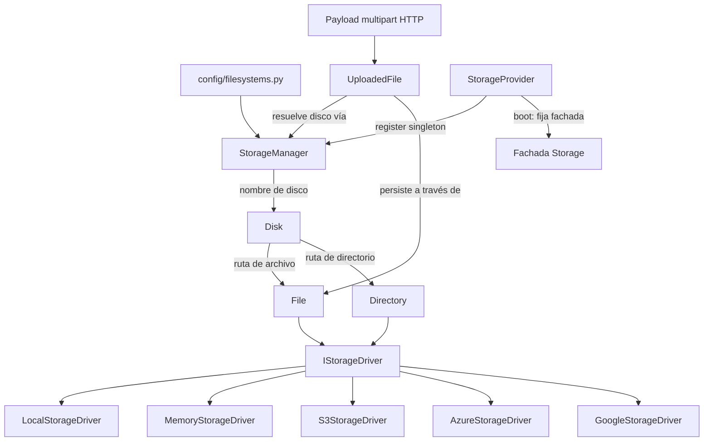

# Orionis Storage (`orionis.storage`)

> Abstracción de sistema de archivos al estilo Laravel, con drivers intercambiables local, en memoria y en la nube (S3, Azure Blob, GCS).
>
> 🇬🇧 English version: [README.md](README.md)

`orionis.storage` ofrece a las aplicaciones una única API, agnóstica del
disco, para leer, escribir, transmitir en streaming y gestionar archivos y
directorios. El código de negocio siempre trabaja con objetos `Disk`,
`File` y `Directory`; el medio real —sistema de archivos local, memoria del
proceso o un almacenamiento de objetos en la nube— se selecciona
únicamente mediante configuración, y toda operación bloqueante es `async`
y se descarga a un hilo trabajador para que el bucle de eventos nunca se
bloquee.

---

## Tabla de contenidos

1. [Requisitos](#requisitos)
2. [Descripción funcional del módulo](#descripción-funcional-del-módulo)
3. [Arquitectura](#arquitectura)
4. [Referencia de API](#referencia-de-api)
   - [`StorageManager`](#storagemanager-orionisstoragemanagerstoragemanager)
   - [`Disk`](#disk-orionisstoragediskdisk)
   - [`File`](#file-orionisstoragefilefile)
   - [`Directory`](#directory-orionisstoragedirectorydirectory)
   - [`UploadedFile`](#uploadedfile-orionisstorageuploaded_fileuploadedfile)
   - [`AsyncStream`](#asyncstream-orionisstoragestreamasyncstream)
   - [`StorageProvider`](#storageprovider-orionisstorageproviderstorageprovider)
   - [Drivers (`IStorageDriver`)](#drivers-istoragedriver)
   - [`FileInfo` / `Visibility`](#fileinfo--visibility)
   - [Normalización de rutas](#normalización-de-rutas)
   - [Excepciones](#excepciones)
5. [Ejemplos de uso](#ejemplos-de-uso)
6. [Consideraciones de rendimiento y concurrencia](#consideraciones-de-rendimiento-y-concurrencia)
7. [Notas de diseño](#notas-de-diseño)
8. [Notas de compatibilidad](#notas-de-compatibilidad)

---

## Requisitos

Los discos local, en memoria y público/privado funcionan sin instalación
adicional:

```bash
pip install orionis
```

Los drivers en la nube requieren su SDK oficial como **dependencia
opcional**, incluida mediante extras definidos en `pyproject.toml`:

```bash
pip install orionis[s3]       # boto3>=1.35            (Amazon S3 / compatibles con S3)
pip install orionis[azure]    # azure-storage-blob>=12.24
pip install orionis[gcs]      # google-cloud-storage>=2.18
pip install orionis[storage]  # los tres SDKs de nube a la vez
```

- **Python:** 3.14 o superior.
- Si falta un SDK de nube, el driver correspondiente lanza
  `MissingStorageDependencyException` **solo cuando se usa por primera
  vez** (la importación es perezosa), con una sugerencia de instalación
  accionable en el mensaje.

## Descripción funcional del módulo

Casi cualquier aplicación necesita almacenar archivos subidos, reportes
generados o artefactos en caché, y normalmente necesita moverse entre disco
local, memoria (pruebas) y almacenamiento en la nube sin reescribir la
lógica de negocio. `orionis.storage` resuelve esto con un modelo de objetos
pequeño y por capas:

- **`StorageManager`** lee la configuración `filesystems`
  (`config/filesystems.py`, respaldada por las entidades
  `orionis.foundation.config.filesystems`), construye objetos `Disk`
  vinculados al driver correcto, y los cachea por nombre.
- **`Disk`** es el punto de entrada que usan las aplicaciones día a día:
  construye objetos `File`/`Directory` para una ruta dada y expone métodos
  de conveniencia (`put`, `exists`, `delete`, `copy`, `move`) que
  simplemente delegan en un `File`.
- **`File`** y **`Directory`** encapsulan una ruta canónica y una
  referencia al driver; toda operación (lectura, escritura, streaming,
  metadatos, reubicación, listado) delega en el driver — estas clases no
  contienen lógica de E/S propia.
- **`UploadedFile`** adapta el payload multipart en buffer producido por la
  capa HTTP (`orionis.http.payload`) para que pueda persistirse en
  cualquier disco configurado (`store`, `storeAs`, `move`, `copy`).
- **`AsyncStream`** envuelve un handle binario abierto de forma perezosa
  para que los drivers puedan exponer `open()` como un gestor de contexto
  asíncrono sin bloquear el bucle de eventos.
- **Los drivers** (`LocalStorageDriver`, `MemoryStorageDriver`,
  `S3StorageDriver`, `AzureStorageDriver`, `GoogleStorageDriver`)
  implementan el contrato de bajo nivel `IStorageDriver` — el único lugar
  que sabe cómo hablar con el medio real. Los drivers no contienen
  **ninguna** lógica de negocio.
- **`StorageProvider`** es el `ServiceProvider` del framework (diferible)
  que registra `IStorageManager` como singleton y fija la fachada `Storage`
  (`orionis.support.facades.storage`, fuera de este módulo) en el arranque.

## Arquitectura



- `StorageManager.disk(name)` resuelve la entidad de configuración
  `Filesystems` para `name`, instancia el driver correspondiente
  (asignación incorporada: `local` → `LocalStorageDriver`, `memory` →
  `MemoryStorageDriver`, `aws`/`s3` → `S3StorageDriver`, `azure` →
  `AzureStorageDriver`, `gcs`/`google` → `GoogleStorageDriver`), lo envuelve
  en un `Disk`, y cachea el resultado. `StorageManager.extend(driver,
  factory)` permite que el código de la aplicación registre una fábrica de
  driver personalizada que tiene prioridad sobre la asignación incorporada.
- Toda ruta aceptada por `File`/`Directory` pasa por
  `orionis/storage/paths.py` (`normalizePath`/`normalizeFilePath`) antes de
  llegar a un driver, de modo que los drivers solo ven rutas canónicas y
  seguras frente a traversal.
- `orionis/storage/drivers/functions.py` contiene helpers compartidos por
  todos los drivers: `importDriverDependency` (importación perezosa de SDK
  opcional), `assertBinaryMode`, `resolveDownloadTarget`, `filterFiles`,
  `deriveDirectories`.
- Cada clase concreta tiene un contrato equivalente en
  `orionis/storage/contracts/` (`IStorageManager`, `IDisk`, `IFile`,
  `IDirectory`, `IUploadedFile`, `IStorageStream`, `IStorageDriver`),
  reexportados desde `contracts/__init__.py`.

## Referencia de API

### `StorageManager` (`orionis.storage.manager.StorageManager`)

```python
class StorageManager(IStorageManager):
    __slots__ = ("_app", "_base_path", "_config", "_custom", "_default", "_disks")
    def __init__(self, app: IApplication) -> None: ...
```

Lee `app.config("filesystems")` en una entidad `Filesystems` durante la
construcción y resuelve `app.basePath` para raíces locales relativas.

| Método | Firma | Descripción |
| --- | --- | --- |
| `disk` | `(name: str \| None = None) -> IDisk` | Resuelve (y cachea) el disco registrado bajo `name`, o el disco por defecto configurado si `name is None`. |
| `default` | `() -> IDisk` | Resuelve el disco configurado como `filesystems.default`. |
| `extend` | `(driver: str, factory: Callable[[object], IStorageDriver]) -> None` | Registra una fábrica de driver personalizada bajo `driver`, con prioridad sobre los drivers incorporados. Vacía la caché de discos para que las futuras resoluciones la usen. |
| `uploaded` | `(source: IHttpUploadedFile) -> IUploadedFile` | Envuelve un payload multipart HTTP (de `orionis.http.payload`) como un `UploadedFile` vinculado a este manager. |

**Lanza:** `DiskNotFoundException` (disco ausente de la configuración),
`DriverNotSupportedException` (nombre de driver desconocido sin fábrica
registrada vía `extend`).

### `Disk` (`orionis.storage.disk.Disk`)

```python
class Disk(IDisk):
    __slots__ = ("_driver", "_name")
    def __init__(self, name: str, driver: IStorageDriver) -> None: ...
```

| Método | Firma | Descripción |
| --- | --- | --- |
| `name` | `() -> str` | Nombre de configuración del disco. |
| `file` | `(path: str) -> IFile` | Construye un `File` vinculado al driver de este disco. |
| `directory` | `(path: str = "") -> IDirectory` | Construye un `Directory` vinculado al driver de este disco (`""` = raíz del disco). |
| `put` | `(path: str, contents: bytes \| str, visibility: str \| None = None) -> IFile` | Conveniencia para `disk.file(path).write(contents, visibility)`. |
| `exists` | `(path: str) -> bool` | Conveniencia para `disk.file(path).exists()`. |
| `delete` | `(path: str) -> bool` | Conveniencia para `disk.file(path).delete()`. |
| `copy` | `(source: str, target: str) -> IFile` | Conveniencia para `disk.file(source).copyTo(target)`. |
| `move` | `(source: str, target: str) -> IFile` | Conveniencia para `disk.file(source).moveTo(target)`. |

Todos los métodos de conveniencia son `async` y simplemente delegan en un
`File` — `Disk` nunca duplica lógica de E/S.

### `File` (`orionis.storage.file.File`)

```python
class File(IFile):
    __slots__ = ("_driver", "_path")
    def __init__(self, driver: IStorageDriver, path: str) -> None: ...
```

La ruta se normaliza vía `normalizeFilePath` en `__init__` (lanza
`StoragePathException` si es inválida o vacía).

**Contenido:**

| Método | Firma | Descripción |
| --- | --- | --- |
| `path` | `() -> str` | Ruta canónica relativa a la raíz. |
| `read` | `() -> bytes` | Contenido completo del archivo. |
| `readStream` | `(chunk_size: int = 65536) -> AsyncIterator[bytes]` | Transmite el archivo en fragmentos (chunks). |
| `write` | `(contents: bytes \| str, visibility: str \| None = None) -> IFile` | Sobrescribe el archivo; las cadenas se codifican en UTF-8. Devuelve `self` para encadenar. |
| `writeStream` | `(stream: AsyncIterable[bytes], visibility: str \| None = None) -> IFile` | Escribe fragmentos desde un iterable asíncrono. Devuelve `self`. |
| `open` | `(mode: str = "rb") -> IStorageStream` | Abre un `AsyncStream` (solo modos binarios: `rb`, `wb`, `ab`, `rb+`, `wb+`, `ab+`). |
| `delete` | `() -> bool` | `True` si el archivo existía y fue eliminado. |
| `exists` | `() -> bool` | `True` si el archivo existe. |

**Reubicación:**

| Método | Firma | Descripción |
| --- | --- | --- |
| `copyTo` | `(target: str) -> IFile` | Copia a `target` en el mismo disco; devuelve un nuevo `File`. |
| `moveTo` | `(target: str) -> IFile` | Mueve a `target`; el objeto original sigue apuntando a la ruta antigua — usa el `File` devuelto. |
| `rename` | `(name: str) -> IFile` | Renombra dentro del directorio actual. Lanza `StoragePathException` si `name` contiene `/` o `\`. |

**Metadatos:**

| Método | Firma | Descripción |
| --- | --- | --- |
| `size` | `() -> int` | Tamaño en bytes. |
| `mimeType` | `() -> str \| None` | Tipo MIME estimado. |
| `lastModified` | `() -> datetime` | Marca de tiempo de última modificación, con zona horaria (UTC). |
| `url` | `() -> str` | URL pública. Lanza `UnsupportedStorageOperationException` si el disco no expone ninguna. |
| `temporaryUrl` | `(expires_in: int = 3600) -> str` | URL firmada y de tiempo limitado. Lanza `UnsupportedStorageOperationException` si no está soportado. |
| `visibility` | `() -> str` | `'public'` o `'private'`. |
| `setVisibility` | `(visibility: str) -> IFile` | Cambia la visibilidad; devuelve `self`. |
| `download` | `(destination: str \| Path) -> Path` | Copia el archivo a una ruta local; si `destination` es un directorio existente, conserva el nombre original del archivo dentro de él. |
| `hash` | `(algorithm: str = "sha256") -> str` | Digest hexadecimal del contenido usando cualquier algoritmo compatible con `hashlib.new`. |
| `info` | `() -> FileInfo` | Instantánea completa de metadatos (ver [`FileInfo`](#fileinfo--visibility)). |

**Lanza en la mayoría de métodos:** `StorageFileNotFoundException` cuando
el archivo objetivo no existe.

### `Directory` (`orionis.storage.directory.Directory`)

```python
class Directory(IDirectory):
    __slots__ = ("_driver", "_path")
    def __init__(self, driver: IStorageDriver, path: str = "") -> None: ...
```

La ruta se normaliza vía `normalizePath` (`""` = raíz del disco, nunca
lanza excepción para la propia raíz).

| Método | Firma | Descripción |
| --- | --- | --- |
| `path` | `() -> str` | Ruta canónica relativa a la raíz (`""` para la raíz del disco). |
| `create` | `() -> IDirectory` | Crea el directorio (y los padres faltantes). Devuelve `self`. |
| `delete` | `() -> bool` | Elimina recursivamente el directorio y su contenido. |
| `exists` | `() -> bool` | `True` si el directorio existe. |
| `files` | `() -> list[IFile]` | Archivos hijos directos, ordenados por ruta. |
| `allFiles` | `() -> list[IFile]` | Todos los archivos del árbol de directorios, ordenados por ruta. |
| `directories` | `() -> list[IDirectory]` | Directorios hijos directos, ordenados por ruta. |
| `allDirectories` | `() -> list[IDirectory]` | Todos los directorios del árbol, ordenados por ruta. |

Los métodos de listado siempre devuelven objetos `File`/`Directory`, nunca
cadenas de ruta planas.

### `UploadedFile` (`orionis.storage.uploaded_file.UploadedFile`)

```python
class UploadedFile(IUploadedFile):
    __slots__ = ("_hash_name", "_manager", "_source")
    def __init__(self, source: IHttpUploadedFile, manager: IStorageManager) -> None: ...
```

Adapta un payload multipart HTTP (`orionis.http.payload`) para que pueda
persistirse en cualquier disco resuelto a través de `manager`.

**Metadatos del payload:**

| Método | Retorna | Descripción |
| --- | --- | --- |
| `originalName()` | `str` | Nombre de archivo sanitizado suministrado por el cliente. |
| `extension()` | `str` | Extensión en minúsculas incluyendo el punto, o `""`. |
| `size()` | `int` | Tamaño del payload en bytes. |
| `mimeType()` | `str \| None` | Tipo MIME declarado por el cliente. |
| `hashName()` | `str` | Nombre aleatorio y seguro frente a colisiones (`secrets.token_hex(20)` + extensión); se genera una vez y se cachea por instancia. |

**Acceso al contenido:**

| Método | Firma | Descripción |
| --- | --- | --- |
| `read` | `() -> bytes` | Lee el payload completo (vía un hilo trabajador; el payload puede estar en buffer en disco). |

**Persistencia:**

| Método | Firma | Descripción |
| --- | --- | --- |
| `store` | `(directory: str = "", disk: str \| None = None, visibility: str \| None = None) -> IFile` | Persiste bajo un `hashName()` generado. |
| `storeAs` | `(directory: str, name: str, disk: str \| None = None, visibility: str \| None = None) -> IFile` | Persiste bajo un `name` explícito (un único segmento de ruta; lanza `StoragePathException` si contiene un separador). |
| `move` | `(directory: str, name: str \| None = None, disk: str \| None = None) -> IFile` | Persiste el payload y **cierra el buffer de subida** a continuación (uso único). |
| `copy` | `(directory: str, name: str \| None = None, disk: str \| None = None) -> IFile` | Persiste el payload **manteniendo utilizable el buffer de subida** para llamadas posteriores. |

### `AsyncStream` (`orionis.storage.stream.AsyncStream`)

```python
class AsyncStream(IStorageStream):
    __slots__ = ("_handle", "_on_close", "_opener")
    def __init__(
        self, opener: Callable[[], BinaryIO],
        on_close: Callable[[BinaryIO], None] | None = None,
    ) -> None: ...
```

Envuelve un handle binario abierto de forma perezosa para que el `open()`
de cada driver devuelva un objeto utilizable como gestor de contexto
`async with`. Lo construyen los drivers; normalmente no se instancia
directamente desde el código de la aplicación.

| Método | Firma | Descripción |
| --- | --- | --- |
| `read` | `(size: int = -1) -> bytes` | Lee hasta `size` bytes (`-1` = hasta EOF). |
| `write` | `(data: bytes) -> int` | Escribe `data`; devuelve los bytes escritos. |
| `seek` | `(offset: int, whence: int = 0) -> int` | Mueve la posición; `whence`: `0` inicio, `1` actual, `2` fin. |
| `close` | `() -> None` | Ejecuta el callback `on_close` del driver (si existe) y luego cierra el handle. Idempotente — cerrar dos veces no hace nada. |
| `__aenter__` / `__aexit__` | — | Abre el handle al entrar; siempre lo cierra al salir. |

El handle se abre de forma perezosa (en el primer `read`/`write`/`seek`/
`__aenter__`), y toda llamada bloqueante se ejecuta vía
`asyncio.to_thread`.

### `StorageProvider` (`orionis.storage.provider.StorageProvider`)

```python
class StorageProvider(ServiceProvider, DeferrableProvider):
    @classmethod
    def provides(cls) -> list[type]: ...
    def register(self) -> None: ...
    async def boot(self) -> None: ...
```

| Método | Descripción |
| --- | --- |
| `provides()` | Devuelve `[IStorageManager]` — declara el servicio diferido para el contenedor. |
| `register()` | Vincula `IStorageManager` → `StorageManager` como singleton. |
| `boot()` | `await StorageFacade.pin()` — fija la fachada `Storage` para un acceso directo a atributos sin DI. |

### Drivers (`IStorageDriver`)

Todos los drivers implementan
`orionis.storage.contracts.driver.IStorageDriver` (`read`, `readStream`,
`write`, `writeStream`, `delete`, `exists`, `copy`, `move`, `size`,
`mimeType`, `lastModified`, `createDirectory`, `deleteDirectory`,
`directoryExists`, `files`, `directories`, `url`, `temporaryUrl`,
`visibility`, `setVisibility`, `download`, `hash`, `info`, `open`). Los
drivers no contienen **ninguna** lógica de negocio — el código de la
aplicación nunca los llama directamente; siempre pasa por
`Disk`/`File`/`Directory`.

| Driver | Medio de respaldo | Constructor | Notas |
| --- | --- | --- | --- |
| `LocalStorageDriver` | Sistema de archivos local | `(root: Path, base_url: str \| None = None)` | Toda ruta se resuelve dentro de `root` (se crea si no existe); la visibilidad se mapea a bits de permisos POSIX (`0o644`/`0o600` para archivos, `0o755`/`0o700` para directorios); toda E/S bloqueante vía `asyncio.to_thread`. |
| `MemoryStorageDriver` | Memoria del proceso (`dict`) | `(base_url: str \| None = None)` | Implementa el contrato completo sobre diccionarios simples (`_files`, `_directories`); pensado para pruebas/fakes y cargas efímeras; el contenido se pierde al finalizar el proceso. |
| `S3StorageDriver` | Amazon S3 / compatibles con S3 | `(config: object)` | Requiere `boto3` (`pip install orionis[s3]`); importado de forma perezosa en el primer uso; ACLs predefinidas (`public-read`/`private`) aplicadas según `Visibility`; los directorios son virtuales (prefijos inferidos + marcadores `path/` de 0 bytes). |
| `AzureStorageDriver` | Azure Blob Storage | `(config: object)` | Requiere `azure-storage-blob` (`pip install orionis[azure]`); sin visibilidad por blob — `visibility()` refleja el nivel de acceso del contenedor y `setVisibility()` no está soportado. |
| `GoogleStorageDriver` | Google Cloud Storage | `(config: object)` | Requiere `google-cloud-storage` (`pip install orionis[gcs]`); ACLs predefinidas (`publicRead`/`private`); se autentica mediante la clave de cuenta de servicio configurada o Application Default Credentials. |

Nombres de `driver` incorporados reconocidos por `StorageManager` (desde
`config/filesystems.py`): `local`, `memory`, `aws`/`s3`, `azure`,
`gcs`/`google`. Cualquier otro nombre requiere
`StorageManager.extend(...)`.

Helpers compartidos (`orionis.storage.drivers.functions`) usados por los
drivers de nube: `importDriverDependency` (importación perezosa de SDK
opcional con un error accionable), `assertBinaryMode`,
`resolveDownloadTarget`, `filterFiles`, `deriveDirectories`.

### `FileInfo` / `Visibility`

**`FileInfo`** (`orionis.storage.entities.file_info.FileInfo`) —
`@dataclass(frozen=True, kw_only=True, slots=True)`, devuelto por
`File.info()`:

| Campo | Tipo | Descripción |
| --- | --- | --- |
| `path` | `str` | Ruta canónica relativa a la raíz. |
| `size` | `int` | Tamaño en bytes. |
| `lastModified` | `datetime` | Marca de tiempo de última modificación, con zona horaria. |
| `visibility` | `str` | `'public'` o `'private'`. |
| `mimeType` | `str \| None` | Tipo MIME estimado, por defecto `None`. |
| `createdAt` | `datetime \| None` | Marca de tiempo de creación cuando el driver puede proporcionarla, por defecto `None`. |
| `etag` | `str \| None` | Entity tag (digest MD5 hexadecimal en drivers incorporados), por defecto `None`. |
| `checksum` | `str \| None` | Digest SHA-256 hexadecimal, por defecto `None`. |
| `url` | `str \| None` | URL pública cuando el disco expone una, por defecto `None`. |

**`Visibility`** (`orionis.storage.enums.visibility.Visibility`) —
`StrEnum` con miembros `PUBLIC = "public"` y `PRIVATE = "private"`; los
miembros son cadenas simples y se aceptan en cualquier lugar donde se
espere una cadena de visibilidad.

### Normalización de rutas

`orionis.storage.paths` provee las dos funciones en las que se apoya cada
constructor de `File`/`Directory`:

| Función | Firma | Descripción |
| --- | --- | --- |
| `normalizePath` | `(path: str) -> str` | Convierte `\` en `/`, elimina segmentos vacíos/`.`, resuelve `..` lógicamente, y rechaza null bytes, caracteres `:` y secuencias `..` que escapen de la raíz. Devuelve `""` para la raíz del disco. |
| `normalizeFilePath` | `(path: str) -> str` | `normalizePath` más un rechazo del resultado vacío (una ruta de archivo nunca puede ser la raíz del disco). |

Ambas lanzan `StoragePathException` ante una entrada inválida.

### Excepciones

Todas definidas en `orionis.storage.exceptions`, y heredan de
`StorageException(Exception)`:

| Excepción | Se lanza cuando |
| --- | --- |
| `StorageException` | Clase base de todo error de almacenamiento. |
| `DiskNotFoundException` | Un nombre de disco no está declarado en la configuración `filesystems`. |
| `DriverNotSupportedException` | Un disco referencia un nombre de driver sin implementación incorporada ni fábrica registrada vía `extend()`. |
| `MissingStorageDependencyException` | El SDK opcional de un driver de nube no está instalado. |
| `StoragePathException` | Una ruta está mal formada, escapa de la raíz del disco, o no es válida para la operación solicitada. |
| `StorageFileNotFoundException` | Un archivo no existe en el disco objetivo. |
| `UnsupportedStorageOperationException` | Un driver no puede realizar la operación solicitada (p. ej. un modo de stream inválido, o `setVisibility` en Azure). |

## Ejemplos de uso

### Resolver discos y operaciones básicas con archivos

```python
from orionis.storage.manager import StorageManager

manager: StorageManager = ...  # normalmente resuelto vía el contenedor de DI

disk = manager.disk("public")  # o manager.default()

file = await disk.put("reports/2026-07.csv", "id,name\n1,Ada\n")
await file.exists()          # True
await file.size()            # bytes escritos
await file.url()             # URL pública (lanza si el disco no tiene ninguna)

await disk.copy("reports/2026-07.csv", "reports/2026-07-copy.csv")
await disk.delete("reports/2026-07-copy.csv")
```

### Trabajar directamente con un objeto `File`

```python
disk_file = disk.file("images/logo.png")

await disk_file.write(b"\x89PNG...", visibility="public")
info = await disk_file.info()
info.size, info.mimeType, info.visibility

digest = await disk_file.hash("sha256")
await disk_file.rename("brand-logo.png")
local_path = await disk_file.download("/tmp/downloads")
```

### Streaming de archivos grandes

```python
async for chunk in disk.file("videos/demo.mp4").readStream(chunk_size=1 << 20):
    process(chunk)

async def produce_chunks():
    yield b"primer fragmento..."
    yield b"segundo fragmento..."

await disk.file("uploads/large.bin").writeStream(produce_chunks())
```

### Usar `open()` como gestor de contexto asíncrono

```python
async with disk.file("logs/app.log").open("ab") as stream:
    await stream.write(b"nueva línea de log\n")
```

### Listar un árbol de directorios

```python
directory = disk.directory("reports")
for f in await directory.allFiles():
    print(f.path(), await f.size())

for d in await directory.directories():
    print(d.path())
```

### Almacenar una subida HTTP

```python
# Dentro de un controlador HTTP, `request.file("avatar")` devuelve un
# IHttpUploadedFile de orionis.http.payload.
uploaded = manager.uploaded(request.file("avatar"))

stored = await uploaded.store("avatars", disk="public", visibility="public")
stored.path()  # p. ej. "avatars/9f1c...a3.png"

# O con un nombre explícito, liberando el buffer de subida a continuación:
stored = await uploaded.move("avatars", name="user-42.png")
```

### Registrar un driver personalizado

```python
def my_driver_factory(disk_config: object):
    return MyCustomStorageDriver(disk_config)

manager.extend("my-driver", my_driver_factory)
# config/filesystems.py: Disks(custom=SomeConfig(driver="my-driver"))
custom_disk = manager.disk("custom")
```

## Consideraciones de rendimiento y concurrencia

- **E/S bloqueante descargada a hilos**: `LocalStorageDriver`,
  `MemoryStorageDriver`, `S3StorageDriver`, `AzureStorageDriver` y
  `GoogleStorageDriver` ejecutan todas sus llamadas bloqueantes (syscalls
  de sistema de archivos, llamadas HTTP del SDK) vía `asyncio.to_thread`,
  de modo que una operación lenta no bloquea el bucle de eventos para
  atender otras corrutinas.
- **Importación perezosa de SDKs de nube**: `boto3`/`azure-storage-blob`/
  `google-cloud-storage` se importan solo en el primer uso del driver
  correspondiente (`importDriverDependency`), y el propio cliente se
  inicializa en la primera operación — construir una instancia de
  `S3StorageDriver`/`AzureStorageDriver`/`GoogleStorageDriver` es barato y
  no requiere tener el SDK instalado salvo que realmente llames a un
  método.
- **Las instancias de disco se cachean por manager**:
  `StorageManager.disk(name)` construye un `Disk` (y su driver) una sola
  vez y lo reutiliza en llamadas posteriores con el mismo nombre; llamar a
  `extend()` vacía esta caché para que las fábricas recién registradas se
  apliquen en la próxima resolución.
- **`MemoryStorageDriver` es local al proceso y no persiste**: el
  contenido vive solo en los diccionarios de esa instancia de driver; no
  se comparte entre procesos/workers y desaparece al finalizar el proceso
  — pensado para pruebas y casos de uso efímeros, no para despliegues
  multi-worker.
- **El streaming evita cargar archivos completos en memoria**:
  `readStream`/`writeStream`/`open()` permiten procesar archivos fragmento
  a fragmento (64 KiB por defecto), lo cual importa para subidas/descargas
  grandes; los drivers de nube usan un buffer con volcado a disco
  (`_SPOOL_THRESHOLD` = 8 MiB en memoria antes de volcar a un archivo
  temporal) para escrituras en streaming.
- **Los directorios en drivers de nube son virtuales**: S3/Azure/GCS no
  tienen un concepto real de directorio — los listados se derivan de
  prefijos de clave de objeto, y los directorios "explícitos" son objetos
  marcador de 0 bytes con `path/`; esto afecta el costo de
  `Directory.files()`/`allFiles()` (una llamada de listado a la API)
  frente a un recorrido de sistema de archivos local.
- **Sin caché en proceso de contenido o metadatos de archivos**: cada
  llamada a un método de `File` llega directamente al driver (y, en
  drivers de nube, a la red) — llamar repetidamente a
  `size()`/`exists()`/`read()` sobre la misma ruta repite la operación cada
  vez.
- **Los handles de `AsyncStream` se abren una vez y se reutilizan**: la
  primera llamada a `read`/`write`/`seek`/`__aenter__` abre el handle
  subyacente; permanece abierto hasta `close()`/`__aexit__`, evitando la
  sobrecarga repetida de abrir/cerrar dentro del ciclo de vida de un mismo
  stream.

## Notas de diseño

- **Capas estrictas, sin duplicación de lógica**: `Disk`/`File`/`Directory`
  solo mantienen una referencia al driver y una ruta canónica — toda
  operación real se delega en el driver, y los métodos de conveniencia de
  `Disk` (`put`, `exists`, `delete`, `copy`, `move`) están a su vez
  implementados delegando en `File`, de modo que el comportamiento se
  define en un único lugar.
- **`__slots__` en todas las clases concretas** (`StorageManager`, `Disk`,
  `File`, `Directory`, `UploadedFile`, `AsyncStream`, y cada driver)
  elimina la sobrecarga de `__dict__` por instancia — es una decisión de
  diseño existente.
- **Contratos para cada colaborador**: cada clase concreta implementa un
  contrato `ABC` equivalente en `orionis/storage/contracts/`
  (`IStorageManager`, `IDisk`, `IFile`, `IDirectory`, `IUploadedFile`,
  `IStorageStream`, `IStorageDriver`), de modo que la superficie pública se
  define independientemente de cualquier implementación de driver
  específica.
- **Frontera de payload HTTP duck-typed**: `UploadedFile` solo importa
  `IHttpUploadedFile` bajo `TYPE_CHECKING` — en tiempo de ejecución
  funciona con cualquier objeto que exponga los atributos esperados
  (`filename`, `extension`, `size`, `content_type`, `read`, `chunks`,
  `close`), manteniendo `orionis.storage` desacoplado de la implementación
  concreta de la capa HTTP.
- **Seguridad de rutas centralizada en un único módulo**:
  `orionis/storage/paths.py` es el único lugar que rechaza traversal
  (`..` escapando de la raíz), null bytes y caracteres `:`, de modo que
  cada driver puede asumir que solo recibirá una ruta canónica y segura.
- **Los clientes de nube se inicializan en el primer uso, no en la
  construcción**: el `__init__` de cada driver de nube solo almacena
  valores de configuración (credenciales, nombres de bucket/contenedor) —
  el objeto cliente del SDK real se crea de forma perezosa la primera vez
  que una operación lo necesita, lo que mantiene el constructor puro y
  testeable sin tener el SDK instalado.
- **Directorios virtuales en almacenamiento de objetos**: los drivers de
  S3/Azure/GCS representan directorios como objetos de 0 bytes con una `/`
  final en su clave/nombre, y derivan los listados (`deriveDirectories`,
  `filterFiles` en `drivers/functions.py`) a partir de prefijos de clave en
  lugar de un árbol de directorios real — así es como funcionan las APIs
  de almacenamiento de objetos, no es un workaround a cambiar.
- **La visibilidad se mapea a la primitiva nativa más cercana por
  backend**: bits de permisos POSIX localmente, ACLs predefinidas en
  S3/GCS, y nivel de acceso del contenedor en Azure (donde la visibilidad
  por blob simplemente no está soportada).

## Notas de compatibilidad

- **Versión mínima de Python:** 3.14 (según `pyproject.toml`,
  `requires-python = ">=3.14"`), igual que el resto del framework.
- **Dependencia central:** ninguna más allá de la biblioteca estándar de
  Python (`asyncio`, `hashlib`, `mimetypes`, `pathlib`, `shutil`,
  `tempfile`) para `LocalStorageDriver`/`MemoryStorageDriver`.
- **Dependencias opcionales** (solo requeridas para el driver de nube
  correspondiente, instaladas mediante extras de `pyproject.toml`):
  - `boto3>=1.35` — `pip install orionis[s3]`
  - `azure-storage-blob>=12.24` — `pip install orionis[azure]`
  - `google-cloud-storage>=2.18` — `pip install orionis[gcs]`
  - `pip install orionis[storage]` instala los tres a la vez.
- **Dependencias internas del framework:** `StorageManager` depende de
  `orionis.foundation.contracts.application.IApplication` y de las
  entidades de configuración `Filesystems`/`Disks`
  (`orionis.foundation.config.filesystems`); `StorageProvider` depende de
  `orionis.container.providers` y `orionis.support.facades.storage`;
  `UploadedFile` depende de
  `orionis.http.payload.contracts.uploaded_file` únicamente para el
  chequeo de tipos.
- Las rutas locales se manejan con `pathlib.Path`, que se comporta
  correctamente en Windows, Linux y macOS; los bits de permisos POSIX
  aplicados por `LocalStorageDriver` degradan de forma controlada (mejor
  esfuerzo) en plataformas sin una implementación completa de modos POSIX.
