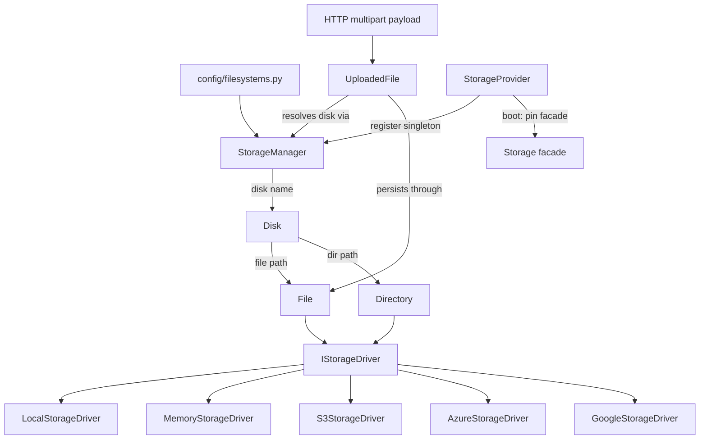

# Orionis Storage (`orionis.storage`)

> Laravel-style filesystem abstraction with pluggable local, in-memory, and cloud (S3, Azure Blob, GCS) drivers.
>
> 🇪🇸 Versión en español: [README.es.md](README.es.md)

`orionis.storage` gives applications a single, disk-agnostic API for
reading, writing, streaming, and managing files and directories. Business
code always talks to `Disk`, `File`, and `Directory` objects; the actual
medium — local filesystem, in-process memory, or a cloud object store — is
selected purely through configuration, and every blocking operation is
`async` and thread-offloaded so the event loop never stalls.

---

## Table of contents

1. [Requirements](#requirements)
2. [Module overview](#module-overview)
3. [Architecture](#architecture)
4. [API reference](#api-reference)
   - [`StorageManager`](#storagemanager-orionisstoragemanagerstoragemanager)
   - [`Disk`](#disk-orionisstoragediskdisk)
   - [`File`](#file-orionisstoragefilefile)
   - [`Directory`](#directory-orionisstoragedirectorydirectory)
   - [`UploadedFile`](#uploadedfile-orionisstorageuploaded_fileuploadedfile)
   - [`AsyncStream`](#asyncstream-orionisstoragestreamasyncstream)
   - [`StorageProvider`](#storageprovider-orionisstorageproviderstorageprovider)
   - [Drivers (`IStorageDriver`)](#drivers-istoragedriver)
   - [`FileInfo` / `Visibility`](#fileinfo--visibility)
   - [Path normalization](#path-normalization)
   - [Exceptions](#exceptions)
5. [Usage examples](#usage-examples)
6. [Performance and concurrency considerations](#performance-and-concurrency-considerations)
7. [Design notes](#design-notes)
8. [Compatibility notes](#compatibility-notes)

---

## Requirements

Local, in-memory, and public/private disks work with no extra
installation:

```bash
pip install orionis
```

Cloud drivers require their official SDK as an **optional dependency**,
pulled in through extras defined in `pyproject.toml`:

```bash
pip install orionis[s3]       # boto3>=1.35            (Amazon S3 / S3-compatible)
pip install orionis[azure]    # azure-storage-blob>=12.24
pip install orionis[gcs]      # google-cloud-storage>=2.18
pip install orionis[storage]  # all three cloud SDKs at once
```

- **Python:** 3.14 or newer.
- If a cloud SDK is missing, the corresponding driver raises
  `MissingStorageDependencyException` **only when first used** (the import
  is lazy), with an actionable install hint in the message.

## Module overview

Almost every application needs to store uploaded files, generated reports,
or cached artifacts, and typically needs to move between local disk,
in-memory (tests), and cloud storage without rewriting business logic.
`orionis.storage` solves this with a small, layered object model:

- **`StorageManager`** reads the `filesystems` configuration
  (`config/filesystems.py`, backed by `orionis.foundation.config.filesystems`
  entities), builds `Disk` objects bound to the right driver, and caches
  them by name.
- **`Disk`** is the entry point applications use day to day: it builds
  `File`/`Directory` objects for a given path and exposes convenience
  methods (`put`, `exists`, `delete`, `copy`, `move`) that simply delegate
  to a `File`.
- **`File`** and **`Directory`** encapsulate a canonical path and a driver
  reference; every operation (read, write, stream, metadata, relocation,
  listing) delegates to the driver — these classes hold no I/O logic of
  their own.
- **`UploadedFile`** adapts the buffered multipart payload produced by the
  HTTP layer (`orionis.http.payload`) into something that can be persisted
  onto any configured disk (`store`, `storeAs`, `move`, `copy`).
- **`AsyncStream`** wraps a lazily opened binary handle so drivers can
  expose `open()` as an async context manager without blocking the event
  loop.
- **Drivers** (`LocalStorageDriver`, `MemoryStorageDriver`,
  `S3StorageDriver`, `AzureStorageDriver`, `GoogleStorageDriver`) implement
  the low-level `IStorageDriver` contract — the only place that knows how
  to talk to the actual medium. Drivers contain **no business logic**.
- **`StorageProvider`** is the framework `ServiceProvider` (deferrable)
  that registers `IStorageManager` as a singleton and pins the `Storage`
  facade (`orionis.support.facades.storage`, outside this module) at boot.

## Architecture



- `StorageManager.disk(name)` resolves the `Filesystems` configuration
  entity for `name`, instantiates the matching driver (built-in mapping:
  `local` → `LocalStorageDriver`, `memory` → `MemoryStorageDriver`,
  `aws`/`s3` → `S3StorageDriver`, `azure` → `AzureStorageDriver`,
  `gcs`/`google` → `GoogleStorageDriver`), wraps it in a `Disk`, and caches
  the result. `StorageManager.extend(driver, factory)` lets application
  code register a custom driver factory that takes precedence over the
  built-in mapping.
- Every path accepted by `File`/`Directory` is passed through
  `orionis/storage/paths.py` (`normalizePath`/`normalizeFilePath`) before
  reaching a driver, so drivers only ever see canonical, traversal-safe
  paths.
- `orionis/storage/drivers/functions.py` holds helpers shared by every
  driver: `importDriverDependency` (lazy optional-SDK import),
  `assertBinaryMode`, `resolveDownloadTarget`, `filterFiles`,
  `deriveDirectories`.
- Every concrete class has a matching contract in
  `orionis/storage/contracts/` (`IStorageManager`, `IDisk`, `IFile`,
  `IDirectory`, `IUploadedFile`, `IStorageStream`, `IStorageDriver`),
  re-exported from `contracts/__init__.py`.

## API reference

### `StorageManager` (`orionis.storage.manager.StorageManager`)

```python
class StorageManager(IStorageManager):
    __slots__ = ("_app", "_base_path", "_config", "_custom", "_default", "_disks")
    def __init__(self, app: IApplication) -> None: ...
```

Reads `app.config("filesystems")` into a `Filesystems` entity on
construction and resolves `app.basePath` for relative local roots.

| Method | Signature | Description |
| --- | --- | --- |
| `disk` | `(name: str \| None = None) -> IDisk` | Resolves (and caches) the disk registered under `name`, or the configured default disk when `name is None`. |
| `default` | `() -> IDisk` | Resolves the disk configured as `filesystems.default`. |
| `extend` | `(driver: str, factory: Callable[[object], IStorageDriver]) -> None` | Registers a custom driver factory under `driver`, taking precedence over built-in drivers. Clears the disk cache so future resolutions pick it up. |
| `uploaded` | `(source: IHttpUploadedFile) -> IUploadedFile` | Wraps an HTTP multipart payload (from `orionis.http.payload`) as an `UploadedFile` bound to this manager. |

**Raises:** `DiskNotFoundException` (disk absent from configuration),
`DriverNotSupportedException` (unknown driver name with no factory
registered via `extend`).

### `Disk` (`orionis.storage.disk.Disk`)

```python
class Disk(IDisk):
    __slots__ = ("_driver", "_name")
    def __init__(self, name: str, driver: IStorageDriver) -> None: ...
```

| Method | Signature | Description |
| --- | --- | --- |
| `name` | `() -> str` | Configuration name of the disk. |
| `file` | `(path: str) -> IFile` | Builds a `File` bound to this disk's driver. |
| `directory` | `(path: str = "") -> IDirectory` | Builds a `Directory` bound to this disk's driver (`""` = disk root). |
| `put` | `(path: str, contents: bytes \| str, visibility: str \| None = None) -> IFile` | Convenience for `disk.file(path).write(contents, visibility)`. |
| `exists` | `(path: str) -> bool` | Convenience for `disk.file(path).exists()`. |
| `delete` | `(path: str) -> bool` | Convenience for `disk.file(path).delete()`. |
| `copy` | `(source: str, target: str) -> IFile` | Convenience for `disk.file(source).copyTo(target)`. |
| `move` | `(source: str, target: str) -> IFile` | Convenience for `disk.file(source).moveTo(target)`. |

All convenience methods are `async` and simply delegate to a `File` —
`Disk` never duplicates I/O logic.

### `File` (`orionis.storage.file.File`)

```python
class File(IFile):
    __slots__ = ("_driver", "_path")
    def __init__(self, driver: IStorageDriver, path: str) -> None: ...
```

Path is normalized via `normalizeFilePath` in `__init__` (raises
`StoragePathException` if invalid or empty).

**Content:**

| Method | Signature | Description |
| --- | --- | --- |
| `path` | `() -> str` | Canonical root-relative path. |
| `read` | `() -> bytes` | Full file contents. |
| `readStream` | `(chunk_size: int = 65536) -> AsyncIterator[bytes]` | Streams the file in chunks. |
| `write` | `(contents: bytes \| str, visibility: str \| None = None) -> IFile` | Overwrites the file; strings are UTF-8 encoded. Returns `self` for chaining. |
| `writeStream` | `(stream: AsyncIterable[bytes], visibility: str \| None = None) -> IFile` | Writes chunks from an async iterable. Returns `self`. |
| `open` | `(mode: str = "rb") -> IStorageStream` | Opens an `AsyncStream` (binary modes only: `rb`, `wb`, `ab`, `rb+`, `wb+`, `ab+`). |
| `delete` | `() -> bool` | `True` if the file existed and was removed. |
| `exists` | `() -> bool` | `True` if the file exists. |

**Relocation:**

| Method | Signature | Description |
| --- | --- | --- |
| `copyTo` | `(target: str) -> IFile` | Copies to `target` on the same disk; returns a new `File`. |
| `moveTo` | `(target: str) -> IFile` | Moves to `target`; the original object still points at the old path — use the returned `File`. |
| `rename` | `(name: str) -> IFile` | Renames within the current directory. Raises `StoragePathException` if `name` contains `/` or `\`. |

**Metadata:**

| Method | Signature | Description |
| --- | --- | --- |
| `size` | `() -> int` | Size in bytes. |
| `mimeType` | `() -> str \| None` | Guessed MIME type. |
| `lastModified` | `() -> datetime` | Timezone-aware (UTC) modification timestamp. |
| `url` | `() -> str` | Public URL. Raises `UnsupportedStorageOperationException` if the disk exposes none. |
| `temporaryUrl` | `(expires_in: int = 3600) -> str` | Signed, time-limited URL. Raises `UnsupportedStorageOperationException` if unsupported. |
| `visibility` | `() -> str` | `'public'` or `'private'`. |
| `setVisibility` | `(visibility: str) -> IFile` | Changes visibility; returns `self`. |
| `download` | `(destination: str \| Path) -> Path` | Copies the file to a local path; if `destination` is an existing directory, keeps the original file name inside it. |
| `hash` | `(algorithm: str = "sha256") -> str` | Hex digest of the content using any `hashlib.new`-compatible algorithm. |
| `info` | `() -> FileInfo` | Full metadata snapshot (see [`FileInfo`](#fileinfo--visibility)). |

**Raises across most methods:** `StorageFileNotFoundException` when the
target file does not exist.

### `Directory` (`orionis.storage.directory.Directory`)

```python
class Directory(IDirectory):
    __slots__ = ("_driver", "_path")
    def __init__(self, driver: IStorageDriver, path: str = "") -> None: ...
```

Path is normalized via `normalizePath` (`""` = disk root, never raises for
the root itself).

| Method | Signature | Description |
| --- | --- | --- |
| `path` | `() -> str` | Canonical root-relative path (`""` for the disk root). |
| `create` | `() -> IDirectory` | Creates the directory (and missing parents). Returns `self`. |
| `delete` | `() -> bool` | Recursively deletes the directory and its contents. |
| `exists` | `() -> bool` | `True` if the directory exists. |
| `files` | `() -> list[IFile]` | Direct child files, sorted by path. |
| `allFiles` | `() -> list[IFile]` | Every file in the directory tree, sorted by path. |
| `directories` | `() -> list[IDirectory]` | Direct child directories, sorted by path. |
| `allDirectories` | `() -> list[IDirectory]` | Every directory in the tree, sorted by path. |

Listing methods always return `File`/`Directory` objects, never plain path
strings.

### `UploadedFile` (`orionis.storage.uploaded_file.UploadedFile`)

```python
class UploadedFile(IUploadedFile):
    __slots__ = ("_hash_name", "_manager", "_source")
    def __init__(self, source: IHttpUploadedFile, manager: IStorageManager) -> None: ...
```

Adapts an HTTP multipart payload (`orionis.http.payload`) so it can be
persisted onto any disk resolved through `manager`.

**Payload metadata:**

| Method | Returns | Description |
| --- | --- | --- |
| `originalName()` | `str` | Sanitized client-supplied file name. |
| `extension()` | `str` | Lowercase extension including the dot, or `""`. |
| `size()` | `int` | Payload size in bytes. |
| `mimeType()` | `str \| None` | Client-declared MIME type. |
| `hashName()` | `str` | Random, collision-safe name (`secrets.token_hex(20)` + extension); generated once and cached per instance. |

**Content access:**

| Method | Signature | Description |
| --- | --- | --- |
| `read` | `() -> bytes` | Reads the full payload (via a worker thread; the payload may be spooled to disk). |

**Persistence:**

| Method | Signature | Description |
| --- | --- | --- |
| `store` | `(directory: str = "", disk: str \| None = None, visibility: str \| None = None) -> IFile` | Persists under a generated `hashName()`. |
| `storeAs` | `(directory: str, name: str, disk: str \| None = None, visibility: str \| None = None) -> IFile` | Persists under an explicit `name` (single path segment; raises `StoragePathException` if it contains a separator). |
| `move` | `(directory: str, name: str \| None = None, disk: str \| None = None) -> IFile` | Persists the payload and **closes the upload buffer** afterwards (single use). |
| `copy` | `(directory: str, name: str \| None = None, disk: str \| None = None) -> IFile` | Persists the payload while **keeping the upload buffer usable** for further calls. |

### `AsyncStream` (`orionis.storage.stream.AsyncStream`)

```python
class AsyncStream(IStorageStream):
    __slots__ = ("_handle", "_on_close", "_opener")
    def __init__(
        self, opener: Callable[[], BinaryIO],
        on_close: Callable[[BinaryIO], None] | None = None,
    ) -> None: ...
```

Wraps a lazily opened binary handle so every driver's `open()` returns an
object usable as an `async with` context manager. Constructed by drivers,
not typically instantiated directly by application code.

| Method | Signature | Description |
| --- | --- | --- |
| `read` | `(size: int = -1) -> bytes` | Reads up to `size` bytes (`-1` = until EOF). |
| `write` | `(data: bytes) -> int` | Writes `data`; returns bytes written. |
| `seek` | `(offset: int, whence: int = 0) -> int` | Moves the position; `whence`: `0` start, `1` current, `2` end. |
| `close` | `() -> None` | Runs the driver's `on_close` callback (if any) then closes the handle. Idempotent — closing twice is a no-op. |
| `__aenter__` / `__aexit__` | — | Opens the handle on enter; always closes it on exit. |

The handle is opened lazily (on first `read`/`write`/`seek`/`__aenter__`),
and every blocking call runs via `asyncio.to_thread`.

### `StorageProvider` (`orionis.storage.provider.StorageProvider`)

```python
class StorageProvider(ServiceProvider, DeferrableProvider):
    @classmethod
    def provides(cls) -> list[type]: ...
    def register(self) -> None: ...
    async def boot(self) -> None: ...
```

| Method | Description |
| --- | --- |
| `provides()` | Returns `[IStorageManager]` — declares the deferred service for the container. |
| `register()` | Binds `IStorageManager` → `StorageManager` as a singleton. |
| `boot()` | `await StorageFacade.pin()` — pins the `Storage` facade for direct, DI-free attribute access. |

### Drivers (`IStorageDriver`)

All drivers implement `orionis.storage.contracts.driver.IStorageDriver`
(`read`, `readStream`, `write`, `writeStream`, `delete`, `exists`, `copy`,
`move`, `size`, `mimeType`, `lastModified`, `createDirectory`,
`deleteDirectory`, `directoryExists`, `files`, `directories`, `url`,
`temporaryUrl`, `visibility`, `setVisibility`, `download`, `hash`, `info`,
`open`). Drivers contain **no business logic** — application code never
calls them directly; it always goes through `Disk`/`File`/`Directory`.

| Driver | Backing medium | Constructor | Notes |
| --- | --- | --- | --- |
| `LocalStorageDriver` | Local filesystem | `(root: Path, base_url: str \| None = None)` | Every path resolved inside `root` (created if missing); visibility maps to POSIX permission bits (`0o644`/`0o600` for files, `0o755`/`0o700` for directories); all blocking I/O via `asyncio.to_thread`. |
| `MemoryStorageDriver` | Process memory (`dict`) | `(base_url: str \| None = None)` | Implements the full contract over plain dictionaries (`_files`, `_directories`); intended for tests/fakes and ephemeral workloads; content lost on process exit. |
| `S3StorageDriver` | Amazon S3 / S3-compatible | `(config: object)` | Requires `boto3` (`pip install orionis[s3]`); lazily imported on first use; canned ACLs (`public-read`/`private`) applied per `Visibility`; directories are virtual (inferred prefixes + zero-byte `path/` markers). |
| `AzureStorageDriver` | Azure Blob Storage | `(config: object)` | Requires `azure-storage-blob` (`pip install orionis[azure]`); no per-blob visibility — `visibility()` reflects the container access level and `setVisibility()` is unsupported. |
| `GoogleStorageDriver` | Google Cloud Storage | `(config: object)` | Requires `google-cloud-storage` (`pip install orionis[gcs]`); predefined ACLs (`publicRead`/`private`); authenticates via the configured service-account key or Application Default Credentials. |

Built-in `driver` names recognized by `StorageManager` (from
`config/filesystems.py`): `local`, `memory`, `aws`/`s3`, `azure`,
`gcs`/`google`. Any other name requires `StorageManager.extend(...)`.

Shared helpers (`orionis.storage.drivers.functions`) used across cloud
drivers: `importDriverDependency` (lazy optional-SDK import with an
actionable error), `assertBinaryMode`, `resolveDownloadTarget`,
`filterFiles`, `deriveDirectories`.

### `FileInfo` / `Visibility`

**`FileInfo`** (`orionis.storage.entities.file_info.FileInfo`) —
`@dataclass(frozen=True, kw_only=True, slots=True)`, returned by
`File.info()`:

| Field | Type | Description |
| --- | --- | --- |
| `path` | `str` | Canonical root-relative path. |
| `size` | `int` | Size in bytes. |
| `lastModified` | `datetime` | Timezone-aware last-modification timestamp. |
| `visibility` | `str` | `'public'` or `'private'`. |
| `mimeType` | `str \| None` | Guessed MIME type, default `None`. |
| `createdAt` | `datetime \| None` | Creation timestamp when the driver can provide it, default `None`. |
| `etag` | `str \| None` | Entity tag (MD5 hex digest on built-in drivers), default `None`. |
| `checksum` | `str \| None` | SHA-256 hex digest, default `None`. |
| `url` | `str \| None` | Public URL when the disk exposes one, default `None`. |

**`Visibility`** (`orionis.storage.enums.visibility.Visibility`) —
`StrEnum` with members `PUBLIC = "public"` and `PRIVATE = "private"`;
members are plain strings and accepted anywhere a visibility string is
expected.

### Path normalization

`orionis.storage.paths` provides the two functions every `File`/`Directory`
constructor relies on:

| Function | Signature | Description |
| --- | --- | --- |
| `normalizePath` | `(path: str) -> str` | Converts `\` to `/`, drops empty/`.` segments, resolves `..` logically, and rejects null bytes, `:` characters, and `..` sequences escaping the root. Returns `""` for the disk root. |
| `normalizeFilePath` | `(path: str) -> str` | `normalizePath` plus a rejection of the empty result (a file path can never be the disk root). |

Both raise `StoragePathException` on invalid input.

### Exceptions

All defined in `orionis.storage.exceptions`, inheriting from
`StorageException(Exception)`:

| Exception | Raised when |
| --- | --- |
| `StorageException` | Base class for every storage error. |
| `DiskNotFoundException` | A disk name is not declared in the `filesystems` configuration. |
| `DriverNotSupportedException` | A disk references a driver name with no built-in implementation and no `extend()` factory. |
| `MissingStorageDependencyException` | A cloud driver's optional SDK is not installed. |
| `StoragePathException` | A path is malformed, escapes the disk root, or is otherwise invalid for the requested operation. |
| `StorageFileNotFoundException` | A file does not exist on the target disk. |
| `UnsupportedStorageOperationException` | A driver cannot perform the requested operation (e.g. an invalid stream mode, or `setVisibility` on Azure). |

## Usage examples

### Resolving disks and basic file operations

```python
from orionis.storage.manager import StorageManager

manager: StorageManager = ...  # typically resolved via the DI container

disk = manager.disk("public")  # or manager.default()

file = await disk.put("reports/2026-07.csv", "id,name\n1,Ada\n")
await file.exists()          # True
await file.size()            # bytes written
await file.url()             # public URL (raises if the disk has none)

await disk.copy("reports/2026-07.csv", "reports/2026-07-copy.csv")
await disk.delete("reports/2026-07-copy.csv")
```

### Working with a `File` object directly

```python
disk_file = disk.file("images/logo.png")

await disk_file.write(b"\x89PNG...", visibility="public")
info = await disk_file.info()
info.size, info.mimeType, info.visibility

digest = await disk_file.hash("sha256")
await disk_file.rename("brand-logo.png")
local_path = await disk_file.download("/tmp/downloads")
```

### Streaming large files

```python
async for chunk in disk.file("videos/demo.mp4").readStream(chunk_size=1 << 20):
    process(chunk)

async def produce_chunks():
    yield b"first chunk..."
    yield b"second chunk..."

await disk.file("uploads/large.bin").writeStream(produce_chunks())
```

### Using `open()` as an async context manager

```python
async with disk.file("logs/app.log").open("ab") as stream:
    await stream.write(b"new log line\n")
```

### Listing a directory tree

```python
directory = disk.directory("reports")
for f in await directory.allFiles():
    print(f.path(), await f.size())

for d in await directory.directories():
    print(d.path())
```

### Storing an HTTP upload

```python
# Inside an HTTP controller, `request.file("avatar")` returns an
# IHttpUploadedFile from orionis.http.payload.
uploaded = manager.uploaded(request.file("avatar"))

stored = await uploaded.store("avatars", disk="public", visibility="public")
stored.path()  # e.g. "avatars/9f1c...a3.png"

# Or with an explicit name, releasing the upload buffer afterwards:
stored = await uploaded.move("avatars", name="user-42.png")
```

### Registering a custom driver

```python
def my_driver_factory(disk_config: object):
    return MyCustomStorageDriver(disk_config)

manager.extend("my-driver", my_driver_factory)
# config/filesystems.py: Disks(custom=SomeConfig(driver="my-driver"))
custom_disk = manager.disk("custom")
```

## Performance and concurrency considerations

- **Thread-offloaded blocking I/O**: `LocalStorageDriver`,
  `MemoryStorageDriver`, `S3StorageDriver`, `AzureStorageDriver`, and
  `GoogleStorageDriver` all run their blocking calls (filesystem syscalls,
  SDK HTTP calls) via `asyncio.to_thread`, so a single slow operation does
  not block the event loop from serving other coroutines.
- **Lazy SDK imports for cloud drivers**: `boto3`/`azure-storage-blob`/
  `google-cloud-storage` are imported only on first use of the
  corresponding driver (`importDriverDependency`), and the client itself
  is bootstrapped on first operation — building an `S3StorageDriver`/
  `AzureStorageDriver`/`GoogleStorageDriver` instance is cheap and does not
  require the SDK to be installed unless you actually call a method.
- **Disk instances are cached per manager**: `StorageManager.disk(name)`
  builds a `Disk` (and its driver) once and reuses it for subsequent calls
  with the same name; calling `extend()` clears this cache so newly
  registered factories apply on the next resolution.
- **`MemoryStorageDriver` is process-local and not persisted**: content
  lives only in the dictionaries of that driver instance; it is not
  shared across processes/workers and disappears when the process exits —
  intended for tests and ephemeral use cases, not multi-worker deployments.
- **Streaming avoids loading whole files in memory**: `readStream`/
  `writeStream`/`open()` let you process files chunk by chunk (default
  64 KiB), which matters for large uploads/downloads; cloud drivers use a
  disk-spooled buffer (`_SPOOL_THRESHOLD` = 8 MiB in-memory before
  spilling to a temp file) for streamed writes.
- **Directories on cloud drivers are virtual**: S3/Azure/GCS have no real
  directory concept — listings are derived from object-key prefixes, and
  "explicit" directories are zero-byte `path/` marker objects; this affects
  the cost profile of `Directory.files()`/`allFiles()` (a listing API call)
  compared to a local filesystem walk.
- **No in-process caching of file contents or metadata**: every `File`
  method call reaches the driver (and, for cloud drivers, the network)
  directly — repeatedly calling `size()`/`exists()`/`read()` on the same
  path performs the operation again each time.
- **`AsyncStream` handles are opened once and reused**: the first
  `read`/`write`/`seek`/`__aenter__` call opens the underlying handle; it
  stays open until `close()`/`__aexit__`, avoiding repeated open/close
  overhead within a single stream lifetime.

## Design notes

- **Strict layering, no logic duplication**: `Disk`/`File`/`Directory`
  hold **only** a driver reference and a canonical path — every actual
  operation is delegated to the driver, and `Disk`'s convenience methods
  (`put`, `exists`, `delete`, `copy`, `move`) are themselves implemented by
  delegating to `File`, so behavior is defined in exactly one place.
- **`__slots__` on every concrete class** (`StorageManager`, `Disk`,
  `File`, `Directory`, `UploadedFile`, `AsyncStream`, and each driver)
  removes per-instance `__dict__` overhead — an existing design choice.
- **Contracts for every collaborator**: each concrete class implements a
  matching `ABC` contract in `orionis/storage/contracts/`
  (`IStorageManager`, `IDisk`, `IFile`, `IDirectory`, `IUploadedFile`,
  `IStorageStream`, `IStorageDriver`), so the public surface is defined
  independently from any specific driver implementation.
- **Duck-typed HTTP payload boundary**: `UploadedFile` only imports
  `IHttpUploadedFile` under `TYPE_CHECKING` — at runtime it works with any
  object exposing the expected attributes (`filename`, `extension`, `size`,
  `content_type`, `read`, `chunks`, `close`), keeping `orionis.storage`
  decoupled from the HTTP layer's concrete implementation.
- **Path safety centralized in one module**: `orionis/storage/paths.py` is
  the single place that rejects traversal (`..` escaping the root), null
  bytes, and `:` characters, so every driver can assume it only ever
  receives a canonical, safe path.
- **Cloud clients bootstrap on first use, not at construction**: each cloud
  driver's `__init__` only stores configuration values (credentials,
  bucket/container names) — the actual SDK client object is created lazily
  the first time an operation needs it, which keeps the constructor pure
  and testable without the SDK installed.
- **Virtual directories on object storage**: S3/Azure/GCS drivers represent
  directories as zero-byte objects with a trailing `/` in their key/name,
  and derive listings (`deriveDirectories`, `filterFiles` in
  `drivers/functions.py`) from key prefixes rather than a real directory
  tree — this is how object storage APIs work, not a workaround to change.
- **Visibility maps to the closest native primitive per backend**: POSIX
  permission bits locally, canned/predefined ACLs on S3/GCS, and container
  access level on Azure (where per-blob visibility is simply unsupported).

## Compatibility notes

- **Minimum Python version:** 3.14 (per `pyproject.toml`,
  `requires-python = ">=3.14"`), matching the rest of the framework.
- **Core dependency:** none beyond the Python standard library
  (`asyncio`, `hashlib`, `mimetypes`, `pathlib`, `shutil`, `tempfile`) for
  `LocalStorageDriver`/`MemoryStorageDriver`.
- **Optional dependencies** (only required for the corresponding cloud
  driver, installed via `pyproject.toml` extras):
  - `boto3>=1.35` — `pip install orionis[s3]`
  - `azure-storage-blob>=12.24` — `pip install orionis[azure]`
  - `google-cloud-storage>=2.18` — `pip install orionis[gcs]`
  - `pip install orionis[storage]` installs all three at once.
- **Framework-internal dependencies:** `StorageManager` depends on
  `orionis.foundation.contracts.application.IApplication` and the
  `Filesystems`/`Disks` configuration entities
  (`orionis.foundation.config.filesystems`); `StorageProvider` depends on
  `orionis.container.providers` and `orionis.support.facades.storage`;
  `UploadedFile` depends on `orionis.http.payload.contracts.uploaded_file`
  only for type checking.
- Local paths are handled with `pathlib.Path`, which behaves correctly on
  Windows, Linux, and macOS; POSIX permission bits applied by
  `LocalStorageDriver` degrade gracefully (best-effort) on platforms
  without a full POSIX mode implementation.
