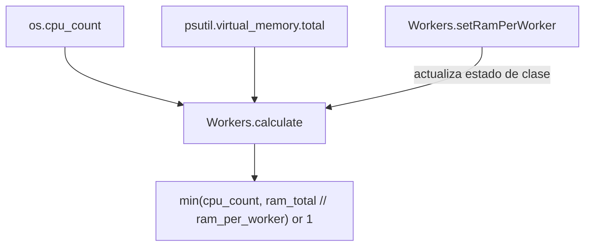

# Orionis System (`orionis.system`)

> Cálculo del número de workers según los núcleos de CPU y la RAM disponibles.
>
> 🇬🇧 English version: [README.md](README.md)

`orionis.system` responde a una única pregunta muy concreta: **¿cuántos
procesos worker puede ejecutar esta máquina de forma segura en
paralelo?** Expone una única utilidad estática, `Workers`, que combina el
número de núcleos de CPU con la RAM total del sistema (y un presupuesto de
RAM configurable por worker) para recomendar un número de workers — el
mismo tipo de lógica de dimensionamiento que usan gestores de procesos
como Gunicorn o el flag `--workers` de Uvicorn.

---

## Tabla de contenidos

1. [Requisitos](#requisitos)
2. [Descripción funcional del módulo](#descripción-funcional-del-módulo)
3. [Arquitectura](#arquitectura)
4. [Referencia de API](#referencia-de-api)
   - [`Workers`](#workers-orionissystemworkersworkers)
5. [Ejemplos de uso](#ejemplos-de-uso)
6. [Consideraciones de rendimiento y concurrencia](#consideraciones-de-rendimiento-y-concurrencia)
7. [Notas de diseño](#notas-de-diseño)
8. [Notas de compatibilidad](#notas-de-compatibilidad)

---

## Requisitos

No se requiere ninguna instalación adicional a la del propio framework:

```bash
pip install orionis
```

- **Python:** 3.14 o superior.
- **Dependencia en tiempo de ejecución:** [`psutil`](https://pypi.org/project/psutil/)
  (`psutil~=7.2`, dependencia central y no opcional del framework) se
  utiliza para leer la RAM total del sistema.

## Descripción funcional del módulo

Elegir cuántos procesos worker lanzar para un servidor de aplicaciones es
una decisión recurrente y fácil de hacer mal: demasiados workers en una
máquina limitada de memoria provoca swapping y caídas, y muy pocos deja
núcleos de CPU sin usar. `orionis.system` centraliza este único cálculo en
una sola clase:

- **`Workers`** — una utilidad sin estado por instancia, compuesta
  únicamente por classmethods (nunca se instancia), que:
  - Lee el número de núcleos de CPU (`os.cpu_count()`) y la RAM total del
    sistema (`psutil.virtual_memory().total`) **una sola vez**, en el
    momento de importar el módulo.
  - Permite configurar cuánta RAM (en GB) se debe presupuestar por worker
    (`setRamPerWorker`, por defecto `0.5` GB).
  - Calcula el número de workers recomendado (`calculate`) como el menor
    entre el número de núcleos de CPU y cuántos "presupuestos de RAM"
    caben en la RAM total del sistema, con un mínimo de `1`.

## Arquitectura



- `orionis/system/workers.py` calcula `_CPU_COUNT` y `_RAM_TOTAL_BYTES`
  como **constantes a nivel de módulo**, evaluadas una sola vez cuando el
  módulo se importa por primera vez, de modo que `Workers.calculate()`
  nunca vuelve a consultar el sistema operativo ni `psutil`.
- `Workers` implementa el contrato `IWorkers`
  (`orionis/system/contracts/workers.py`), un `ABC` simple con los mismos
  dos `@classmethod`.
- No existe service provider, fachada, ni wiring de DI para este módulo —
  `Workers` es una clase utilitaria estática pensada para importarse y
  llamarse directamente allí donde se necesite un número de workers (p. ej.
  al configurar un servidor ASGI o un pool de procesos).

## Referencia de API

### `Workers` (`orionis.system.workers.Workers`)

```python
class Workers(IWorkers):
    __slots__ = ()
    _ram_per_worker: float = 0.5  # GB, estado a nivel de clase
```

Nunca se instancia — todos sus miembros son `@classmethod`.

| Método | Firma | Descripción |
| --- | --- | --- |
| `setRamPerWorker` | `(ram_per_worker: float) -> None` | Actualiza el presupuesto de RAM (en GB) a nivel de clase usado por `calculate()`. Tiene efecto inmediato en cada llamada posterior, sobre la propia clase (es estado compartido y global — ver [Notas de diseño](#notas-de-diseño)). |
| `calculate` | `() -> int` | Devuelve `min(cpu_count, ram_total_bytes // ram_per_worker_bytes) or 1` — el número recomendado de procesos worker. Siempre devuelve al menos `1` cuando el valor calculado es `0` (gracias a `or 1`), pero ver las [notas](#notas-sobre-casos-límite) sobre presupuestos de RAM inválidos más abajo. |

Ambos métodos están declarados con `@classmethod` tanto en `Workers` como
en su contrato `IWorkers`, por lo que pueden llamarse directamente sobre la
clase — `Workers.calculate()` — sin crear una instancia.

#### Notas sobre casos límite

- `calculate()` realiza una **división entera (floor division)** entre la
  RAM total en bytes y el valor de RAM-por-worker configurado en bytes; no
  protege contra un `_ram_per_worker` cero o negativo:
  - `setRamPerWorker(0.0)` (o establecer directamente
    `Workers._ram_per_worker = 0.0`) hace que la siguiente llamada a
    `calculate()` lance `ZeroDivisionError`.
  - Un `ram_per_worker` negativo produce un resultado de división entera
    negativo, que `min()` propaga como un valor de retorno **negativo** (el
    respaldo `or 1` solo se activa ante `0`, no ante números negativos).
  - Estos son comportamientos documentados y actuales de la aritmética sin
    protección — se espera que quien llame pase un valor positivo y
    distinto de cero.

## Ejemplos de uso

### Dimensionar procesos worker con la configuración por defecto

```python
from orionis.system import Workers

# Usa el presupuesto por defecto de 0.5 GB de RAM por worker.
worker_count = Workers.calculate()
print(f"Workers recomendados: {worker_count}")
```

### Ajustar el presupuesto de RAM por worker

```python
from orionis.system import Workers

# Se espera que cada worker necesite aproximadamente 2 GB de RAM.
Workers.setRamPerWorker(2.0)
worker_count = Workers.calculate()
```

### Usar el resultado para configurar un servidor / pool de procesos

```python
from orionis.system import Workers

# Ejemplo: configurar programáticamente un servidor ASGI al estilo Uvicorn.
config = {
    "workers": Workers.calculate(),
    "host": "0.0.0.0",
    "port": 8000,
}
```

### Usar el contrato para código orientado a tipado/DI

```python
from orionis.system.contracts.workers import IWorkers
from orionis.system.workers import Workers

def print_worker_count(workers_cls: type[IWorkers] = Workers) -> None:
    print(workers_cls.calculate())
```

## Consideraciones de rendimiento y concurrencia

- **El número de CPUs y la RAM total se leen exactamente una vez por
  proceso**: `_CPU_COUNT` y `_RAM_TOTAL_BYTES` se calculan en el **momento
  de importar el módulo** y se cachean como constantes a nivel de módulo;
  `calculate()` nunca vuelve a llamar a `os.cpu_count()` ni a
  `psutil.virtual_memory()` después de eso, por lo que las llamadas
  repetidas son baratas (sin syscalls, sin la sobrecarga de `psutil` en
  cada llamada).
- **`_ram_per_worker` es estado de clase compartido y mutable**:
  `setRamPerWorker` muta un atributo de clase en el propio `Workers`. Como
  existe un único valor compartido (no por instancia, ni por hilo), llamar
  a `setRamPerWorker` desde una parte de la aplicación (o desde código/tests
  ejecutándose de forma concurrente) afecta a todas las llamadas
  posteriores a `calculate()` en todo el proceso. No hay ningún bloqueo
  alrededor de esta mutación — trátalo como una configuración establecida
  una vez al arrancar, en lugar de algo que se alterna concurrentemente
  desde varios hilos/tareas.
- **`calculate()` en sí es aritmética pura y ligera**: realiza una
  multiplicación, una división entera y una llamada a `min()` — sin E/S,
  sin `async` involucrado, seguro de llamar tantas veces como se necesite.
- **`__slots__ = ()`** en `Workers` impide la creación de atributos de
  instancia (coherente con que la clase nunca se instancia) y evita añadir
  un `__dict__` a las instancias si alguna se creara por error.
- **Los valores calculados reflejan la máquina/contenedor en el que se
  ejecuta el proceso** en el momento de la importación — si tu despliegue
  redimensiona los límites de CPU/RAM en tiempo de ejecución (p. ej.
  ciertos orquestadores de contenedores), `Workers` no recogerá
  automáticamente los nuevos límites sin reiniciar el proceso, ya que
  `_CPU_COUNT`/`_RAM_TOTAL_BYTES` se calculan una sola vez.

## Notas de diseño

- **Utilidad de responsabilidad única, sin estado por instancia**:
  `Workers` expone intencionalmente solo `@classmethod` y
  `__slots__ = ()` — nunca está pensada para instanciarse, reflejando cómo
  se usa un helper puro de dimensionamiento/cálculo en el resto del
  framework (similar en espíritu a `orionis.aio.Loop`, otra utilidad
  compuesta únicamente por classmethods).
- **Constantes a nivel de módulo en lugar de llamadas repetidas al SO**:
  `_CPU_COUNT` y `_RAM_TOTAL_BYTES` se calculan una sola vez en el momento
  de la importación específicamente para evitar llamadas repetidas a
  `os.cpu_count()`/`psutil.virtual_memory()` en cada invocación de
  `calculate()` — esta es una decisión de diseño existente orientada al
  rendimiento, no algo a cambiar.
- **Aritmética entera en lugar de `math.floor()`**: `calculate()` convierte
  el valor de RAM-por-worker en GB a bytes como `int` y usa `//` (división
  entera) directamente sobre los conteos de bytes, evitando
  deliberadamente `math.floor()` para ahorrarse la búsqueda del atributo
  del módulo, el valor intermedio en punto flotante, y la llamada a
  función adicional a nivel de Python.
- **Sin protección de excepciones para configuraciones degeneradas**:
  `calculate()` no valida `_ram_per_worker` antes de dividir por él; un
  valor `0.0` lanza `ZeroDivisionError` y un valor negativo produce un
  resultado negativo. Este es un comportamiento documentado e intencional
  (cubierto por tests) — el contrato traslada la responsabilidad de pasar
  un valor razonable y positivo a quien llama a `setRamPerWorker`.
- **El contrato `IWorkers` refleja exactamente la clase concreta**: tanto
  `setRamPerWorker` como `calculate` están declarados como
  `@classmethod` + `@abstractmethod` en `IWorkers`, de modo que el código
  puede depender del contrato abstracto en lugar de la clase concreta
  `Workers` si es necesario.

## Notas de compatibilidad

- **Versión mínima de Python:** 3.14 (según `pyproject.toml`,
  `requires-python = ">=3.14"`), igual que el resto del framework.
- **Dependencia obligatoria:** `psutil~=7.2` (dependencia central, usada
  únicamente para leer `psutil.virtual_memory().total`).
- Todo lo demás se apoya en la biblioteca estándar (`os.cpu_count()`).
- `os.cpu_count()` puede devolver `None` en entornos sandboxed/restringidos
  poco frecuentes; `Workers` recurre a `1` CPU en ese caso
  (`os.cpu_count() or 1`, evaluado una sola vez en el momento de la
  importación).
- Sin comportamiento específico de plataforma más allá de lo que ya
  gestionan `os.cpu_count()` y `psutil`; el módulo funciona de forma
  idéntica en Windows, Linux y macOS.
