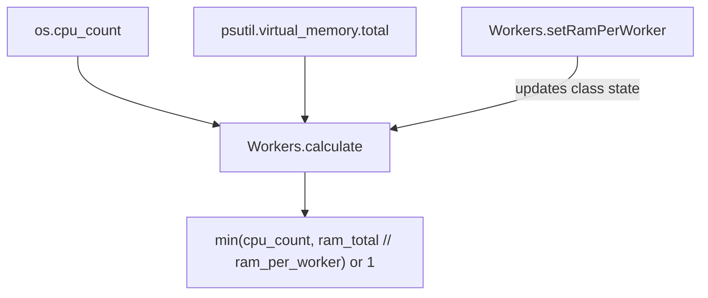

# Orionis System (`orionis.system`)

> Worker-count sizing based on available CPU cores and RAM.
>
> 🇪🇸 Versión en español: [README.es.md](README.es.md)

`orionis.system` answers one narrow question: **how many worker processes
can this machine safely run in parallel?** It exposes a single static
utility, `Workers`, that combines the CPU core count with the total system
RAM (and a configurable RAM budget per worker) to recommend a worker count
— the same kind of sizing logic used by process managers such as Gunicorn
or Uvicorn's `--workers` flag.

---

## Table of contents

1. [Requirements](#requirements)
2. [Module overview](#module-overview)
3. [Architecture](#architecture)
4. [API reference](#api-reference)
   - [`Workers`](#workers-orionissystemworkersworkers)
5. [Usage examples](#usage-examples)
6. [Performance and concurrency considerations](#performance-and-concurrency-considerations)
7. [Design notes](#design-notes)
8. [Compatibility notes](#compatibility-notes)

---

## Requirements

No installation beyond the framework itself is required:

```bash
pip install orionis
```

- **Python:** 3.14 or newer.
- **Runtime dependency:** [`psutil`](https://pypi.org/project/psutil/)
  (`psutil~=7.2`, a core, non-optional dependency of the framework) is used
  to read the total system RAM.

## Module overview

Choosing how many worker processes to spawn for an application server is a
recurring, easy-to-get-wrong decision: too many workers on a
memory-constrained machine leads to swapping and crashes, too few leaves
CPU cores idle. `orionis.system` centralizes this single calculation in
one class:

- **`Workers`** — a stateless, class-method-only utility (never
  instantiated) that:
  - Reads the number of CPU cores (`os.cpu_count()`) and the total system
    RAM (`psutil.virtual_memory().total`) **once**, at module import time.
  - Lets you configure how much RAM (in GB) should be budgeted per worker
    (`setRamPerWorker`, default `0.5` GB).
  - Computes the recommended worker count (`calculate`) as the smaller of
    the CPU core count and how many "RAM budgets" fit in total system RAM,
    with a floor of `1`.

## Architecture



- `orionis/system/workers.py` computes `_CPU_COUNT` and `_RAM_TOTAL_BYTES`
  as **module-level constants**, evaluated once when the module is first
  imported, so `Workers.calculate()` never re-queries the OS or `psutil`.
- `Workers` implements the `IWorkers` contract
  (`orionis/system/contracts/workers.py`), a plain `ABC` with the same two
  `@classmethod`s.
- There is no service provider, facade, or DI wiring for this module —
  `Workers` is a plain static utility class meant to be imported and called
  directly wherever a worker count is needed (e.g. when configuring an ASGI
  server or a process pool).

## API reference

### `Workers` (`orionis.system.workers.Workers`)

```python
class Workers(IWorkers):
    __slots__ = ()
    _ram_per_worker: float = 0.5  # GB, class-level state
```

Never instantiated — every member is a `@classmethod`.

| Method | Signature | Description |
| --- | --- | --- |
| `setRamPerWorker` | `(ram_per_worker: float) -> None` | Updates the class-level RAM budget (in GB) used by `calculate()`. Takes effect immediately for every subsequent call, on the class itself (this is shared, global state — see [Design notes](#design-notes)). |
| `calculate` | `() -> int` | Returns `min(cpu_count, ram_total_bytes // ram_per_worker_bytes) or 1` — the recommended number of worker processes. Always returns at least `1` when the computed value is `0` (thanks to `or 1`), but see the [Notes](#notes-on-edge-cases) on invalid RAM budgets below. |

Both methods are declared with `@classmethod` on both `Workers` and its
contract `IWorkers`, so they can be called directly on the class —
`Workers.calculate()` — without creating an instance.

#### Notes on edge cases

- `calculate()` performs **integer floor division** between the total RAM
  in bytes and the configured RAM-per-worker in bytes; it does not guard
  against a zero or negative `_ram_per_worker`:
  - `setRamPerWorker(0.0)` (or setting `Workers._ram_per_worker = 0.0`
    directly) makes the next `calculate()` call raise `ZeroDivisionError`.
  - A negative `ram_per_worker` produces a negative floor-division result,
    which `min()` then propagates as a **negative** return value (the
    `or 1` fallback only triggers on `0`, not on negative numbers).
  - These are documented, current behaviors of the unguarded arithmetic —
    callers are expected to pass a positive, non-zero value.

## Usage examples

### Sizing worker processes with default settings

```python
from orionis.system import Workers

# Uses the default budget of 0.5 GB of RAM per worker.
worker_count = Workers.calculate()
print(f"Recommended workers: {worker_count}")
```

### Adjusting the RAM budget per worker

```python
from orionis.system import Workers

# Each worker is expected to need about 2 GB of RAM.
Workers.setRamPerWorker(2.0)
worker_count = Workers.calculate()
```

### Feeding the result into a server/process-pool configuration

```python
from orionis.system import Workers

# Example: configuring a Uvicorn-style ASGI server programmatically.
config = {
    "workers": Workers.calculate(),
    "host": "0.0.0.0",
    "port": 8000,
}
```

### Using the contract for typing/DI-friendly code

```python
from orionis.system.contracts.workers import IWorkers
from orionis.system.workers import Workers

def print_worker_count(workers_cls: type[IWorkers] = Workers) -> None:
    print(workers_cls.calculate())
```

## Performance and concurrency considerations

- **CPU count and total RAM are read exactly once per process**:
  `_CPU_COUNT` and `_RAM_TOTAL_BYTES` are computed at **module import
  time** and cached as module-level constants; `calculate()` never calls
  `os.cpu_count()` or `psutil.virtual_memory()` again afterwards, so
  repeated calls are cheap (no syscalls, no `psutil` overhead per call).
- **`_ram_per_worker` is shared, mutable class state**: `setRamPerWorker`
  mutates a class attribute on `Workers` itself. Because there is a single
  shared value (not per-instance, not per-thread), calling
  `setRamPerWorker` from one part of an application (or from concurrently
  running code/tests) affects every subsequent `calculate()` call
  process-wide. There is no locking around this mutation — treat it as
  configuration set once at startup rather than something toggled
  concurrently from multiple threads/tasks.
- **`calculate()` itself is pure, allocation-light arithmetic**: it does
  one multiplication, one integer floor-division, and one `min()` call —
  no I/O, no `async` involved, safe to call as often as needed.
- **`__slots__ = ()`** on `Workers` prevents instance attribute creation
  (consistent with the class never being instantiated) and avoids adding
  a `__dict__` to instances if one were ever created by mistake.
- **The computed values reflect the machine/container the process runs
  in** at the moment of import — if your deployment resizes CPU/RAM limits
  at runtime (e.g. certain container orchestrators), `Workers` will not
  automatically pick up the new limits without a process restart, since
  `_CPU_COUNT`/`_RAM_TOTAL_BYTES` are computed once.

## Design notes

- **Single-responsibility, stateless-by-instantiation utility**: `Workers`
  intentionally exposes only `@classmethod`s and `__slots__ = ()` — it is
  never meant to be instantiated, mirroring how a pure sizing/calculation
  helper is used across the framework (similar in spirit to
  `orionis.aio.Loop`, another class-method-only utility).
- **Module-level constants over repeated OS calls**: `_CPU_COUNT` and
  `_RAM_TOTAL_BYTES` are computed once at import time specifically to
  avoid repeated `os.cpu_count()`/`psutil.virtual_memory()` calls on every
  `calculate()` invocation — this is an existing performance-oriented
  design choice, not something to change.
- **Integer arithmetic instead of `math.floor()`**: `calculate()` converts
  the RAM-per-worker GB value to bytes as an `int` and uses `//` (integer
  floor division) directly on byte counts, deliberately avoiding
  `math.floor()` to skip the module attribute lookup, the float
  intermediate value, and the extra Python-level function call.
- **No exception guarding for degenerate configurations**: `calculate()`
  does not validate `_ram_per_worker` before dividing by it; a `0.0` value
  raises `ZeroDivisionError` and a negative value produces a negative
  result. This is documented, intentional (test-covered) behavior — the
  contract places the responsibility of passing a sane, positive value on
  the caller of `setRamPerWorker`.
- **`IWorkers` contract mirrors the concrete class exactly**: both
  `setRamPerWorker` and `calculate` are declared as
  `@classmethod` + `@abstractmethod` on `IWorkers`, so code can depend on
  the abstract contract instead of the concrete `Workers` class if needed.

## Compatibility notes

- **Minimum Python version:** 3.14 (per `pyproject.toml`,
  `requires-python = ">=3.14"`), matching the rest of the framework.
- **Required dependency:** `psutil~=7.2` (core dependency, used only to
  read `psutil.virtual_memory().total`).
- Everything else relies on the standard library (`os.cpu_count()`).
- `os.cpu_count()` can return `None` in rare sandboxed/restricted
  environments; `Workers` falls back to `1` CPU in that case
  (`os.cpu_count() or 1`, evaluated once at import time).
- No platform-specific behavior beyond what `os.cpu_count()` and `psutil`
  already handle; the module works identically on Windows, Linux, and
  macOS.
