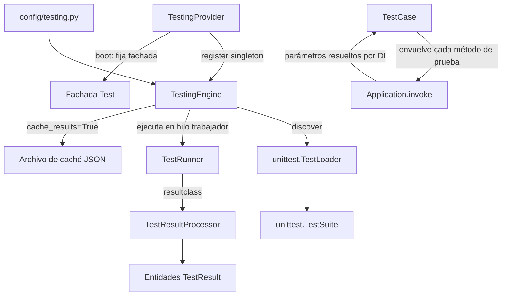

# Orionis Test (`orionis.test`)

> Motor de pruebas unitarias async-first construido sobre `unittest`, con métodos de test inyectados por dependencias y reportes en consola vía Rich.
>
> 🇬🇧 English version: [README.md](README.md)

`orionis.test` es el motor de pruebas que usa el propio comando `reactor
test` del framework (y cualquier aplicación construida sobre Orionis).
Descubre pruebas al estilo `unittest` en un árbol de directorios, las
ejecuta de forma asíncrona sin bloquear el bucle de eventos, inyecta
dependencias de la aplicación directamente en los métodos de prueba a
través del contenedor de DI, y renderiza los resultados con `rich`
(resúmenes compactos de una línea o paneles detallados con tracebacks y
líneas de código fuente resaltadas).

---

## Tabla de contenidos

1. [Requisitos](#requisitos)
2. [Descripción funcional del módulo](#descripción-funcional-del-módulo)
3. [Arquitectura](#arquitectura)
4. [Referencia de API](#referencia-de-api)
   - [`TestCase`](#testcase-orionistestcasescasetestcase)
   - [`TestingEngine`](#testingengine-orionistestcoreenginetestingengine)
   - [`TestRunner`](#testrunner-orionistestexecutorsrunnertestrunner)
   - [`TestResultProcessor`](#testresultprocessor-orionistestexecutorsresultstestresultprocessor)
   - [`TestingProvider`](#testingprovider-orionistestprovidertestingprovider)
   - [`TestResult` / `TestStatus`](#testresult--teststatus)
5. [Ejemplos de uso](#ejemplos-de-uso)
6. [Consideraciones de rendimiento y concurrencia](#consideraciones-de-rendimiento-y-concurrencia)
7. [Notas de diseño](#notas-de-diseño)
8. [Notas de compatibilidad](#notas-de-compatibilidad)

---

## Requisitos

No se requiere ninguna instalación adicional a la del propio framework:

```bash
pip install orionis
```

- **Python:** 3.14 o superior.
- **Dependencia en tiempo de ejecución:** [`rich`](https://pypi.org/project/rich/)
  (`rich~=15.0`, dependencia central y no opcional del framework) se usa
  para toda la salida en consola (paneles, tablas, etiquetas de estado
  coloreadas).
- El descubrimiento y ejecución de pruebas requieren una instancia
  **`IApplication` arrancada** (el contenedor de DI), ya que `TestCase`
  resuelve los métodos de prueba a través de ella y `TestingEngine` lee su
  configuración `testing.*`. Ejecutar `python -m unittest` directamente
  sobre casos de prueba de Orionis **no** arranca la aplicación — usa el
  runner propio del framework (ver [Ejemplos de uso](#ejemplos-de-uso)).

## Descripción funcional del módulo

Probar una aplicación construida alrededor de la inyección de
dependencias plantea un problema práctico: los métodos de prueba a menudo
necesitan servicios del contenedor (un repositorio, un mailer falso, un
cliente configurado), y el `unittest` puro no ofrece ninguna forma
integrada de inyectarlos. `orionis.test` resuelve esto, además de la
ejecución asíncrona y el reporte, con un pequeño conjunto de
colaboradores:

- **`TestCase`** (`orionis.test.cases.case.TestCase`) — la clase base que
  extienden las pruebas de la aplicación. Es una subclase ligera de
  `unittest.IsolatedAsyncioTestCase` que envuelve cada método de prueba
  coincidente para que se ejecute a través de `Application.invoke(...)`,
  lo que significa que **cualquier parámetro adicional declarado en un
  método de prueba es resuelto automáticamente por el contenedor de DI**.
- **`TestingEngine`** (`orionis.test.core.engine.TestingEngine`) — el
  orquestador: lee la configuración `testing.*` de la aplicación,
  descubre pruebas bajo un directorio de inicio, las ejecuta vía
  `TestRunner` en un hilo trabajador (para que el bucle de eventos quede
  libre), opcionalmente cachea los resultados como JSON, y devuelve una
  `list[TestResult]`.
- **`TestRunner`** (`orionis.test.executors.runner.TestRunner`) — una
  subclase de `unittest.TextTestRunner` que renderiza los paneles Rich de
  "inicio" y "resumen" alrededor de una ejecución síncrona de `unittest`.
- **`TestResultProcessor`** (`orionis.test.executors.results.TestResultProcessor`)
  — una subclase de `unittest.TestResult` que captura cada resultado como
  una entidad `TestResult`, la imprime en vivo (una línea o un panel
  detallado, según la verbosidad), y extrae el contexto de traceback/código
  fuente para fallos y errores.
- **`TestingProvider`** — el `ServiceProvider` del framework (diferible)
  que registra `ITestingEngine` como singleton y fija la fachada `Test`
  (`orionis.support.facades.testing`, fuera de este módulo).

## Arquitectura



- `TestingEngine.discover()` recorre `testing.start_dir` con `os.walk`
  (de modo que los subdirectorios sin `__init__.py` también se recorren, a
  diferencia de `unittest.discover()`), compara los nombres de archivo con
  `testing.file_pattern` y los nombres de método con
  `testing.method_pattern`, e importa cada módulo coincidente con un
  `unittest.TestLoader` nuevo (evitando el estado compartido de
  `unittest.defaultTestLoader`).
- `TestingEngine.run()` construye la suite filtrada, configura
  `TestResultProcessor.setPrintVerbosity(...)`, construye un `TestRunner`,
  y lo ejecuta vía `loop.run_in_executor(None, runner.run, suite)` para
  que la ejecución bloqueante de `unittest` no detenga el bucle de
  eventos.
- `TestRunner.run()` es un método síncrono (sobrescribe
  `unittest.TextTestRunner.run`); imprime el panel de inicio, ejecuta
  `test(result)`, y luego imprime el panel de resumen usando los conteos
  reunidos por `TestResultProcessor`.
- `TestResultProcessor` se establece como `TestRunner.resultclass`, de
  modo que cada callback `addSuccess`/`addFailure`/`addError`/`addSkip` de
  `unittest` construye un `TestResult` y lo imprime inmediatamente (salida
  en vivo por prueba), además de devolverse todos juntos al final vía
  `getTestResults()`.
- `TestCase.__init__` envuelve el método de prueba resuelto **una sola
  vez**, en el momento de la construcción (no en cada acceso a un
  atributo), reemplazándolo por un wrapper que llama a
  `await Application.invoke(original_method, *args, **kwargs)`.

## Referencia de API

### `TestCase` (`orionis.test.cases.case.TestCase`)

```python
class TestCase(unittest.IsolatedAsyncioTestCase):
    _method_regex: re.Pattern[str] = re.compile(fnmatch.translate("test*"))
    def __init__(self, method_name: str = "runTest") -> None: ...
```

La clase base que extienden las pruebas de la aplicación/framework en
lugar de `unittest.TestCase` / `unittest.IsolatedAsyncioTestCase`
directamente.

| Método | Firma | Descripción |
| --- | --- | --- |
| `setMethodPattern` | `(pattern: str) -> None` (`@classmethod`) | Cambia el patrón glob (por defecto `"test*"`) usado para decidir qué métodos se envuelven para la invocación con DI. Se compila una vez y se guarda como atributo de clase; afecta a cada subclase de `TestCase` salvo que se sobrescriba por clase. |

**Comportamiento en `__init__`:** el constructor inspecciona
`method_name`; si **no** empieza por `_`, **no** es uno de los hooks de
ciclo de vida (`setUp`, `tearDown`, `setUpClass`, `tearDownClass`,
`asyncSetUp`, `asyncTearDown`), y coincide con `_method_regex`, el método
vinculado original se reemplaza (vía `object.__setattr__`) por un wrapper
`async` que lo ejecuta a través de
`Application.invoke(method, *args, **kwargs)` — esto es lo que permite que
los métodos de prueba declaren parámetros adicionales resueltos por el
contenedor de DI (ver [Ejemplos de uso](#ejemplos-de-uso)).

### `TestingEngine` (`orionis.test.core.engine.TestingEngine`)

```python
class TestingEngine(ITestingEngine):
    def __init__(self, app: IApplication) -> None: ...
```

Lee `testing.verbosity`, `testing.fail_fast`, `testing.start_dir`,
`testing.file_pattern`, `testing.method_pattern` y
`testing.cache_results` desde `app.config(...)` en el momento de la
construcción; la carpeta de caché JSON está fijada en
`app.path("storage") / "framework" / "cache" / "testing"`.

| Método | Firma | Descripción |
| --- | --- | --- |
| `setVerbosity` | `(verbosity: int) -> Self` | Sobrescribe la verbosidad configurada (`0` silencioso, `1` una línea por prueba, `2` paneles detallados). Encadenable. |
| `setFailFast` | `(*, fail_fast: bool) -> Self` | Sobrescribe si la ejecución se detiene en el primer fallo. Encadenable. |
| `setStartDir` | `(start_dir: str) -> Self` | Sobrescribe el directorio en el que buscar pruebas. Encadenable. |
| `setFilePattern` | `(file_pattern: str) -> Self` | Sobrescribe el patrón glob usado para hacer coincidir archivos de prueba (p. ej. `"test_*.py"`). Encadenable. |
| `setMethodPattern` | `(method_pattern: str) -> Self` | Sobrescribe el patrón glob para métodos de prueba; también se propaga a `TestCase.setMethodPattern(...)` para que el envoltorio de DI coincida con los mismos métodos. Encadenable. |
| `withoutPanel` | `() -> Self` | Desactiva los paneles Rich de inicio/resumen para esta ejecución. Encadenable. |
| `discover` | `() -> unittest.TestSuite` | Recorre `start_dir`, importa los archivos coincidentes, y devuelve un `unittest.TestSuite` que contiene solo los casos de prueba cuyo nombre de método coincide con `method_pattern`. Los fallos de importación amplios (`SyntaxError`, `ImportError`, etc.) en archivos individuales se omiten silenciosamente. |
| `run` | `async () -> list[TestResult]` | Añade la suite de `discover()` a la suite interna, construye un `TestRunner`, lo ejecuta en un executor de hilos, opcionalmente escribe un archivo de caché JSON con marca de tiempo, y devuelve la lista de `TestResult` recolectados. |

Todos los setters devuelven `Self`, de modo que las llamadas pueden
encadenarse fluidamente antes de llamar a `await engine.run()`.

### `TestRunner` (`orionis.test.executors.runner.TestRunner`)

```python
class TestRunner(unittest.TextTestRunner):
    resultclass = TestResultProcessor
    def __init__(
        self, verbosity: int = 0, failfast: bool = False, buffer: bool = False,
        warnings: str | None = None, with_panel: bool = True, **kwargs: dict,
    ) -> None: ...
```

Un `unittest.TextTestRunner` que renderiza paneles Rich alrededor de una
ejecución estándar y síncrona de `unittest`. Normalmente se construye y
maneja internamente desde `TestingEngine`, no directamente desde el
código de la aplicación.

| Método | Firma | Descripción |
| --- | --- | --- |
| `run` | `(test: unittest.suite.TestSuite) -> unittest.result.TestResult` | Imprime el panel de inicio (salvo `with_panel=False`), ejecuta `test(result)`, imprime el panel de resumen (conteos de pruebas por estado + tiempo total), y devuelve el objeto resultado de `unittest` (una instancia de `TestResultProcessor`). |

### `TestResultProcessor` (`orionis.test.executors.results.TestResultProcessor`)

```python
class TestResultProcessor(unittest.TestResult):
    _print_verbosity: int | None = None
```

Una subclase de `unittest.TestResult`; se establece como
`TestRunner.resultclass`, de modo que `unittest` la instancia y maneja
automáticamente durante una ejecución.

| Método | Firma | Descripción |
| --- | --- | --- |
| `setPrintVerbosity` | `(verbosity: int) -> None` (`@classmethod`) | Establece la verbosidad a nivel de clase que controla cómo se imprime cada resultado: `0` = sin salida por prueba, `1` = una línea compacta por prueba (estado, nombre, relleno de puntos, tiempo de ejecución), `2` = un panel Rich detallado por prueba (ID, clase, método, módulo, ruta de archivo, y — para fallos/errores — el mensaje de excepción y las líneas de código fuente resaltadas alrededor). |
| `addSuccess` / `addFailure` / `addError` / `addSkip` | (sobrescriben `unittest.TestResult`) | Construyen un `TestResult` para el resultado, lo añaden a la lista interna, lo imprimen inmediatamente según la verbosidad configurada, y luego delegan en la implementación de la superclase. |
| `getTestResults` | `() -> list[TestResult]` | Devuelve todos los `TestResult` recolectados hasta el momento. |

### `TestingProvider` (`orionis.test.provider.TestingProvider`)

```python
class TestingProvider(ServiceProvider, DeferrableProvider):
    @classmethod
    def provides(cls) -> list[type]: ...
    def register(self) -> None: ...
    async def boot(self) -> None: ...
```

| Método | Descripción |
| --- | --- |
| `provides()` | Devuelve `[ITestingEngine]` — declara el servicio diferido para el contenedor. |
| `register()` | Vincula `ITestingEngine` → `TestingEngine` como singleton. |
| `boot()` | `await TestFacade.pin()` — fija la fachada `Test` para un acceso directo a atributos sin DI. |

### `TestResult` / `TestStatus`

**`TestResult`** (`orionis.test.entities.result.TestResult`) —
`@dataclass(frozen=True, kw_only=True)`, extiende
`orionis.support.entities.base.BaseEntity`. Representa el resultado de
una única prueba:

| Campo | Tipo | Descripción |
| --- | --- | --- |
| `id` | `Any` | Identificador único (`id(test)` en el momento de la construcción). |
| `name` | `str` | Identificador completo de la prueba (`test.id()`, p. ej. `modulo.Clase.test_metodo`). |
| `status` | `TestStatus` | Estado del resultado. |
| `execution_time` | `float` | Tiempo transcurrido en segundos. |
| `error_message` | `str \| None` | `str(exception)` en caso de fallo/error, si no `None`. |
| `traceback` | `str \| None` | Líneas de traceback formateadas, si las hay. |
| `class_name` | `str \| None` | Nombre de la clase que contiene la prueba. |
| `method` | `str \| None` | Nombre del método de prueba. |
| `module` | `str \| None` | Módulo que contiene la prueba. |
| `file_path` | `str \| None` | Ruta del archivo fuente. |
| `doc_string` | `str \| None` | Docstring del método de prueba. |
| `exception` | `BaseException \| None` | Nombre de la **clase** de la excepción en caso de fallo/error (a pesar del type hint, el valor almacenado es `exc_info[0].__name__`, una `str`). |
| `line_no` | `int \| None` | Número de línea donde ocurrió el fallo, cuando puede resolverse desde el traceback. |
| `source_code` | `list[tuple[int, str]] \| None` | Pares `(line_no, código)` alrededor de la línea del fallo, usados para los paneles de verbosidad `2`. |

**`TestStatus`** (`orionis.test.enums.status.TestStatus`) — `StrEnum` con
miembros `PASSED`, `FAILED`, `ERRORED`, `SKIPPED` (todos con valores de
cadena en mayúsculas, p. ej. `TestStatus.PASSED == "PASSED"`).

## Ejemplos de uso

### Escribir una prueba con `TestCase`

```python
from orionis.test import TestCase

class TestWelcomeService(TestCase):

    async def testGreetReturnsExpectedMessage(self) -> None:
        """Verifica que el mensaje de saludo tenga el formato esperado."""
        self.assertEqual(1 + 1, 2)
```

### Inyectar servicios de la aplicación en un método de prueba

Como cada método de prueba coincidente se ejecuta a través de
`await Application.invoke(method, *args, **kwargs)`, puedes declarar
parámetros adicionales y dejar que el contenedor los resuelva — el mismo
auto-wiring usado para controladores y comandos de consola:

```python
from orionis.test import TestCase
from app.contracts.welcome_service import IWelcomeService

class TestWelcomeService(TestCase):

    async def testGreetUsesConfiguredName(
        self,
        service: IWelcomeService,  # resuelto automáticamente por el contenedor de DI
    ) -> None:
        message = await service.greet()
        self.assertIn("Hello", message)
```

### Ejecutar pruebas programáticamente con `TestingEngine`

```python
from orionis.test.contracts.engine import ITestingEngine

# Normalmente se resuelve vía el contenedor de DI una vez que
# TestingProvider ha arrancado.
engine: ITestingEngine = await app.make(ITestingEngine)

results = await (
    engine
    .setStartDir("tests")
    .setFilePattern("test_*.py")
    .setMethodPattern("test*")
    .setVerbosity(1)
    .setFailFast(fail_fast=False)
    .run()
)

for result in results:
    print(result.status, result.name, result.execution_time)
```

### Ejecutar pruebas vía la CLI del framework (recomendado para el uso diario)

```bash
python reactor test --start-dir="tests/app" --verbosity=1
python reactor test --fail-fast=1 --no-panel
```

`orionis.console.commands.test.test_command.TestCommand` lee las mismas
claves de configuración `testing.*` como valores por defecto y resuelve
`ITestingEngine` a través del contenedor de DI (parámetro
`test_engine: ITestingEngine` en su método `handle`) — es un envoltorio
CLI ligero alrededor de `TestingEngine`.

### Ajustar la verbosidad de salida directamente en el procesador

```python
from orionis.test.executors.results import TestResultProcessor

TestResultProcessor.setPrintVerbosity(2)  # paneles detallados por prueba
```

## Consideraciones de rendimiento y concurrencia

- **La ejecución de pruebas corre en un hilo trabajador, no en el bucle de
  eventos**: `TestingEngine.run()` llama a
  `loop.run_in_executor(None, runner.run, self.__suite)`, descargando
  toda la ejecución (síncrona y bloqueante) de `unittest` al executor de
  hilos por defecto, de modo que `await engine.run()` no bloquea otras
  corrutinas ejecutándose concurrentemente en el mismo proceso.
- **Los métodos de prueba async son manejados por
  `unittest.IsolatedAsyncioTestCase`**: cada subclase de `TestCase`
  obtiene su propio bucle de eventos por prueba (comportamiento estándar
  de `IsolatedAsyncioTestCase`) — las pruebas no comparten un bucle entre
  sí ni con la corrutina exterior `TestingEngine.run()`.
- **La resolución de DI ocurre una vez por llamada de prueba, no por
  acceso a atributo**: `TestCase.__init__` envuelve el método objetivo una
  única vez en el momento de la construcción; no intercepta
  `__getattribute__` en cada acceso, manteniendo las búsquedas normales de
  atributos en la instancia a su costo habitual.
- **`_method_regex` es estado de clase compartido y mutable**:
  `setMethodPattern` (tanto en `TestCase` como en `TestingEngine`) muta un
  atributo a nivel de clase. Llamarlo afecta a **todas** las subclases de
  `TestCase` en todo el proceso a partir de ese momento — trátalo como un
  paso de configuración único al inicio de una ejecución de pruebas, no
  algo que se alterna concurrentemente entre ejecuciones de pruebas
  paralelas en el mismo proceso.
- **Supresión amplia de excepciones durante el descubrimiento**:
  `discover()` usa `contextlib.suppress(Exception)` alrededor de cada
  importación de archivo, de modo que un único archivo de prueba roto
  (error de sintaxis, dependencia faltante, etc.) se excluye
  silenciosamente de la suite en lugar de abortar el descubrimiento —
  esto sacrifica el rigor a cambio de un descubrimiento resiliente y de
  mejor esfuerzo a través de un árbol de pruebas grande.
- **Las escrituras de la caché JSON también se descargan a un hilo**:
  cuando `testing.cache_results` está activado, `__saveCache` escribe el
  archivo de resultados vía `loop.run_in_executor(None, ...)`, evitando
  una escritura bloqueante en el sistema de archivos sobre el bucle de
  eventos.
- **La impresión por prueba en consola ocurre de forma síncrona dentro de
  los callbacks de `unittest`** (`addSuccess`/`addFailure`/etc.), que se
  ejecutan en el hilo trabajador que corre la suite — el orden de la
  salida coincide con el orden de ejecución de las pruebas, no con el
  orden de llegada a ninguna cola asíncrona.

## Notas de diseño

- **`TestCase` envuelve una vez, no en cada acceso**: el docstring y la
  implementación evitan explícitamente interceptar `__getattribute__` en
  cada búsqueda de atributo, reemplazando el método resuelto por un
  wrapper `async` decorado con `functools.wraps` exactamente una vez en
  `__init__` — esto mantiene la sobrecarga de la ejecución normal de
  pruebas al mínimo.
- **Un `unittest.TestLoader` nuevo por cada pasada de descubrimiento**:
  `TestingEngine.discover()` crea deliberadamente un
  `unittest.TestLoader()` nuevo en lugar de reutilizar
  `unittest.defaultTestLoader`, evitando estado mutable compartido
  (caché de `_top_level_dir`, etc.) entre llamadas de descubrimiento
  repetidas. También se usa `os.walk` en lugar de `unittest.discover()`
  para llegar a subdirectorios que carecen de `__init__.py`. La suite
  devuelta por `discover()` se fusiona con la suite interna
  `unittest.TestSuite` de `TestingEngine` dentro de `run()`, en lugar de
  reemplazarla.
- **La verbosidad se controla en dos capas independientes**: `TestRunner`
  siempre se construye con `verbosity=0` (para que la impresión propia de
  `unittest` permanezca silenciosa), mientras que la salida real por
  prueba se maneja completamente mediante
  `TestResultProcessor._print_verbosity` (`0`/`1`/`2`) — esta separación
  permite que `orionis.test` posea por completo el renderizado en consola
  en lugar de mezclarlo con la salida de texto por defecto de `unittest`.
- **`TestResult` es un dataclass congelado basado en `BaseEntity`**:
  consistente con otras entidades del framework (ver el `Signature` de
  `orionis.introspection`, `orionis.localization`), cada campo lleva una
  anotación `metadata={"description": ...}` y la instancia es inmutable
  una vez creada; `toDict()` (heredado de `BaseEntity`) es usado
  directamente por el escritor de la caché JSON.
- **Provider diferible + fijado de fachada**: `TestingProvider` sigue el
  mismo patrón que `StorageProvider`/`LocalizationProvider` — declara el
  servicio vía `provides()`, lo vincula de forma perezosa como singleton
  en `register()`, y fija la fachada correspondiente (`Test`) en `boot()`
  para un acceso sin sobrecarga a partir de ese momento.
- **Impresión en vivo por prueba en lugar de reporte solo al final**:
  `TestResultProcessor` imprime cada resultado tan pronto como se
  registra (dentro de `addSuccess`/`addFailure`/`addError`/`addSkip`), por
  lo que las suites de larga duración muestran progreso de forma
  incremental en lugar de solo un resumen final.

## Notas de compatibilidad

- **Versión mínima de Python:** 3.14 (según `pyproject.toml`,
  `requires-python = ">=3.14"`), igual que el resto del framework.
  `TestCase` extiende `unittest.IsolatedAsyncioTestCase` de la biblioteca
  estándar.
- **Dependencia obligatoria:** `rich~=15.0` (dependencia central, usada
  para todos los paneles, tablas y texto coloreado en consola).
- **Dependencias internas del framework:** `TestingEngine` depende de
  `orionis.foundation.contracts.application.IApplication` (para
  configuración y rutas) y de `orionis.test.cases.case.TestCase` (para
  propagar el patrón de método); `TestCase` depende de
  `orionis.support.facades.application.Application` (para invocar los
  métodos de prueba a través del contenedor); `TestingProvider` depende
  de `orionis.container.providers` y `orionis.support.facades.testing`.
- Ejecutar casos de prueba de Orionis requiere un contexto de aplicación
  arrancado (`Application.invoke` necesita un contenedor resoluble) —
  invocarlos con un `python -m unittest` desnudo, fuera del runner del
  framework, no está soportado.
- Sin comportamiento específico de plataforma; el descubrimiento usa
  `os.walk`/`pathlib`, que se comportan de forma idéntica en Windows,
  Linux y macOS.
