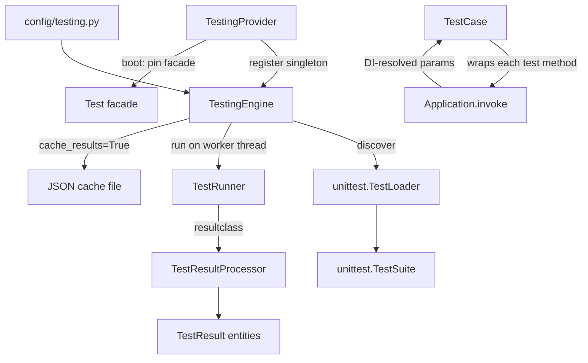

# Orionis Test (`orionis.test`)

> Async-first unit testing engine built on `unittest`, with dependency-injected test methods and Rich console reporting.
>
> 🇪🇸 Versión en español: [README.es.md](README.es.md)

`orionis.test` is the testing engine used by the framework's own `reactor
test` command (and by any application built on Orionis). It discovers
`unittest`-style tests across a directory tree, executes them
asynchronously without blocking the event loop, injects application
dependencies directly into test methods through the DI container, and
renders results with `rich` (compact one-line summaries or detailed panels
with tracebacks and highlighted source lines).

---

## Table of contents

1. [Requirements](#requirements)
2. [Module overview](#module-overview)
3. [Architecture](#architecture)
4. [API reference](#api-reference)
   - [`TestCase`](#testcase-orionistestcasescasetestcase)
   - [`TestingEngine`](#testingengine-orionistestcoreenginetestingengine)
   - [`TestRunner`](#testrunner-orionistestexecutorsrunnertestrunner)
   - [`TestResultProcessor`](#testresultprocessor-orionistestexecutorsresultstestresultprocessor)
   - [`TestingProvider`](#testingprovider-orionistestprovidertestingprovider)
   - [`TestResult` / `TestStatus`](#testresult--teststatus)
5. [Usage examples](#usage-examples)
6. [Performance and concurrency considerations](#performance-and-concurrency-considerations)
7. [Design notes](#design-notes)
8. [Compatibility notes](#compatibility-notes)

---

## Requirements

No installation beyond the framework itself is required:

```bash
pip install orionis
```

- **Python:** 3.14 or newer.
- **Runtime dependency:** [`rich`](https://pypi.org/project/rich/)
  (`rich~=15.0`, a core, non-optional dependency of the framework) is used
  for all console output (panels, tables, colored status labels).
- Test discovery and execution require a **booted `IApplication`**
  instance (the DI container), since `TestCase` resolves test methods
  through it and `TestingEngine` reads its `testing.*` configuration.
  Running plain `python -m unittest` directly on Orionis test cases does
  **not** boot the application — use the framework's own runner (see
  [Usage examples](#usage-examples)).

## Module overview

Testing an application built around dependency injection raises a
practical problem: test methods often need services from the container
(a repository, a fake mailer, a configured client), and plain `unittest`
gives no built-in way to inject them. `orionis.test` addresses this, plus
async execution and reporting, with a small set of collaborators:

- **`TestCase`** (`orionis.test.cases.case.TestCase`) — the base class
  application tests extend. It is a thin `unittest.IsolatedAsyncioTestCase`
  subclass that wraps every matched test method so it runs through
  `Application.invoke(...)`, meaning **any extra parameter declared on a
  test method is resolved by the DI container** automatically.
- **`TestingEngine`** (`orionis.test.core.engine.TestingEngine`) — the
  orchestrator: reads the `testing.*` application configuration,
  discovers tests under a start directory, runs them via `TestRunner` on a
  worker thread (so the event loop stays free), optionally caches results
  as JSON, and returns a `list[TestResult]`.
- **`TestRunner`** (`orionis.test.executors.runner.TestRunner`) — a
  `unittest.TextTestRunner` subclass that renders the Rich "start" and
  "summary" panels around a synchronous `unittest` run.
- **`TestResultProcessor`** (`orionis.test.executors.results.TestResultProcessor`)
  — a `unittest.TestResult` subclass that captures each outcome as a
  `TestResult` entity, prints it live (one-line or detailed panel,
  depending on verbosity), and extracts traceback/source-code context for
  failures and errors.
- **`TestingProvider`** — the framework `ServiceProvider` (deferrable) that
  registers `ITestingEngine` as a singleton and pins the `Test` facade
  (`orionis.support.facades.testing`, outside this module).

## Architecture



- `TestingEngine.discover()` walks `testing.start_dir` with `os.walk` (so
  subdirectories without `__init__.py` are still traversed, unlike
  `unittest.discover()`), matches file names against `testing.file_pattern`
  and method names against `testing.method_pattern`, and imports each
  matching module with a fresh `unittest.TestLoader` (avoiding shared
  state in `unittest.defaultTestLoader`).
- `TestingEngine.run()` builds the filtered suite, configures
  `TestResultProcessor.setPrintVerbosity(...)`, builds a `TestRunner`, and
  runs it via `loop.run_in_executor(None, runner.run, suite)` so the
  blocking `unittest` execution does not stall the event loop.
- `TestRunner.run()` is a synchronous method (it overrides
  `unittest.TextTestRunner.run`); it prints the start panel, executes
  `test(result)`, then prints the summary panel using the counts gathered
  by `TestResultProcessor`.
- `TestResultProcessor` is set as `TestRunner.resultclass`, so every
  `addSuccess`/`addFailure`/`addError`/`addSkip` callback from `unittest`
  builds a `TestResult` and immediately prints it (per-test, live output),
  in addition to being returned all together at the end via
  `getTestResults()`.
- `TestCase.__init__` wraps the resolved test method **once**, at
  construction time (not on every attribute access), replacing it with a
  wrapper that calls `await Application.invoke(original_method, *args,
  **kwargs)`.

## API reference

### `TestCase` (`orionis.test.cases.case.TestCase`)

```python
class TestCase(unittest.IsolatedAsyncioTestCase):
    _method_regex: re.Pattern[str] = re.compile(fnmatch.translate("test*"))
    def __init__(self, method_name: str = "runTest") -> None: ...
```

The base class application/framework tests extend instead of
`unittest.TestCase` / `unittest.IsolatedAsyncioTestCase` directly.

| Method | Signature | Description |
| --- | --- | --- |
| `setMethodPattern` | `(pattern: str) -> None` (`@classmethod`) | Changes the glob pattern (default `"test*"`) used to decide which methods get wrapped for DI invocation. Compiled once and stored as a class attribute; affects every `TestCase` subclass unless overridden per class. |

**Behavior in `__init__`:** the constructor inspects `method_name`; if it
does **not** start with `_`, is **not** one of the lifecycle hooks
(`setUp`, `tearDown`, `setUpClass`, `tearDownClass`, `asyncSetUp`,
`asyncTearDown`), and matches `_method_regex`, the original bound method is
replaced (via `object.__setattr__`) with an `async` wrapper that executes
it through `Application.invoke(method, *args, **kwargs)` — this is what
allows test methods to declare extra parameters resolved by the DI
container (see [Usage examples](#usage-examples)).

### `TestingEngine` (`orionis.test.core.engine.TestingEngine`)

```python
class TestingEngine(ITestingEngine):
    def __init__(self, app: IApplication) -> None: ...
```

Reads `testing.verbosity`, `testing.fail_fast`, `testing.start_dir`,
`testing.file_pattern`, `testing.method_pattern`, and
`testing.cache_results` from `app.config(...)` at construction time; the
JSON cache folder is fixed at `app.path("storage") / "framework" / "cache"
/ "testing"`.

| Method | Signature | Description |
| --- | --- | --- |
| `setVerbosity` | `(verbosity: int) -> Self` | Overrides the configured verbosity (`0` silent, `1` one-line per test, `2` detailed panels). Chainable. |
| `setFailFast` | `(*, fail_fast: bool) -> Self` | Overrides whether the run stops at the first failure. Chainable. |
| `setStartDir` | `(start_dir: str) -> Self` | Overrides the directory to search for tests. Chainable. |
| `setFilePattern` | `(file_pattern: str) -> Self` | Overrides the glob pattern used to match test **files** (e.g. `"test_*.py"`). Chainable. |
| `setMethodPattern` | `(method_pattern: str) -> Self` | Overrides the glob pattern for test **methods**; also propagates to `TestCase.setMethodPattern(...)` so DI-wrapping matches the same methods. Chainable. |
| `withoutPanel` | `() -> Self` | Disables the Rich start/summary panels for this run. Chainable. |
| `discover` | `() -> unittest.TestSuite` | Walks `start_dir`, imports matching files, and returns a `unittest.TestSuite` containing only the test cases whose method name matches `method_pattern`. Broad import failures (`SyntaxError`, `ImportError`, etc.) on individual files are silently skipped. |
| `run` | `async () -> list[TestResult]` | Adds `discover()`'s suite to the internal suite, builds a `TestRunner`, executes it on a thread-pool executor, optionally writes a timestamped JSON cache file, and returns the collected `TestResult` list. |

All setters return `Self`, so calls can be chained fluently before calling
`await engine.run()`.

### `TestRunner` (`orionis.test.executors.runner.TestRunner`)

```python
class TestRunner(unittest.TextTestRunner):
    resultclass = TestResultProcessor
    def __init__(
        self, verbosity: int = 0, failfast: bool = False, buffer: bool = False,
        warnings: str | None = None, with_panel: bool = True, **kwargs: dict,
    ) -> None: ...
```

A `unittest.TextTestRunner` that renders Rich panels around a standard,
synchronous `unittest` execution. Typically constructed and driven
internally by `TestingEngine`, not directly by application code.

| Method | Signature | Description |
| --- | --- | --- |
| `run` | `(test: unittest.suite.TestSuite) -> unittest.result.TestResult` | Prints the start panel (unless `with_panel=False`), executes `test(result)`, prints the summary panel (test counts by status + total time), and returns the `unittest` result object (a `TestResultProcessor` instance). |

### `TestResultProcessor` (`orionis.test.executors.results.TestResultProcessor`)

```python
class TestResultProcessor(unittest.TestResult):
    _print_verbosity: int | None = None
```

A `unittest.TestResult` subclass; set as `TestRunner.resultclass`, so
`unittest` instantiates and drives it automatically during a run.

| Method | Signature | Description |
| --- | --- | --- |
| `setPrintVerbosity` | `(verbosity: int) -> None` (`@classmethod`) | Sets the class-level verbosity controlling how each result is printed: `0` = no per-test output, `1` = one compact line per test (status, name, dot-filler, execution time), `2` = a detailed Rich panel per test (ID, class, method, module, file path, and — for failures/errors — the exception message and highlighted surrounding source lines). |
| `addSuccess` / `addFailure` / `addError` / `addSkip` | (override `unittest.TestResult`) | Build a `TestResult` for the outcome, append it to the internal list, print it immediately per the configured verbosity, then delegate to the superclass implementation. |
| `getTestResults` | `() -> list[TestResult]` | Returns every `TestResult` collected so far. |

### `TestingProvider` (`orionis.test.provider.TestingProvider`)

```python
class TestingProvider(ServiceProvider, DeferrableProvider):
    @classmethod
    def provides(cls) -> list[type]: ...
    def register(self) -> None: ...
    async def boot(self) -> None: ...
```

| Method | Description |
| --- | --- |
| `provides()` | Returns `[ITestingEngine]` — declares the deferred service for the container. |
| `register()` | Binds `ITestingEngine` → `TestingEngine` as a singleton. |
| `boot()` | `await TestFacade.pin()` — pins the `Test` facade for direct, DI-free attribute access. |

### `TestResult` / `TestStatus`

**`TestResult`** (`orionis.test.entities.result.TestResult`) —
`@dataclass(frozen=True, kw_only=True)`, extends
`orionis.support.entities.base.BaseEntity`. Represents the outcome of a
single test:

| Field | Type | Description |
| --- | --- | --- |
| `id` | `Any` | Unique identifier (`id(test)` at construction). |
| `name` | `str` | Full test identifier (`test.id()`, e.g. `module.Class.test_method`). |
| `status` | `TestStatus` | Outcome status. |
| `execution_time` | `float` | Elapsed time in seconds. |
| `error_message` | `str \| None` | `str(exception)` on failure/error, else `None`. |
| `traceback` | `str \| None` | Formatted traceback lines, if any. |
| `class_name` | `str \| None` | Name of the class containing the test. |
| `method` | `str \| None` | Name of the test method. |
| `module` | `str \| None` | Module containing the test. |
| `file_path` | `str \| None` | Source file path. |
| `doc_string` | `str \| None` | Docstring of the test method. |
| `exception` | `BaseException \| None` | Exception **class name** on failure/error (despite the type hint, the stored value is `exc_info[0].__name__`, a `str`). |
| `line_no` | `int \| None` | Line number where the failure occurred, when resolvable from the traceback. |
| `source_code` | `list[tuple[int, str]] \| None` | `(line_no, code)` pairs surrounding the failure line, used for verbosity `2` panels. |

**`TestStatus`** (`orionis.test.enums.status.TestStatus`) — `StrEnum` with
members `PASSED`, `FAILED`, `ERRORED`, `SKIPPED` (all uppercase string
values, e.g. `TestStatus.PASSED == "PASSED"`).

## Usage examples

### Writing a test with `TestCase`

```python
from orionis.test import TestCase

class TestWelcomeService(TestCase):

    async def testGreetReturnsExpectedMessage(self) -> None:
        """Assert the greeting message is formatted correctly."""
        self.assertEqual(1 + 1, 2)
```

### Injecting application services into a test method

Because every matched test method runs through
`await Application.invoke(method, *args, **kwargs)`, you can declare extra
parameters and let the container resolve them — the same auto-wiring used
for controllers and console commands:

```python
from orionis.test import TestCase
from app.contracts.welcome_service import IWelcomeService

class TestWelcomeService(TestCase):

    async def testGreetUsesConfiguredName(
        self,
        service: IWelcomeService,  # resolved automatically by the DI container
    ) -> None:
        message = await service.greet()
        self.assertIn("Hello", message)
```

### Running tests programmatically with `TestingEngine`

```python
from orionis.test.contracts.engine import ITestingEngine

# Typically resolved via the DI container once TestingProvider has booted.
engine: ITestingEngine = await app.make(ITestingEngine)

results = await (
    engine
    .setStartDir("tests")
    .setFilePattern("test_*.py")
    .setMethodPattern("test*")
    .setVerbosity(1)
    .setFailFast(fail_fast=False)
    .run()
)

for result in results:
    print(result.status, result.name, result.execution_time)
```

### Running tests via the framework CLI (recommended for day-to-day use)

```bash
python reactor test --start-dir="tests/app" --verbosity=1
python reactor test --fail-fast=1 --no-panel
```

`orionis.console.commands.test.test_command.TestCommand` reads the same
`testing.*` configuration keys as defaults and resolves `ITestingEngine`
through the DI container (`test_engine: ITestingEngine` parameter on its
`handle` method) — it is a thin CLI wrapper around `TestingEngine`.

### Adjusting output verbosity directly on the processor

```python
from orionis.test.executors.results import TestResultProcessor

TestResultProcessor.setPrintVerbosity(2)  # detailed per-test panels
```

## Performance and concurrency considerations

- **Test execution runs on a worker thread, not the event loop**:
  `TestingEngine.run()` calls
  `loop.run_in_executor(None, runner.run, self.__suite)`, offloading the
  entire (synchronous, blocking) `unittest` execution to the default
  thread-pool executor so `await engine.run()` does not block other
  coroutines running concurrently in the same process.
- **Async test methods are driven by `unittest.IsolatedAsyncioTestCase`**:
  each `TestCase` subclass gets its own event loop per test (standard
  `IsolatedAsyncioTestCase` behavior) — tests do not share a loop with each
  other or with the outer `TestingEngine.run()` coroutine.
- **DI resolution happens once per test call, not per attribute access**:
  `TestCase.__init__` wraps the target method a single time at
  construction; it does not intercept `__getattribute__` on every access,
  keeping normal attribute lookups on the instance at their usual cost.
- **`_method_regex` is shared, mutable class state**: `setMethodPattern`
  (on both `TestCase` and `TestingEngine`) mutates a class-level attribute.
  Calling it affects **every** `TestCase` subclass process-wide from that
  point on — treat it as a one-time configuration step at the start of a
  test run, not something toggled concurrently across parallel test runs
  in the same process.
- **Broad exception suppression during discovery**: `discover()` uses
  `contextlib.suppress(Exception)` around each file import, so a single
  broken test file (syntax error, missing dependency, etc.) is silently
  excluded from the suite rather than aborting discovery — this trades
  strictness for a resilient, best-effort discovery pass across a large
  test tree.
- **JSON cache writes are also thread-offloaded**: when
  `testing.cache_results` is enabled, `__saveCache` writes the results
  file via `loop.run_in_executor(None, ...)`, avoiding a blocking
  filesystem write on the event loop.
- **Per-test console printing happens synchronously inside `unittest`
  callbacks** (`addSuccess`/`addFailure`/etc.), which execute on the
  worker thread running the suite — output ordering matches test
  execution order, not arrival order into any async queue.

## Design notes

- **`TestCase` wraps once, not on every access**: the docstring and
  implementation explicitly avoid intercepting `__getattribute__` for
  every attribute lookup, replacing the resolved method with a
  `functools.wraps`-decorated `async` wrapper exactly once in `__init__` —
  this keeps normal test execution overhead minimal.
- **Fresh `unittest.TestLoader` per discovery pass**: `TestingEngine.discover()`
  deliberately creates a new `unittest.TestLoader()` instead of reusing
  `unittest.defaultTestLoader`, avoiding shared mutable state
  (`_top_level_dir` caching, etc.) across repeated discovery calls.
  `os.walk` is also used instead of `unittest.discover()` to reach
  subdirectories that lack `__init__.py`. The suite returned by
  `discover()` is merged into `TestingEngine`'s internal
  `unittest.TestSuite` inside `run()`, rather than replacing it.
- **Verbosity is controlled at two independent layers**: `TestRunner` is
  always constructed with `verbosity=0` (so `unittest`'s own built-in
  printing stays silent), while the actual per-test output is driven
  entirely by `TestResultProcessor._print_verbosity` (`0`/`1`/`2`) — this
  separation lets `orionis.test` fully own the console rendering instead
  of mixing it with `unittest`'s default text output.
- **`TestResult` is a frozen, `BaseEntity`-based dataclass**: consistent
  with other framework entities (see `orionis.introspection`'s `Signature`,
  `orionis.localization`), each field carries a `metadata={"description":
  ...}` annotation and the instance is immutable once created; `toDict()`
  (inherited from `BaseEntity`) is used directly by the JSON cache writer.
- **Deferrable provider + facade pinning**: `TestingProvider` follows the
  same pattern as `StorageProvider`/`LocalizationProvider` — declare the
  service via `provides()`, bind it lazily as a singleton in `register()`,
  and pin the corresponding facade (`Test`) in `boot()` for overhead-free
  access afterwards.
- **Live, per-test printing instead of end-of-run-only reporting**:
  `TestResultProcessor` prints each result as soon as it is recorded
  (inside `addSuccess`/`addFailure`/`addError`/`addSkip`), which is why
  long-running suites show progress incrementally rather than only a
  final summary.

## Compatibility notes

- **Minimum Python version:** 3.14 (per `pyproject.toml`,
  `requires-python = ">=3.14"`), matching the rest of the framework.
  `TestCase` extends `unittest.IsolatedAsyncioTestCase` from the standard
  library.
- **Required dependency:** `rich~=15.0` (core dependency, used for all
  console panels, tables, and colored text).
- **Framework-internal dependencies:** `TestingEngine` depends on
  `orionis.foundation.contracts.application.IApplication` (for
  configuration and paths) and `orionis.test.cases.case.TestCase`
  (to propagate the method pattern); `TestCase` depends on
  `orionis.support.facades.application.Application` (to invoke test
  methods through the container); `TestingProvider` depends on
  `orionis.container.providers` and `orionis.support.facades.testing`.
- Running Orionis test cases requires a booted application context
  (`Application.invoke` needs a resolvable container) — invoking them with
  a bare `python -m unittest` outside the framework's runner is not
  supported.
- No platform-specific behavior; discovery uses `os.walk`/`pathlib`, which
  behave identically on Windows, Linux, and macOS.
